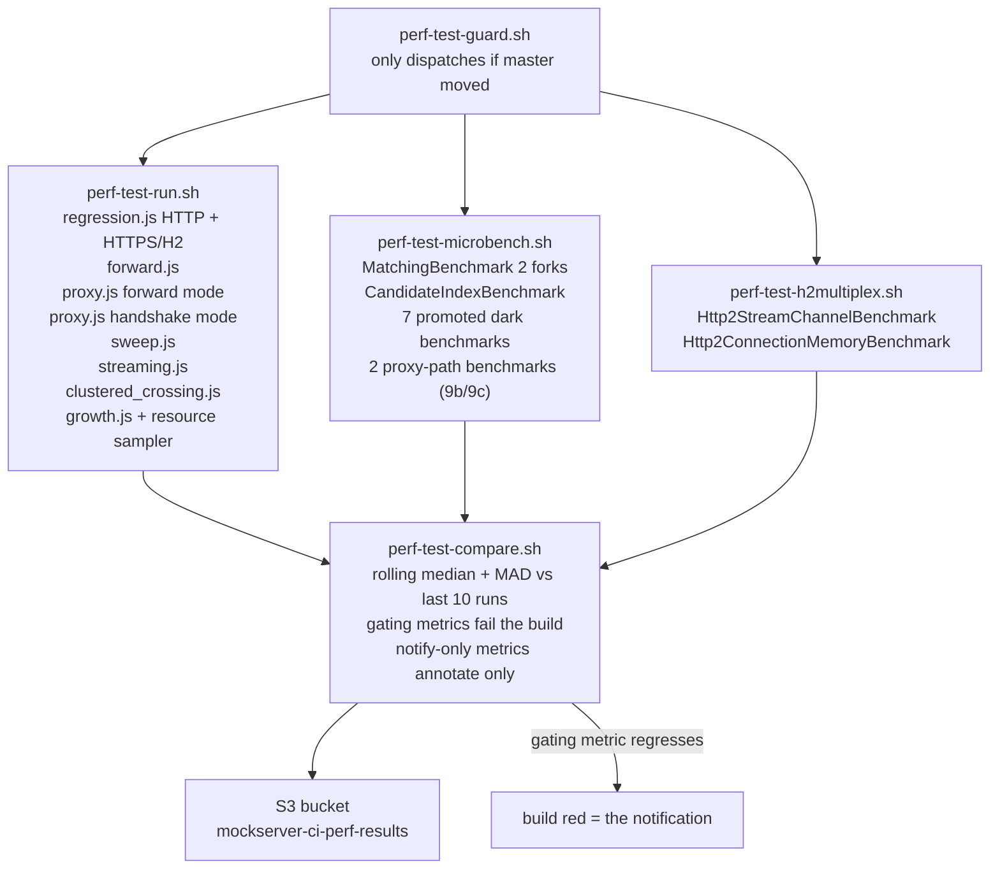

# Performance Measurement

The performance harness is **not** a uniform set of guards. Scripts exist for more scenarios than
CI executes, and of the executed scripts only a subset gate the build. Reading a number without
knowing which category it came from — linted only, executed once by hand, or gated daily — is how
regressions hide and stale claims get published.

## Summary

| Script / benchmark | What it measures | CI status | Fails build? |
|---|---|---|---|
| `regression.js` (HTTP + HTTPS/H2) | Per-behaviour latency percentiles and delivery ratio at 200 rps | Daily (perf queue) | No — notify-only |
| `growth.js` | Latency slope as the event log fills | Daily (perf queue) | No — notify-only |
| `sweep.js` | Throughput-vs-latency knee curve | Daily (perf queue) | No — notify-only |
| `forward.js` | Forward connection-pool regression guard | Daily (perf queue) | `forward.error_rate` only |
| `proxy.js` | Proxy and TLS handshake latency | Daily (perf queue) | No — notify-only |
| `streaming.js` | LLM/SSE streaming concurrency vs match latency | Daily (perf queue) | No — notify-only |
| `clustered_crossing.js` | Cross-node request latency in a cluster | Daily (perf queue) — but **never actually runs** | **No — nothing is measured.** `perf-test-compare.sh` DOES read `clustered_state.*` (notify-only), so the older claim that it ignores them was wrong about the mechanism. The real gap is upstream: the clustered image (`PERF_CLUSTERED_IMAGE`, default `mockserver/mockserver:mockserver-snapshot-clustered`) is never pulled or built on the perf queue, so every run takes the absent-image skip, sets `clustered_attempted=false` and emits no `clustered_state` block for compare to read. Compare annotates the skip and counts consecutive misses |
| `MatchingBenchmark` JMH | Matcher hot-path time/op and allocation/op | Daily (perf queue) | Yes — `time_per_op` + `alloc_bytes_per_op` |
| `CandidateIndexBenchmark` JMH | Index vs scan scaling | Daily (perf queue) | No |
| Promoted dark benchmarks (7 classes, see below) | Various hot paths | Daily (perf queue) | No — notify-only |
| Proxy-path benchmarks (`RelayByteCopyBenchmark`, `SocksHandshakeBenchmark`) | CONNECT/relay byte cost; SOCKS handshake cost | Daily (perf queue) | No — notify-only |
| `Http2StreamChannelBenchmark` JMH | HTTP/2 streams-per-connection throughput and latency | Daily (perf queue) | No — by explicit design |
| `Http2ConnectionMemoryBenchmark` JMH | Retained heap per established connection | Daily (perf queue) | No — by explicit design |
| `load.js` | p95 / p99 gate, ramping 50 -> 500 rps | Opt-in (manual / scheduled) | Yes — k6 thresholds |
| `stress.js` | Ramp past the knee | Lint only | Never executes in CI |
| `soak.js` | Sustained load over hours | Lint only | Never executes in CI |
| `scripts/perf/bench_startup.py` | Launch-to-ready variant matrix | Never runs in CI | Never |
| `inject` (`run-inject.sh`) | Load-injection ceiling | Opt-in | Never in daily pipeline |

## The Daily Pipeline

`perf-test-guard.sh` skips the entire chain when `master` has not moved since the last run, so
the daily job is a no-op on unchanged code.

`perf-test-compare.sh` reads `behaviours.*`, `growth.*`, and `microbench.*` from the per-run
artifacts and gates only the metrics explicitly marked `gating: true` in the compare script.
Everything else is reported in the Buildkite annotation but does not change the exit code.

**Currently gating:**
- `MatchingBenchmark` — `time_per_op` and `alloc_bytes_per_op` per matcher type / expectation count
- `forward.error_rate` (discriminating pass/fail, not a tuned threshold)

**Notify-only until ≥ 10 clean run history exists to derive a budget from:**
- All `regression.js` latency percentiles
- `sweep.js` `rig_valid_peak_achieved_rps` (extended from 16k to 64k in the current code)
- `growth.js` ratios and `live_set_bytes`
- All promoted dark benchmark metrics
- The proxy-path benchmark metrics (`RelayByteCopyBenchmark`, `SocksHandshakeBenchmark` — items 9b/9c), which share the `microbench_extra.*` budgets

## What Each Harness Actually Measures

### `regression.js` — latency at a fixed offered rate

Four primary `constant-arrival-rate` scenarios (`match`, `forward`, `template`, `large`) run at
200 rps each over HTTP, then the same run repeats over HTTPS negotiating HTTP/2 via ALPN. Results are
keyed `<op>_<proto>`, e.g. `match_http`, `forward_https_h2`. Alongside the primary four, secondary
arms run at deliberately reduced rates — `template_mustache`, `large_1mb`, `large_10mb` and
`large_file`. The authoritative list is the arm string in `perf-test-run.sh` and the
`REGRESSION.*Rate` entries in `lib/config.js`; read those rather than this sentence.

Per behaviour it records:
- `p50_ms`, `p95_ms`, `p99_ms` — latency percentiles over the measured window (settle-excluded)
- `throughput_rps` — completed / duration; **not** pinned to the offered rate
- `delivery_ratio` — `throughput_rps / offered_rps`; the at-a-glance health indicator
- `offered_rps`, `dropped_iterations` — make a `throughput_rps` shortfall interpretable

**`throughput_rps` is not a throughput ceiling.** It is a delivery ratio against a fixed offered
rate of 200 rps. A `delivery_ratio` below 1.0 means the client could not deliver all iterations —
the server got slower, or the VU pool ran out, or both. Use `sweep.js` to find the actual ceiling.

The script runs with `preAllocatedVUs == maxVUs` so no VU allocation happens mid-run (the original
design had a mid-run ramp that caused a connection storm and 1–3 second p99 tails even when the
server was fast). A per-scenario settle window at the start of the measured window is excluded and
reported as `settle_excluded` so it is auditable.

### `sweep.js` — throughput-vs-latency knee

Offers the match path at an ascending ladder of fixed rates and records per rung: `achieved_rps`,
`p50_ms` through `p999_ms`, and `error_rate`. The ladder now extends to 64,000 rps; the earlier
16,000 ceiling sat below saturation so the knee could not be observed.

The healthy operating ceiling is the highest rung where `achieved_rps` is within 5% of
`offered_rps` **and** latency is within a stated multiple of the flat-ladder baseline. The peak
`achieved_rps` (top of the overload curve) is a different, higher number; do not publish one
without the other.

### `forward.js` — forward connection-pool guard

Guards `mockserver.forwardConnectionPoolEnabled`. The guard runs against a dedicated upstream
MockServer instance, not a loopback. With pooling enabled the `forward.error_rate` stays near
zero at 1,500 rps. With pooling off, ephemeral port exhaustion produces `BindException`s and the
rate spikes. This is the one k6 script whose error-rate threshold actually gates the daily build.

### `load.js` — absolute p95/p99 gate

Runs `load.js` as a **ramping** arrival rate — `K6_START_RATE` (50) up to `K6_PEAK_RATE` (500) over
`K6_RAMP_UP` (30 s), held for `K6_HOLD` (60 s), then ramped down — with k6 thresholds p95 < 25 ms,
p99 < 100 ms, error rate < 1%. The rates are the defaults in `lib/config.js`; read them there rather
than trusting this sentence, which is the kind of figure that goes stale.
This gate runs only on manual or scheduled builds, not on every commit. It runs on the noisy
Spot `default` queue so its noise floor is worse than its sensitivity. A 50× throughput
regression against the sweep knee passes this gate silently.

### `MatchingBenchmark` JMH — allocation backstop

Measures the matcher hot path (`firstMatchingExpectation_noMatch`) with `gc.alloc.rate.norm`
(bytes/op) and `time_per_op`. Runs with 2 JMH forks to sample inter-fork JIT variance (a single
fork underestimates real run-to-run dispersion and makes any derived budget too tight).

`alloc_bytes_per_op` is noise-free and is the stronger of the two signals. `time_per_op` is
wall-clock; the gate is self-calibrating (rolling `median + 3 × 1.4826 × MAD` with a 5% floor)
rather than a fixed number.

**This backstop was once silently dark for several days** (fixed in `bb3c41246`) because a reactor dependency drift
stopped the benchmark classpath resolving. `perf-test-microbench.sh` now emits a failure
annotation so a broken backstop is visible as a red build, not a silent absent artifact.

### `Http2StreamChannelBenchmark` JMH — notify-only by design

Measures streams per connection at N = 1, 10, 100 over one h2c connection. Has no threshold
because run-to-run variance on this benchmark is not yet characterised. The absence of a gate
is intentional and correct, not an oversight.

### The seven promoted dark benchmarks

These classes existed but were run by no CI step before the performance programme:

| Class | What it measures |
|---|---|
| `InboundDecodeBenchmark` | Inbound decode allocation by body size |
| `LocalCallbackDispatchBenchmark` | Local object callback dispatch latency |
| `ForwardPathBenchmark` | **Load generator render path** — see note below |
| `OpenApiValidationBenchmark` | OpenAPI validation cache benefit |
| `MetricsIncrementBenchmark` | Metrics contention |
| `ResponseWriteBenchmark` | Response write allocation by size |
| `Http3RequestBridgeBenchmark` | HTTP/3 vs HTTP/2 bridge A/B |

They are promoted into `perf-test-microbench.sh`'s second JMH invocation and land in
`microbench_extra.*`. All are notify-only (no gating flag) until each has enough history to
derive a budget.

### The proxy-path benchmarks (items 9b, 9c)

Proxying was the largest request-path area the programme's mandate named that had no
measurement (`ForwardPathBenchmark`, despite the name, measures the load generator — see the
note below). Two JMH classes close it, run in a **third, param-pinned** JMH invocation in
`perf-test-microbench.sh` (on the same classpath — no extra module build) and **merged into the
same `microbench_extra.*` result object**, so they inherit the existing notify-only
`microbench_extra.*.{time_per_op,alloc_bytes_per_op}` budgets with no new budget key:

| Class | What it measures | Item |
|---|---|---|
| `RelayByteCopyBenchmark` | The CONNECT/relay **response leg** — HTTP decode → the real relay aggregator → re-encode — as bytes/s and allocation per relayed message. The relay handlers copy nothing; the per-message cost lives in the flanking codecs and is per-fragment, not per-byte. | 9c |
| `SocksHandshakeBenchmark` | The per-connection **SOCKS4/5 handshake** codec cost (the only uncovered SOCKS cost: k6 has no SOCKS transport, and the SOCKS steady-state relay is already `RelayByteCopyBenchmark`'s territory). Ships with two controls — `detect` (allocation-free front-door floor) and `channelPlumbingOnly` (per-op `EmbeddedChannel` construction share). | 9b |

Both benchmarks declare large default `@Param` cartesians (relay 2×3×4 = 24, socks 3×3 = 9) for
on-demand characterisation via their own `run-*`/`run.sh`. The daily invocation **pins** each to
one representative cell — relay at a 256 KiB body in 1460-byte fragments, socks at
`SOCKS5_PASSWORD` (the heaviest handshake) — so the daily step emits exactly **5 rows** and stays
inside the microbench step's 70 min budget rather than doubling it. That fixed count is asserted
by the step's `EXTRA_EXPECTED` fail-closed row guard (now 37 = 32 dark + 5 proxy); a rename, a
crashed fork, **or a `-p` pin that stopped applying** (which would re-expand to the full
cartesian) all red the build.

**`ForwardPathBenchmark` does not measure proxying.** It measures the work
`LoadScenarioOrchestrator.RunningScenario.render()` performs before handing a request to the
Netty HTTP client: `request.clone()` plus Velocity template rendering. This is the load
generator's own hot path, not the server's forward-and-proxy path. The javadoc makes this
explicit: "the per-iteration work ... performs before each request is handed to the Netty HTTP
client". A regression in this benchmark means the load generator is slower, not MockServer.

### `scripts/perf/bench_startup.py` — never runs in CI

The startup measurement scripts in `scripts/perf/` are for local hand measurement only. No CI
step runs them. Published startup figures (e.g. "566 ms standard Docker image") are hand-measured
point-in-time values, not continuously monitored numbers. See `docs/code/startup-performance.md`
for the full variant table and methodology.

The one continuous startup measurement that does run in CI is the **AppCDS archive validity
check** (`bb3c41246`): a boolean pass/fail on every master build that confirms the archive maps
correctly. A corrupted archive (experiment confirmed 2026-09-16: `bad magic number`) still lets
the container serve requests — the 34% startup win is silently given back. The CI check catches
this; `scripts/perf/bench_startup.py` does not.

### `inject` — "how much load can MockServer generate"

The load-injection harness (`mockserver-performance-test/stack/inject/`, driven by
`perf-test-inject.sh`) measures MockServer as an **HTTP load generator**, not as a mock server.
It drives N MockServer instances against an Envoy `direct_response` sink and measures the
injection ceiling per instance and aggregate scaling.

The inject harness answers: "how many requests per second can MockServer inject when used as
a load-injection tool?" It says nothing about how fast MockServer serves mocked responses. The
Envoy sink absorbs far more than the injectors can produce by design; the bottleneck is always
the injector. This step is opt-in and does not run as part of the daily pipeline.

### `stress.js` and `soak.js` — linted only, never executed by CI

Both scripts pass `k6 inspect` validation in `perf-test-lint.sh`. Neither is executed by any
CI step. Published documentation that calls them part of how MockServer is tested is wrong:
they are tooling that exists for optional local or scheduled use.

## Run Provenance

Every stored run JSON carries a `config` block: MockServer version and image digest, log level,
`DISABLE_SYSTEM_OUT` flag, resolved heap and GC, JVM options, k6 image digest, cpusets, and
k6 container CPU allocation. Values are resolved from the running JVM where possible — the
record describes what the run was, not what someone intended.

An earlier version had `"instance_type": ""` for every stored run because `curl -s` exits 0 on
an empty body, so the fallback never fired. A populated field that holds an empty value survives
review in a way an absent field does not. That is fixed (`19686f9f1`); runs missing a `config`
block are annotated but not backfilled.

`perf-test-compare.sh` skips baseline runs whose `config.jmh` fingerprint differs from the
current run's, so a JMH methodology change (fork count, warmup/measurement iterations) does not
fire a spurious gating regression against history collected under different settings.

## Published Figures

The `performance.html` page on the docs site is a static snapshot. `perf-test-compare.sh`
writes results to S3 and stops; no step regenerates the committed chart data.

Before publishing any figure:
- State the version, date, core count, heap, GC, and log level. A figure without these is not a figure.
- State whether it is a default-configuration run. The daily CI run uses
  `MOCKSERVER_LOG_LEVEL=ERROR` and `MOCKSERVER_DISABLE_SYSTEM_OUT=true`; the shipped default is
  `INFO` and the consumer docs describe INFO-level per-matcher diagnostics as "the single largest
  matching-path allocation". CI figures are not default-configuration figures.
- Never publish a throughput ceiling without the latency measured at it. The peak `achieved_rps`
  from `sweep.js` is the top of an overload curve. The healthy operating ceiling is a lower
  number; publish both, labelled distinctly.
