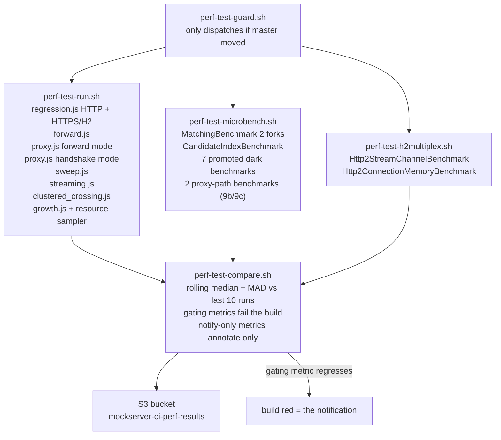

# Performance Measurement

The performance harness is **not** a uniform set of guards. Scripts exist for more scenarios than
CI executes, and of the executed scripts only a subset gate the build. Reading a number without
knowing which category it came from — linted only, executed once by hand, or gated daily — is how
regressions hide and stale claims get published.

## Summary

| Script / benchmark | What it measures | CI status | Fails build? |
|---|---|---|---|
| `regression.js` (HTTP + HTTPS/H2) | Per-behaviour latency percentiles and delivery ratio at 200 rps | Daily (perf queue) | No — notify-only |
| `growth.js` | Latency slope as the event log fills | Daily (perf queue) | No — notify-only |
| `sweep.js` | Throughput-vs-latency knee curve | Daily (perf queue) | No — notify-only |
| `forward.js` | Forward connection-pool regression guard | Daily (perf queue) | `forward.error_rate` only |
| `proxy.js` | Proxy and TLS handshake latency | Daily (perf queue) | No — notify-only |
| `proxy.js` forward + slow upstream | Unmatched-proxy in-flight concurrency cap (unit 21) | **Opt-in** (`PERF_WORKLOAD=forward`) | `workload_forward_served_via_upstream` validity check |
| `streaming.js` | LLM/SSE streaming concurrency vs match latency | Daily (perf queue) | No — notify-only |
| `clustered_crossing.js` | Cross-node request latency in a cluster | Daily (perf queue) | **Notify-only.** `perf-test-compare.sh` reads `clustered_state.*` as notify-only metrics. This measured NOTHING until the clustered image was published to the perf queue: the run gates the A/B on `docker image inspect`, nothing pulled or built that image, so every run took the absent-image skip and emitted no `clustered_state` block to read. The snapshot push now builds `mockserver-snapshot-clustered` in the same job, from the same jar and commit as the SUT image, and the run refuses to measure if the two image revisions disagree (`clustered_skip_reason=revision_mismatch`) — a ratio computed across two commits would be arithmetically fine and describe code the measured binary never contained |
| `MatchingBenchmark` JMH | Matcher hot-path time/op and allocation/op | Daily (perf queue) | Yes — `time_per_op` + `alloc_bytes_per_op` |
| `CandidateIndexBenchmark` JMH | Index vs scan scaling | Daily (perf queue) | No |
| Promoted dark benchmarks (7 classes, see below) | Various hot paths | Daily (perf queue) | No — notify-only |
| Proxy-path benchmarks (`RelayByteCopyBenchmark`, `SocksHandshakeBenchmark`) | CONNECT/relay byte cost; SOCKS handshake cost | Daily (perf queue) | No — notify-only |
| `Http2StreamChannelBenchmark` JMH | HTTP/2 streams-per-connection throughput and latency | Daily (perf queue) | No — by explicit design |
| `Http2ConnectionMemoryBenchmark` JMH | Retained heap per established connection (`bytes_per_connection`, shapes 1x1 / 10x10 / 100x10) | Daily (perf queue) | No — notify-only. `perf-test-compare.sh` reads `.h2_connection_memory` and annotates each shape's `bytes_per_connection` against the `h2_connection_memory.*.bytes_per_connection` budget every run; non-gating, so a move is surfaced but cannot fail the build until >=10 clean runs let a MAD-derived floor be set |
| `load.js` | p95 / p99 gate, ramping 50 -> 500 rps | Opt-in (manual / scheduled) | Yes — k6 thresholds |
| `stress.js` | Ramp past the knee | Lint only | Never executes in CI |
| `soak.js` | Sustained load over hours | Lint only | Never executes in CI |
| `scripts/perf/bench_startup.py` | Launch-to-ready variant matrix | Never runs in CI | Never |
| `inject` (`run-inject.sh`) | Load-injection ceiling | Opt-in | Never in daily pipeline |

## The Daily Pipeline


```mermaid
flowchart TD
  guard["perf-test-guard.sh\nonly dispatches if master moved"]
  run["perf-test-run.sh\nregression.js HTTP + HTTPS/H2\nforward.js\nproxy.js forward mode\nproxy.js handshake mode\nsweep.js\nstreaming.js\nclustered_crossing.js\ngrowth.js + resource sampler"]
  micro["perf-test-microbench.sh\nMatchingBenchmark 2 forks\nCandidateIndexBenchmark\n7 promoted dark benchmarks\n2 proxy-path benchmarks (9b/9c)"]
  h2["perf-test-h2multiplex.sh\nHttp2StreamChannelBenchmark\nHttp2ConnectionMemoryBenchmark"]
  cmp["perf-test-compare.sh\nrolling median + MAD vs last 10 runs\ngating metrics fail the build\nnotify-only metrics annotate only"]
  s3["S3 bucket\nmockserver-ci-perf-results"]
  red["build red = the notification"]

  guard --> run
  guard --> micro
  guard --> h2
  run --> cmp
  micro --> cmp
  h2 --> cmp
  cmp --> s3
  cmp -->|"gating metric regresses"| red
```

`perf-test-guard.sh` skips the entire chain when `master` has not moved since the last run, so
the daily job is a no-op on unchanged code.

`perf-test-compare.sh` reads `behaviours.*`, `growth.*`, and `microbench.*` from the per-run
artifacts and gates only the metrics explicitly marked `gating: true` in the compare script.
Everything else is reported in the Buildkite annotation but does not change the exit code.

**Currently gating:**
- `MatchingBenchmark` — `time_per_op` and `alloc_bytes_per_op` per matcher type / expectation count, on the shipped-default `detailedMatchFailures=true` arm (keys `<matcherType>_100_detailed`)
- `forward.error_rate` (discriminating pass/fail, not a tuned threshold)

**Notify-only until ≥ 10 clean run history exists to derive a budget from:**
- All `regression.js` latency percentiles
- `sweep.js` `rig_valid_peak_achieved_rps` (extended from 16k to 64k in the current code)
- `growth.js` ratios and `live_set_bytes`
- All promoted dark benchmark metrics
- The proxy-path benchmark metrics (`RelayByteCopyBenchmark`, `SocksHandshakeBenchmark` — items 9b/9c), which share the `microbench_extra.*` budgets

## What Each Harness Actually Measures

### `regression.js` — latency at a fixed offered rate

Four primary `constant-arrival-rate` scenarios (`match`, `forward`, `template`, `large`) run at
200 rps each over HTTP, then the same run repeats over HTTPS negotiating HTTP/2 via ALPN. Results are
keyed `<op>_<proto>`, e.g. `match_http`, `forward_https_h2`. Alongside the primary four, secondary
arms run at deliberately reduced rates — `template_mustache`, `large_1mb`, `large_10mb` and
`large_file`. The authoritative list is the arm string in `perf-test-run.sh` and the
`REGRESSION.*Rate` entries in `lib/config.js`; read those rather than this sentence.

Per behaviour it records:
- `p50_ms`, `p95_ms`, `p99_ms` — latency percentiles over the measured window (settle-excluded)
- `throughput_rps` — completed / duration; **not** pinned to the offered rate
- `delivery_ratio` — `throughput_rps / offered_rps`; the at-a-glance health indicator
- `offered_rps`, `dropped_iterations` — make a `throughput_rps` shortfall interpretable

**`throughput_rps` is not a throughput ceiling.** It is a delivery ratio against a fixed offered
rate of 200 rps. A `delivery_ratio` below 1.0 means the client could not deliver all iterations —
the server got slower, or the VU pool ran out, or both. Use `sweep.js` to find the actual ceiling.

The script runs with `preAllocatedVUs == maxVUs` so no VU allocation happens mid-run (the original
design had a mid-run ramp that caused a connection storm and 1–3 second p99 tails even when the
server was fast). A per-scenario settle window at the start of the measured window is excluded and
reported as `settle_excluded` so it is auditable.

### `sweep.js` — throughput-vs-latency knee

Offers the match path at an ascending ladder of fixed rates and records per rung: `achieved_rps`,
`p50_ms` through `p999_ms`, and `error_rate`. The ladder now extends to 64,000 rps; the earlier
16,000 ceiling sat below saturation so the knee could not be observed.

The healthy operating ceiling is the highest rung where `achieved_rps` is within 5% of
`offered_rps` **and** latency is within a stated multiple of the flat-ladder baseline. The peak
`achieved_rps` (top of the overload curve) is a different, higher number; do not publish one
without the other.

**Rig validity and the `vus_active_p95` criterion.** A rung is rig-valid when the k6 client had
CPU headroom, low errors, and the VU pool was not exhausted. The original check keyed off
`vus_active_max`, which is right-censored: it cannot exceed the pool size, so a single stall
pileup that temporarily drains the pool makes the rung read as client-limited even when the pool
sat at 1% utilisation for 95% of the measurement. Switching to `vus_active_p95 < pool`
(`bac8a96b7`) fixed the low rungs but was still wrong at the knee: it is true even at 95%
occupancy, so it discarded the saturating rung it existed to find. The current discriminator
(`derive_saturation` in `.buildkite/scripts/steps/perf-test-run.sh`) is the occupancy **ratio**
`vus_active_p95 / pool`: at or above 0.80 the pool is the binding constraint (VUs blocked on server
responses → server-limited → keep, and label the knee); below 0.80, drops over the 1% tolerance are a
client-side scheduling stall → exclude. 0.80 sits in the widest gap of the observed ladder (a pinned
rung reads ~0.86–0.95; a client-limited idle pool ~0.01–0.02). When `vus_active_p95`/`pool_per_rung`
are absent (older artifacts) the rule stays strict zero-drop.

k6 CPU headroom is judged on the **mean** over the rung's steady window, with the sampler's first
(startup) `docker stats` reading dropped; the max is still recorded as `k6_cpu_pct_max`. A per-rung
MAX made one cold-read spike look like sustained client saturation, and a high percentile of a
window holding ~4 samples is effectively the max.

**Ladder granularity.** A 2,000-rps gap between rungs cannot reliably locate a knee. In build
420 (2026-09-24) the 38,000-rps rung dipped just below the ratio floor (0.949 vs 0.950); without
finer rungs at 39,000 and 41,000, the reported healthy ceiling would have been ~36,000 rather than
41,000. When placing rungs near a suspected knee, use gaps of 1,000 rps or smaller.

**Ladder anchor rule.** Always include at least one rung *below* the expected knee. A ladder that
starts above the cleanly-served region reports `saturation_rps=0` — every rung is already in
overload, so none qualifies as the healthy ceiling — which looks like a defect and is not. The
default ladder (500, 1,000, 2,000, 4,000, 8,000, 16,000, 24,000, 32,000, 36,000, 40,000, 44,000,
48,000, 64,000 rps) begins well below the knee for exactly this reason.

### `forward.js` — forward connection-pool guard

Guards `mockserver.forwardConnectionPoolEnabled`. The guard runs against a dedicated upstream
MockServer instance, not a loopback. With pooling enabled the `forward.error_rate` stays near
zero at 1,500 rps. With pooling off, ephemeral port exhaustion produces `BindException`s and the
rate spikes. This is the one k6 script whose error-rate threshold actually gates the daily build.

### Opt-in workload — unmatched-proxy concurrency (unit 21)

**Status: drafted, awaiting approval — not yet enabled on any scheduled run.** Gated on
`PERF_WORKLOAD`, which is empty by default, so the standard daily/regression run is byte-for-byte
unchanged and stays baseline-comparable. Setting `PERF_WORKLOAD=forward` labels the result
`config_profile=workload-forward`, which flips `baseline_eligible=false` (same lever as a tuned run),
so the run is recorded but never persisted to the default-configuration baseline.

Why it exists: the default `forward.js` arm drives a **matched** `/forward` expectation, which uses
the already-async forward path unit 21 did not change; and `proxy.js`'s unmatched-proxy arm hits a
**fast** upstream at ~200 rps, so in-flight concurrency (~0.04) stays far below the old ~poolSize cap.
Neither can show unit 21.

**`PERF_WORKLOAD=forward`** (needs `PERF_UPSTREAM_DELAY_MS>0`, e.g. `50`): **resets the SUT** (a prior
handshake phase seeds a persistent `/simple` mock on it, which would otherwise match the proxied
request and defeat the whole point), re-seeds the run's upstream `/simple` with a server-side delay,
then re-drives `proxy.js` forward mode (absolute-URI = `handleUnmatchedProxyForward`, the path unit 21
changed) at elevated concurrency (`PERF_WORKLOAD_FORWARD_RATE`, `PERF_WORKLOAD_FORWARD_VUS`). With
`offered_rate × upstream_latency` above the blocking action-handler pool, the cap binds and shows as
`forward_absolute_proxy` `delivery_ratio < 1` and a p99 blow-up. Read the effect by A/B-ing a
**pre-21** vs **post-21** image (`MOCKSERVER_IMAGE`) at the same delay/rate: post-21 sustains far more
in-flight before the delivery ratio drops. Result (with the setup HTTP codes and the p50 floor) lands
under `.workload.forward`.

**Fail-closed (design goal 4).** The validity check `workload_forward_served_via_upstream` reds the
build unless the SUT actually **forwarded** to the slow upstream, proven by three things together:
(1) the SUT reset, upstream reset and upstream seed all returned their expected HTTP codes
(200/200/201 — checked explicitly, since `curl` without `-f` treats 4xx/5xx as success); (2) the
`forward_absolute` arm relayed responses (`sample_count>0`; `proxy.js` `setup()` also aborts if the
relay does not work); and (3) its **p50 ≥ `PERF_UPSTREAM_DELAY_MS × 0.8`** — a `/simple` mock on the
SUT or a fast/shadowed upstream answers in ~0 ms and cannot clear this floor, so it goes red. Any
failure → the check is false → `validity.valid=false`.

Trigger a run (perf queue, one at a time):

```bash
# unit 21 — proxy concurrency with a 50 ms upstream
bk build create -p mockserver-performance-test -b master -m "[perf-run] unit21 proxy concurrency" \
  -e PERF_WORKLOAD=forward -e PERF_UPSTREAM_DELAY_MS=50
```

### `load.js` — absolute p95/p99 gate

Runs `load.js` as a **ramping** arrival rate — `K6_START_RATE` (50) up to `K6_PEAK_RATE` (500) over
`K6_RAMP_UP` (30 s), held for `K6_HOLD` (60 s), then ramped down — with k6 thresholds p95 < 25 ms,
p99 < 100 ms, error rate < 1%. The rates are the defaults in `lib/config.js`; read them there rather
than trusting this sentence, which is the kind of figure that goes stale.
This gate runs only on manual or scheduled builds, not on every commit. It runs on the noisy
Spot `default` queue so its noise floor is worse than its sensitivity. A 50× throughput
regression against the sweep knee passes this gate silently.

### `MatchingBenchmark` JMH — allocation backstop

Measures the matcher hot path (`firstMatchingExpectation_noMatch`) with `gc.alloc.rate.norm`
(bytes/op) and `time_per_op`. Runs with 2 JMH forks to sample inter-fork JIT variance (a single
fork underestimates real run-to-run dispersion and makes any derived budget too tight).

`alloc_bytes_per_op` is noise-free and is the stronger of the two signals. `time_per_op` is
wall-clock; the gate is self-calibrating (rolling `median + 3 × 1.4826 × MAD` with a 5% floor)
rather than a fixed number.

It runs the **shipped default**, `detailedMatchFailures=true`, so the gate tracks what users run.
Rows are keyed `<matcherType>_<expectationCount>_detailed` (for example `EXACT_100_detailed`); a
`detailedMatchFailures=false` row would carry no suffix. The opt-out `false` arm is not measured
daily; the per-merge `perf-alloc-gate.sh` gives both arms an absolute allocation floor.

**Switching the arm resets this baseline, and needs no S3 or budget change.** The budgets are the
wildcards `microbench.*.time_per_op` / `microbench.*.alloc_bytes_per_op` with `floor: null`, so every
threshold comes from the rolling S3 history for that exact metric name. Two things isolate the new arm
from the old history, and either one alone is enough:

| Mechanism | Effect on the first runs after a switch |
|---|---|
| New metric keys (`_detailed`) | No prior run has a value under that name, so the metric reports `:new: new` |
| `config.jmh.args` fingerprint changes | Compare drops every baseline run with a different fingerprint, so the whole `microbench.*` / `microbench_extra.*` family reports `:new: new` and the annotation shows "microbench baseline reset" until the whole baseline window has turned over |

Gating resumes once 5 (`PERF_MIN_BASELINE`) runs share the new fingerprint. The retired keys
(`EXACT_100`, `REGEX_100`, `JSON_BODY_100`) simply stop being compared: compare only looks at metrics
the head run emits, so a key that is present in history but absent from the head trips no
missing-metric check (that check covers a head metric with no budget, not the reverse). One side
effect: because the fingerprint covers the whole `.config.jmh` object, the notify-only
`microbench_extra.*` metrics also restart their 5-run warm-up.

**This backstop was once silently dark for several days** (fixed in `bb3c41246`) because a reactor dependency drift
stopped the benchmark classpath resolving. `perf-test-microbench.sh` now emits a failure
annotation so a broken backstop is visible as a red build, not a silent absent artifact.

### `Http2StreamChannelBenchmark` JMH — notify-only by design

Measures streams per connection at N = 1, 10, 100 over one h2c connection. Has no threshold
because run-to-run variance on this benchmark is not yet characterised. The absence of a gate
is intentional and correct, not an oversight.

### The seven promoted dark benchmarks

These classes existed but were run by no CI step before the performance programme:

| Class | What it measures |
|---|---|
| `InboundDecodeBenchmark` | Inbound decode allocation by body size |
| `LocalCallbackDispatchBenchmark` | Local object callback dispatch latency |
| `ForwardPathBenchmark` | **Load generator render path** — see note below |
| `OpenApiValidationBenchmark` | OpenAPI validation cache benefit |
| `MetricsIncrementBenchmark` | Metrics contention |
| `ResponseWriteBenchmark` | Response write allocation by size |
| `Http3RequestBridgeBenchmark` | HTTP/3 vs HTTP/2 bridge A/B |

They are promoted into `perf-test-microbench.sh`'s second JMH invocation and land in
`microbench_extra.*`. All are notify-only (no gating flag) until each has enough history to
derive a budget.

### The proxy-path benchmarks (items 9b, 9c)

Proxying was the largest request-path area the programme's mandate named that had no
measurement (`ForwardPathBenchmark`, despite the name, measures the load generator — see the
note below). Two JMH classes close it, run in a **third, param-pinned** JMH invocation in
`perf-test-microbench.sh` (on the same classpath — no extra module build) and **merged into the
same `microbench_extra.*` result object**, so they inherit the existing notify-only
`microbench_extra.*.{time_per_op,alloc_bytes_per_op}` budgets with no new budget key:

| Class | What it measures | Item |
|---|---|---|
| `RelayByteCopyBenchmark` | The CONNECT/relay **response leg** — HTTP decode → the real relay aggregator → re-encode — as bytes/s and allocation per relayed message. The relay handlers copy nothing; the per-message cost lives in the flanking codecs and is per-fragment, not per-byte. | 9c |
| `SocksHandshakeBenchmark` | The per-connection **SOCKS4/5 handshake** codec cost (the only uncovered SOCKS cost: k6 has no SOCKS transport, and the SOCKS steady-state relay is already `RelayByteCopyBenchmark`'s territory). Ships with two controls — `detect` (allocation-free front-door floor) and `channelPlumbingOnly` (per-op `EmbeddedChannel` construction share). | 9b |

Both benchmarks declare large default `@Param` cartesians (relay 2×3×4 = 24, socks 3×3 = 9) for
on-demand characterisation via their own `run-*`/`run.sh`. The daily invocation **pins** each to
one representative cell — relay at a 256 KiB body in 1460-byte fragments, socks at
`SOCKS5_PASSWORD` (the heaviest handshake) — so the daily step emits exactly **5 rows** and stays
inside the microbench step's 70 min budget rather than doubling it. That fixed count is asserted
by the step's `EXTRA_EXPECTED` fail-closed row guard (now 37 = 32 dark + 5 proxy); a rename, a
crashed fork, **or a `-p` pin that stopped applying** (which would re-expand to the full
cartesian) all red the build.

**`ForwardPathBenchmark` does not measure proxying.** It measures the work
`LoadScenarioOrchestrator.RunningScenario.render()` performs before handing a request to the
Netty HTTP client: `request.clone()` plus Velocity template rendering. This is the load
generator's own hot path, not the server's forward-and-proxy path. The javadoc makes this
explicit: "the per-iteration work ... performs before each request is handed to the Netty HTTP
client". A regression in this benchmark means the load generator is slower, not MockServer.

### `scripts/perf/bench_startup.py` — never runs in CI

The startup measurement scripts in `scripts/perf/` are for local hand measurement only. No CI
step runs them. Published startup figures (e.g. "566 ms standard Docker image") are hand-measured
point-in-time values, not continuously monitored numbers. See `docs/code/startup-performance.md`
for the full variant table and methodology.

The one continuous startup measurement that does run in CI is the **AppCDS archive validity
check** (`bb3c41246`): a boolean pass/fail on every master build that confirms the archive maps
correctly. A corrupted archive (experiment confirmed 2026-09-16: `bad magic number`) still lets
the container serve requests — the 34% startup win is silently given back. The CI check catches
this; `scripts/perf/bench_startup.py` does not.

### `inject` — "how much load can MockServer generate"

The load-injection harness (`mockserver-performance-test/stack/inject/`, driven by
`perf-test-inject.sh`) measures MockServer as an **HTTP load generator**, not as a mock server.
It drives N MockServer instances against an Envoy `direct_response` sink and measures the
injection ceiling per instance and aggregate scaling.

The inject harness answers: "how many requests per second can MockServer inject when used as
a load-injection tool?" It says nothing about how fast MockServer serves mocked responses. The
Envoy sink absorbs far more than the injectors can produce by design; the bottleneck is always
the injector. This step is opt-in and does not run as part of the daily pipeline.

### `stress.js` and `soak.js` — linted only, never executed by CI

Both scripts pass `k6 inspect` validation in `perf-test-lint.sh`. Neither is executed by any
CI step. Published documentation that calls them part of how MockServer is tested is wrong:
they are tooling that exists for optional local or scheduled use.

## Run Provenance

Every stored run JSON carries a `config` block: MockServer version and image digest, log level,
`DISABLE_SYSTEM_OUT` flag, resolved heap and GC, JVM options, k6 image digest, cpusets, and
k6 container CPU allocation. Values are resolved from the running JVM where possible — the
record describes what the run was, not what someone intended.

An earlier version had `"instance_type": ""` for every stored run because `curl -s` exits 0 on
an empty body, so the fallback never fired. A populated field that holds an empty value survives
review in a way an absent field does not. That is fixed (`19686f9f1`); runs missing a `config`
block are annotated but not backfilled.

`perf-test-compare.sh` skips baseline runs whose `config.jmh` fingerprint differs from the
current run's, so a JMH methodology change (fork count, warmup/measurement iterations, or a pinned
`-p` value such as `detailedMatchFailures`) does not fire a spurious gating regression against
history collected under different settings.

## Published Figures

The `performance.html` page on the docs site renders from a committed data file
(`jekyll-www.mock-server.com/_data/perf_figures.json`) plus committed chart data and PNGs.
`perf-test-compare.sh` writes each run to S3; the daily run's tail step
`perf-website-publish.sh` regenerates that data file from the latest valid run and, when it
has drifted, emits the refresh as a build artifact — but nothing applies it automatically (see
[Publishing a run's figures](#publishing-a-runs-figures-manual-step) below).

Before publishing any figure:
- State the version, date, core count, heap, GC, and log level. A figure without these is not a figure.
- State whether it is a default-configuration run. The daily CI run uses
  `MOCKSERVER_LOG_LEVEL=ERROR` and `MOCKSERVER_DISABLE_SYSTEM_OUT=true`; the shipped default is
  `INFO` and the consumer docs describe INFO-level per-matcher diagnostics as "the single largest
  matching-path allocation". CI figures are not default-configuration figures.
- Never publish a throughput ceiling without the latency measured at it. The peak `achieved_rps`
  from `sweep.js` is the top of an overload curve. The healthy operating ceiling is a lower
  number; publish both, labelled distinctly.

**Current certified knee (build 420, 2026-09-24, `3dbed98ae`, `c5.12xlarge`, 6 physical cores
isolated, G1 with a 1.2 GB heap, JDK 17.0.20.1+1, `MOCKSERVER_LOG_LEVEL=ERROR`, `MOCKSERVER_DISABLE_SYSTEM_OUT=true`):**
`healthy_ceiling_rps` **41,000** (achieved 39,033, p50 0.196 ms); `peak_achieved_rps` **43,671**
(at 48,000 offered, server in overload). Previous published figures for reference (build 64,
2026-06-24, pre-8.0.0, instance type not recorded): 32,000 healthy ceiling at p50 0.194 ms,
36,323 peak — both predating the 8.0.0 HTTP/2 multiplex change, and taken before the 2026-09-22
hardware change, so the load generator was sharing the server's physical cores.

### Publishing a run's figures (manual step)

The daily perf pipeline's tail step `perf-website-publish.sh` (`perf` queue, `soft_fail`,
non-gating) regenerates `perf_figures.json` and the charts from the newest valid run in S3. The
perf queue holds **only** the S3 perf-results grant — no git or gh credentials — so it cannot
push or open a PR. When the committed figures have drifted (older than `PUBLISH_MAX_AGE_DAYS`,
default 30, or a headline metric moved more than `PUBLISH_MOVE_PCT`, default 10%) it commits the
refresh to a fresh local branch and attaches that commit as a `git format-patch` artifact
(`website-figures-<UTC-timestamp>.patch`, applied with `git am`) alongside the regenerated
`perf_figures.json`, `perf-sweep.json`, `perf-result.json` and chart PNGs. A build with no drift
emits nothing. **Nothing applies the patch automatically** — publishing a customer-facing figure
is a deliberate human step.

To publish a run's figures:

1. **Find and download the patch** from the daily `mockserver-performance-test` build with the
   local `bk` CLI. `list` takes the build number as a positional; `download` takes it as
   `--build`, and the positional it takes is the artifact ID (list first to get it):
   ```
   bk artifacts list <N> -p mockserver-performance-test
   bk artifacts download <ARTIFACT_ID> --build <N> -p mockserver-performance-test
   ```
2. **Check the source run before applying.** The step publishes from the newest run that passes
   three fail-closed gates: it is self-describing (`schema_version >= 2` with a `config` block),
   it passed its own validity checks (`validity.valid == true`), and it yields a healthy ceiling
   from a usable sweep. Confirm the run named in the patch commit message and the build annotation
   is the one you mean, its `build_number` is expected, and it is a default-configuration baseline
   — `config_profile` is `default` and `baseline_eligible` is `true`. Only baseline-eligible,
   default-profile runs are persisted to `s3://<bucket>/runs/<branch>/` at all
   (`perf-test-compare.sh` refuses to persist a tuned or instrumented run), so this is a
   confirmation, not a search.
3. **Apply it and open the PR** (the annotation prints these commands):
   ```
   git fetch origin master
   git checkout -b perf/website-figures-<UTC-timestamp> origin/master
   git am website-figures-<UTC-timestamp>.patch
   git push -u origin perf/website-figures-<UTC-timestamp> && gh pr create --fill --base master
   ```
   The patch rewrites only `_data/perf_figures.json` and the chart data/PNGs. Before merging,
   reconcile the hand-authored numbers it does **not** touch in `mock_server/performance.html`:
   the front-matter `description`, the JSON-LD `schema_faq` answers, and matcher-scaling figures
   (a separate JMH source, expected to differ).

## Rig Capacity and k6 CPU Behaviour

The perf box is a `c5.12xlarge`: 48 logical CPUs, 24 physical cores (hyperthread siblings at `N` and `N+24`). All 24 physical cores are allocated across the six-vCPU server arm (6), upstream (1), and k6 (17). A ten-vCPU arm leaves only 13 physical cores for k6, which is not enough at the server's knee — measuring a ten-core arm requires k6 on a separate machine.

**k6 CPU is non-monotonic in offered load.** k6 draws its peak CPU at the last healthy rung; past the knee VUs block on I/O rather than working, so client CPU falls as offered load rises above the knee. A high k6 CPU reading at a given rung therefore locates the knee rather than indicating a bad measurement. Use the mean over the steady window, not the max — the first (startup) sample is inflated and not representative.

## Heap Profiling Pitfalls

Six non-obvious constraints apply when analysing MockServer's heap and saturation history.

### JFR cannot attribute retained heap under ZGC

`jdk.ObjectCount` (`object-statistics`) and `jdk.OldObjectSample` (`memory-leaks-by-class`) emit nothing under ZGC and populate normally under G1 — verified on JDK 25 with the same program. Use `jcmd GC.class_histogram` instead; it works under both collectors.

### `jcmd` attach needs an exact uid match

`jcmd` inside a container requires an exact uid match with the target process. Running as root fails with `Unable to open socket file /tmp/.java_pid1`. Read the uid from the target's own `/proc/1/status` in the shared PID namespace before attaching.

### Saturation-series comparability break

Widening k6's cpuset (from cores 7–10 to 7–23, to give the client enough headroom at the server's default 6-core config) changed the rig. The hardware-mismatch guard keys on `instance_type`, which did not change, so nothing in the tooling flags it. Stored `saturation_rps` and sweep latencies from before this change are not comparable with those after it. Similarly, adding rungs to the default ladder introduces ladder-position history that has no prior comparable points. When reviewing a stored run's `saturation_rps` against an older run, confirm both used the same k6 cpuset and the same ladder rungs.

### GC log cycle times are not stop-the-world pause times

`-Xlog:gc` records GC cycle duration, not stop-the-world (STW) pause duration. A 1,000 ms p95 cycle under generational ZGC is concurrent work and is consistent with a request p95 of ~74 ms — not 1,000 ms. For STW pauses use `-Xlog:gc+phases`. ZGC's actual STW pauses are typically under 1 ms regardless of heap size.

Separately: the live set under MockServer tracks the event-log budget, not the workload. Increasing the heap without increasing `maxEventLogSizeInBytes` leaves most of the extra heap unused; the budget, not the workload size, is the dominant driver of GC pressure and retained heap.

### Measurement condition is load-bearing for heap histograms

The histogram sampler runs across all phases, but the phase that fills the event log drives only `GET /simple` mocked responses over plain HTTP/1.1. Under exactly those conditions the HTTP/2 stream id, the forwarded-response status code, `Timing` fields, injected delays, and streaming chunk timestamps are all inert and `socketAddress` is null. Any allocation or retention finding attributed to a histogram must state which phase produced it — a finding valid on the mocked-HTTP/1.1 phase may not exist on the forward phase, and vice versa.
