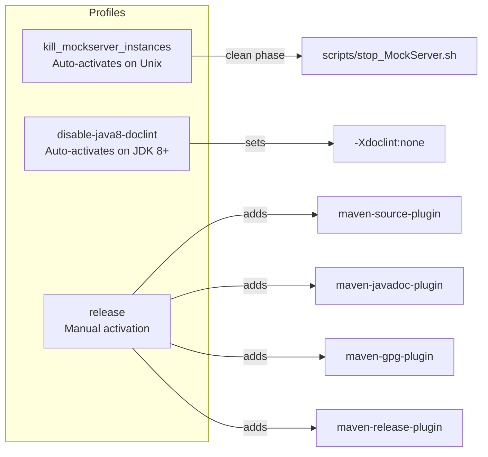
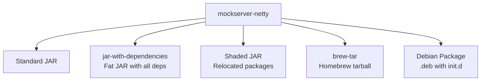

# Build System

## Monorepo Build Landscape

The monorepo contains multiple projects with different build tools:

| Directory | Build Tool | Build Command (from repo root) |
|-----------|-----------|-------------------------------|
| `mockserver/` | Maven (`./mvnw`) | `cd mockserver && ./mvnw clean install` |
| `mockserver-ui/` | Vite + npm | `cd mockserver-ui && npm ci && npm run build` |
| `mockserver-node/` | Grunt + npm | `cd mockserver-node && npm ci && npx grunt` |
| `mockserver-client-node/` | npm + TypeScript | `cd mockserver-client-node && npm ci && npm test` |
| `mockserver-client-python/` | pip + pytest | `cd mockserver-client-python && pip install -e '.[dev]' && pytest` |
| `mockserver-client-ruby/` | Bundler + RSpec | `cd mockserver-client-ruby && bundle install && bundle exec rspec` |
| `mockserver/mockserver-maven-plugin/` | Maven | `cd mockserver && ./mvnw clean install -DskipTests && ./mvnw -f mockserver-maven-plugin/pom.xml clean verify` |
| `mockserver-performance-test/` | k6 (JavaScript) | `cd mockserver-performance-test && for f in k6/*.js; do k6 inspect "$f"; done` |

> **Running the regression and growth scripts locally:** see [Performance regression pipeline — local runs](#performance-regression-pipeline-local-runs) below.

CI builds are orchestrated by `.buildkite/scripts/generate-pipeline.sh` which selects pipelines based on changed files. See [CI/CD](../infrastructure/ci-cd.md) for details.

## Local Development Behind a Corporate TLS-Inspection Proxy

**TL;DR — if dependency downloads fail locally with TLS/`certificate verify failed`/`unable to get local issuer certificate` errors, your machine is behind a TLS-inspection proxy and the toolchains don't trust the corporate root CA. Point each toolchain at a *combined* CA bundle (system roots + corporate root). This is configured ONLY in your user/shell environment — never in repo files or pipeline scripts. CI agents have no proxy, so pipelines are unaffected and must stay that way.**

### Why this happens

A corporate TLS-inspection (MITM) proxy re-signs HTTPS traffic with a certificate chained to a corporate root CA. Package managers (npm, pip, cargo, composer, gem, go) and HTTP clients reject it because the corporate root is not in their default trust store. CI build agents run outside the proxy, so they never see this — which is exactly why the fix must live outside the repo.

### One-time setup (new laptop / new engineer)

1. Obtain the corporate root CA (PEM) from IT, e.g. `tesco_root_ca.pem`.
2. Build a **combined** bundle (system roots + corporate root) once and keep it at a stable path, e.g. `~/.tesco-ca/ca-bundle-with-tesco.pem`:
   ```bash
   mkdir -p ~/.tesco-ca
   # system roots from the OpenSSL/certifi default + the corporate root, concatenated:
   cat "$(python3 -m certifi 2>/dev/null || echo /etc/ssl/cert.pem)" ~/path/to/tesco_root_ca.pem \
     > ~/.tesco-ca/ca-bundle-with-tesco.pem
   ```
3. Add the per-toolchain settings below to your **shell profile** (`~/.zshrc`) and user configs. Nothing here is committed.

### Per-toolchain settings (user/shell scope only)

| Toolchain | Where it runs | Setting (local only) |
|-----------|---------------|----------------------|
| Anything in Docker via `.buildkite/scripts/run-in-docker.sh` (PHP/Python/Ruby/Go/Rust/.NET/Node) | container | `export LOCAL_DOCKER_CA_BUNDLE=~/.tesco-ca/ca-bundle-with-tesco.pem` — the wrapper mounts it read-only and points every in-container tool at it (opt-in; unset in CI). |
| Building **MockServer's own Docker images** (`docker/*/Dockerfile`, whose alpine download/copy stages `apk add` + `wget` the tcnative native `.so` from Maven Central through the proxy) | image build context | `export MOCKSERVER_LOCAL_CA_BUNDLE=~/.tesco-ca/ca-bundle-with-tesco.pem` — `docker/ensure-ca-bundle.sh <context-dir>` stages it into the context as `ca-bundle.pem` (which the stage COPYs in and trusts before the downloads). Prefer the **combined** bundle here: it becomes the alpine stage's entire trust store, so system roots must be included or Maven Central itself fails to verify. Falls back to `LOCAL_CA_BUNDLE`, then `NODE_EXTRA_CA_CERTS`, then `AWS_CA_BUNDLE` if unset — but those may be the corporate root **alone**, so set `MOCKSERVER_LOCAL_CA_BUNDLE` explicitly to the combined bundle. This is a **different** mechanism from `LOCAL_DOCKER_CA_BUNDLE` above (that one is `run-in-docker.sh` for client-language toolchains; this one is `ensure-ca-bundle.sh` for MockServer's image builds). The staged `ca-bundle.pem` is a build-context scratch file — never commit it. |
| npm — direct **and** the `mockserver/mockserver-netty` Maven `build-ui` step (frontend-maven-plugin) | host | `~/.npmrc` with `cafile=/Users/<you>/.tesco-ca/ca-bundle-with-tesco.pem` (npm always reads user `~/.npmrc`, so the Maven plugin's bundled node picks it up too). |
| Node (direct scripts) | host | `export NODE_EXTRA_CA_CERTS=~/.tesco-ca/ca-bundle-with-tesco.pem` |
| Python / pip / requests | host | `export PIP_CERT=~/.tesco-ca/ca-bundle-with-tesco.pem REQUESTS_CA_BUNDLE=~/.tesco-ca/ca-bundle-with-tesco.pem SSL_CERT_FILE=~/.tesco-ca/ca-bundle-with-tesco.pem` |
| Ruby / bundler / rubygems | host | `export SSL_CERT_FILE=~/.tesco-ca/ca-bundle-with-tesco.pem BUNDLE_SSL_CA_CERT=~/.tesco-ca/ca-bundle-with-tesco.pem` |
| Rust / cargo | host | `export CARGO_HTTP_CAINFO=~/.tesco-ca/ca-bundle-with-tesco.pem` |
| Go (and git clone over HTTPS) | host | `export SSL_CERT_FILE=~/.tesco-ca/ca-bundle-with-tesco.pem GIT_SSL_CAINFO=~/.tesco-ca/ca-bundle-with-tesco.pem` |
| AWS CLI / SDK / Terraform | host | `export AWS_CA_BUNDLE=~/.tesco-ca/ca-bundle-with-tesco.pem` (see [AGENTS.md](../../AGENTS.md) → AWS Prerequisites) |
| **k3d / k3s** — the local Kubernetes cluster the Helm integration tests (`container_integration_tests/helm-deploy.sh`) stand up | in-node containerd | `export K3D_LOCAL_CA_BUNDLE=~/.tesco-ca/ca-bundle-with-tesco.pem` — `helm-deploy.sh`'s `start-up-k8s` then overmounts it as the k3s node's containerd trust store when it creates the cluster (opt-in; unset in CI, where the created command is byte-identical). **Two trust stores, not one — this is the trap that made it look impossible:** the *host* Docker daemon already trusts the corporate root, so `k3d cluster create` pulls the k3s node image fine and "Docker works, so k3d should" seems true. But **containerd *inside* the k3s node has its own separate trust store** at `/etc/ssl/certs/ca-certificates.crt` (public roots only). Without the corporate root *there*, containerd cannot pull even the `rancher/mirrored-pause` sandbox image, so **every** pod fails at sandbox creation with `x509: certificate signed by unknown authority` — the symptom to recognise. Overmounting `${K3D_LOCAL_CA_BUNDLE}` at that path (`--volume ...:/etc/ssl/certs/ca-certificates.crt@server:*`) replaces containerd's *entire* trust store, so it **must** be the **combined** bundle (system/public roots + corporate root) — the corporate root alone would leave containerd unable to verify Docker Hub itself. |

The Java/Maven build itself usually works because the JDK trust store already chains Maven Central correctly; if a JVM HTTPS download fails (e.g. the frontend-maven-plugin downloading node from nodejs.org on a *cold* build), import the corporate root into a JDK trust store and pass `-Djavax.net.ssl.trustStore=...`, or pre-warm `mockserver-netty/target/frontend` once on a network without the proxy.

### Non-negotiable: keep proxy config out of the repo and pipelines

- **Never** add `cafile`/`strict-ssl`/proxy settings to a committed `.npmrc`, `pom.xml`, `pip.conf`, `Cargo` config, or any `.buildkite/scripts/**` step — that would break or skew CI, which has no proxy.
- The three repo-side hooks are all **opt-in / env-gated** and all no-op in CI: the `LOCAL_DOCKER_CA_BUNDLE` branch in `run-in-docker.sh` (does nothing unless set); `docker/ensure-ca-bundle.sh`, which stages `MOCKSERVER_LOCAL_CA_BUNDLE` (or its fallbacks) into an image build context but writes an **empty placeholder** when none is set — the Dockerfiles' `[ -s ]` guards then skip all trust changes, so CI and published images are byte-identical to a no-CA build; and the `K3D_LOCAL_CA_BUNDLE` branch in `container_integration_tests/helm-deploy.sh` (appends the containerd trust-store overmount only when set, warns-not-fails if the file is missing, and leaves the `k3d cluster create` command byte-identical when unset).
- All other settings live in your shell profile and user-level config files (`~/.npmrc`, `~/.zshrc`).

## Java Server Build (mockserver/)

### Maven Configuration

MockServer uses Maven 3.9.16 via the Maven Wrapper (`mvnw`). The project targets Java 17 source/target compatibility — produced bytecode runs on Java 17+, and building from source requires JDK 17+.

`mockserver/.mvn/maven.config` sets `-T 1C` so the reactor builds with the parallel (one-thread-per-core) `MultiThreadedBuilder` by default, matching CI (`./mvnw -T 1C clean install`). This is a free speed-up on the multi-module compile/package phases and composes with the within-module parallel unit tests (see [performance-tuning.md](performance-tuning.md)). Pass `-T 1` on the command line to force a single-threaded build when debugging reactor ordering or interleaved log output.

The same file also sets Maven Resolver HTTP-transport retry flags so a transient Maven Central failure (`Connection reset` / timeout / 5xx during artifact or plugin resolution) is retried in-process instead of failing the build:

```
-Daether.connector.http.retryHandler.count=5
-Daether.connector.http.retryHandler.requestSentEnabled=true
-Daether.connector.http.connectionMaxTtl=120
```

These are the **native** transport property names. Maven 3.9 defaults to the native Maven Resolver HTTP transport, which **ignores** the legacy `maven.wagon.http.*` properties — using the wagon names here would be a silent no-op. Because every Maven invocation runs with its working directory inside the `mockserver/` reactor, all of them inherit these flags through this one file (the isolated `maven-invoker-plugin` child builds, which have their own base directory, are the only exception and resolve against the already-populated local repo). This is the in-process layer of the broader transient-Central resilience described in [ci-cd.md → Transient Maven Central Resilience](../infrastructure/ci-cd.md#transient-maven-central-resilience).

### Modules

The project comprises 25 Maven modules:

| Module | Packaging | Purpose |
|--------|-----------|---------|
| `mockserver-bom` | pom (flattened) | Bill of Materials — import to pin every MockServer module and third-party transitive to one converged version |
| `mockserver-testing` | jar | Shared test utilities |
| `mockserver-client-java` | jar | Java client API (`MockServerClient`) |
| `mockserver-client-java-no-dependencies` | jar (shaded) | Client with all dependencies shaded |
| `mockserver-core` | jar | Domain model, matching, TLS, templates, codecs, event log, action handlers |
| `mockserver-integration-testing` | jar | Integration test base classes |
| `mockserver-integration-testing-no-dependencies` | jar (shaded) | Integration test base classes, shaded |
| `mockserver-war` | war | Servlet WAR deployment |
| `mockserver-proxy-war` | war | Proxy-only WAR deployment |
| `mockserver-netty` | jar (+fat, shaded) | Netty server, CLI, dashboard, proxy relay |
| `mockserver-netty-no-dependencies` | jar (shaded) | Netty server with all dependencies shaded |
| `mockserver-junit-rule` | jar | JUnit 4 `@Rule` integration |
| `mockserver-junit-rule-no-dependencies` | jar (shaded) | JUnit 4 rule, shaded |
| `mockserver-junit-jupiter` | jar | JUnit 5 `@ExtendWith` integration |
| `mockserver-junit-jupiter-no-dependencies` | jar (shaded) | JUnit 5 extension, shaded |
| `mockserver-spring-test-listener` | jar | Spring Test integration |
| `mockserver-spring-test-listener-no-dependencies` | jar (shaded) | Spring Test integration, shaded |
| `mockserver-examples` (at `examples/java`, built standalone — not a reactor module) | jar | Usage examples |
| `mockserver-async` | jar | AsyncAPI broker mocking |
| `mockserver-testcontainers` | jar | Testcontainers integration module |
| `mockserver-state-infinispan` | jar | Infinispan-backed clustered state backend |
| `mockserver-blob-s3` | jar | S3 blob storage backend |
| `mockserver-blob-gcs` | jar | GCS blob storage backend |
| `mockserver-blob-azure` | jar | Azure blob storage backend |
| `mockserver-k8s-webhook` | jar (+fat) | Kubernetes admission webhook for sidecar injection |

### Dependency management and the BOM

MockServer pins all of its third-party transitive versions in the **parent POM's `<dependencyManagement>`**, and the reactor's own Enforcer `dependencyConvergence` rule guards that everything resolves to a single version. That management is, by design, **not inherited by downstream consumers** — so a consumer running the same Enforcer rule would see MockServer's transitive versions diverge.

`mockserver-bom` closes that gap. It extends the parent POM (inheriting every third-party pin) and adds `dependencyManagement` entries for the published MockServer modules, then uses the `flatten-maven-plugin` (`flattenMode=bom`, `dependencyManagement=expand`) to publish a **self-contained** POM with all pins inlined and no parent reference. Consumers import it to get a converged tree:

```xml
<dependencyManagement>
  <dependencies>
    <dependency>
      <groupId>org.mock-server</groupId>
      <artifactId>mockserver-bom</artifactId>
      <version>${mockserver.version}</version>
      <type>pom</type>
      <scope>import</scope>
    </dependency>
  </dependencies>
</dependencyManagement>
```

Two related choices reduce convergence pressure even without the BOM: `mockserver-client-java` **excludes the server-only engines** from its `mockserver-core` dependency (a client never executes templates/scripts/WASM/gRPC), and `mockserver-core` **prunes the stale `velocity-engine-core 2.3`** that `velocity-tools-generic` drags in alongside the `2.4.1` the build already uses. The parent's `flatten-maven-plugin` execution is declared `<inherited>false</inherited>`, so it applies only to the root POM; `mockserver-bom` carries its own copy.

#### Gotcha: `netty-tcnative` and other classifier-shipped artifacts

`netty-tcnative-boringssl-static` has **no version property of its own** — the imported `netty-bom` is the single source of truth, pinning the base artifact **and** every OS/arch classifier (`linux-x86_64`, `linux-aarch_64`, `osx-*`, `windows-x86_64`) in lockstep with `<netty.version>`. This is deliberate: an earlier explicit `<netty-tcnative-boringssl-static.version>` override contradicted the BOM and was a recurring convergence trap — every Netty bump moved the BOM-governed classifier jars while the override kept the base artifact pinned to the old version, failing the Enforcer `dependencyConvergence` rule in `mockserver-core` (a red master on Buildkite/CodeQL, not a test failure). Removing the override means a Netty bump now moves tcnative automatically and can never diverge. **Do not re-add a version or a property for this artifact.**

The tcnative **native `.so`** is not shipped in the shaded server jar — the natives cannot be shade-relocated and would clash with a consumer's own Netty (issue #1778), so `mockserver-netty-no-dependencies` strips `META-INF/native/**` and the jar ships tcnative **classes only**. The Docker images therefore fetch the matching native out-of-band. To keep that download at the exact same version as the classes **with no manual step**, the build stamps the Maven-resolved version at `META-INF/mockserver-tcnative.version` (via `maven-dependency-plugin:properties` exposing the resolved tcnative jar path + `src/packaging/stamp-tcnative-version.sh`), and each `docker/*/Dockerfile` reads it back from the jar it will ship to build the download URL.

The stamp must be present in **whichever jar the Dockerfile actually consumes**, and there are two, fed by the `source` build arg:

- **`source=copy`** (release, snapshot, and the container-integration-test images — `--build-arg source=copy`) COPYs the shaded **`mockserver-netty-no-dependencies-<ver>.jar`** (maven-shade output). That module stamps its shade output.
- **`source=download`** (the Dockerfiles' **default**, the public reference path a user gets from a plain `docker build`) downloads the **`mockserver-netty-<ver>-jar-with-dependencies.jar`** assembly artifact from Sonatype/Maven Central. That is the `mockserver-netty` module's maven-**assembly** output — a *different* jar that does not depend on the no-dependencies module — so `mockserver-netty` stamps its own `target/classes` at `prepare-package` (reusing the same script) and the assembly's `useProjectArtifact=true` unpack carries the stamp into the jar-with-dependencies.

Both stampings derive from the same netty-bom-governed resolution, so the two jars can never carry different versions. The read-back line each Dockerfile runs:

```dockerfile
RUN NETTY_TCNATIVE="$(unzip -p mockserver-netty-jar-with-dependencies.jar META-INF/mockserver-tcnative.version | tr -d '[:space:]')" \
    && if [ -z "$NETTY_TCNATIVE" ]; then echo "ERROR: ... missing ..." >&2; exit 1; fi \
    && ...   # build URL, wget, SHA256-verify, unzip the .so
```

There is no longer any hardcoded `NETTY_TCNATIVE=` build arg to keep in sync, so a Netty bump needs no Docker edit at all. Verify a bump locally with:

```bash
mvn -pl mockserver-core -am validate   # Enforcer runs at the validate phase
# look for: "Rule 0: ...DependencyConvergence passed"
```

Then confirm **both** shipped jars actually carry the stamp — this is the check that catches a stamp wired into the wrong artifact (the `source=download` assembly jar and the `source=copy` shade jar are built by different modules, so it is possible to stamp one and not the other):

```bash
# copy path (shade output) and download path (assembly output)
unzip -p mockserver/mockserver-netty-no-dependencies/target/mockserver-netty-no-dependencies-*.jar META-INF/mockserver-tcnative.version
unzip -p mockserver/mockserver-netty/target/mockserver-netty-*-jar-with-dependencies.jar     META-INF/mockserver-tcnative.version
# both must print the same non-empty version, equal to the netty-bom-resolved tcnative version.
# An empty read is exactly what makes the Dockerfile derive `exit 1`.
```

The same classifier-convergence discipline applies to any dependency that ships OS/arch classifier variants: let its umbrella BOM govern the version rather than pinning it independently.

#### The `COPY ... /usr/lib/` line and the `--read-only` guard

After the `.so` is fetched/unzipped, every `docker/*/Dockerfile` also does:

```dockerfile
COPY --from=intermediate META-INF/native/libnetty_tcnative_linux_*.so /usr/lib/
```

This looks redundant — the assembly jar already bundles the per-platform natives — but it is a **native-TLS fallback for read-only-rootfs deployments** (`docker run --read-only`), introduced by `e4dd3a61b`:

- **Default case (writable `/tmp`):** Netty's `NativeLibraryLoader` extracts the bundled native from the jar into `java.io.tmpdir` and loads it there. The `/usr/lib` copy is **never touched** — it is dormant.
- **`--read-only` case:** extraction to a read-only `/tmp` fails, so BoringSSL native TLS survives **only** because `System.loadLibrary` finds `/usr/lib/libnetty_tcnative_linux_<arch>.so` on the default `java.library.path` (`…:/usr/lib`). Remove the copy and those deployments **silently** downgrade to the JDK TLS provider — MockServer still serves TLS, so nothing looks broken.
- **Inert for the shaded `no-dependencies` jar:** that jar relocates tcnative to `shaded_package.io.netty.internal.tcnative`, while the stock `/usr/lib` `.so` exports `Java_io_netty_…` symbols, so it cannot satisfy the relocated classes. Only the **assembly** jar-with-dependencies (which keeps `io.netty.*`) can use it.

**What guards it:** `.buildkite/scripts/steps/docker-build-verify.sh`'s `assert_native_provider_readonly` starts the built image with `docker run --read-only` (deliberately **no** `--tmpfs /tmp`) and asserts `OpenSsl.isAvailable=true`. This is the *only* check that exercises the copy's purpose: `assert_so_present` merely confirms the file exists (it cannot tell a working `.so` from a broken one), and the plain `assert_native_provider` runs on a writable `/tmp` where the jar-bundled native masks a broken `/usr/lib` copy. Proven by replacing the image's `/usr/lib` `.so` with an empty file: under `--read-only` the probe goes red (`isAvailable=false`, "Failed to load any of the given libraries"), while the writable-`/tmp` run stays green — exactly the silent regression the guard exists to catch. **Do not add `--tmpfs /tmp` to that probe** — it would re-enable jar extraction and defeat the test.

### Quick Reference

All Maven commands run from within the `mockserver/` directory:

```bash
cd mockserver

# Full build (clean + compile + test + package)
./mvnw clean install

# Build without tests
./mvnw clean install -DskipTests

# Build a single module
./mvnw clean install -pl mockserver-core

# Run unit tests only
./mvnw test -pl mockserver-netty

# Run integration tests
./mvnw verify -pl mockserver-netty
```

### Build Scripts

| Script | Purpose |
|--------|---------|
| `scripts/buildkite_quick_build.sh` | CI build — `mvnw clean install` with 8GB heap |
| `scripts/buildkite_deploy_snapshot.sh` | CI deploy — `mvnw clean deploy` to Sonatype snapshots |
| `scripts/local_quick_build.sh` | Local build — Java 17, 3 threads, includes integration tests |
| `scripts/local_online_build.sh` | Local build — Java 17, includes integration tests |
| `scripts/local_buildkite_build.sh` | Run Buildkite build locally inside Docker |
| `scripts/local_build_module_by_module.sh` | Build each module sequentially |
| `scripts/local_release.sh` | Maven release (prepare + perform) to Sonatype staging |
| `scripts/local_deploy_snapshot.sh` | Deploy SNAPSHOT via Docker container |
| `scripts/local_single_test.sh` | Run a single integration test |
| `scripts/local_single_module.sh` | Build a single module |
| `scripts/stop_MockServer.sh` | Kill running MockServer processes |
| `scripts/bash_functions.sh` | Shared shell functions library |
| `scripts/download_maven_jars.sh` | Download Maven JARs from repositories |
| `scripts/install_ca_certificate.sh` | Install CA certificates into trust stores |
| `scripts/jekyll_server.sh` | Start Jekyll development server |
| `scripts/local_docker_launch.sh` | Launch interactive Docker Maven container |
| `scripts/local_docker_push_tag.sh` | Push Docker image with tag |
| `scripts/local_generate_web_site.sh` | Generate Jekyll documentation website |
| `scripts/local_javadoc_build_all_versions.sh` | Build Javadoc for all versions |
| `scripts/local_list_versions.sh` | List project versions |
| `scripts/log_event_size_test_*.sh` | Log event size test variants (4 scripts) |

## Maven Profiles



| Profile | Activation | Purpose |
|---------|-----------|---------|
| `kill_mockserver_instances` | Auto on Unix (`/usr/bin/env` exists) | Kills existing MockServer processes during `clean` phase |
| `disable-java8-doclint` | Auto on JDK 8+ | Disables strict Javadoc linting |
| `release` | Manual (`-P release`) | Adds source JARs, Javadoc JARs, GPG signing, Maven release plugin |

## Build Plugins

| Plugin | Version | Phase | Purpose |
|--------|---------|-------|---------|
| `maven-compiler-plugin` | 3.15.0 | compile | Java 17 compilation with `-Xlint:all` |
| `git-commit-id-maven-plugin` | 9.0.1 | initialize | Resolves the abbreviated git commit hash into `${git.commit.id.abbrev}` for the version class (mockserver-core only); degrades to an empty hash when no git metadata is present |
| `templating-maven-plugin` | 3.1.0 | generate-sources | Generates version class from templates (version, group/artifact id, git hash) |
| `maven-jar-plugin` | 3.5.0 | package | JAR packaging with MANIFEST.MF metadata |
| `maven-clean-plugin` | 3.5.0 | clean | Removes `.log`, keystore, and temp files |
| `maven-surefire-plugin` | 3.5.6 | test | Unit tests (`*Test.java`, excludes `*IntegrationTest.java`) |
| `maven-failsafe-plugin` | 3.5.6 | integration-test | Integration tests (`*IntegrationTest.java`) |
| `maven-checkstyle-plugin` | 3.6.0 | validate | Code style enforcement via `checkstyle.xml` |
| `maven-enforcer-plugin` | 3.6.3 | validate | Dependency convergence checks |
| `exec-maven-plugin` | 3.6.3 | clean | Runs `stop_MockServer.sh` (Unix profile) |

## Test Configuration

- **Unit tests:** `*Test.java` — run during `test` phase via Surefire
- **Integration tests:** `*IntegrationTest.java` — run during `integration-test`/`verify` phases via Failsafe
- **Parallel unit tests (`mockserver-core`):** Surefire runs in two phases — a parallel phase (`parallel=classes`, `threadCount=4`) for the bulk of the suite, and a `sequential-tests` execution (`parallel=none`) for the classes that mutate JVM-global state (`ConfigurationProperties` system properties, the static Prometheus `Metrics` registry, the controllable clock, or globally-fixed time). Two guard tests enforce this:
  - `ParallelStaticStateGuardTest` (`mockserver-core/src/test/java/org/mockserver/testing/ParallelStaticStateGuardTest.java`) fails the build if the parallel-phase `<excludes>` and the sequential-tests `<includes>` in `mockserver-core/pom.xml` are not the exact same set — preventing the silent "class runs twice or never" failure.
  - `GlobalStateMutationGuardTest` (`mockserver-core/src/test/java/org/mockserver/testing/GlobalStateMutationGuardTest.java`) scans every test source file for mutation-pattern calls (`ConfigurationProperties.<setter>`, `System.setProperty`, singleton `.reset()`/`.clear()`, Prometheus registry access) and fails the build if the class is not listed in the sequential phase. To suppress a genuine false positive, add a class-level comment `// @ParallelStateGuardSuppress: <reason>` — the guard skips any file containing that marker.

  **Rule:** any new test that mutates JVM-global static state must be added to BOTH the Surefire `<excludes>` (parallel phase) AND the `<includes>` (sequential-tests execution) in `mockserver-core/pom.xml`. See [performance-tuning.md](performance-tuning.md) for the rationale.

  **`-Dtest` defeats the split.** Surefire's `test` parameter replaces the `<includes>` *and* the `<excludes>` of **every** execution, so `./mvnw test -pl mockserver-core -Dtest=<Class>` runs the named class in both phases — a sequential-phase class then also runs in the parallel phase and reports failures that are artefacts of the wrong phase (and the clean second run is what the tail of the log shows). Verify a sequential-phase class with a full-module run, or with `./mvnw -o -pl mockserver-core test-compile surefire:test@sequential-tests -Dtest=<Class>` which runs that execution only. See `.opencode/rules/testing-policy.md` → "Quarantined (Sequential-Phase) Tests".

- **Troubleshooting — parallel-phase build hangs to ~1800s with zero test failures:** the `forkedProcessTimeoutInSeconds=1800` in `mockserver/pom.xml` (both Surefire and Failsafe) is the hard kill for a hung ForkedBooter JVM. When `mockserver-core` unit tests hang to exactly that limit with no reported failures, the most common cause is **GraalJS interpreter-only CPU starvation**: under parallel CPU contention, GraalJS runs in interpreter mode and a JS template parse/execute can spin for minutes rather than seconds — the ForkedBooter looks alive (consuming CPU) but makes no test progress. This is NOT a deadlock and is usually NOT caused by the commit under investigation. Diagnose with `jstack <ForkedBooter-PID>` — a GraalJS hang shows deep Truffle/polyglot frames, not a Java lock cycle. Mitigations already in place: `StreamTemplateRendererTest` is moved to the sequential phase (pom comment at that exclude); `JavaScriptTemplateEngineTest` disables the production execution timeout (`javascriptTemplateExecutionTimeout(0L)`) to prevent premature kills. Keep JS test loops small and avoid per-test GraalJS context creation.
- **Log level:** `mockserver.logLevel=ERROR` during tests
- **Locale:** Forced to `en-GB` (`-Duser.language=en -Duser.country=GB`)
- **Test listener:** `org.mockserver.test.PrintOutCurrentTestRunListener` for progress output

## Packaging Outputs

The `mockserver-netty` module produces multiple artifacts:



| Artifact | Classifier | Description |
|----------|-----------|-------------|
| Standard JAR | (none) | Module classes only |
| Fat JAR | `jar-with-dependencies` | All dependencies bundled (used by Docker) |
| Shaded JAR | `shaded` | Dependencies relocated to avoid conflicts |
| Homebrew tarball | `brew-tar` | Tarball for Homebrew formula |
| Debian package | (none) | `.deb` with SysV init.d and Upstart configs |

#### Gotcha: `jar-with-dependencies` bundles `mockserver-core` from `~/.m2`, not from `target/`

The fat JAR is assembled by `maven-assembly-plugin` (`assembly:single`) using the descriptor at `mockserver-netty/src/main/assembly/jar-with-dependencies/jar-with-dependencies.xml`. The descriptor uses `<dependencySets>` with `<scope>runtime</scope>` and `<scope>provided</scope>` — Maven resolves these from the **local repository (`~/.m2`)**, not from sibling modules' `target/` directories.

**Consequence:** if you edit `mockserver-core` source and then run `mvn -pl mockserver-netty package` without first installing the updated core, the fat JAR will silently bundle the **old** `mockserver-core` from `~/.m2`. The symptom is that your core change has no effect when running the fat JAR (including in Docker), even though the class files in `mockserver-core/target/` are up to date.

**Fix:** install core first, then build the fat JAR:

```bash
cd mockserver
mvn -o -pl mockserver-core install   # or without -o if offline deps are missing
mvn -pl mockserver-netty package
```

A full reactor build (`mvn clean install`) is unaffected because Maven processes modules in dependency order and installs each before moving to the next.

## Distribution

Artifacts are published to:

- **Central Portal** (snapshots): `https://central.sonatype.com/repository/maven-snapshots/`
- **Maven Central** (releases): via Central Portal at `https://central.sonatype.com/repository/maven-releases/`

GPG signing is required for releases (configured in the `release` profile).

### The build never *resolves* from the snapshot repository

`central.sonatype.com/repository/maven-snapshots` is a **publish-only** destination for this
repository. It is declared in `mockserver/pom.xml` `<distributionManagement>` (plus the matching
`central-portal` credentials in `mockserver/.buildkite-settings.xml`) and **nowhere else**.

Do not add it as a `<repository>`/`<pluginRepository>` — in a POM, in a maven-invoker `settings.xml`,
in `docker_build/maven/settings.xml`, or as a Gradle `maven { url ... }`. Every `-SNAPSHOT` the build
consumes is one it produces, and no third-party SNAPSHOT dependency exists anywhere in the reactor, so
the repository can only ever return *our own* artifacts from a previous CI build.

Maven resolves a `-SNAPSHOT` by merging `maven-metadata.xml` from every configured repository and taking
the newest `lastUpdated`. Two failure modes follow:

| Failure mode | When it fires | Symptom |
|---|---|---|
| **False red** | Whenever the remote copy is chosen and cannot be fetched | Sonatype outage, or a corporate TLS-inspection proxy holding a `.jar` for sandbox analysis and answering `403`. The reactor fails in whatever module happened to trigger the refresh — typically long after that module's own tests passed, so it reads as a test failure. |
| **False green** | Whenever the **locally installed** snapshot is **older** than the last published one | The remote wins and an integration test verifies a *previously published* build rather than the code under test. Routine on a developer machine, and in any tree whose upstream modules have not been rebuilt. |

Both are intermittent because Maven's default snapshot `updatePolicy` is `daily`: a build only re-checks
the remote once the interval has elapsed, or when `-U` is passed.

The false-green mode needs a *stale* local install, so CI's normal ordering avoids it: `java-build.sh`
runs `./mvnw -T 1C clean install` over the whole reactor before any module reaches `integration-test`,
`invoker:install` stages the module's own artifacts before `invoker:run`, and `java-deploy-snapshot`
runs after the build behind a `wait` in `.buildkite/pipeline-java.yml` — so the newest remote snapshot
during a build is always from a *previous* build and loses to the just-installed copy. Declaring the
repository was still a latent hazard there: it applied to every Maven process in the CI image (see
[CI/CD → Build Docker Image](../infrastructure/ci-cd.md#build-docker-image)) and would take effect the
moment a partial reactor was built or the ordering changed.

Reproduce/verify the difference with the maven-invoker test that first exposed it — `-Dinvoker.updateSnapshots=true`
forces the child build to refresh:

```bash
cd mockserver
./mvnw -pl mockserver-netty invoker:run -Dinvoker.updateSnapshots=true
```

Note that `-Dinvoker.settingsFile=...` does **not** override the `<settingsFile>` configured in the POM,
so A/B testing this requires editing `mockserver-netty/src/integration-tests/settings.xml` itself.

#### Consequence: build the reactor with `install`, not `verify`

With no remote fallback, the maven-invoker and Gradle integration tests can only get MockServer
artifacts from the local repository, so on a clean `~/.m2` the reactor must be built with `install`.
`./mvnw verify` on a fresh clone fails inside a **child** Maven process with an opaque
`Could not resolve … org.mock-server:mockserver-integration-testing:<version>-SNAPSHOT` and no remote
repository in the log to explain it — the fix is `./mvnw install` (or `-DskipTests` first). This was
previously masked by a silent remote fallback that fetched the last published snapshot instead.

Consuming MockServer snapshots from *outside* this repository is a different thing and is unaffected —
see `README.md` and `jekyll-www.mock-server.com/where/maven_central.html` for the repository declaration
users should add.

## Performance regression pipeline — local runs

`mockserver-performance-test/k6/regression.js` and `growth.js` can be run locally against the compose stack in `mockserver-performance-test/stack/`. The `forward` behaviour requires a dedicated upstream MockServer because it proxies to a separate instance (not itself). Use `K6_FORWARD_SELF=true` to skip the upstream requirement on a single-container local smoke run.

```bash
# Start the compose stack (includes mockserver + mockserver-upstream)
cd mockserver-performance-test/stack
docker compose up -d

# Run regression over HTTP (default)
k6 run \
  -e BASE_URL=http://localhost:1080 \
  -e K6_RESULT_PATH=/tmp/perf-result.json \
  mockserver-performance-test/k6/regression.js

# Run regression over HTTPS + HTTP/2
k6 run \
  -e BASE_URL=https://localhost:1080 \
  -e PROTO=https_h2 \
  -e K6_RESULT_PATH=/tmp/perf-result-h2.json \
  mockserver-performance-test/k6/regression.js

# Run growth (fills maxLogEntries, measures latency slope)
k6 run \
  -e BASE_URL=http://localhost:1080 \
  mockserver-performance-test/k6/growth.js

# Single-container smoke (no upstream needed)
k6 run \
  -e K6_FORWARD_SELF=true \
  -e BASE_URL=http://localhost:1080 \
  mockserver-performance-test/k6/regression.js
```

The upstream container is named `mockserver-upstream` and listens on port 1080 inside the stack network (`FORWARD_UPSTREAM_HOST` defaults to `mockserver-upstream:1080`). For local runs where k6 is on the host, set `FORWARD_UPSTREAM_HOST=localhost:<exposed-port>` or use `K6_FORWARD_SELF=true`.

### Result JSON schema

The pipeline compare step (`perf-test-compare.sh`) merges two artifacts and persists the result to S3. The schemas are:

**`perf-result.json`**
```json
{
  "metadata": { "sha": "...", "branch": "...", "timestamp": "..." },
  "behaviours": {
    "<op>_<proto>": { "p50_ms": 0, "p95_ms": 0, "p99_ms": 0, "throughput_rps": 0, "error_rate": 0 }
  },
  "growth": {
    "cpu_peak": 0, "heap_start": 0, "heap_end": 0, "heap_peak": 0, "heap_ratio": 0,
    "gc_seconds_delta": 0, "threads_peak": 0, "p95_start": 0, "p95_end": 0, "p95_ratio": 0
  }
}
```

**`perf-microbench.json`**
```json
{
  "microbench": {
    "<matcherType>_<count>": { "time_per_op": 0, "time_unit": "ns/op", "alloc_bytes_per_op": 0 }
  }
}
```

`<op>_<proto>` keys are `match_http`, `forward_http`, `template_http`, `large_http`, and their `_https_h2` counterparts. The merged run is stored at `s3://mockserver-ci-perf-results/runs/<branch>/<iso>__<sha>.json`.
