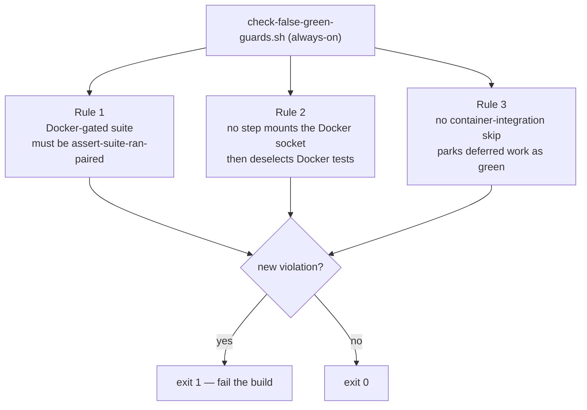

# False-Green Guards

## TL;DR

`.buildkite/scripts/steps/check-false-green-guards.sh` is a standing CI gate that
**fails closed when a new "false-green" test shape is introduced** — a test or CI
step that reports success while verifying nothing. It runs on **every build** and
is a few `grep`s (~1s).

It exists because the 2026-07-21 coverage audit classified its findings by the
*shape* of the false green, those categories lived only in plan documents, and the
repository then produced roughly a dozen fresh instances in a single day. This
guard turns the shapes that can be pinned down precisely into an enforced control,
so the pattern cannot recur silently.

It is deliberately narrow. A noisy grep everyone learns to ignore is worse than
nothing, so it enforces only rules that are (a) mechanically checkable with a low
false-positive rate and (b) tied to a real, shipped false green. Two of the
audit's five shapes are **declined** because they have no trustworthy textual
signature — see [Declined rules](#declined-rules).

## What it checks

| Rule | Shape it catches | Real instance it would have caught |
|------|------------------|-------------------------------------|
| **1** | A suite gated by `Assume.assumeTrue(DockerAvailability.isAvailable(...))` that is not paired with an `assert-suite-ran.sh` glob **for its own Maven module**. When Docker is unusable the suite reports SKIPPED and Maven exits 0, so a CI step checking only the exit code goes green having tested nothing. | The HTTP/3 suite and the socket-gated testcontainer/cloud suites, which skipped on 100% of builds while reporting green; and (found by this guard) the `Gcs`/`Azure` `RegistrarConfigWiringTest` cloud suites, which ran under a socket in CI but were never fail-closed-asserted. |
| **2** | A CI step that grants the Docker socket (`run-in-docker.sh -s`/`--docker-socket`) but then deselects the Docker-marked tests (e.g. `pytest -m "not docker"`). It pays to mount the socket, then starts no container, and passes green. | The python client job: `pytest -m "not docker"` deselected every container test while the socket was mounted; the job passed having started nothing. |
| **3** | A container-integration `logTestSkip` invoked with deferral language ("CI wiring is a follow-up", TODO, pending, …). A skip that parks unfinished work reads as green forever. | The `docker_compose_war_tomcat` WAR case, skipped as a "follow-up" and read as green for months. |

Rule 1's match is **module-scoped**, not class-name-only. The correlation key is
the Maven module directory name — the last path segment before `/target/` in an
`assert-suite-ran` glob, and before `/src/test/` in a gated suite — which is
identical whether the glob is written `mockserver-blob-azure/target/...` (script
runs from within `mockserver/`) or `mockserver/mockserver-netty/target/...` (from
the repo root). A gated suite is "covered" only by a glob belonging to **its own
module**, so a new gated suite in an unpaired module (e.g. a hypothetical
`OracleBlobStoreContractTest` under `mockserver-blob-oracle`) is **not** reported
covered just because its class-name suffix (`*BlobStoreContractTest`) is shared by
a glob for the S3/GCS/Azure modules. That family — `*BlobStoreContractTest`,
`*LiveBrokerIntegrationTest`, `*RegistrarConfigWiringTest` — is exactly the growth
path this guard protects, and a class-name-only match would silently pass it.

One precision limit is worth stating rather than leaving implied: the key is the
module directory's **basename**, so it assumes those basenames are globally unique.
They are today — every Java module is a flat, distinct `mockserver/<module>` — but a
nested module that duplicated an existing basename would collapse two modules onto
one key, and a gated suite in one could then be reported covered by the other's glob.
That is the same fail-open the module-scoping exists to close, so if such a module is
ever added, re-key on a repo-root-relative module suffix.

Matching remains **glob-based within a module**: the guard verifies that *some*
`assert-suite-ran` glob for the suite's module would match the suite's class name.
This is not a residual false-green — the very same glob is what the module's
`assert-suite-ran.sh` invocation runs against the reports, so a within-module
suffix match means the assertion genuinely covers the suite.

Rule 1 also fails on a **dangling** `assert-suite-ran.sh` glob — one that names a
suite that no longer exists (renamed or removed) — so an assertion can never rot
into a permanent no-op. (The dangling check is class-name-only by design: a glob
whose class still exists but has *moved modules* surfaces above as a coverage
miss for the suite, not as a dangling glob.)

## Where it runs

Wired into the **always-on** steps in `.buildkite/scripts/generate-pipeline.sh`
(alongside `clients-version-consistency.sh`), on the `trigger` queue.

This is deliberate. A new false green can be introduced from a Java test source
(routes to `mockserver-java`), a `.buildkite` step script (`mockserver-infra`), a
client test step (that client's pipeline) or a `container_integration_tests`
script — **no single path-filtered pipeline sees them all**, so only an always-on
step catches every case. The guard is also linted by `infra-validate-scripts.sh`
(`bash -n` + `shellcheck`) like every other CI script.

## Rationale — why these three, and why not the others

The audit named five false-green shapes. A guard is only worth having if it would
have caught its real instance without crying wolf on legitimate code, so each
shape was judged against that bar.

### Declined rules

- **Self-derived golden fixtures** (LLM codec goldens regenerated from the codec
  they verify via `-Dmockserver.updateLlmGoldens=true`). *Declined:* whether a
  fixture is self-derived is a property of test *design*, not a textual pattern —
  there is no low-false-positive signature to grep for. The real defense already
  shipped: a structural contract test asserting the codec against hand-authored,
  schema-derived expectations (`LlmCodecStructuralContractTest`). A generic
  regeneration/mutation gate is the separately-declined pitest proposal (Gap #5 in
  `docs/plans/test-coverage-gaps.md`).
- **A guard whose own precondition can silently fail** (a gate whose toolchain was
  absent so it never ran; a `nullglob` scoping bug that returned success when the
  build produced nothing). *Declined:* "this bash can fail open" is not detectable
  by a standing grep — it is a logic-bug class. The mitigations are structural:
  `assert-suite-ran.sh` already fails closed when a glob matches nothing (the
  nullglob lesson), and `shellcheck` in `infra-validate-scripts.sh` catches many
  quoting/glob bugs.

The **npm-script variant** of Rule 2 ("`npm run test:unit` ran instead of the
integration suite") is also not covered: which npm script is the "real" one is not
mechanically distinguishable. Rule 2 covers only the crisp contradiction — mount
the socket **and** deselect the tests that need it.

## Allow-lists — how to add an entry

Some Docker-gated files are legitimately **not** assert-suite-ran-paired (for
example the probe's own unit test, `DockerAvailabilityTest`, which calls
`isAvailable()` with stubbed suppliers and starts no container). Each rule has an
allow-list array near the top of the script (`R1_ALLOWLIST`, `R2_ALLOWLIST`,
`R3_ALLOWLIST`).

An allow-list entry is a **justification, never a mute button.** Follow the
precedent of `check-certificate-expiry.sh`, which allow-lists the intentionally
expired fixture *and asserts it is still expired*:

1. Add the entry (a repo-relative path for Rules 1/2, a `path:lineno` for Rule 3).
2. Write a comment saying **why** it is legitimately exempt.
3. The guard **verifies the entry still is what it claims** and fails the build if
   not — an entry that names a file that no longer exists, or (Rule 1) a file that
   has since gained an `Assume` gate and become a real suite, or (Rules 2/3) a
   location that no longer matches the pattern, is a hard error. So the allow-list
   cannot quietly rot into a no-op or mask a genuine regression.

If you find yourself wanting to allow-list a **real** finding to make the build
green, stop: the finding is the guard doing its job. Wire the suite up, run the
Docker tests, or make the skip declare a genuine N/A reason instead.

## Self-testing

Prove any rule bites by reintroducing its real defect and confirming the guard
goes red, then restore:

- **Rule 1** — remove an `assert-suite-ran.sh` glob line (e.g. a
  `RegistrarConfigWiringTest` pairing in `java-cloud-store-test.sh`).
- **Rule 2** — re-add `-m "not docker"` to `pytest` in a socket-mounting step.
- **Rule 3** — add a `logTestSkip "... follow-up"` line under
  `container_integration_tests/`.
- **Allow-list rot** — point an allow-list entry at a nonexistent path.

Each should turn the guard's exit code to 1 with a `+++ :bangbang:` line naming
the offender.
