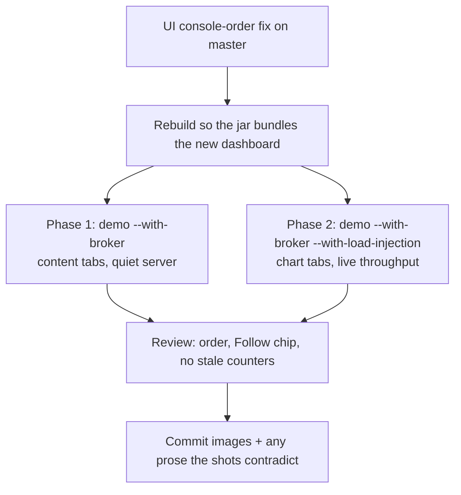

# Dashboard Documentation Refresh — after the console-order UI fix

## Outcome

Once the dashboard console-order fix is committed, the consumer documentation needs a second
pass: the **prose is already corrected**, but every committed dashboard **screenshot still shows
the old newest-at-top layout**, the removed counters, and no Follow control. Regenerate them with
the existing two-phase capture tool against a **live demo server**, keeping the same image set and
filenames the website already references.

There is no new tooling to build. `mockserver-ui/scripts/capture-docs-screenshots.sh` already does
this. The work is (a) teaching it about the one thing the redesign changed for capture — panel
follow state — and (b) running it and reviewing the output.

**Sequencing:** this runs *after* the UI fix lands on `master`, because the screenshots must show
the shipped build, and the dashboard is bundled into the netty jar at build time.

## Flow

## What already exists

| Piece | Where | Notes |
|---|---|---|
| Two-phase capture | `mockserver-ui/scripts/capture-docs-screenshots.sh` | Phase 1 `--with-broker`; phase 2 `--with-broker --with-load-injection` with a 90s chart warm-up |
| Per-tab capture | `mockserver-ui/scripts/capture-dashboard-screenshots.mjs` | ~19 tabs, each pinned to a fixed filename; default `OUT_DIR` is `jekyll-www.mock-server.com/images` |
| Demo server | `mockserver-ui/scripts/launch-with-demo-data.sh` (`npm run demo`) | Seeds rich demo data; `--with-broker` needs Docker for Mosquitto |

**Why two phases, and do not collapse them.** Load injection and content screenshots want opposite
things. The server keeps only the most recent ~100 traffic items, so a load scenario firing
thousands of requests a second evicts the seeded LLM conversations and can saturate the WebSocket
so panels never fill. Content tabs are therefore captured against a quiet demo; only the chart tabs
(Metrics, Performance), which need sustained throughput to draw a non-empty time-series, run under
load. The client-side hold added by the UI fix does **not** change this — it holds rows for a
*reader who is already looking at them*, and a freshly loaded capture page has nothing to hold.

## The one thing the redesign changes for capture

**Panel follow state is now load-bearing for a screenshot, and the capture script does not know
about it yet.** Lists render oldest-first with the newest at the bottom. A panel that is not
following sits at the **top** of the window — i.e. showing the *oldest* rows it holds. Captured
naively under phase 2, every panel would show stale rows and an un-pinned scroll position, which is
both unrepresentative and visually worse than what it replaced.

Before capture, each panel must be **following** (pinned to the tail, newest visible at the bottom).
Options, cheapest first:

1. Assert the default. Panels initialise to following via `useFollow`, so a freshly loaded page
   should already be at the tail — **verify this, do not assume it**, particularly for the tabs
   using `SLOW_SETTLE`/`lazy` where content arrives after first paint.
2. If any panel is not following at capture time, drive its Follow control (or the toolbar's master
   switch) from the capture script before the screenshot.

Add an explicit pre-capture check so a future UI change cannot silently reintroduce
oldest-rows-only screenshots — a screenshot that renders successfully while showing the wrong thing
is exactly the failure mode this whole change set has been about.

## Constraints

- **Keep the same image set.** Same ~19 tabs, same filenames, same default `OUT_DIR`. The website
  references these by name; do not add, rename or drop images as part of a refresh. If a tab
  genuinely warrants a new image, raise it separately.
- **Live data only.** Screenshots come from a running demo server via the script above, never from
  hand-built or edited fixtures.
- **Match the existing look** — `1920x900 @2x`, light theme, consistent with the current set.
- Review every regenerated image against the prose on its page: the shot and the text must agree.

## Checklist

- [ ] UI console-order fix committed and on `master`
- [ ] Rebuild so the dashboard bundled in the jar is the fixed one
- [ ] Verify/force panels are following before capture; add the pre-capture assertion
- [ ] Run `bash mockserver-ui/scripts/capture-docs-screenshots.sh` (both phases)
- [ ] Review each image: oldest-first order, Follow control visible, no removed counters, no empty panels
- [ ] Confirm `images/MockServerDashboard.png` specifically — it is the main 2x2 shot and the one
      known to show the old ordering
- [ ] Re-read `jekyll-www.mock-server.com/mock_server/mockserver_ui.html` against the new shots
- [ ] Decide on `images/intellij_dashboard_in_ide.png` — produced by separate tooling
      (`mockserver-jetbrains/docs/make-marketplace-screenshots.py`); refresh only if panel ordering
      is legible in it
- [ ] Commit images and any prose corrections together

## Already done (do not redo)

The consumer prose in `jekyll-www.mock-server.com/mock_server/mockserver_ui.html` was corrected
alongside the UI fix: the `Auto-Scroll` heading and its pause/play description, the title-bar button
list, and three "most recent first" / "reverse chronological order" ordering claims. The removed
window-derived counters were never documented for consumers, so there is nothing to retract.
`dashboard_privacy.html` is unaffected.
