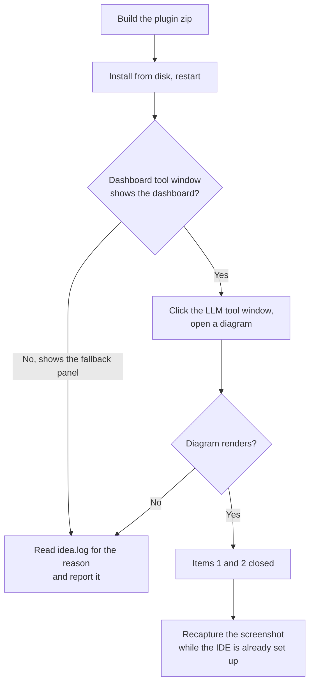

# JetBrains plugin — outstanding follow-ups

## Outcome

Three items remain on the JetBrains plugin, and **every one of them needs a human**: one needs a
running IDE to confirm, one needs a design decision, one needs someone driving the IDE by hand.
Nothing here is blocked on code that could be written instead.

The code fixes themselves are **done and on `master`**: the JCEF crash, the JCEF declaration that
restores the embedded browser, and the clipped tool-window labels. This document covers only what
is left.

| # | Item | What it needs | Blocking a release? |
|---|------|---------------|---------------------|
| 1 | Confirm the embedded dashboard renders | Install the built plugin, look at it | **Yes** — the fix is unverified in the only environment that counts |
| 2 | Confirm the LLM diagram view renders | Same session as #1, one extra click | **Yes** — same code path, never observed working |
| 3 | Pick a tool-window icon direction | A decision, or an explicit "none of these" | No — cosmetic |
| 4 | Recapture `intellij_dashboard_in_ide.png` | Driving the IDE by hand | No — but the shipped image is now wrong |

## The sequence



Items 1, 2 and 4 are one sitting: the screenshot needs exactly the state that verifying the
dashboard puts you in, so do them together.

---

## 1 & 2 — Confirm the embedded browser works

### Why this is not already done

The plugin asks whether the embedded browser (JCEF) is usable before using it. On IntelliJ 2026.2
that question **was itself the crash**: JCEF moved out of the IDE core into its own component, so
the class behind the question was not reachable from the plugin and touching it threw
`NoClassDefFoundError` onto the EDT. Two commits fixed it — one so the question can be asked
safely, one so the answer is yes.

The second is confirmed as far as it can be confirmed without a running IDE. The Plugin Verifier's
dependency report went from two direct dependencies to three, with `com.intellij.modules.jcef` now
declared at the plugin's own level. But that same verifier reports `Compatible` for code that
throws at runtime, because it models a more permissive classpath than the real
`PluginClassLoader`. **It cannot answer this question. A running IDE can.**

### Manual steps

**Build the plugin.**

```bash
cd mockserver-jetbrains
./gradlew buildPlugin
```

Behind a TLS-inspection proxy Gradle cannot resolve plugins at all (`403 Forbidden` from
`plugins.gradle.org`) until it is given the corporate CA. Build a truststore once and pass it to
every Gradle command:

```bash
KS=/tmp/gradle-ca.jks
cp "$(/usr/libexec/java_home)/lib/security/cacerts" "$KS" && chmod +w "$KS"
keytool -importcert -noprompt -trustcacerts -alias corp \
        -file ~/.tesco-ca/tesco_root_ca.pem -keystore "$KS" -storepass changeit
./gradlew buildPlugin -Djavax.net.ssl.trustStore="$KS" -Djavax.net.ssl.trustStorePassword=changeit
```

**Install it.** Settings | Plugins | gear icon | **Install Plugin from Disk…** →
`mockserver-jetbrains/build/distributions/mockserver-jetbrains-<version>.zip` → restart.

> **Install by FILE, not by version.** A local build does not bump `pluginVersion`, so the zip
> carries the same version as the release it replaces and the IDE keeps showing that number.
> Nothing warns you if you install the wrong one. Confirm the build actually contains the fix:
>
> ```bash
> cd mockserver-jetbrains
> Z=$(ls build/distributions/mockserver-jetbrains-*.zip | head -1)
> V=$(basename "$Z" .zip); V=${V#mockserver-jetbrains-}
> unzip -p "$Z" "mockserver-jetbrains/lib/mockserver-jetbrains-$V.jar" > /tmp/p.jar
> unzip -p /tmp/p.jar META-INF/plugin.xml | grep 'modules\.jcef</depends>' \
>   || echo "NO MATCH - this build does NOT carry the fix"
> ```
>
> Name the jar by its exact version rather than globbing it. The zip holds a second
> `...-searchableOptions.jar` beside it, and `mockserver-jetbrains-*.jar` matches **both** —
> `unzip -p` then concatenates them, the reader sees only the last archive, `META-INF/plugin.xml`
> is not found, and the grep prints **nothing at all**. Silence there looks exactly like "the fix
> is missing", which is why the command above says so in words instead of printing nothing.

**Start a server**, because the plugin does not contain the dashboard — it points a browser at
whichever MockServer it is configured for. From `mockserver-ui`:

```bash
npm run demo -- --no-browser
```

That seeds demo data, which matters for item 4; a bare `java -jar` gives empty panels.

**Check item 1.** Open the **MockServer Dashboard** tool window. It should show the dashboard
itself, not a panel offering the external browser.

**Check item 2.** Open the **MockServer LLM** tool window and open a diagram (**Render Call Graph**, with a
session id in the field beside it). This shares the same JCEF path and had the identical defect, but — unlike the dashboard —
**nobody has ever observed it working**. The guard test only asserts that `JBCefApp` is not
referenced outside the guarded helper; nothing exercises diagram rendering. Treat this as
genuinely unverified rather than as a formality.

### If either still shows the fallback

The plugin logs the reason it declined. That line distinguishes "the class is missing" from
"JCEF is present but disabled", which need different fixes:

```bash
grep -a "JcefSupport" ~/Library/Logs/JetBrains/IntelliJIdea*/idea.log | tail -5
```

- `(NoClassDefFoundError)` → the declaration did not take effect. Check the installed plugin is
  the one you built (see the version trap above).
- anything else → JCEF is reachable but unusable in this IDE or runtime, which is a different
  problem and the fallback is then behaving correctly.

Report that line rather than the symptom; it is the whole diagnosis.

---

## 3 — Tool-window icons

### The problem, and the half already fixed

All four MockServer tool windows share one icon, so the stripe cannot tell them apart. The labels
used to make it worse — they were run-together tokens (`MockServerDashboard`) that the platform
could not wrap, so they were cut off mid-word. **That half is fixed**: the labels now contain a
space and wrap onto two lines like every neighbouring plugin.

What remains is distinguishing the icons themselves.

### Review the options

```bash
open mockserver-jetbrains/docs/icon-options/index.html
```

Three approaches, each drawn for Dashboard (D), Debugger (B) and LLM (L):

| | Approach | Trade-off |
|---|---|---|
| **A** | Solid dark badge, bottom-right | Highest contrast; the disc covers part of the mark |
| **B** | Knockout badge — white disc, dark outline, dark letter | Keeps its own contrast on any background; best in dark mode |
| **C** | Corner wedge — folded-corner shape | Mark stays fully intact; smallest letter, most at risk |

**B is for Breakpoint** — the debugger tool window is `BreakpointDebuggerToolWindowFactory`, and
D was already taken by Dashboard.

**Judge them at the 13 px column.** That is the real stripe size; the larger columns are only there
to show construction. A single letter is about all that fits — a word would be a smudge, which is
why every option uses one.

### What to decide

Pick a direction, or reject all three. **"None of these read well enough at 13 px" is a legitimate
answer**, and if it is the answer the next thing to try is *shape* differentiation rather than
letters — a distinct silhouette per tool window instead of a badged variant of one mark.

Whatever is chosen, the icons ship as four files under
`mockserver-jetbrains/src/main/resources/icons/` (light and dark), wired per tool window in
`plugin.xml`, replacing today's single shared `icon="/icons/mockserver.svg"`.

---

## 4 — Recapture `intellij_dashboard_in_ide.png`

### Why it cannot be scripted

`mockserver-jetbrains/docs/make-marketplace-screenshots.py` only *frames* an existing capture; it
does not produce one. The website's dashboard screenshots regenerate automatically via
`mockserver-ui/scripts/capture-docs-screenshots.sh`, but that drives a browser, not an IDE. This
image needs a person.

### Why the current one is wrong

It shows the dashboard from before the console-order work, and every one of these is now false:

- Received Requests numbered **39 → 30 descending**
- Log Messages **newest at the top**
- The removed counters visible: `Log Messages 100`, `Received Requests 39`, `Proxied Requests 8`
- Row **index numbers** instead of timestamps
- No **Follow** control

### What the new capture must show

With the IDE already set up from items 1–2:

1. Generate some traffic so the panels are not sparse — a few requests a second looks natural,
   thousands looks chaotic:
   ```bash
   while true; do curl -s -o /dev/null http://localhost:1080/api/items/$RANDOM; sleep 0.3; done
   ```
2. Check the panels read **`Following`**, not `Follow`. They follow by default, but if anything
   scrolled them the chip flips — and a paused panel sits at its *oldest* rows, which is exactly
   the stale-looking capture being replaced. **If a panel reads `Follow`, click the chip to
   resume**, then let it scroll to the bottom before capturing.
3. Capture, and confirm the image shows: **oldest first with the newest at the bottom**,
   `Following` chips lit, **timestamps** rather than row indices, and **no counts** beside Log
   Messages / Received Requests / Proxied Requests.
4. Replace `mockserver-jetbrains/docs/screenshots/intellij_dashboard_in_ide.png`.

`intellij_dashboard_code_export.png` shows the code-export dialog rather than the panels and is
unaffected.

---

## Already done — do not redo

- **The JCEF crash** — the availability probe survives the class being absent (`JcefSupport`,
  `LinkageError`), so the tool window can no longer take down the EDT.
- **The JCEF declaration** — `com.intellij.modules.jcef` declared optional, confirmed as a third
  direct dependency in the verifier's report. Optional deliberately: a required dependency would
  stop the plugin loading entirely on an IDE without JCEF, turning a degraded dashboard into no
  plugin.
- **The clipped labels** — stripe titles now `MockServer Dashboard` / `MockServer Debugger` /
  `MockServer LLM`. Set via `stripeTitle` rather than renaming the tool-window ids, because those
  ids are referenced in code *and* persisted in the user's window layout.
- **A guard against the crash returning** — `JcefSupportGuardTest` fails the build if `JBCefApp` is
  referenced anywhere outside the guarded helper. The Plugin Verifier **cannot** catch this class
  of bug and no `failureLevel` change would help; it was tested and reports `Compatible` for the
  crashing code.
