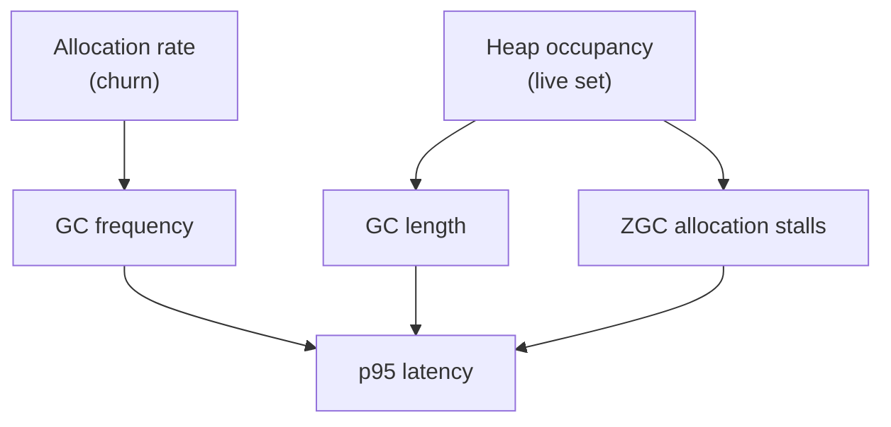

# Memory Optimisation Programme

## Outcome

MockServer's event log retains roughly four to five times what its own budget
believes, and the heap it holds is dominated by per-request structure rather than
by the payloads users care about. This programme reduces **both** quantities that
drive GC cost, and every change is gated on evidence that it did not alter
behaviour.

The two levers are distinct and a change usually moves only one:

- **Allocation rate (churn)** sets how *often* a collection runs.
- **Heap occupancy (live set)** sets how *long* each collection takes, because
  ZGC's marking and relocation work scales with what is live, not with what was
  allocated.

Both feed the p95 tail, by different routes: frequency raises the chance a
request meets a cycle, length raises the cost when it does, and at high occupancy
ZGC can stall allocating threads outright. **Classify every finding by which
lever it moves; prefer findings that move both.**

## Measured evidence

Live-heap class histogram at peak load, CI build 441 (6 vCPU, generational ZGC,
JDK 25), with 84k requests / 42k responses / 101k log entries live:

| Class | Bytes | Instances |
|---|---:|---:|
| `byte[]` | 133 MB | 1.73 M |
| `NottableString` | 60.6 MB | 758 k |
| `String` | 53.7 MB | 1.68 M |
| `LinkedListMultimap$Node` | 35 MB | 547 k |
| `LogEntry` | 19.3 MB | 101 k |
| `HttpRequest` | 18.9 MB | 84 k |
| `LinkedListMultimap$KeyList` | 17.5 MB | 547 k |
| `TextNode` | 17 MB | 709 k |
| `Expectation` | 16.5 MB | 42 k |

**Header machinery totals ~181 MB, exceeding the 133 MB of actual body bytes.**
One Guava `LinkedListMultimap` plus a backing `HashMap` plus an `AtomicInteger`
per message, to hold 4.3 headers: ~1,379 bytes of structure per message, against
the 277 the weigher charges.

## Units

| # | Unit | Lever | Status |
|---|---|---|---|
| 4a | KeysToMultiValues characterisation corpus (93 tests) | — | **landed** `ddb1061a1` |
| 1 | Text bodies no longer retained twice (`String` + `byte[]`) | occupancy | **landed** `b413de937` |
| 2 | `NottableString` immutable | correctness, unblocks 3 | **landed** `0f8758cd7` |
| A/B | `withEntry` null NPE; `withKeyMatchStyle` cache invalidation | bug fixes | reviewed PASS, site-1 test added, awaiting verify + commit |
| 5 | Synthetic per-request `Expectation` derived lazily | both | verified (11,069 tests), awaiting review + commit |
| 3 | Header-name dedup + `NottableString` field diet | both | to do — unblocked by 2 |
| 4b | Flat insertion-ordered array replacing the Guava multimap | both | to do — gated on 4a, which is landed |
| 6 | `estimatedHeapSize()` to count headers and expectation | accounting | to do, **after** 5 |
| 7 | Boxed `Long`, per-entry `Object[]`, `AtomicInteger`, `KeyToMultiValue.hashCode` | churn | to do |
| 8 | Audit all of `org.mockserver.model` | both | to do, after 1-7 |

Expected size of the remaining work, from the histogram above: unit 3 targets the
60.6 MB of `NottableString` (~80 bytes each, of which four fields are matcher-only
and null on the data plane); unit 4b targets ~70 MB of multimap container
machinery; unit 5 removes ~20 MB of synthetic `Expectation` and `Timing`.

Units 1, 5 and 6 all edit `LogEntry.estimatedHeapSize()` and **must run
sequentially** — concurrent edits to one method are how a gate-passed change gets
silently dropped.

## Carried over from the earlier performance work

These predate this programme and are **not** addressed by it. Recorded here so
they survive its completion.

| Item | Why it still matters |
|---|---|
| **Published figures are stale** — the site shows build 420: JDK 17, G1, 1,230 MiB heap, 39,033 req/s at p95 74.4 ms | The product now ships JDK 25 with generational ZGC. Build 441 measured 47,412 req/s at p95 17.8 ms on the same hardware — better on both axes |
| **The publish step cannot push** | `perf-website-publish.sh` regenerates `perf_figures.json` and the charts, then attaches a `git format-patch` artifact, because the `perf` queue holds no git/gh credentials. Builds have been emitting patches nobody applies. Either grant credentials or make applying the patch an explicit step |
| **The default ladder cannot resolve the knee** | It jumps 32,000 to 48,000. The last cleanly-served rung is 32,000, so a mechanical publish would headline a figure *worse* than what is already published. A fine ladder is needed before publishing |
| **Ladder anchor rule** | Always include a rung below the expected knee. A ladder starting above the cleanly-served region reports `saturation_rps=0`, which looks like a defect and is not |
| **Ten cores is unmeasurable on this rig** | 10 server + 1 upstream + 13 k6 = 24 physical cores, and 13 is demonstrably insufficient for the client. A ten-core headline needs k6 on a separate box |
| **`perf-test-h2multiplex.sh` UI skip** | Deliberately deferred; review confirmed it would be safe |
| **Master is red** | `:docker: container integration tests` fails on build 2528. The `-DskipITs` fix (`a1db68d43`) cured the blob-store timeout but unmasked this, which had been `waiting_failed` and never running |
| **Comment hygiene backlog** | `docs/plans/comment-hygiene-sweep.md` — historical run narrative in comments across CI scripts and k6 config. Not started |

Two earlier items are now closed by this programme: the ~2 GB of unattributed
heap is explained (it is header machinery plus the double-retained bodies, not a
leak), and GC pause data is available because the deep tier's `-Xlog:gc*` already
includes `gc+phases`.

## Testing standard

This is the part that makes the rest mean anything.

1. **Every unit adds the tests needed for confidence**, not just enough to go
   green.
2. **Every unit proves its tests can fail.** Break the change, show a *named*
   test goes red, restore. A test that passes whether or not the change is
   present proves nothing. Report the red count.
3. **Characterisation tests assert reality, not intent.** Where behaviour looks
   wrong, pin what the code *does* and report it separately. A test asserting
   aspiration is worse than no test.
4. **Integration tests are a separate gate.** `mvn test` runs surefire only;
   failsafe is excluded, and `mockserver-netty` is ~1,218 tests under `test`
   versus ~2,257 under `verify`. Run `verify` on `mockserver-netty` per batch —
   it also enables the `paranoid` ByteBuf leak detection that
   `docs/code/optimisation-safety.md` requires for data-plane changes.
5. **Hazard class drives the evidence** (see `docs/code/optimisation-safety.md`):
   reuse/pooling needs a cross-talk test at real concurrency; caching needs the
   invalidation path tested; laziness needs concurrent first-use; a structural
   swap needs a differential corpus.

Negative controls run so far:

| Unit | Control | Red |
|---|---|---|
| 2 | revert the four call-site fixes | 9, all parameter-style |
| 4a | `ArrayListMultimap` (groups by key) | 20 |
| 4a | swap-remove in `remove()` | 10, pure-insertion tests correctly green |
| A | revert both null-storing sites | 2 |
| B | drop `isModified()` | 1 |
| 5 | break the lazy derivation | 2, incl. a previously untested serialized field |

## Verified facts — do not re-derive

- **JFR cannot attribute retained heap under ZGC.** `jdk.ObjectCount`
  (`object-statistics`) and `jdk.OldObjectSample` (`memory-leaks-by-class`) emit
  nothing under ZGC and populate normally under G1, verified on JDK 25 with the
  same program. Use `jcmd GC.class_histogram`, which does work.
- **`jcmd` attach needs an exact uid match.** Root fails with `Unable to open
  socket file /tmp/.java_pid1`. Read the uid from the target's own
  `/proc/1/status` in the shared PID namespace.
- **No Guava multimap other than `LinkedListMultimap` preserves global insertion
  order.** `ImmutableListMultimap` and `ArrayListMultimap` group by key;
  `LinkedHashMultimap` is Set-backed and dedupes identical repeated headers.
  Measured live-set for 200k messages x 6 entries: LinkedList 280 MB,
  ArrayList 242 MB, Immutable 188 MB, flat array 102 MB.
- **Response header wire order comes from `getMultimap().entries()`**
  (`NettyResponseWriter:157`, `Http3RequestBridge:243`), so a swap-remove in a
  flat array would scramble headers on the wire.
- **No consumer mutates through `getMultimap()`** — a read-only projection is safe.
- **`Cookies` extends `KeysAndValues`, not `KeysToMultiValues`** — unaffected by 4b.
- **Serialized JSON sorts keys descending**, not by insertion order, so it is not
  a differential signal for the structure change.
- **`ObjectWithJsonToString.toString()` does not build an `ObjectMapper` per
  call** — `ObjectMapperFactory.createObjectMapper(pretty, defaults)` returns a
  cached static `ObjectWriter`.
- **`ParameterBody`, `GraphQLBody` and `JsonRpcBody` override `toString()`** and
  their raw bytes are correct. Ten matcher-side bodies inherit the JSON
  `toString()` and so return JSON bytes from `getRawBytes()`.
- **The retained body is the same instance as the live request's** when
  `maxLoggedBodyBytes=0` (the default).

## Constraints

- **`toString()` must remain JSON.** It is real UX value in logs, assertion
  failures and debugging. Optimise by memoising where an object is immutable and
  re-serialized often, by replacing the reflective `equals`/`hashCode`, and by
  getting `toString()` off data paths — never by changing what it emits.
- **Java 17 source/target floor** stays unchanged.
- Comment discipline per `.opencode/rules/code-comment-discipline.md`: no run
  narrative, no measured figures, no build numbers in comments.
- Every unit passes `review-final` before commit; stage by explicit path, since
  the tree holds several units at once.

## Open decisions

- `withEntry(NottableString, List)` and `withEntry(NottableString, NottableString...)`
  remain no-ops on an empty list, silently dropping a header the caller asked
  for — a third semantic, inconsistent with the two sites fixed to store
  `string("")`.
- Whether `getRawBytes()` on the ten matcher-side bodies is meaningless or wrong.
  `MultipartBody` and `LogEntryBody` need checking against real paths.

## Tooling hazards

- Never run two Maven builds concurrently in one worktree — they recompile
  `target/classes` under each other's forked test JVMs and produce bogus
  `ClassNotFoundException` failures. Check `pgrep -f surefire` first.
- Always capture Maven's **own** exit code. Piping into `grep`/`tail` returns the
  last command's status, not Maven's.
- After restoring a file with `mv`/`cp`, `touch` it — an mtime older than the
  compiled `.class` makes Maven skip recompilation and test a stale class.

## Done when

All eight units are complete, the `mockserver-netty` integration suite passes
with leak detection, and a perf run with a fine ladder (32000, 36000, 40000,
44000, 48000) both validates the wins and pins the healthy-ceiling knee — the
default ladder jumps 32,000 to 48,000 and cannot resolve it. The run's generated
`perf_figures.json` patch is then applied to the website, which currently
publishes JDK 17 / G1 figures for a product shipping JDK 25 with generational ZGC.
