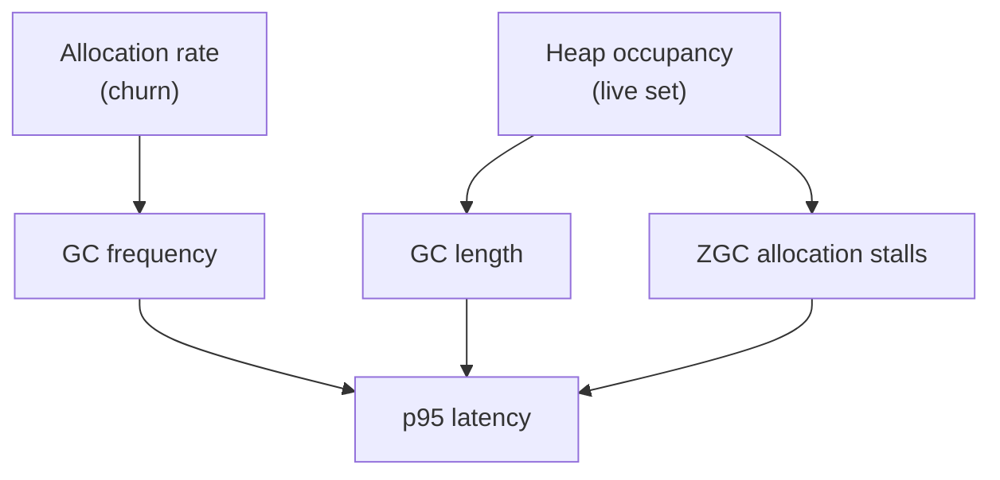

# Memory Optimisation Programme

## Outcome

MockServer's event log retains roughly four to five times what its own budget
believes, and the heap it holds is dominated by per-request structure rather than
by the payloads users care about. This programme reduces **both** quantities that
drive GC cost, and every change is gated on evidence that it did not alter
behaviour.

The two levers are distinct and a change usually moves only one:

- **Allocation rate (churn)** sets how *often* a collection runs.
- **Heap occupancy (live set)** sets how *long* each collection takes, because
  ZGC's marking and relocation work scales with what is live, not with what was
  allocated.

Both feed the p95 tail, by different routes: frequency raises the chance a
request meets a cycle, length raises the cost when it does, and at high occupancy
ZGC can stall allocating threads outright. **Classify every finding by which
lever it moves; prefer findings that move both.**

## Measured evidence

Live-heap class histogram at peak load, CI build 441 (6 vCPU, generational ZGC,
JDK 25), with 84k requests / 42k responses / 101k log entries live:

| Class | Bytes | Instances |
|---|---:|---:|
| `byte[]` | 133 MB | 1.73 M |
| `NottableString` | 60.6 MB | 758 k |
| `String` | 53.7 MB | 1.68 M |
| `LinkedListMultimap$Node` | 35 MB | 547 k |
| `LogEntry` | 19.3 MB | 101 k |
| `HttpRequest` | 18.9 MB | 84 k |
| `LinkedListMultimap$KeyList` | 17.5 MB | 547 k |
| `TextNode` | 17 MB | 709 k |
| `Expectation` | 16.5 MB | 42 k |

**Header machinery totals ~181 MB, exceeding the 133 MB of actual body bytes.**
One Guava `LinkedListMultimap` plus a backing `HashMap` plus an `AtomicInteger`
per message, to hold 4.3 headers: ~1,379 bytes of structure per message, against
the 277 the weigher charges.

## Units

| # | Unit | Lever | Status |
|---|---|---|---|
| 4a | KeysToMultiValues characterisation corpus (93 tests) | — | **landed** `ddb1061a1` |
| 1 | Text bodies no longer retained twice (`String` + `byte[]`) | occupancy | **landed** `b413de937` |
| 2 | `NottableString` immutable | correctness, unblocks 3 | **landed** `0f8758cd7` |
| A/B | `withEntry` null NPE; `withKeyMatchStyle` cache invalidation | bug fixes | **landed** `1122561d7` |
| 5 | Synthetic per-request `Expectation` derived lazily | both | **landed** `4d09ceb55` |
| 3 | Header-name dedup + `NottableString` field diet | both | **landed** `37a8fb023` |
| 4b | Flat insertion-ordered array replacing the Guava multimap | both | **landed** — 1,213 to 654 bytes per message |
| 6 | `estimatedHeapSize()` to count headers and expectation | accounting | to do, **after** 5 |
| 7 | Boxed `Long`, per-entry `Object[]`, `AtomicInteger`, `KeyToMultiValue.hashCode` | churn | to do |
| 8 | Audit all of `org.mockserver.model` | both | to do, after 1-7 |

Expected size of the remaining work, from the histogram above: unit 3 targets the
60.6 MB of `NottableString` (~80 bytes each, of which four fields are matcher-only
and null on the data plane); unit 4b targets ~70 MB of multimap container
machinery; unit 5 removes ~20 MB of synthetic `Expectation` and `Timing`.

Units 1, 5 and 6 all edit `LogEntry.estimatedHeapSize()` and **must run
sequentially** — concurrent edits to one method are how a gate-passed change gets
silently dropped.

## Outcome — measured, build 442

All nine units landed and were measured on the same rig and configuration as the
pre-programme baseline (build 441): JDK 25, generational ZGC, 6 vCPU, 2.4 GiB
heap, `ERROR` log level. `image_revision` was confirmed as the commit carrying
all nine units before any number was read.

| offered | achieved | p50 ms | p95 ms | clean |
|---:|---:|---:|---:|:--|
| 32,000 | 30,956 | 0.111 | 0.340 | rig-invalid |
| 36,000 | 35,990 | 0.111 | 1.234 | yes |
| 40,000 | 39,981 | 0.112 | 7.571 | yes |
| 44,000 | 43,817 | 0.115 | 10.374 | yes |
| 48,000 | **47,580** | **0.119** | 16.282 | yes |

**`saturation_rps` is 48,000, up from 32,000.** In build 441 the 48k rung was
rig-invalid, so the highest cleanly-served rung was 32,000 and the knee could not
be located. The fine ladder resolves it: the healthy ceiling is 47,580 req/s at a
0.119 ms median, and the median is flat across the whole ladder.

The 32,000 rung is rig-invalid here (VU occupancy 0.026) — a bottom-of-ladder
client artefact, not a server regression; its p95 improved.

### The histogram confirms the units caused it

Build 442 carried 19% more live load than 441 (100,005 versus 84,223 requests),
so these are normalised per request.

Absent from the top 25 entirely, having totalled ~118 MB in 441:
`LinkedListMultimap$Node`, `$KeyList`, `LinkedListMultimap`, `$1EntriesImpl`,
`$1KeySetImpl`, the backing `HashMap`/`$Node`/`$Node[]`, `Expectation`, and
`AtomicInteger`.

| | 441 | 442 | per request |
|---|---:|---:|---|
| Header container machinery | ~118 MB (1,406 B/req) | ~25 MB (252 B/req) | **−82%** |
| `NottableString` | 60.6 MB, 9.0/req at 80 B | 36.4 MB, 6.5/req at 56 B | **−49%** |

The −82% matches what the local bench predicted, on different hardware. The new
`NottableString[]` at 16.8 MB *is* the flat store, replacing ~101 MB of linked
machinery.

### What this did not do, stated plainly

- **The p95 gain at 48k is ~8%** (17.8 → 16.3 ms) from a **single run**. Do not
  publish it as a definitive delta without repeats.
- **Throughput is essentially unchanged**, which was the prediction: the
  programme removed *retained* heap, not per-request allocation rate. Occupancy
  drives collection *length*; churn drives *frequency*, and churn was barely
  touched.
- **`Long` was not eliminated.** 168,982 → 150,588 instances, about 2.0 → 1.5 per
  request — a 25% cut, not removal. Unit 7 unboxed `receivedTimestamp`; something
  else still boxes ~1.5 `Long` per request and it is unidentified.
- **`Integer` appeared** at 101,343 instances (~1 per request), absent from 441's
  top 25. Unit 7 unboxed `KeyToMultiValue`'s hash, so this is a different source.
- `byte[]` and `String` rose in absolute terms but are flat per request. Correct —
  nothing here targeted payload bytes.

### What the reviews caught that the tests did not

Five defects invisible to roughly 11,000 passing tests: four call sites silently
losing parameter styles (unit 2); unsafe publication of a mutable object across
reader threads (unit 5); a caller-controlled quadratic reachable through form
bodies (4b); NOT-key identity, which this plan's own corpus missed and older
tests caught (4b); and an ARM-reachable torn read in a hash cache (unit 7).

None was found by running tests. The corpus was necessary but **not sufficient**.

## Phase two — the inbound request path

The nine units above cut retained heap hard and barely moved peak throughput. An
audit of the receive/parse path and the control-plane decision found why that is
consistent rather than disappointing: **a serialising lock sits on the hot path**,
and no amount of memory saving lifts a ceiling set by contention.

Units are ordered by expected value, not by ease.

| # | Unit | Lever | Status |
|---|---|---|---|
| 10 | Stop taking a global lock per request to re-add a known SAN host | **throughput** (contention) | to do |
| 11 | Precompile the two `URLParser` regexes | churn + CPU | to do |
| 12 | Cheapest-first gate for the control-plane decision | churn + CPU | to do |
| 13 | Single-pass header ingest | churn | to do |
| 14 | Per-PUT future, query-map copy, address `toString` | churn | to do |
| 15 | Identify the boxed `Long` and `Integer` residuals from a dominator tree | occupancy | to do |

### 10 — the per-request lock

`HttpRequestHandler.java:234` calls `configuration.addSubjectAlternativeName(...)`
with the `Host` header on **every** request, before anything else.
`Configuration.java:6427` has no guard: it does a `substringBefore`, a Guava
`InetAddresses.isInetAddress` parse, then calls `addSslSubjectAlternativeNameDomains`
(`:6469`) or `addSslSubjectAlternativeNameIps` (`:6440`) — **both `synchronized` on
the shared `Configuration` instance**.

So every event loop thread contends on one monitor, per request, to re-add a host
that is almost always already present. For a mock serving a stable `Host` it is
pure overhead; for a proxy with many hosts it is genuinely contended.

The fix is a lock-free read fast-path: if the normalised host is already in the
set, return without locking, and take the lock only for a real addition. The
correctness constraint is that the SAN set must still end up right — the lock
exists because of a real defect (noted at `:6441` as C7) where concurrent adds
raced to read-modify-write separate copies.

### 11 — regexes that are compiled per request

`URLParser.java:10-11` holds `schemeRegex` and `schemeHostAndPortRegex` as `static
final` **strings**, then `isFullUrl` calls `uri.matches(...)` and `returnPath` calls
`path.replaceAll(...)`. Both `String` methods compile a fresh `Pattern` on every
call. One to two compiles plus a `Matcher` per request, for a change with identical
semantics.

### 12 — the control-plane decision is a linear scan

`HttpRequest.matches(String, String...)` (`:578-587`) allocates a varargs `String[]`
per comparison, and re-tests the method inside the per-path loop. A data-plane GET
falls through roughly 22 such calls in `HttpState.handle`, a PUT through 59, and
then `HttpRequestHandler.channelRead0` (`:238-519`) runs a *second* chain for
`/ready`, `/status`, `/bind`, `/stop`, `/configuration`, dashboard, openapi,
metrics, http3status and CONNECT before reaching the data plane. Nothing rejects a
data-plane path cheaply first.

**The constraint that makes this non-trivial:** every control-plane route also
accepts a bare-path alias without the prefix — `matches("PUT", PATH_PREFIX +
"/expectation", "/expectation")` — so a plain `startsWith(PATH_PREFIX)` gate would
break the bare forms. A correct gate is the prefix test **or** membership of a
fixed bare-alias set, computed once per request. Enumerating that set completely is
the whole risk; treat it as a structural change needing a differential corpus.

Note `PATH_PREFIX + "/expectation"` is **not** a per-call allocation — `PATH_PREFIX`
is `static final`, so the concatenation is a compile-time constant. The churn is the
varargs array, not the string.

### 15 — the residuals, and how to actually find them

A live histogram shows about **1.5 boxed `Long` and 1.0 boxed `Integer` retained per
request**, identical under G1 and ZGC.

For `Integer`, `LogEntry.port` was **ruled out**: it looks like the obvious
per-entry box but is a shared instance threaded through a `ThreadLocal`
(`HttpState.java:211-218`, copied by reference at `LogEntry.java:995`). The real
candidates are `HttpResponse.statusCode` (autoboxed above the 127 cache, retained
per logged response) and, under HTTP/2 only, `HttpRequest.streamId` /
`HttpResponse.streamId` from `headers().getInt(...)`.

For `Long`, **no retained per-request field was found.** Every candidate was
checked and excluded: `receivedTimestamp` and `LogEntry.epochTime` are primitive,
the deque tracks weight as primitive, `Timing` early-returns without allocating on
the default path, and `Expectation` has left the live set. There is real transient
`Long` churn at `withReceivedTimestamp(Long)`, but transient objects do not survive
the full GC that a class histogram forces.

**Do not attribute this by inspection.** A class histogram names classes, not
retainers, which is exactly why it has stayed unexplained. Take the heap dump the
rig already captures and get the immediate-dominators / paths-to-GC-roots view for
`java.lang.Long`.

## Phase three — beyond the model objects

Phase one cut retained heap hard and barely moved peak throughput. Phase two found
why: a shared monitor sat on the hot path. The lesson reframes this phase — **look
for blocking and setup cost, not only bytes**.

Ordered by expected value. Units 16 and 17 are the two biggest available wins and
neither is primarily an allocation fix.

| # | Unit | Lever | Status |
|---|---|---|---|
| 16 | Stop the INFO-level serialise-and-reparse per request | CPU + churn | to do |
| 17 | Reconsider the shipped GC default | **GC length → p95** | to do |
| 18 | Response write path | churn | to do |
| 19 | Dashboard WebSocket handler | occupancy + threads | to do |
| 20 | Matching path — per-candidate churn | churn → GC frequency | audited, see below |
| 21 | Forwarding client — blocking proxy paths | **throughput** (thread occupancy) | audited, see below |
| 22 | Templating and callback paths | churn + CPU | to do |

### 16 — the default log level does double work on every request

At `INFO`, which is the **shipped default**, every served request and response body
is `toString()`-serialised to JSON and then, for a `JsonBody`, immediately re-parsed
via `readTree` — a serialise-then-reparse of the same content, twice per request
(`LogEntry.java:762-811` and `:891-958`, reached from `getMessage()` →
`getArguments()` → `updateBody`).

`MockServerLogger.java:215-216` short-circuits before `getMessage()` when the level
is not enabled, so `WARN` and `ERROR` never pay it.

**Every measurement in this programme was taken at `ERROR`.** The figures are
honest about what they measured, but they describe a configuration users do not
run. This is the clearest gap between what we optimised and what ships.

Fix by not calling `toString()` on that path, or by avoiding the JSON → String →
JSON round trip for a body that is already parsed. **Not** by caching the JSON —
`toString()` must keep emitting JSON (it is real UX value in logs and assertion
failures) and caching it would retain memory, fighting the occupancy goal.

### 17 — the shipped GC default

Two runs, same commit, same hardware, same ladder, differing only in collector and
heap:

| | throughput at 48k offered | p95 |
|---|---:|---:|
| build 443 — G1, 1,230 MiB (the shipped default) | 47,209 | 34.4 ms |
| build 442 — generational ZGC, 4 GB | 47,580 | 16.3 ms |

Essentially the same throughput at **less than half the tail latency**, from what
would be a one-line change to the image default.

This is not yet a recommendation, because **the comparison changes two variables at
once**: 442 used ZGC *and* a 4 GB container (2,458 MiB heap), 443 used G1 *and* the
default container (1,230 MiB). Either could be the cause.

The decisive question is narrower than a full matrix. The change actually on the
table is "flip the collector, leave the heap alone" — so the cell that settles it is
**ZGC at the default heap**:

| | G1 | generational ZGC |
|---|---|---|
| default heap (1,230 MiB) | build 443 / 445 | **build 446 — the decisive cell** |
| 4 GB container (2,458 MiB) | not measured | build 442 |

Build 446 runs the same full-span ladder, same commit, same cpusets and the same
default heap as 445, differing **only** in the collector. If ZGC still wins there,
the collector is the cause and the default change is justified. If it does not, 442's
advantage came from the heap, and flipping the collector alone would not help — and
could hurt, since ZGC carries more per-object overhead and wants headroom that a
1,230 MiB heap may not have.

Both runs set `PERF_SERVER_JAVA_OPTS`, so they are `config_profile=tuned` and not
baseline-eligible. That is correct: these are experiments, not publishable figures.

Single samples either way, so a clear result should be repeated before the image
default changes. This remains a product decision rather than a code one.

### 18 — the response write path

`NettyResponseWriter` and `BodyDecoderEncoder.bodyToBytes` have not been examined
except to rule out the matcher-side bodies. Note `premerge_alloc.ResponseWriteBenchmark`
and `InboundDecodeBenchmark` already gate allocation-per-op, so regressions are
ratcheted — but a ratchet prevents drift, it does not find existing waste.

### 19 — the dashboard WebSocket handler

`DashboardWebSocketHandler` carries 8 synchronized sites, and the `@Sharable`
handler is effectively per-channel in practice: N open dashboards means N
listeners, N walks and 2N threads, and its `CircularHashMap(100)` bounds nothing.
Not the request path, but it degrades a live server precisely while someone is
watching it.

### 20 — the matching path

My own first read of this file concluded it was "probably already optimised". That
was **half right, and the wrong half was load-bearing.**

Right: none of the nine `synchronized` sites in `RequestMatchers` is inline on the
match read path. `:1748` (`removeHttpRequestMatcher`) is the only one the serve path
can reach, and the expiry and lazy-removal routes dispatch through
`scheduler.submit(...)` off the event loop. The one inline route is `postProcess`
removing a *just-served* expectation that is now inactive — so only `once()` or
limited-`Times` expectations, which the perf rig does not use.

Wrong: that says nothing about **allocation**, and the match path is exactly where
this programme's untouched churn lives. Allocation here multiplies by **candidate
count**, not request count.

| Finding | Location | Scope |
|---|---|---|
| `containsSubset` allocates a `HashSet<Integer>` for the match **plus one per matcher entry**, boxing every superset index, plus a `stream().filter().filter().count()` on the success path | `SubSetMatcher.java:30,54,43-46` | **fires on the winning match**, for any header/query/param-constrained expectation |
| `addDifference(logger, msg, arg, arg, …)` builds a varargs `Object[]` **at the call site, before the guard runs**, then discards it on the default path | 60 sites, e.g. `RegexStringMatcher.java:207`, `MultiValueMapMatcher.java:56`, `HashMapMatcher.java:56` | per candidate, per failed field |
| `new MatchDifferenceCount(request)` per candidate, with a **boxed `Integer`** counter incremented by `++` | `HttpRequestPropertiesMatcher.java:351`, `MatchDifferenceCount.java:8,19` | per candidate |
| `string(request.getProtocol().name())` wraps a `NottableString` per candidate reaching the PROTOCOL field, even when the expectation does not constrain protocol | `HttpRequestPropertiesMatcher.java:441` | per candidate |

The first is the one to do: it fires on the **winning** match, not only on misses.
A primitive bitset over the superset reproduces the distinct-index semantics exactly.

**Do not** cache the candidate-index bucket re-sort (`CandidateIndex.java:348-360`) —
it only engages above 64 expectations, the bucket is small, and caching adds an
invalidation surface for little gain.

**Already optimal, do not touch:** the request-side header/cookie/query multimap is
memoised per request via `getConvertedMatcher(controlPlaneMatcher)`, so headers are
*not* rebuilt per candidate; `MatchDifference` uses a shared instance with a lazy map
and an `emptyMap()` fast path; `RegexStringMatcher` already has a literal
short-circuit and an ASCII bypass; `toSortedList()` is cached and rebuilt only on
mutation.

These move **GC frequency**, hence the tail — not peak throughput, which is
dispatch- and contention-bound. State any win as churn or tail latency, gated on
`premerge_alloc.MatchingBenchmark.alloc_bytes_per_op`, which already ratchets exactly
this. Do not headline a throughput number.

### 21 — the forwarding client

**Connections are already pooled**, so the obvious worry does not apply.
`forwardConnectionPoolEnabled` defaults true, the pool is keyed by
`host:port:secure` and **bounded** at 8 idle per key with 30s idle eviction, and the
TLS `SslContext` is cached per key with a lock-free read — **not** built per request.
A fresh connection happens only for HTTP/2, HTTP/3, binary or streaming forwards,
tunnelled proxying, `Connection: close`, or pooling explicitly disabled.

**The real ceiling is a blocking wait on a bounded pool.** The *matched* forward path
is fully asynchronous — `writeForwardActionResponse` hands off via
`Scheduler.submit(future, …)` using `whenCompleteAsync`, so no thread parks. But
three other paths do a genuine blocking `.get()` on the thread that issued the
request:

- `handleUnmatchedProxyForward` — `HttpActionHandler.java:1115`
- the breakpoint-continuation unmatched forward — `:1330`
- the proxy-pass reverse-proxy mapping — `:1552`

That thread comes from a `ScheduledThreadPoolExecutor` sized `max(5, cores)`
(`Scheduler.java:111-115`). So for a proxy workload with upstream latency L,
sustained forward concurrency is capped at roughly `poolSize / L` — about six on a
six-core box — **regardless of the connection pool**, because each in-flight forward
pins a pool thread for the whole round trip. The matched path has no such cap.

The fix is to consume the future via the same `whenCompleteAsync(scheduler)`
continuation the matched path already uses. Treat it as structural: it must preserve
ordering, breakpoint, validation and chaos semantics and error mapping, and needs the
Extended/WebSocket/proxy integration suites run **with pooling on**.

**The benefit is inferred, not measured** — the perf rig exercises the mock path, not
the proxy path. Size it with a proxy-workload benchmark before claiming a figure.

Secondary, cheap, worth folding in: `HopByHopHeaderFilter` does a full
`request.clone()` **then** rebuilds and replaces the filtered `Headers` — a double
header copy per hop, twice per proxied request (`HopByHopHeaderFilter.java:40-55,58-73`);
and response header mapping is O(headers²) via `names()` then `getAll(name)` per name
(`FullHttpResponseToMockServerHttpResponse.java:91-119`).

`BodyDecoderEncoder.java:103-125` double-stores a forwarded response body as both
`byte[]` and `String` — the same defect class as unit 1, on the forward-decode funnel.
Check whether unit 1's release hook already covers it before doing anything.

**Do not** add pooling (it exists), do not bound `localCallbackExecutor` (its lack of
bound is a deliberate self-deadlock defence), and do not touch the outbound request
body path — it is already near-zero-copy via `Unpooled.wrappedBuffer`.

Latent hazard worth knowing: `@Sharable` on `HttpClientInitializer` and
`HttpClientHandler` is **misleading** — both hold per-connection state. It is harmless
only because `connectFresh` news a fresh initializer per connect. Anyone who "fixes"
that by reusing one will break it.

### 22 — templating and callbacks

Velocity, Mustache and GraalJS response templating, and the class/object callback
dispatch, are per-request when used and none has been examined.

## The daily run's configuration, and a break in its history

The daily 04:00 regression run costs the same agent and the same wall-clock as any
other run on the perf queue, but until now produced a figure about a third below
what the server actually serves. Two causes, both fixed:

- **Its ladder jumped 32,000 to 48,000 to 64,000.** The 48,000 rung lands just
  under the 95%-achieved threshold, so the highest cleanly-served rung was 32,000
  and `saturation_rps` came out as 32,000 — against a server that serves 47,209
  cleanly. Four rungs added (24,000 / 36,000 / 40,000 / 44,000). Each rung is a 15s
  step plus a 5s gap — the harness overrides the k6 script's own 20s default — and
  the sweep runs on both the ERROR and INFO arms, so the real cost is about 2.7
  minutes of a sixty-minute budget, not the under-two I first estimated.
- **k6 had thirteen physical cores, and thirteen is not enough.** The client fell
  below the threshold at 48,000 offered while the same server served it cleanly
  with seventeen. Cores 7-10 were reserved so a ten-vCPU server arm would need no
  k6 move, but that arm cannot run on this box at all — it leaves the client the
  same thirteen cores already shown to be too few — so the reservation bought
  nothing and cost measurement quality every day. k6 now spans 7-23.

Neither change can affect the regression gate: all eight gating budgets are JMH
micro-benchmark timings, allocation-per-op ratios and `forward.error_rate`. No
gated metric is keyed on an offered rate and there is no gated saturation metric.

**The saturation series has an unannounced break at this change.** Widening k6
changed the rig, and the hardware-mismatch guard keys on `instance_type`, which
did not change — so nothing in the tooling flags it. Stored `saturation_rps` and
sweep latencies from before this change are not comparable with those after it.
The same applies to the added ladder rungs, which have no history at all.

## Carried over from the earlier performance work

These predate this programme and are **not** addressed by it. Recorded here so
they survive its completion.

| Item | Why it still matters |
|---|---|
| **Published figures are stale** — the site shows build 420: JDK 17, G1, 1,230 MiB heap, 39,033 req/s at p95 74.4 ms | The product now ships JDK 25 with generational ZGC. Build 441 measured 47,412 req/s at p95 17.8 ms on the same hardware — better on both axes |
| **The publish step cannot push** | `perf-website-publish.sh` regenerates `perf_figures.json` and the charts, then attaches a `git format-patch` artifact, because the `perf` queue holds no git/gh credentials. Builds have been emitting patches nobody applies. Either grant credentials or make applying the patch an explicit step |
| **The default ladder cannot resolve the knee** | It jumps 32,000 to 48,000. The last cleanly-served rung is 32,000, so a mechanical publish would headline a figure *worse* than what is already published. A fine ladder is needed before publishing |
| **Ladder anchor rule** | Always include a rung below the expected knee. A ladder starting above the cleanly-served region reports `saturation_rps=0`, which looks like a defect and is not |
| **Ten cores is unmeasurable on this rig** | 10 server + 1 upstream + 13 k6 = 24 physical cores, and 13 is demonstrably insufficient for the client. A ten-core headline needs k6 on a separate box |
| **`perf-test-h2multiplex.sh` UI skip** | Deliberately deferred; review confirmed it would be safe |
| **Master is red** | `:docker: container integration tests` fails on build 2528. The `-DskipITs` fix (`a1db68d43`) cured the blob-store timeout but unmasked this, which had been `waiting_failed` and never running |
| **Comment hygiene backlog** | `docs/plans/comment-hygiene-sweep.md` — historical run narrative in comments across CI scripts and k6 config. Not started |

Two earlier items are now closed by this programme: the ~2 GB of unattributed
heap is explained (it is header machinery plus the double-retained bodies, not a
leak), and GC pause data is available because the deep tier's `-Xlog:gc*` already
includes `gc+phases`.

## Testing standard

This is the part that makes the rest mean anything.

1. **Every unit adds the tests needed for confidence**, not just enough to go
   green.
2. **Every unit proves its tests can fail.** Break the change, show a *named*
   test goes red, restore. A test that passes whether or not the change is
   present proves nothing. Report the red count.
3. **Characterisation tests assert reality, not intent.** Where behaviour looks
   wrong, pin what the code *does* and report it separately. A test asserting
   aspiration is worse than no test.
4. **Integration tests are a separate gate.** `mvn test` runs surefire only;
   failsafe is excluded, and `mockserver-netty` is ~1,218 tests under `test`
   versus ~2,257 under `verify`. Run `verify` on `mockserver-netty` per batch —
   it also enables the `paranoid` ByteBuf leak detection that
   `docs/code/optimisation-safety.md` requires for data-plane changes.
5. **Hazard class drives the evidence** (see `docs/code/optimisation-safety.md`):
   reuse/pooling needs a cross-talk test at real concurrency; caching needs the
   invalidation path tested; laziness needs concurrent first-use; a structural
   swap needs a differential corpus.

The `mockserver-netty verify` gate has passed once, on the batch containing units
1, 2, 4a, A/B and 5: **1,261 unit plus 2,278 integration tests, 0 failures, leak
detection clean**. Two things that run taught us:

- `MainCliTest.shouldStartWithNewPortFlag` failed the first attempt and passed
  the second. It is the known find-then-bind port race, not a regression — but
  note the first failure aborted the build **in surefire**, so the integration
  tests never ran and the gate had told us nothing. A gate that aborts before
  reaching what it exists to test is not a pass.
- That same green run contained unit 5's unsafe-publication race. **A passing
  integration suite did not clear it**; only the review did, because no test
  exercises `getExpectation()` concurrently. Green is not evidence about a
  hazard nothing exercises.

Negative controls run so far:

| Unit | Control | Red |
|---|---|---|
| 2 | revert the four call-site fixes | 9, all parameter-style |
| 4a | `ArrayListMultimap` (groups by key) | 20 |
| 4a | swap-remove in `remove()` | 10, pure-insertion tests correctly green |
| A | revert both null-storing sites | 2 |
| B | drop `isModified()` | 1 |
| 5 | break the lazy derivation | 2, incl. a previously untested serialized field |

## Verified facts — do not re-derive

- **JFR cannot attribute retained heap under ZGC.** `jdk.ObjectCount`
  (`object-statistics`) and `jdk.OldObjectSample` (`memory-leaks-by-class`) emit
  nothing under ZGC and populate normally under G1, verified on JDK 25 with the
  same program. Use `jcmd GC.class_histogram`, which does work.
- **`jcmd` attach needs an exact uid match.** Root fails with `Unable to open
  socket file /tmp/.java_pid1`. Read the uid from the target's own
  `/proc/1/status` in the shared PID namespace.
- **No Guava multimap other than `LinkedListMultimap` preserves global insertion
  order.** `ImmutableListMultimap` and `ArrayListMultimap` group by key;
  `LinkedHashMultimap` is Set-backed and dedupes identical repeated headers.
  Measured live-set for 200k messages x 6 entries: LinkedList 280 MB,
  ArrayList 242 MB, Immutable 188 MB, flat array 102 MB.
- **Response header wire order comes from `getMultimap().entries()`**
  (`NettyResponseWriter:157`, `Http3RequestBridge:243`), so a swap-remove in a
  flat array would scramble headers on the wire.
- **No consumer mutates through `getMultimap()`** — a read-only projection is safe.
- **`Cookies` extends `KeysAndValues`, not `KeysToMultiValues`** — unaffected by 4b.
- **Serialized JSON sorts keys descending**, not by insertion order, so it is not
  a differential signal for the structure change.
- **`ObjectWithJsonToString.toString()` does not build an `ObjectMapper` per
  call** — `ObjectMapperFactory.createObjectMapper(pretty, defaults)` returns a
  cached static `ObjectWriter`.
- **`ParameterBody`, `GraphQLBody` and `JsonRpcBody` override `toString()`** and
  their raw bytes are correct. Ten matcher-side bodies inherit the JSON
  `toString()` and so return JSON bytes from `getRawBytes()`.
- **The retained body is the same instance as the live request's** when
  `maxLoggedBodyBytes=0` (the default).

## Constraints

- **`toString()` must remain JSON.** It is real UX value in logs, assertion
  failures and debugging. Optimise by memoising where an object is immutable and
  re-serialized often, by replacing the reflective `equals`/`hashCode`, and by
  getting `toString()` off data paths — never by changing what it emits.
- **Java 17 source/target floor** stays unchanged.
- Comment discipline per `.opencode/rules/code-comment-discipline.md`: no run
  narrative, no measured figures, no build numbers in comments.
- Every unit passes `review-final` before commit; stage by explicit path, since
  the tree holds several units at once.

## Open decisions

- `withEntry(NottableString, List)` and `withEntry(NottableString, NottableString...)`
  remain no-ops on an empty list, silently dropping a header the caller asked
  for — a third semantic, inconsistent with the two sites fixed to store
  `string("")`.
- Whether `getRawBytes()` on the ten matcher-side bodies is meaningless or wrong.
  `MultipartBody` and `LogEntryBody` need checking against real paths.

## Tooling hazards

- Never run two Maven builds concurrently in one worktree — they recompile
  `target/classes` under each other's forked test JVMs and produce bogus
  `ClassNotFoundException` failures. Check `pgrep -f surefire` first.
- Always capture Maven's **own** exit code. Piping into `grep`/`tail` returns the
  last command's status, not Maven's.
- After restoring a file with `mv`/`cp`, `touch` it — an mtime older than the
  compiled `.class` makes Maven skip recompilation and test a stale class.

## Done when

All eight units are complete, the `mockserver-netty` integration suite passes
with leak detection, and a perf run with a fine ladder (32000, 36000, 40000,
44000, 48000) both validates the wins and pins the healthy-ceiling knee — the
default ladder jumps 32,000 to 48,000 and cannot resolve it. The run's generated
`perf_figures.json` patch is then applied to the website, which currently
publishes JDK 17 / G1 figures for a product shipping JDK 25 with generational ZGC.
