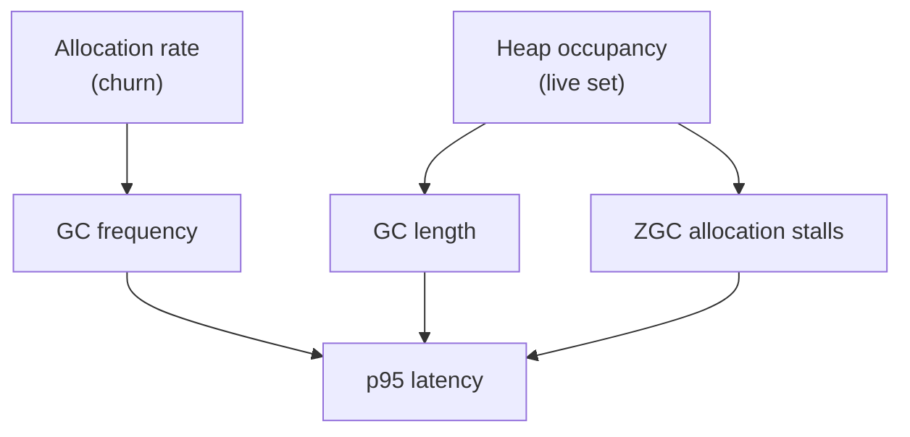

# Memory Optimisation Programme

## Outcome

MockServer's event log retains roughly four to five times what its own budget
believes, and the heap it holds is dominated by per-request structure rather than
by the payloads users care about. This programme reduces **both** quantities that
drive GC cost, and every change is gated on evidence that it did not alter
behaviour.

The two levers are distinct and a change usually moves only one:

- **Allocation rate (churn)** sets how *often* a collection runs.
- **Heap occupancy (live set)** sets how *long* each collection takes, because
  ZGC's marking and relocation work scales with what is live, not with what was
  allocated.

Both feed the p95 tail, by different routes: frequency raises the chance a
request meets a cycle, length raises the cost when it does, and at high occupancy
ZGC can stall allocating threads outright. **Classify every finding by which
lever it moves; prefer findings that move both.**

```mermaid
flowchart TD
    A["Allocation rate\n(churn)"] --> B["GC frequency"]
    C["Heap occupancy\n(live set)"] --> D["GC length"]
    B --> E["p95 latency"]
    D --> E
    C --> F["ZGC allocation stalls"]
    F --> E
```

## What is left

Everything not listed here has landed or been closed. **17 units landed, 5 declined with reasons,
6 items of work remain, plus 4 defects and 4 missing instruments.** Every remaining item has been
audited, so each row names a concrete change rather than a question.

### Code work remaining

| # | What | Lever | Ready? | Note |
|---|---|---|---|---|
| **21** | Three blocking proxy paths | **throughput** | **done, unmerged** | the only **measured** win: 24 concurrent forwards went 4 → 24 in-flight, wall ~3,110 ms → ~505 ms. Needs rebase + review + merge |
| **14c** | Per-connection address strings rebuilt per request | churn | yes | 16 allocations/request counted from JDK source, 14 garbage. Memoise on the mapper (per pipeline and per h2 child channel). Keep-alive HTTP/1.1 only, nothing for h2 — say so in the commit. Do **not** reformat from `getHostString()` |
| **19a-19e** | Dashboard: 2 request-path allocations, 2 wasted walks, 1 retention | occupancy + churn | yes | 19e is the biggest — rendering memoises a clone + Jackson tree **onto the retained entry** with no release path, partly undoing unit 1, and the byte budget excludes it on a false premise. 19b has a trap: capacity 1 ships, capacity 10 is what the tests exercise |
| **13c** | Three one-line adjacents | churn | yes | `Host` read 3× in one expression; unconditional `ImmutableList.Builder`; `Objects.hash` `Object[2]` |
| **14b** | Query-map copy | churn | after 13a | a second `HashMap` + `putAll` for nothing; reuses 13a's `reserve` so that class is edited once |
| **22A** | A4, then A2+A3 | churn | yes | A4 (Mustache copies ~26 bindings per render) is smallest and output-identical. A1 needs a **product decision** — whether an edited `templateFile` should still take effect per request |
| **18a** | Three small `ResponseWriter` items | churn | **blocked** | extend the benchmark first (see instruments) |

### Defects — fix ahead of the churn work

| | What | State |
|---|---|---|
| **D1** | Unbounded 1/sec task accumulation on an unauthenticated endpoint, which also removed the throttle it enforces | **fixed + test + negative control** |
| **D3** | `redactSecretsInLog` leaves secrets in `message` and `arguments` | **fixed + 3 tests**, verifying |
| **D2** | Split WebSocket handler teardown | latent — unreachable today, consolidate into `handlerRemoved` |
| **D4** | Forward class-callback ignores `contextClassLoaderOverride` | not independently verified |

### Missing instruments — these gate the work above

| Gap | Blocks | Why it matters |
|---|---|---|
| `ResponseWriteBenchmark` enters at the encoder, never calls `ResponseWriter` | **18a** | 18a would land and the ratchet would report no change |
| No template allocation benchmark exists | **22A** | no figure can honestly be claimed for A2/A3/A4 |
| Rig exercises no proxy and no callback workload | 21, 22B | 21's win is measured at unit level only; 22B's would be pure inference |
| Heap dump analysis not yet run | **15** | the dump **already exists** on the /diag volume with a parser — no new run needed. Check the validity control first: `Long` and `Object[2]` proportional to `NottableString` means no full collection preceded it and every retention conclusion is unsafe |

### Declined, with reasons recorded — do not re-propose

**16** (the `readTree` produces the rendered output; in tension with unit 1), **16b** (four parses
feeding four distinct output fields, and the two levers point in opposite directions), **14a**
(unit 12's gate made it stale, and the future is load-bearing for three async routes that
self-deadlock inline), **22B** (off the measured workload entirely), and **18 as originally
scoped** (its named files were already optimal).

### Then, and only then: new figures

Re-run the ladder. **445 remains the publishable curve** until a new baseline-eligible run exists.
Unit 17 (ZGC as the shipped default) is decision-ready — it won at both 6 and 2 cores — but wants
a repeat on **matched images**, since no two cells so far shared a binary.

## Measured evidence

Live-heap class histogram at peak load, CI build 441 (6 vCPU, generational ZGC,
JDK 25), with 84k requests / 42k responses / 101k log entries live:

| Class | Bytes | Instances |
|---|---:|---:|
| `byte[]` | 133 MB | 1.73 M |
| `NottableString` | 60.6 MB | 758 k |
| `String` | 53.7 MB | 1.68 M |
| `LinkedListMultimap$Node` | 35 MB | 547 k |
| `LogEntry` | 19.3 MB | 101 k |
| `HttpRequest` | 18.9 MB | 84 k |
| `LinkedListMultimap$KeyList` | 17.5 MB | 547 k |
| `TextNode` | 17 MB | 709 k |
| `Expectation` | 16.5 MB | 42 k |

**Header machinery totals ~181 MB, exceeding the 133 MB of actual body bytes.**
One Guava `LinkedListMultimap` plus a backing `HashMap` plus an `AtomicInteger`
per message, to hold 4.3 headers: ~1,379 bytes of structure per message, against
the 277 the weigher charges.

## Units

**Phase one is complete** — units 4a, 1, 2, A/B, 5, 3, 4b, 6, 7 all landed, and unit 8 closed as
subsumed. The commits are in git history; they are not re-listed here.

## Outcome — measured, build 442

All nine units landed and were measured on the same rig and configuration as the
pre-programme baseline (build 441): JDK 25, generational ZGC, 6 vCPU, 2.4 GiB
heap, `ERROR` log level. `image_revision` was confirmed as the commit carrying
all nine units before any number was read.

| offered | achieved | p50 ms | p95 ms | clean |
|---:|---:|---:|---:|:--|
| 32,000 | 30,956 | 0.111 | 0.340 | rig-invalid |
| 36,000 | 35,990 | 0.111 | 1.234 | yes |
| 40,000 | 39,981 | 0.112 | 7.571 | yes |
| 44,000 | 43,817 | 0.115 | 10.374 | yes |
| 48,000 | **47,580** | **0.119** | 16.282 | yes |

**`saturation_rps` is 48,000, up from 32,000.** In build 441 the 48k rung was
rig-invalid, so the highest cleanly-served rung was 32,000 and the knee could not
be located. The fine ladder resolves it: the healthy ceiling is 47,580 req/s at a
0.119 ms median, and the median is flat across the whole ladder.

The 32,000 rung is rig-invalid here (VU occupancy 0.026) — a bottom-of-ladder
client artefact, not a server regression; its p95 improved.

### The histogram confirms the units caused it

Build 442 carried 19% more live load than 441 (100,005 versus 84,223 requests),
so these are normalised per request.

Absent from the top 25 entirely, having totalled ~118 MB in 441:
`LinkedListMultimap$Node`, `$KeyList`, `LinkedListMultimap`, `$1EntriesImpl`,
`$1KeySetImpl`, the backing `HashMap`/`$Node`/`$Node[]`, `Expectation`, and
`AtomicInteger`.

| | 441 | 442 | per request |
|---|---:|---:|---|
| Header container machinery | ~118 MB (1,406 B/req) | ~25 MB (252 B/req) | **−82%** |
| `NottableString` | 60.6 MB, 9.0/req at 80 B | 36.4 MB, 6.5/req at 56 B | **−49%** |

The −82% matches what the local bench predicted, on different hardware. The new
`NottableString[]` at 16.8 MB *is* the flat store, replacing ~101 MB of linked
machinery.

### What this did not do, stated plainly

- **The p95 gain at 48k is ~8%** (17.8 → 16.3 ms) from a **single run**. Do not
  publish it as a definitive delta without repeats.
- **Throughput is essentially unchanged**, which was the prediction: the
  programme removed *retained* heap, not per-request allocation rate. Occupancy
  drives collection *length*; churn drives *frequency*, and churn was barely
  touched.
- **`Long` was not eliminated.** 168,982 → 150,588 instances, about 2.0 → 1.5 per
  request — a 25% cut, not removal. Unit 7 unboxed `receivedTimestamp`; something
  else still boxes ~1.5 `Long` per request and it is unidentified.
- **`Integer` appeared** at 101,343 instances (~1 per request), absent from 441's
  top 25. Unit 7 unboxed `KeyToMultiValue`'s hash, so this is a different source.
- `byte[]` and `String` rose in absolute terms but are flat per request. Correct —
  nothing here targeted payload bytes.

### What the reviews caught that the tests did not

Five defects invisible to roughly 11,000 passing tests: four call sites silently
losing parameter styles (unit 2); unsafe publication of a mutable object across
reader threads (unit 5); a caller-controlled quadratic reachable through form
bodies (4b); NOT-key identity, which this plan's own corpus missed and older
tests caught (4b); and an ARM-reachable torn read in a hash cache (unit 7).

None was found by running tests. The corpus was necessary but **not sufficient**.

## Phase two — the inbound request path

The nine units above cut retained heap hard and barely moved peak throughput. An
audit of the receive/parse path and the control-plane decision found why that is
consistent rather than disappointing: **a serialising lock sits on the hot path**,
and no amount of memory saving lifts a ceiling set by contention.

Units are ordered by expected value, not by ease.

| # | Unit | Lever | Status |
|---|---|---|---|
| 10 | Stop taking a global lock per request to re-add a known SAN host | **throughput** (contention) | **landed** `e498a1592` |
| 11 | Precompile the two `URLParser` regexes | churn + CPU | **landed** `a8ca82053` |
| 12 | Cheapest-first gate for the control-plane decision | churn + CPU | **landed** `d605a3cb6` |
| 13 | Single-pass header ingest | churn | 13b **landed** `f95991cc0`; 13a/13c to do |
| 14 | Per-connection address strings recomputed per request | churn | audited — 14a declined, 14b folded into 13, 14c is the unit |
| 15 | Boxed residuals | occupancy | audited — `Integer` **located (I1)**; `Long` not located; two prior conclusions corrected |

### 10 — the per-request lock

`HttpRequestHandler.java:234` calls `configuration.addSubjectAlternativeName(...)`
with the `Host` header on **every** request, before anything else.
`Configuration.java:6427` has no guard: it does a `substringBefore`, a Guava
`InetAddresses.isInetAddress` parse, then calls `addSslSubjectAlternativeNameDomains`
(`:6469`) or `addSslSubjectAlternativeNameIps` (`:6440`) — **both `synchronized` on
the shared `Configuration` instance**.

So every event loop thread contends on one monitor, per request, to re-add a host
that is almost always already present. For a mock serving a stable `Host` it is
pure overhead; for a proxy with many hosts it is genuinely contended.

The fix is a lock-free read fast-path: if the normalised host is already in the
set, return without locking, and take the lock only for a real addition. The
correctness constraint is that the SAN set must still end up right — the lock
exists because of a real defect (noted at `:6441` as C7) where concurrent adds
raced to read-modify-write separate copies.

### 11 — regexes that are compiled per request

`URLParser.java:10-11` holds `schemeRegex` and `schemeHostAndPortRegex` as `static
final` **strings**, then `isFullUrl` calls `uri.matches(...)` and `returnPath` calls
`path.replaceAll(...)`. Both `String` methods compile a fresh `Pattern` on every
call. One to two compiles plus a `Matcher` per request, for a change with identical
semantics.

### 12 — the control-plane decision is a linear scan

`HttpRequest.matches(String, String...)` (`:578-587`) allocates a varargs `String[]`
per comparison, and re-tests the method inside the per-path loop. A data-plane GET
falls through roughly 22 such calls in `HttpState.handle`, a PUT through 59, and
then `HttpRequestHandler.channelRead0` (`:238-519`) runs a *second* chain for
`/ready`, `/status`, `/bind`, `/stop`, `/configuration`, dashboard, openapi,
metrics, http3status and CONNECT before reaching the data plane. Nothing rejects a
data-plane path cheaply first.

**The constraint that makes this non-trivial:** every control-plane route also
accepts a bare-path alias without the prefix — `matches("PUT", PATH_PREFIX +
"/expectation", "/expectation")` — so a plain `startsWith(PATH_PREFIX)` gate would
break the bare forms. A correct gate is the prefix test **or** membership of a
fixed bare-alias set, computed once per request. Enumerating that set completely is
the whole risk; treat it as a structural change needing a differential corpus.

Note `PATH_PREFIX + "/expectation"` is **not** a per-call allocation — `PATH_PREFIX`
is `static final`, so the concatenation is a compile-time constant. The churn is the
varargs array, not the string.

### 13 — header ingest walks the header set twice

Audited. **Real, and it splits into two parts — the second is worth more than the
first.** All inbound ingest is one method,
`FullHttpRequestToMockServerHttpRequest.java:131-180`, reached via
`NettyHttpToMockServerHttpRequestDecoder.java:42 → :125`.

| Pass | Site | Cost |
|---|---|---|
| A | `:144` `httpHeaders.names()` | full walk; netty's `DefaultHeaders.names()` builds a `LinkedHashSet` over the whole linked list |
| B | `:152` `getAll(headerName)` per distinct name | a second full traversal in aggregate — each call re-hashes the name and walks its bucket |
| C | `:145` `equalsIgnoreCase(CONTENT_LENGTH)` per name | third touch, only when a preserved `Transfer-Encoding` exists |

Roughly **7 removable transient objects per header** and ~11 per request, including
array-growth garbage in the flat store (`ensureCapacity` grows 0→4→6→9→13 while
`HttpHeaders.size()` is an O(1) field read, so it can be presized).

**Neither prior commit made this stale.** `37a8fb023` removed the *name-side*
`NottableString` allocation for common names and `c381a0303` replaced the container;
neither touched the pass count. `c381a0303` in fact *enables* the fix — the flat store
appends duplicates in order with no per-key grouping, so grouping at ingest is no
longer needed by anything.

**13a — the single-pass ingest.** Replace `:141-155` with one
`httpHeaders.iteratorCharSequence()` walk (netty's `HeaderIterator` yields the
`HeaderEntry` itself, zero per-entry allocation), presize from `size()`, and append
directly. Needs a package-private `appendLiteral(NottableString, NottableString)` +
`reserve(int)` on `KeysToMultiValues`, because the public
`withEntry(NottableString, List)` forces the very `List` being removed.

**13b — gate `EarlyMatchingHandler` before it maps.** This is the bigger win and was
not previously recorded. The handler is added to **every** HTTP/1.1 pipeline
(`PortUnificationHandler.java:482`), and at `EarlyMatchingHandler.java:76-87` it
constructs a mapper, runs the complete ingest, builds an `HttpRequest`, and *only
then* calls the gate whose `respondBeforeBodyIds.isEmpty()` check
(`RequestMatchers.java:1213`) returns null for essentially every deployment. Test the
gate *before* mapping, and hoist the per-request mapper construction. Bounded by
`passThroughAndDetach` (`:119-127`) to **once per connection**, so it is free on
keep-alive load and doubles ingest on connection-per-request load.

**The one intended behaviour change, which must be pinned not avoided.** Single-pass
ingest makes the raw flat store hold *wire* order (`A:1, B:2, A:3`) instead of
*name-grouped* order (`A:1, A:3, B:2`). Everything that puts request headers back on a
wire or into JSON goes through `getHeaderList()`/`getEntries()`
(`KeysToMultiValues.java:344-362`), which re-groups by first-occurrence key, so
outbound wire order is unchanged. The only request-side `getMultimap().entries()`
callers are byte-size accounting (`LogEntry.java:258-275`, `Expectation.java:746-763`)
and `Headers.clone()`. Assert the new raw order as the contract, and assert
`getHeaderList()` is unaffected by it.

Must also not break: case-preserving storage with case-insensitive lookup; literal
names and values (`headerName(...)` / `strings(..., false)`, fix `221b79629`, pinned by
`FullHttpRequestToMockServerHttpRequestTest:197-240`); the
preserved-`Transfer-Encoding` → skip-`Content-Length` rule; and HTTP/2-only stream-id
capture.

**HTTP/3 is worse and separate** — `Http3RequestBridge.java` makes *three* passes
(`:211-218`, `findContentType` `:189-197`, `:175-181`), allocating two `String`s and a
`SimpleImmutableEntry` per header. Same shape, own change.

### 13c — adjacent findings from the same audit

- `HttpActionHandler.java:295` calls `request.getFirstHeader(HOST)` **three times in
  one boolean expression**; each is a store scan that allocates. Hoist to a local.
- The `Host` header is read twice per request from two different structures —
  `FullHttpRequestToMockServerHttpRequest.java:201` (from netty) and
  `HttpRequestHandler.java:234` (from the store).
- `PreserveHeadersNettyRemoves.java:33` unconditionally allocates an
  `ImmutableList.Builder` and its `Object[4]` even though the common path builds
  nothing.
- `NottableString.java:45` — `Objects.hash(value, not)` allocates an `Object[2]` per
  stored instance; inlinable to identical arithmetic.

### 14 — audited: one item is stale, one moves, one is the real unit

The row bundled three unrelated findings and nothing connected them but the word
churn. **Split it: decline 14a, fold 14b into unit 13, keep 14c as unit 14.**

**14a — the per-PUT `CompletableFuture`: declined, the premise is stale.** It is not
allocated per PUT. `d605a3cb6` put `isControlPlanePathCandidate` *above* the PUT
branch (`HttpState.java:2182-2185`), so a data-plane `PUT /api/orders/1` returns at
`:2184` and never reaches the future at `:2189`. What remains is control-plane PUTs
plus the collision case of a user mocking a data-plane PUT on a bare alias path. And
the future is **load-bearing** for three routes — `handleContractTest` (`:7074`,
completed from a worker at `:7154`), `handleTrafficValidate` and `handleReplay` —
which must not run inline because they block on the outbound client that shares the
`workerGroup`, so running them on the event loop self-deadlocks (the reason is
recorded at `:7066-7073`). For the other ~54 routes it is a mutable boolean box, but
removing it means splitting a 1,100-line dispatch chain into sync and async halves.
Not worth it for one allocation per control-plane PUT.

**14b — the query-map copy: real, small, and belongs with unit 13.**
`ExpandedParameterDecoder` builds `new HashMap<>()` then `putAll`s netty's decoded
parameter map into it (`:38`/`:42` and `:59`/`:62`) — a whole second map: one
`HashMap`, its `Node[]`, one `Node` and one re-hash per distinct name, all pure waste.
The decoder's map is a local discarded at `return`, nothing aliases or mutates it, and
the later `splitParameters` mutations operate on the `Parameters` object rather than
the map. `KeysToMultiValues.withEntries(Map)` (`:192-202`) then walks `keySet()` and
calls `get(name)` per key — the same double-pass shape unit 13 found in header ingest,
wanting the same `reserve(int)` helper. **Sequence it after 13a** so that class is
edited once.

Its form-parameter twin is worse shaped: `ParameterStringMatcher.java:29` calls
`retrieveFormParameters` once per *match attempt*, so per request × candidate carrying
a `ParameterBody`, allocating even when the body is blank.

The behaviour change is narrower than it looks: distinct-key order becomes wire order
rather than `HashMap` hash order, and that is not on the forwarding wire —
`MockServerHttpRequestToFullHttpRequest.java:71-72` rebuilds the forwarded URI from
`rawParameterString`, which this decoder always sets. It is visible only in serialised
request JSON, matching is order-insensitive, `ExpandedParameterDecoderTest` asserts
with `containsInAnyOrder` throughout, and the HTTP/3 bridge already produces wire
order. `withRawParameterString` must stay *after* `withEntries`, since
`Parameters.isModified()` nulls it on mutation.

**14c — the real unit: per-connection address strings rebuilt per request.**
`FullHttpRequestToMockServerHttpRequest.java:200-208` calls `toString()` on the remote
and local `InetSocketAddress` every request and strips a leading slash. Counted from the
JDK source rather than measured, that is **8 allocations per address, 7 of them
immediate garbage** (the `byte[4]` clone in
`getHostAddress`, the dotted-quad string, `InetAddress.toString`'s `"/" + ip`, the
`host:port` concatenation, then `substring(1)`), so **16 per request, 14 garbage** —
more than unit 13's ~11. It is unconditional on the netty path for HTTP/1.1, h2c and h2.

The strings are **not** discarded — the one-line row implied they were. They feed the
control-plane audit source address (`HttpState.java:6505-6507`, security-relevant),
load-scenario host attribution, OIDC failure summaries, HAR export, templating, the
proxied-URI fallback, and the serialised `localAddress`/`remoteAddress` fields, with
integration tests asserting exact values. So they can only be made cheaper.

The fix is memoisation, not reformatting. Both addresses are properties of the
*channel*: netty's `AbstractChannel` memoises the `SocketAddress` instance, so identity
is a valid cache key and the string cannot change between requests on one connection.
`MockServerHttpServerCodec` is constructed per pipeline (`PortUnificationHandler.java:511`)
and per HTTP/2 stream child channel (`Http2MultiplexChildInitializer.java:276-282`), so
two memo fields on the mapper remove 14 of the 16 allocations on **every request after
the first on a keep-alive HTTP/1.1 connection** — and buy **nothing** for HTTP/2 or
connection-per-request load. Say that in the commit message or the next reader will
assume h2 was covered.

**Do not** rebuild the string from `getHostString()` + `getHostAddress()`: the current
value is `hostName + "/" + ip + ":" + port` with only the *leading* slash stripped, so
when the hostname field is set the slash survives inside the value, and public API
cannot distinguish "hostname was null" from "hostname equalled the IP literal".
Memoisation preserves behaviour exactly; reformatting does not.

**Adjacent, from the same audit.** `HttpRequest.splitHostPort` (`:392-422`) runs per
request and ends in `hostPort.split(":")` — an `ArrayList`, its `Object[]`, substrings
and a `String[]`, plus a `SocketAddress`; an `indexOf(':')` rewrite is ~2 objects but
must preserve the existing bare-IPv6 behaviour (`"::1".split(":")` yields host `""`)
or pin it first. This is the *third* read of the `Host` header per request after the two
in 13c. A lead for unit 15: `SocketAddress.withPort(Integer)` is fed
`Integer.parseInt(...)` or `443`/`80` when the mapper's cached port is null — above the
`Integer` cache and **retained** for as long as the request sits in the log.
`Http3RequestBridge.java:401-417` does not percent-decode query names or values unlike
the netty path, which looks like a correctness gap rather than a performance one.

### 15 — the residuals: the Integer is located, and two earlier conclusions were wrong

Audited statically. **The `Integer` is found. The `Long` is not, and the "1.5 per request"
framing itself is now in doubt.** Two conclusions recorded earlier in this plan are corrected.

#### I1 — the `Integer`: the port is unboxed and re-boxed on every request

`HttpRequest.java:397,399,401` each read
`port != null ? port : <int expression>`. One operand is `Integer` and the other `int`, so by
JLS 15.25 this is a *numeric* conditional expression: binary numeric promotion makes the result
`int`, **unboxing `port`** — and the `Integer` parameter of
`withSocketAddress(String, Integer, Scheme)` (`:355`) immediately **re-boxes it**. So a fresh
`Integer` is allocated per request *even though the mapper's cached port is non-null*, which it
always is on the netty path. At the rig's port 1080 that is outside the `Integer` cache, so it
is a real allocation. (Verified by reading the JLS rule against both signatures.)

It is then retained: `HttpState.java:322-326` stashes **that instance** in `LOCAL_PORT` and
**nulls `request.socketAddress` at `:325`**; `MockServerEventLog.java:251` copies the reference
into `LogEntry.port`; `Scheduler.java:183,223,232-237` re-sets the same instance on the async
response thread, so both log entries of a request hold it. Ordering is provable — the netty
handler calls `httpState.handle(…)` before `processAction` creates the `RECEIVED_REQUEST` entry.

**This corrects two things this plan asserted.** `LogEntry.port` was recorded as *positively
ruled out* as the `Integer` source — it is in fact the retainer. And `SocketAddress.withPort`
was recorded as the lead — it cannot be, because the field is nulled before any log entry
exists. Same box, wrong retainer named on both counts.

#### The `Long` is not located, and an arithmetic constraint narrows the hunt

Between builds 441 and 442 the **absolute** `Long` count *fell* 168,982 → 150,588 (−11%) while
live requests *rose* 19% (84,223 → 100,005). **A population that is genuinely ~1.5 per retained
request cannot fall while requests rise.** So either the normalisation denominator is wrong, or
the population tracks something pinned near a constant — the obvious candidate being the entry
count, which `maxLogEntries` pins at 100,000. **Resolve this before attributing the `Long` to
anything.** Best remaining candidate is `NettyHttpClient.java:260-266` → `Timing` (≥3 epoch-milli
boxes per *forwarded* response), which is inert on the workload that fills the log.

#### The measurement condition is load-bearing and was never recorded

The histogram sampler runs across **all** phases, but the phase that fills the log to ~100k
entries drives only `GET /simple` — a **mocked** response over **plain HTTP/1.1**. Under exactly
those conditions the HTTP/2 stream id, the forwarded-response status code, `Timing`, injected
delays and streaming chunk timestamps are **all inert**, and `socketAddress` is null. **I1 is
the only per-request retained box that exists in that phase.** Which phase produced the 1.5/1.0
figures must be recorded next to them before anything is attributed. `AutoBoxCacheMax` is not
set anywhere in the rig, so the cache is the default −128..127.

#### Ranked candidates, all gated

| # | Site | Retained | Per request | Live on the growth phase? |
|---|---|---|---|---|
| **I1** | `HttpRequest.java:397-401` → `LogEntry.port` | yes | 1, shared by the request's ~2 entries | **yes — the only one** |
| I2 | stream id → `HttpRequest`/`HttpResponse` | yes | 1 per HTTP/2 request, 0 on HTTP/1.1 | no |
| I3 | forwarded-response `statusCode` | yes | 1 per forwarded response | no |
| L1 | `Timing`'s 6 `Long` fields | yes | ≥3 per forwarded response | no |
| L2/L3 | injected delays; streaming chunk timestamps | yes | gated off by default | no |

#### Positively ruled out — as valuable as the finds

- **`NottableString.java:47`** — `not` is a **primitive `boolean`** (`:24`), so the varargs box
  is `Boolean.valueOf` and shared. Only a transient `Object[2]`, **no retained box**. That is a
  churn item of unit 7's class, not occupancy. (Verified.)
- **Every `Boolean` field** — all written from an autoboxed primitive or literal, so
  `Boolean.valueOf`; zero allocation, zero retained cost.
- **Mocked-path `statusCode`** — `clone()` copies the *reference*, so every served response
  shares the one box deserialised from the seeded expectation. Only forwarded responses allocate.
- **`withReceivedTimestamp(Long)`** — boxed to satisfy the parameter, immediately unboxed into a
  primitive field. Pure churn, nothing retained.
- **`Timing` on the default mock path** (early-returns without injection), the derived synthetic
  `Expectation` (no boxes at all), and all event-log/deque bookkeeping (primitive or atomic).

#### The dump already exists — no new run needed

The rig keeps the raw `.hprof` on the /diag volume and uploads it gzipped, and
`.buildkite/scripts/lib/HprofHisto.java` already parses it. Confirmations:

- **I1**: shortest paths from `java.lang.Integer` should reach `LogEntry.port`; a modal `Integer`
  value equal to the listen port confirms it. Then compare distinct identities reachable from
  `LogEntry.port` against the entry count — **~0.5 per entry is the predicted signature** (two
  entries share one box). **~1.0 per entry means a second source is also boxing and I1 is not
  the whole story.**
- **Negative control**: `COUNT(java.lang.Boolean)` must be **2**. Anything proportional to
  request count means a `new Boolean(...)` exists and is a separate finding.
- **Validity control, check this first**: if `Long` and length-2 `Object[]` appear in proportion
  to `NottableString`, the dump was not preceded by a full collection and **every retention
  conclusion here is unsafe**.

### 16 — declined: the INFO cost is output, not waste

**My premise for this unit was wrong and it is not worth doing as specified.** I
described it as "a serialise-then-reparse of the same content, twice per request",
implying redundancy. It is not redundant. Three pieces of evidence:

**The `readTree` is load-bearing.** `new LogEntryBody(OBJECT_MAPPER.readTree(body.toString()))`
produces the pretty-printed, normalised JSON that the log line actually renders.
Applying the naive "don't parse" change turns three tests red in the existing pin
`LogEntryDeferredArgumentConversionTest` — the rendered body flips from inline
pretty JSON to a raw compact string. The parse exists to produce the output.

**The two parses feed two different log lines.** At INFO a served request emits
`RECEIVED_REQUEST` and `EXPECTATION_RESPONSE`, both `Level.INFO`, both carrying the
request (`HttpActionHandler.java:202`, `:271`, `:2497`). Each parses the body once.
Within a single line nothing is parsed twice — "twice per request" is two outputs,
not duplicated work for one output.

**Removing the second parse requires undoing unit 1.** To parse once and reuse
across both lines you must cache the parsed `JsonNode` on the request's `JsonBody` —
which is exactly the retained per-request tree unit 1 removed, and which
`releaseDerivedForms` now actively nulls. So the two units are in direct tension:
**low occupancy or single-parse, not both**, given the two-lines-per-request design.
Dropping the body from one line would be an output change.

The one remaining option — a streaming token copy avoiding the intermediate tree —
is **not byte-identical**: `readTree` collapses duplicate JSON keys last-wins while a
streaming copy preserves both (`{"a":1,"a":2}` renders `{"a":2}` versus
`{"a":1,"a":2}`). Shipping that would knowingly change output on an edge case for a
benefit that only appears at INFO.

**What remains true:** INFO genuinely costs more than ERROR, and every figure this
programme published was taken at ERROR. That gap is real and worth stating whenever
a figure is quoted. But the cost is the price of the log output users asked for, not
waste to be removed.

## Phase three — beyond the model objects

Phase one cut retained heap hard and barely moved peak throughput. Phase two found
why: a shared monitor sat on the hot path. The lesson reframes this phase — **look
for blocking and setup cost, not only bytes**, and phase three bore that out: the only
**measured** win in the whole programme is unit 21, which removed waiting rather than bytes.

Landed and declined units are not re-tabulated here — see **What is left** near the top.

### 16b — declined: four parses, four output occurrences

**The premise fails the same test unit 16 failed.** Counted from source it is **four**
parses of the same body per serialize, not three — and each feeds a **different occurrence in
the emitted JSON**: the `httpRequest` field (redacted), an `arguments[i]` entry
(unredacted), `expectation.httpRequest`, and the escaped copy inside `message`. Ten
`readTree` calls per first serialize of one served-request entry, dropping to three on a
second serialize because two results are memoised. As with unit 16, repeated parses are
repeated *output*, not waste.

**Only one pair is genuinely redundant**: `getMessage()` and the `arguments` field each build
the same `Object[]` within one `serialize()`, and `getMessage()` keeps only the formatted
string. Nothing else can be shared — parse 1 applies the redactor and parse 3 does not, so
reusing one for the other changes output whenever `redactSecretsInLog` is on.

**The two levers point in opposite directions here**, which is the clearest argument for
leaving it alone: removing parses means keeping the memo (occupancy up, partly undoing unit
1), and removing the memo means more parses. `LogEntryDeferredArgumentConversionTest:111-125`
also pins `getArguments()` returning a **fresh array each call**, so any cache-the-array
variant goes red — the same failure that killed unit 16.

**And it is off the request path at every log level.** It is reached only from
`PUT /mockserver/retrieve?format=LOG_ENTRIES` and the throttled dashboard WebSocket. At the
shipped INFO default the one redundant pair has already collapsed, because `message` is
memoised at log time; the duplicate exists only at WARN/ERROR/OFF — the configuration the
perf rig runs, on a surface the perf rig never calls.

**Verdict: declined.** If anything is kept, keep only **16b-i**: hoist one `getArguments()`
inside `LogEntrySerializer.serialize` and format the message from it. It retains nothing.

### 8 — closed as subsumed: the audit happened unit by unit

`org.mockserver.model` holds **132 classes**; twenty have already been through a perf commit
(units 1, 2, 3, 4b, 7, A/B, 12, 20, plus master-side work on `Headers`/`Parameters`/
`KeysAndValues`, `MediaType`, and `Action`/`Not`). Of the remaining ~112 the overwhelming
majority are control-plane or feature-configuration types built once per expectation, so
"audit all of `org.mockserver.model`" as one row was always going to be mostly dead weight.

The data-plane-reachable untouched set is small and fully enumerated:

- `HttpResponse` is already in good shape — lazily-null containers, cached hash. Its boxed
  `statusCode` and `streamId` are **unit 15 candidates**, not new work.
- `SocketAddress` has no `equals`/`hashCode` and a boxed `port` — **this is unit 15's
  retained-`Integer` lead, now confirmed.**
- `KeysAndValues`/`Cookies` never got unit 4b's flat store and still allocate a
  `LinkedHashMap` eagerly. **But the rig sends no cookies**, so nothing here appears in any
  published figure and it must not be sized from the existing histograms.
- Three one-line leftovers, recorded as **8-residual**: `BinaryBody` holds a per-instance
  `Base64Converter` that is also in its `equals`/`hashCode` (the class has only static state,
  so making it `static final` and dropping it is behaviour-preserving); `ParameterBody`
  allocates a `Parameters` its constructor immediately overwrites; and `KeysAndValues` above.
  **None is visible in any figure this programme published.**

**`toString()` needs no change and the constraint is respected.** Every model class inherits
the JSON `toString()`, which looks like it builds a mapper per call but returns a **cached
static writer** when no extra serializers are passed. Caching `toString()` output remains
explicitly not proposed — it would retain memory and fight the occupancy goal.

**`equals`/`hashCode` is largely already done** — every hot type caches its hash, and the
reflective fallback survives only on types whose enclosing hash is cached, so each reflective
call happens at most once per instance. No per-request caller demanding those hashes was
found, so the cost is latent and sizing it needs measurement, not inspection.

**Verdict: closed as subsumed.** Boxed-field residuals move to unit 15.

### 16-original — the default log level does double work on every request

At `INFO`, which is the **shipped default**, every served request and response body
is `toString()`-serialised to JSON and then, for a `JsonBody`, immediately re-parsed
via `readTree` — a serialise-then-reparse of the same content, twice per request
(`LogEntry.java:762-811` and `:891-958`, reached from `getMessage()` →
`getArguments()` → `updateBody`).

`MockServerLogger.java:215-216` short-circuits before `getMessage()` when the level
is not enabled, so `WARN` and `ERROR` never pay it.

**Every measurement in this programme was taken at `ERROR`.** The figures are
honest about what they measured, but they describe a configuration users do not
run. This is the clearest gap between what we optimised and what ships.

Fix by not calling `toString()` on that path, or by avoiding the JSON → String →
JSON round trip for a body that is already parsed. **Not** by caching the JSON —
`toString()` must keep emitting JSON (it is real UX value in logs and assertion
failures) and caching it would retain memory, fighting the occupancy goal.

### 17 — the shipped GC default

Two runs, same commit, same hardware, same ladder, differing only in collector and
heap:

| | throughput at 48k offered | p95 |
|---|---:|---:|
| build 443 — G1, 1,230 MiB (the shipped default) | 47,209 | 34.4 ms |
| build 442 — generational ZGC, 4 GB | 47,580 | 16.3 ms |

Essentially the same throughput at **less than half the tail latency**, from what
would be a one-line change to the image default.

This is not yet a recommendation, because **the comparison changes two variables at
once**: 442 used ZGC *and* a 4 GB container (2,458 MiB heap), 443 used G1 *and* the
default container (1,230 MiB). Either could be the cause.

The decisive question is narrower than a full matrix. The change actually on the
table is "flip the collector, leave the heap alone" — so the cell that settles it is
**ZGC at the default heap**:

| | G1 | generational ZGC |
|---|---|---|
| default heap (1,230 MiB) | build 443 / 445 | **build 446 — the decisive cell** |
| 4 GB container (2,458 MiB) | not measured | build 442 |

**Build 446 answered it: the collector is the cause.** It ran the same full-span
ladder, the same commit (image revision `c58b367836`), the same cpusets and the same
default heap (`heap_max_bytes` 1,289,748,480 = 1,230 MiB) as 445, with
`perf_server_java_opts` set to exactly `-XX:+UseZGC` and nothing else — a genuine
single-variable cell. All six validity checks passed.

| offered | G1 p95 (445) | ZGC p95 (446) | factor |
|---:|---:|---:|---:|
| 16,000 | 0.199 | 0.177 | 1.1× |
| 24,000 | 4.547 | **0.211** | 22× |
| 32,000 | 14.060 | **0.624** | 23× |
| 36,000 | 17.849 | 2.279 | 7.8× |
| 40,000 | 26.355 | 6.913 | 3.8× |
| 44,000 | 30.120 | 10.407 | 2.9× |
| 48,000 | 31.321 | 15.390 | 2.0× |

Throughput is not traded for it: peak `rig_valid_peak_achieved_rps` rises 47,341.9 →
47,594.1, and the 48,000 rung serves 99.2% rather than 98.6%.

**But ZGC does not reduce GC work — it relocates it off the request threads.** Over
the same 360 s growth phase, `gc_seconds_delta` is **0.35 s under G1 and 5.135 s
under ZGC**, and peak CPU is 33% versus 68%. ZGC buys latency with CPU. That is the
right trade for p95, but it is the opposite of the occupancy/churn lever the rest of
this programme pulls, and it has a boundary: the advantage peaks at 23× at 32,000 and
then narrows to 2.0× at 48,000. That narrowing is *consistent with* ZGC's concurrent
threads contending for the same six pinned cores as the request path, but the
artifacts carry only aggregate `cpu_pct` and `gc_seconds_delta` — with no per-thread
breakdown, this is an inference from the CPU delta, not a measured mechanism, and
the server simply being CPU-bound at the top of the ladder would fit the same data.

**This is why the default should not be flipped on 446 alone.** The rig gives the
server 6 dedicated cores. MockServer ships as a container that users routinely run
with 1–2 CPUs, where ZGC's concurrent threads have nowhere to run and it can lose to
G1 outright. The gating experiment before any image change is therefore a low-core
cell, not a repeat of 446: the same ladder under both collectors at
`PERF_SERVER_CPUS=0-1`. If ZGC holds up there, the default change is justified for
every shipped topology; if it does not, the honest outcome is a documented tuning
recommendation for multi-core deployments rather than a new default.

Both runs set `PERF_SERVER_JAVA_OPTS`, so they are `config_profile=tuned` and not
baseline-eligible. That is correct: these are experiments, not publishable figures —
the published curve stays 445 (G1, default profile).

Still a product decision rather than a code one, and still single samples, so the
low-core cell should be run before the default moves.

#### The low-core cell: ZGC wins there too, and my CPU hypothesis was wrong

Builds 448 (G1) and 449 (ZGC) ran the same ladder on **2 server cores**
(`PERF_SERVER_CPUS=0-1`, upstream `2`, k6 `3-23`), both `config_profile=tuned` and
`baseline_eligible=false`, both passing every validity check.

| offered | G1 p95 | ZGC p95 | factor | G1 VU occ | ZGC VU occ |
|---:|---:|---:|---:|---:|---:|
| 2,000 | 0.601 | 0.578 | 1.0× | 2.5% | 2.5% |
| 4,000 | 0.672 | 0.577 | 1.2× | 2.2% | 1.9% |
| 8,000 | 0.604 | 0.228 | 2.7× | 1.9% | 0.8% |
| 12,000 | 15.690 | **0.460** | 34× | 30.1% | 1.6% |
| 16,000 | 47.562 | **3.079** | 15× | 55.5% | 4.5% |
| 20,000 | 73.211 | 9.267 | 7.9× | 72.7% | 9.3% |
| 24,000 | 82.352 | 16.345 | 5.0× | 84.7% | 15.4% |

ZGC also serves slightly *more* — peak 24,000.4 against 23,550.2, hitting 100% of
offered at 16,000 and 24,000 where G1 falls short — and its VU occupancy stays low
where G1's climbs to 84.7%, i.e. G1 is holding client connections open waiting on
paused request threads while ZGC is not.

**The prediction this cell was built to test was wrong.** The reasoning for running it
was that ZGC's concurrent threads would have nowhere to run on a small container and
could lose to G1 outright. They did not: peak CPU rose only 43.66% → 48.83%, and the
p95 advantage at 2 cores (34× at the knee) is *larger* than at 6 cores (22× at its
best). ZGC still does more GC work — `gc_seconds_delta` 0.863 against 4.584 — so the
"buys latency with CPU" reading holds, but on this workload the CPU it wants is
available even at two cores, and the earlier inference that core contention explained
the 6-core narrowing looks doubtful as a result.

**One confound, being closed rather than argued away.** The two arms did not run the
same binary: 448 used image `53689793f` and 449 used `0e682513f`, because a new
snapshot was published between them. The code delta is `d605a3cb6` (unit 12's
control-plane fast reject) plus documentation and CI commits — so arm B had a small
request-path advantage arm A did not. Unit 12 removes a linear scan of string
comparisons; it is a CPU saving that cannot plausibly produce a 34× p95 change at the
knee or move `gc_seconds_delta` from 0.863 to 4.584, both of which are collector
signatures. The direction is therefore near-certainly the collector, but build **450**
re-runs G1 on arm B's image to settle it, and no default should change until that pair
is matched.

**450 did not give a matched pair — it gave something better.** The snapshot image moved
again before it ran, so the three cells are: 448 G1 on `53689793f`, 449 ZGC on
`0e682513f`, 450 G1 on `306017ced`. Arm A-prime therefore carries *more* performance
code than the ZGC arm — it includes unit 20's findings 2-4 and the response bug fix as
well as unit 12. Two G1 points on either side of the code delta **bracket** the code
effect, which closes the confound more directly than a matched pair would have.

| offered | G1 old code p95 | G1 new code p95 | code delta | ZGC p95 | ZGC vs *best* G1 |
|---:|---:|---:|---:|---:|---:|
| 8,000 | 0.604 | 0.406 | −0.198 | 0.228 | 1.8× |
| 12,000 | 15.690 | 4.944 | **−10.746** | 0.460 | 10.7× |
| 16,000 | 47.562 | 15.376 | **−32.186** | 3.079 | 5.0× |
| 20,000 | 73.211 | 46.704 | −26.507 | 9.267 | 5.0× |
| 24,000 | 82.352 | 68.057 | −14.295 | 16.345 | 4.2× |

**Two corrections to what this plan said earlier.**

1. **The code delta is large, and dismissing it was wrong.** I argued unit 12 "cannot
   plausibly produce" a big p95 change. Units 12 and 20 together cut G1's p95 at 12,000
   by 3.2× and at 16,000 by 3.1×. That is a substantial code win in its own right — and
   it means the first ZGC-vs-G1 margin quoted here (34× at 12,000) was inflated by
   comparing against un-optimised G1. **Against the best G1 the margin is 4-11× at and
   above the knee.** The direction holds; the magnitude was overstated.
2. **There is no throughput regression, despite the peak metric.** `rig_valid_peak`
   reads 23,550 for 448 and 15,876 for 450, which looks like a 33% loss. It is not: 450
   *achieved* 23,554.8 at 24,000 offered, within noise of 448's 23,550.2. Its top two
   rungs were excluded as client scheduling stalls (dropped fraction 1.8-1.9% against
   the 1% tolerance, at occupancy below the 80% knee), so the peak is a max over fewer
   valid rungs. This is the same trap as the published-excluded-rung defect: the metric
   describes the load generator, not the server.

**The rig-validity pattern is itself evidence for ZGC.** All seven ZGC rungs are
rig-valid with a dropped fraction of exactly 0 at 16,000 and 24,000, and occupancy
1.6-15.4%. Both G1 runs shed rungs to client scheduling stalls with occupancy climbing
to 55-85%. A client cannot keep its schedule when responses stall, so G1's excluded
rungs are a symptom of the pauses rather than an unrelated rig problem.

**Verdict for the default.** ZGC wins at both 6 and 2 cores, on the shipped default
heap, without a throughput cost, and it wins at 2 cores *even against a G1 build
carrying more optimisation than the ZGC build had*. The objection this cell was built to
test — that a small container would starve ZGC's concurrent threads — is not supported:
peak CPU was 48.8% against G1's 34-44%. The remaining honest caveats are that each cell
is a single sample and no two cells share an image, so **the change should ship with a
repeat on matched images**, and it would also require correcting
`_includes/performance_configuration.html:165`, which tells users ZGC is not worth it
below a ~4 GB heap.

### 18 — declined as scoped; re-scoped as 18a

Audited. **The two files the row names are already optimal.**
`BodyDecoderEncoder.bodyToBytes` has unit 1's reuse fast path — when the body carries a
declared charset the materialised `rawBytes` are returned and `bodyToByteBuf` wraps them
with `Unpooled.wrappedBuffer`, so the outbound body is zero-copy with no re-encode and
no double store. (`bytesToBody:103-125`, the double-store the plan records, is the
*inbound* direction — not this path.) `ResponseWriteBenchmark:130-136` pins the array
identity, so that is guaranteed rather than incidentally true. The load-bearing header
walk allocates no multimap machinery either: `ReadOnlyInsertionOrderedMultimap`
(`KeysToMultiValues.java:560-628`) reads the flat arrays directly — `c381a0303` already
did this work for exactly this path.

**What is actually left sits one layer up, in `ResponseWriter`.** Counted from the source
(object kinds, not measured volumes), per HTTP/1.1 response with `n` stored headers, the
model store is walked **seven times and fully copied twice, of which one walk and zero
copies are load-bearing**:

| Site | Cost |
|---|---|
| `ResponseWriter.java:76` `getFirstHeader(CONTENT_LENGTH)` | full scan, O(n²) comparisons — `getFirstValue` re-runs `isFirstOccurrence` per index |
| `ResponseWriter.java:117` `response.clone()` | a **second** whole-response copy ≈ 7 + n objects |
| `ResponseWriter.java:122-131` four `replaceHeader(header(CONNECTION, …))` | ≈ 7 objects for two compile-time-constant pairs |
| `…ToFullHttpResponse.java:276` and `:298` | `Content-Type` resolved **twice** |
| `…ToFullHttpResponse.java:307` | `Content-Length` resolved **again** (already read at `ResponseWriter:76`) |
| `…ToFullHttpResponse.java:281-283` | the one load-bearing walk ≈ 4 + n |

**18a — the narrow unit, ascending risk.**
1. Two `static final Header` constants for `Connection: keep-alive` / `close`. `Header`
   is immutable and `replaceEntry` only reads it, so sharing is safe by the argument
   `37a8fb023` used. Removes ~7 objects per response.
2. Resolve `Content-Type` and `Content-Length` once each, and reorder
   `ResponseWriter.java:77-80` so the log-level test is the *first* operand — today the
   scan and an `Integer.parseInt` run before `isEnabledForInstance(INFO)`. **Be honest
   about this one: INFO is the shipped default, so the reorder is only free at WARN and
   above.** At INFO it is work for an output, the shape unit 16 was declined for.
3. Copy only `headers` in the `addConnectionHeader` clone rather than trailers and
   cookies too. Small, since both are usually null.

**Do not remove the clone entirely inside 18a.** It exists so `replaceHeader(CONNECTION, …)`
cannot mutate a caller's response, and several of the ~25 `writeResponse` call sites pass
a response that is *not* a per-request copy (e.g. `HttpActionHandler.java:389`, a stored
response). Only the mock path is provably pre-cloned. Eliminating it needs a
"this response is private" contract across every caller — a structural change, not this unit.

**The ratchet does not cover any of this, so extend the benchmark first.**
`ResponseWriteBenchmark.writeResponseToWire:182-208` enters at
`channel.writeOutbound(response)` — the encoder only. It never calls
`ResponseWriter.writeResponse`, so the clone, the CORS pass and the `Content-Length`
scan are all outside the gate, and its probe response carries one header and no
`Connection` header so it would not see items 1 or 3 either. **Without extending the
benchmark to enter at `ResponseWriter`, 18a would land and the ratchet would report no
change** — an instrument measuring the wrong subject.

**Two wire-order sites this plan did not record — add them before any ordering unit.**
The plan lists `NettyResponseWriter:157` and `Http3RequestBridge:243` as the
order-sensitive readers. Also raw-store order: `…ToFullHttpResponse.java:281-283` (the
**main** HTTP/1.1 and HTTP/2 aggregated leg) and `Http3RequestBridge.java:300-311`
(trailers). And a divergence that already exists today:
`MockServerHttpResponseToHttpServletResponseEncoder.java:41-43` reads `getHeaderList()`,
so **the servlet leg emits name-grouped order while all three netty legs emit raw
insertion order**. Any unit that changes stored ordering must assert both shapes.

**Already optimal, do not touch:** `sanitizeHeaderValue:339-344` is allocation-free when
no CR/LF is present (`String.replace` returns `this` on no match); `MediaType.parse` is
cached and bounded; `AltSvcHeaderHandler` and `TraceContextHandler` are both gated off by
default; `NettyResponseWriter` already reuses `EMPTY_LAST_CONTENT` when there are no
trailers. The `withBody(String)`-with-no-charset re-encode at `BodyDecoderEncoder:86` is
the benchmark's deliberate control arm — leave it.

**Adjacent, smaller:** `HttpResponse.java:689-711` decodes each existing `Set-Cookie`
header **twice** (once for `.name()`, once for `.value()`); the servlet encoder builds
`getTrailerList()` three times per trailered response (`:76`, `:80`), and `getEntries()`
is a real build, not a field read; `NettyResponseWriter:537-538` constructs a fresh
mapper per chunked-with-delay response where two sibling classes hoist it.

**A lead, not a finding, and unverified:** HTTP/3 emits the body from
`getBodyAsRawBytes()` (`Http3RequestBridge:318`) while HTTP/1.1 goes through
`bodyToBytes`' charset resolution. For a `withBody(String)` with no declared charset plus
a `Content-Type` charset, those could resolve to different bytes. Reachability was not
confirmed and no test was written — chase it before believing it.

### 19 — the dashboard WebSocket handler

Audited. The prior note is **confirmed on its facts and stale on its conclusion**: the
`@Sharable` handler is effectively per-channel, N dashboards do mean N listeners and 2N
threads, and `CircularHashMap(100)` bounds nothing — but the file already records all
three, and the walk depth, pull rate and expectation serialisation have since been
optimised. What remains is two request-path allocations that fire **whether or not anyone
is watching**, one retention that **survives the watcher**, and a full-log copy placed on
the log-ingest thread.

The handler is constructed per HTTP/1.1 channel (`PortUnificationHandler.java:507`) and
sits *before* the codec and `HttpRequestHandler`, so its `channelRead` runs for every
inbound request. On HTTP/2 one instance is added to every child stream
(`Http2MultiplexChildInitializer.java:272`), so `handlerAdded` runs per request.

#### Defect D1 — unbounded task accumulation on an unauthenticated endpoint (FIXED)

Three facts combined, all verified directly:

1. `scheduleAtFixedRate` sat **outside** every `if (x == null)` guard in
   `registerListeners()`, while the three things above it were each guarded.
2. `registerListeners()` was called **unconditionally** at the end of `upgradeChannel`,
   including on the `handshaker == null` branch.
3. Netty's `sendUnsupportedVersionResponse` only writes a 426 — its bytecode contains no
   `close()` — so the connection stays an ordinary keep-alive HTTP connection that can
   send the same request again.

`newHandshaker` returns null when `Sec-WebSocket-Version` is present and is not 13/8/7. So
`GET /_mockserver_ui_websocket` with `Sec-WebSocket-Version: 99`, repeated M times on one
keep-alive connection, added **M perpetual 1/second tasks**, released only when the
connection closed. Heap and CPU grew linearly in M with nothing bounding M, and because
each task refills the write permit, M tasks **removed the 1/second write throttle** those
tasks exist to enforce. The endpoint is unauthenticated by default — the file's own
comment says so — and the failed-handshake branch had no test coverage.

Fixed by moving the schedule inside the guard that creates the executor (which
`handlerRemoved` already shuts down) and returning without registering anything on a
failed upgrade.

#### Defect D2 — latent, not live: teardown is split and only the union is correct

`channelInactive` unregisters the listeners but does not stop the executors;
`handlerRemoved` stops the executors but does not unregister the listeners. Two sites
remove this handler before the channel goes inactive
(`CallbackWebSocketServerHandler.java:129`, `WebSocketProxyRelayHandler.java:540`), and a
handler removed that way never sees `channelInactive`. **Today unreachable** — both sites
fire only on channels that never upgraded, so nothing was registered. Consolidating both
halves into `handlerRemoved` removes the hazard with no behaviour change, but read the
HTTP/2 note first: `handlerRemoved` fires per child stream.

#### The performance findings

| # | Site | Fires |
|---|---|---|
| 19a | `:464-466` | a `QueryStringDecoder` per **every** inbound request, only to compare `rawPath()` — 4 objects to answer what a `regionMatches` answers with none. The sibling handler next to it in the pipeline uses a plain `equals` |
| 19b | `:363-383` | a `ThreadPoolExecutor` + queue + policy + thread factory on **every HTTP/1.1 connection and every HTTP/2 stream** — roughly 20 objects counted from the JDK constructors, none ever used on a non-dashboard channel |
| 19c | `:898-993`, `:804-805` | the whole DTO walk runs **before** the throttle is consulted, then is discarded and re-walked after a 200 ms sleep, up to twice |
| 19d | `MockServerEventLog.java:540-542` | every dashboard update copies the **entire retained event log** into a fresh `ArrayList`, **on the single disruptor consumer thread** that ingests every entry for every request |
| 19e | `DashboardLogEntryDTO.java:57-58` | memoises a derived clone plus a Jackson tree **onto the retained log entry**, with no release path |

**19b has a trap:** the two constructions differ — `handlerAdded` uses
`LinkedBlockingQueue(1)`, `registerListeners` uses `(10)`. `handlerAdded` always wins in
production, so capacity **1** ships while capacity **10** is what every unit test
exercises (the tests never add the handler to a pipeline). The fix must move the
capacity-1 construction, not simply drop `handlerAdded`, or it silently deepens the
discard queue tenfold.

**19d can drop the copy entirely.** Retained entries are effectively immutable after
`cloneAndClear`, and `ConcurrentLinkedDeque.descendingIterator()` is weakly consistent and
safe to traverse concurrently. The ordering argument that makes it safe: `eventLog.add`
happens-before `notifyListeners`, so the iterator necessarily observes the triggering
entry. **Scope it to `retrieveLogEntriesInReverseForUI` only** — verify and retrieve
depend on a point-in-time snapshot.

**19e is the biggest occupancy item, and the byte budget cannot see it.** Rendering an
entry re-derives the `String` that `releaseDerivedForms()` had just freed, adds a Jackson
tree and a second message object, and memoises all of it onto the retained entry with no
release path — so it outlives the dashboard connection and partly undoes unit 1
(`b413de937`), whose whole point was not retaining each text body twice. Worse,
`estimatedHeapSize()` **deliberately excludes** these copies on a premise that is false:
`LogEntry.java:187-189` calls them "transient (rebuilt at render time, not retained)"
while `:448-450` on the same field says "the result is memoised on first call". Since
add-time weight must equal evict-time weight, `maxEventLogSizeInBytes` **silently
under-counts every entry a dashboard has rendered and cannot evict for it.** Fix: move the
memo into a per-connection cache bounded to the viewport (`3 × logItemLimit`) rather than
the log. **One behaviour to choose rather than drift into:** the memo currently means
toggling redaction does not retroactively change an already-rendered entry; a
viewport-scoped cache makes an entry that ages out and returns render under the *current*
setting. Assert the new property deliberately.

**Declined on evidence.** The eight `synchronized` sites are not a contention problem —
all guard per-instance state on an instance serving one channel, so at most two threads
contend. Do **not** make `activeExpectationJsonCache` static to "share" it: the comment
claiming it is shared is wrong and should be corrected, but sharing it across instances
means sharing across MockServer instances in one JVM. `MAX_LOG_UPDATE_ITEM_LIMIT` is not
a perf lever.

**Documentation to correct alongside:** `docs/code/dashboard-ui.md:142` and
`DashboardWebSocketHandler.java:130` call the `Semaphore(1)` a "single global permit" when
it is one permit **per dashboard**; the same doc line still says the pull path is
unthrottled, which was fixed; and `LogEntry.java:187-189` contradicts `:448-450` as above.

**Could not determine:** whether the `handlerAdded`/`handlerRemoved` path is exercised
anywhere — the unit tests reach the executor fields by reflection instead of adding the
handler to a pipeline, so production queue depth and shutdown may be covered only by
integration tests. Confirm before 19b lands.

### 20 — the matching path

My own first read of this file concluded it was "probably already optimised". That
was **half right, and the wrong half was load-bearing.**

Right: none of the nine `synchronized` sites in `RequestMatchers` is inline on the
match read path. `:1748` (`removeHttpRequestMatcher`) is the only one the serve path
can reach, and the expiry and lazy-removal routes dispatch through
`scheduler.submit(...)` off the event loop. The one inline route is `postProcess`
removing a *just-served* expectation that is now inactive — so only `once()` or
limited-`Times` expectations, which the perf rig does not use.

Wrong: that says nothing about **allocation**, and the match path is exactly where
this programme's untouched churn lives. Allocation here multiplies by **candidate
count**, not request count.

| Finding | Location | Scope |
|---|---|---|
| `containsSubset` allocates a `HashSet<Integer>` for the match **plus one per matcher entry**, boxing every superset index, plus a `stream().filter().filter().count()` on the success path | `SubSetMatcher.java:30,54,43-46` | **fires on the winning match**, for any header/query/param-constrained expectation |
| `addDifference(logger, msg, arg, arg, …)` builds a varargs `Object[]` **at the call site, before the guard runs**, then discards it on the default path | 60 sites, e.g. `RegexStringMatcher.java:207`, `MultiValueMapMatcher.java:56`, `HashMapMatcher.java:56` | per candidate, per failed field |
| `new MatchDifferenceCount(request)` per candidate, with a boxed `Integer` counter incremented by `++`. **Correction: the counter never allocated** — it is bounded by the `Field` enum (≤18) so it stays inside the `Integer` cache, making this box/unbox CPU, not churn. The per-candidate object itself remains | `HttpRequestPropertiesMatcher.java:351`, `MatchDifferenceCount.java:8,19` | per candidate |
| `string(request.getProtocol().name())` wraps a `NottableString` per candidate reaching the PROTOCOL field, even when the expectation does not constrain protocol | `HttpRequestPropertiesMatcher.java:441` | per candidate |

The first is the one to do: it fires on the **winning** match, not only on misses.
A primitive bitset over the superset reproduces the distinct-index semantics exactly.

**Do not** cache the candidate-index bucket re-sort (`CandidateIndex.java:348-360`) —
it only engages above 64 expectations, the bucket is small, and caching adds an
invalidation surface for little gain.

**Already optimal, do not touch:** the request-side header/cookie/query multimap is
memoised per request via `getConvertedMatcher(controlPlaneMatcher)`, so headers are
*not* rebuilt per candidate; `MatchDifference` uses a shared instance with a lazy map
and an `emptyMap()` fast path; `RegexStringMatcher` already has a literal
short-circuit and an ASCII bypass; `toSortedList()` is cached and rebuilt only on
mutation.

These move **GC frequency**, hence the tail — not peak throughput, which is
dispatch- and contention-bound. State any win as churn or tail latency, gated on
`premerge_alloc.MatchingBenchmark.alloc_bytes_per_op`, which already ratchets exactly
this. Do not headline a throughput number.

### 21 — the forwarding client

**Connections are already pooled**, so the obvious worry does not apply.
`forwardConnectionPoolEnabled` defaults true, the pool is keyed by
`host:port:secure` and **bounded** at 8 idle per key with 30s idle eviction, and the
TLS `SslContext` is cached per key with a lock-free read — **not** built per request.
A fresh connection happens only for HTTP/2, HTTP/3, binary or streaming forwards,
tunnelled proxying, `Connection: close`, or pooling explicitly disabled.

**The real ceiling is a blocking wait on a bounded pool.** The *matched* forward path
is fully asynchronous — `writeForwardActionResponse` hands off via
`Scheduler.submit(future, …)` using `whenCompleteAsync`, so no thread parks. But
three other paths do a genuine blocking `.get()` on the thread that issued the
request:

- `handleUnmatchedProxyForward` — `HttpActionHandler.java:1115`
- the breakpoint-continuation unmatched forward — `:1330`
- the proxy-pass reverse-proxy mapping — `:1552`

That thread comes from a `ScheduledThreadPoolExecutor` sized `max(5, cores)`
(`Scheduler.java:111-115`). So for a proxy workload with upstream latency L,
sustained forward concurrency is capped at roughly `poolSize / L` — about six on a
six-core box — **regardless of the connection pool**, because each in-flight forward
pins a pool thread for the whole round trip. The matched path has no such cap.

The fix is to consume the future via the same `whenCompleteAsync(scheduler)`
continuation the matched path already uses. Treat it as structural: it must preserve
ordering, breakpoint, validation and chaos semantics and error mapping, and needs the
Extended/WebSocket/proxy integration suites run **with pooling on**.

**The benefit is inferred, not measured** — the perf rig exercises the mock path, not
the proxy path. Size it with a proxy-workload benchmark before claiming a figure.

Secondary, cheap, worth folding in: `HopByHopHeaderFilter` does a full
`request.clone()` **then** rebuilds and replaces the filtered `Headers` — a double
header copy per hop, twice per proxied request (`HopByHopHeaderFilter.java:40-55,58-73`);
and response header mapping is O(headers²) via `names()` then `getAll(name)` per name
(`FullHttpResponseToMockServerHttpResponse.java:91-119`). **Scope: unit 21 owns the
remaining O(headers²) pass structure here; the separate literal-`!` correctness defect
in the same method is already fixed** (see below), so only the traversal is left.

That same audit found a **correctness** defect in this method, now fixed: it built
response header, trailer and `Set-Cookie` names and values through the marker-parsing
`NottableString.string(name)`, so an upstream header named `!foo` was recorded as a
negation of `foo`. `221b79629` fixed exactly this on the request and servlet mappers
and did not touch the response mapper. Four sites corrected to the literal-safe form.

`BodyDecoderEncoder.java:103-125` double-stores a forwarded response body as both
`byte[]` and `String` — the same defect class as unit 1, on the forward-decode funnel.
Check whether unit 1's release hook already covers it before doing anything.

**Do not** add pooling (it exists), do not bound `localCallbackExecutor` (its lack of
bound is a deliberate self-deadlock defence), and do not touch the outbound request
body path — it is already near-zero-copy via `Unpooled.wrappedBuffer`.

Latent hazard worth knowing: `@Sharable` on `HttpClientInitializer` and
`HttpClientHandler` is **misleading** — both hold per-connection state. It is harmless
only because `connectFresh` news a fresh initializer per connect. Anyone who "fixes"
that by reusing one will break it.

### 22 — templating and callbacks

Audited. **Split it. 22A's headline premise is stale — "the template is re-parsed on every
request" was fixed three times over before this unit was written. 22B is not on the measured
workload at all, and its one interesting finding is threading, not churn.**

None of this programme's commits touched `templates/`. Five *earlier* ones did, and they are
what make the row stale: Velocity parse-once plus hoisted bindings, the Mustache compiled-template
cache, a shared GraalVM `Engine` with a parsed-`Source` cache, and renders moved onto a dedicated
bounded pool.

#### 22A — response templating

| # | Site | Per render | Verdict |
|---|---|---|---|
| A1 | `HttpTemplate.java:77-85` → `FileReader.java:15-43` | when `templateFile` is used the template is **re-read from disk/classpath every request** — `getCanonicalFile()` syscall, `FileInputStream`, full `byte[]`, new `String` | **biggest item** |
| A2 | `VelocityTemplateEngine.java:261-284` | an unconditional `putStringResource` **and** an LRU `put` per render — two writes into synchronized maps **keyed by the whole template text**, pure bookkeeping for an already-warm cache | do |
| A3 | velocity-engine-core `ResourceManagerImpl.getResource:292` | because the repository is keyed by the template **body**, Velocity allocates a full copy of the template string per render just to form `resourceType + resourceName` | do, with A2 |
| A4 | `MustacheTemplateEngine.java:152-190` | a fresh `ConcurrentHashMap` per render into which **all ~26** built-in functions/helpers are copied. Velocity stopped doing exactly this; Mustache never got the same treatment | **do — smallest and cleanest** |
| A5 | `HttpTemplateOutputDeserializer.java:37-78` → `JsonSchemaValidator.java:311-334` | rendered output parsed **three times** (lenient `readTree`, networknt's own parse of the re-serialised strict JSON, then `readValue`), a fourth at INFO | size separately |
| A6/A7 | `StringFormatter.java:38-48`; `HttpRequestTemplateObject.java:51-82` | an uncached `Pattern.compile` per JS render; and the per-render request model, whose `CaseInsensitiveHeaderMap` build is **O(headers²)** by deliberate design | micro |

**No GraalJS leak.** The `Context` is created in try-with-resources and closed on every path;
the shared process-wide `Engine` is the documented GraalVM pattern and was introduced *to fix* an
accumulation of native engines; `SOURCE_CACHE` never evicts but is hard-bounded at 500 — bounded
retention, not a leak.

**The serialise-then-reparse is real, JavaScript-only, and not waste — declined, recorded so it is
not re-proposed.** `JSON.parse(request)` inside the guest coerces the host object and re-parses it,
which is the same *shape* as unit 16 and the same conclusion for a different reason: the JSON text
**is** the template's request model. The documented contract is that a JS template sees a plain JS
object, so `Object.keys`, `JSON.stringify`, spread and `for-in` all behave as plain-object
operations, and the case-insensitive header `Proxy` is built on the parsed plain object. Velocity
and Mustache do not serialise at all.

**Per-request isolation is the hard line, and it is already load-bearing in three places.** A fresh
Graal `Context` per render stops an implicit global or mutated prototype crossing requests; a fresh
Velocity `ToolContext` per render exists because `$json`/`$xml` hold per-request parse state. Both
are pinned by tests. **Any change that shares a render context, realm or request model between
requests is a cross-request data-leak defect, not an optimisation** — say so on the commit.
Relatedly, the Graal class filter is per-`Context` while the code cache is shared; moving filtering
onto the shared `Engine` would break a per-server security boundary tied to a published advisory.

**The GraalJS history is a hazard, not a caution.** An earlier attempt to cache the JS engine hung
the core Surefire fork on its 1800 s timeout deterministically for seven builds and was reverted;
the recorded root cause was a concurrency stall on a shape that reused a **per-thread `Context`**.
The current shape does not reuse contexts, which is why the shared `Engine` could re-land safely.
**Anything that reuses a `Context` re-enters that failure mode and breaks realm isolation at the
same time.** Also, a `JAVASCRIPT` templateType throws when graal-js is absent by design, so no JS
change may be validated only on the `-graaljs` image.

**Order of work: A4 first, then A2+A3, then decide A1.** A4 is output-identical by inspection —
build the bindings once and pass a two-layer `Map` that reads the per-render layer first, with
writes confined to it (the per-render map **is mutated during** render, so that confinement is
required); it must remain a `Map`, because the Mustache collector's fall-throughs only fire for one.
A2+A3: give each distinct template a short synthetic name from an `AtomicLong` — a counter, **not**
a hash, so collisions are impossible by construction — and register the body before publishing the
name, keeping the `getTemplate`-failure fallback that reports against the logical template name.
A1 needs a **product decision first**: today an edited template file takes effect on the next
request, and the docs neither promise nor deny it. Note that when `templateFile` is in use the fresh
`String` per request also defeats hash-based cache lookup in all three engines, so A1 is worth more
than it looks.

**A5 needs care for the reason unit 16 was declined.** All three parses are currently load-bearing —
the lenient-to-strict round trip is deliberate and the validation produces the
`TEMPLATE_GENERATION_FAILED` message. The only safe shape feeds the strict string to both the
validator and `readValue`, which changes which text the DTO parse sees — precisely the duplicate-key
edge case unit 16 stopped over. Size it separately.

**Measurement: templating IS on the rig, unlike the proxy path.** `/template` (Velocity) is a
full-rate regression arm, `/template_mustache` is throttled to 50/s by default, and
`/template_javascript` runs only on the `-graaljs` image behind a flag. But **there is no template
allocation benchmark** — the gated `premerge_alloc` set is matching, inbound decode and response
write — so a render-allocation ratchet must be added before any figure is claimed.

#### 22B — class and object callbacks: declined as a perf unit

Class callbacks resolve the class and construct an instance per request, and **that is correct
behaviour, not a bug to cache away.** MockServer's own integration callback relies on `public
static` state precisely because the instance does not survive the request, so **caching the
instance would share mutable user state across requests — a security-adjacent defect.** Caching the
resolved `Class`/`Constructor` would be behaviour-preserving but must be keyed by
`(classLoader, className)` with weak references or it becomes a classloader leak and a
wrong-class-served bug under a servlet container; and the cost removed is small, since `loadClass`
on an already-loaded class is a cached lookup.

**The finding that matters is threading, and it is unit-21-shaped.** `Scheduler.schedule` with zero
delay **runs inline on the calling thread**, so object-callback dispatch does its clone, double JSON
encode and write on the inbound request's event loop. The reply is worse: the WebSocket frame is
deserialised and the entire response write performed **inline on the callback channel's event
loop**, and since every reply for one client arrives on that client's single channel, all of them
serialise on one event-loop thread that also serves other connections. The client side has the same
shape. Nothing blocks on a `.get()`, so this is an event-loop occupancy cap rather than pool
exhaustion. `LocalCallbackRegistry` already avoids it by handing off to a deliberately unbounded
pool; the WebSocket reply path never got the same hand-off.

**Do not pursue it yet.** The rig does not exercise callbacks at all — the k6 expectations file says
object and class callbacks are deferred because they need a connected responder — so any benefit
would be **inferred, not measured**, exactly the error this programme has already had to correct.
Size it with a callback-under-load workload first.

**Do not** change the WebSocket wire format to remove the double encode: the JSON-in-an-escaped-string
shape is a cross-process, cross-**version** contract with every client build in the wild, and its
allow-list is also a deserialisation security control.

**Two separate correctness items found in passing**, neither a perf item: the forward class-callback
variant reads only the thread-context classloader and does **not** honour the
`contextClassLoaderOverride` the response variant added; and there is a recorded deferred
limitation where above `maxWebSocketExpectations` concurrent in-flight callbacks the eldest
registry entry is silently evicted and its waiting future never completes (documented with a
reason — cite it rather than rediscovering it).

## The throughput ceiling — build 447 answers 50,000 and 55,000

**Both yes.** Build 447 probed above the previous ladder's top at shipped defaults
(`config_profile=default`, G1, 1,230 MiB, image `53689793f` — every landed unit
through 20a), and it is **baseline-eligible** with all six validity checks green.

| offered | achieved | % | p50 | p95 | p99 | errors | VU occupancy |
|---:|---:|---:|---:|---:|---:|---:|---:|
| 44,000 | 42,544 | 96.7% | 0.115 | 29.983 | 55.869 | 0 | 82.0% |
| 48,000 | 46,877 | 97.7% | 0.117 | 32.039 | 59.672 | 0 | 85.1% |
| 52,000 | **49,943** | 96.0% | 0.125 | 34.478 | 57.434 | 0 | 89.9% |
| 56,000 | 52,585 | 93.9% | 0.129 | 35.152 | 59.783 | 0 | 92.1% |
| 60,000 | **55,725** | 92.9% | 0.144 | 35.532 | 58.640 | 0 | 92.4% |
| 64,000 | **58,351** | 91.2% | 0.138 | 35.033 | 56.456 | 0 | 93.1% |

`rig_valid_peak_achieved_rps` 58,350.7, `saturation_rps` 52,000.

**What this establishes.** 50,000 is served comfortably (49,943 at 52,000 offered)
and 55,000 is too (55,725 at 60,000). **Errors are zero at every rung, all the way to
58,351** — nothing fails, the server simply stops accepting more. p50 stays at
0.115–0.144 ms throughout, and p95 *plateaus* near 35 ms from 52,000 upward rather
than running away. p999 is not monotone — it spikes to 126.0 ms at the 48,000 rung
before settling, then improves across the top four rungs to 75.9 ms at 64,000.

**Why all six rungs are rig-valid despite large `dropped_iterations`.** Every rung sits
at VU occupancy ≥ 82%, above the `SWEEP_OCC_KNEE` 0.80 threshold, so each is
`pool_pinned` and labelled the knee. Under the constant-arrival executor a VU is
occupied only while awaiting a response, so a saturated pool means VUs are blocked on
*server* responses — the drops are the server saturating, not the client failing to
schedule. That is the harness's designed discriminator, and it is why these rungs count.

**Two honest limits.**

1. **The ladder has no sub-knee anchor.** All six rungs are knee rungs, so 447 locates
   the ceiling region but carries no low-rung point to cross-check against 445.
2. **447's two lowest rungs read slightly BELOW 445's** (42,544 vs 43,626 at 44,000;
   46,877 vs 47,342 at 48,000) on a *newer* binary. This is not a regression: 447's
   ladder starts at 44,000 with a cold JVM, where 445 climbed through eight lower rungs
   first. The p95 at 44,000 is essentially identical (29.98 vs 30.12), which is what a
   warm-up difference looks like rather than a throughput loss. Do not quote 447's low
   rungs against 445's.

So the publishable curve stays **445** (its ladder spans the full range and has warm
low rungs); 447 is the ceiling evidence that sits above it.

## The daily run's configuration, and a break in its history

The daily 04:00 regression run costs the same agent and the same wall-clock as any
other run on the perf queue, but until now produced a figure about a third below
what the server actually serves. Two causes, both fixed:

- **Its ladder jumped 32,000 to 48,000 to 64,000.** The 48,000 rung lands just
  under the 95%-achieved threshold, so the highest cleanly-served rung was 32,000
  and `saturation_rps` came out as 32,000 — against a server that serves 47,209
  cleanly. Four rungs added (24,000 / 36,000 / 40,000 / 44,000). Each rung is a 15s
  step plus a 5s gap — the harness overrides the k6 script's own 20s default — and
  the sweep runs on both the ERROR and INFO arms, so the real cost is about 2.7
  minutes of a sixty-minute budget, not the under-two I first estimated.
- **k6 had thirteen physical cores, and thirteen is not enough.** The client fell
  below the threshold at 48,000 offered while the same server served it cleanly
  with seventeen. Cores 7-10 were reserved so a ten-vCPU server arm would need no
  k6 move, but that arm cannot run on this box at all — it leaves the client the
  same thirteen cores already shown to be too few — so the reservation bought
  nothing and cost measurement quality every day. k6 now spans 7-23.

Neither change can affect the regression gate: all eight gating budgets are JMH
micro-benchmark timings, allocation-per-op ratios and `forward.error_rate`. No
gated metric is keyed on an offered rate and there is no gated saturation metric.

**The saturation series has an unannounced break at this change.** Widening k6
changed the rig, and the hardware-mismatch guard keys on `instance_type`, which
did not change — so nothing in the tooling flags it. Stored `saturation_rps` and
sweep latencies from before this change are not comparable with those after it.
The same applies to the added ladder rungs, which have no history at all.

## Defects found by the audits, not performance items

These came out of performance audits but are correctness or security items and should be
sized and fixed on their own, ahead of the churn work.

### D1 — unbounded task accumulation on an unauthenticated endpoint (FIXED)

See unit 19. `registerListeners()` scheduled a perpetual 1/second task **outside** every
idempotence guard and was called on **every** upgrade attempt including failures, and netty's
`sendUnsupportedVersionResponse` does not close the channel. Repeated unsupported-version
upgrades on one keep-alive connection therefore accumulated tasks without bound and, because
each refills the write permit, **removed the throttle they exist to enforce**. Endpoint is
unauthenticated by default. Fixed by scheduling inside the executor's own guard and returning
without registering on a failed upgrade.

### D2 — split WebSocket handler teardown (latent, not live)

See unit 19. `channelInactive` unregisters listeners without stopping executors;
`handlerRemoved` stops executors without unregistering listeners. Two sites remove the handler
before the channel goes inactive, and such a handler never sees `channelInactive` — but both
fire only on channels that never upgraded, so nothing was registered. Consolidate into
`handlerRemoved`, reading the HTTP/2 note first: it fires per child stream.

### D3 — `redactSecretsInLog` does not redact the `message` or `arguments` fields

Found while declining 16b, and **verified directly**. `getHttpUpdatedRequests` and
`getHttpUpdatedResponse` apply `logRedactor(configuration)` (`LogEntry.java:458-462`,
`:620-621`). `getArguments()` (`:815-831`) applies **none** — it calls only `updateBody`.
Both reach output on the same log entry: `LogEntrySerializer:92-94` writes `arguments`
verbatim, and `LogEntry:785` builds the `message` field with
`formatLogMessage(messageFormat, getArguments())`, emitted at `LogEntrySerializer:86-87`.

So with `redactSecretsInLog` enabled — a documented, user-facing property — a JSON log entry
has its `httpRequest` redacted while the `message` and `arguments` on the *same* entry still
carry `Authorization`, `Cookie` and anything else the redactor covers. The dashboard's
rendered message has the same shape. Neither `LogEntryRedactionTest` nor
`DashboardLogEntryDTORedactionTest` asserts anything about `arguments`, which is why it
survived.

This is also why "reuse the redacted copy for the arguments" is **not** a pure dedupe: the two
paths legitimately differ today, and unifying them is the fix, not an optimisation.

### D4 — the forward class-callback ignores `contextClassLoaderOverride`

Found by the unit 22 audit, not independently verified. The response class-callback handler
honours `contextClassLoaderOverride`; the forward variant reads only the thread-context
classloader. Correctness item, own unit.

### Documentation corrections the audits turned up

- `LogEntry.java:187-189` calls the `httpUpdated*` copies "transient (rebuilt at render time,
  not retained)" while `:448-450` on the same field says the result is memoised on first call.
  The first is wrong, and it is the premise on which `estimatedHeapSize` excludes them — so
  `maxEventLogSizeInBytes` under-counts every entry a dashboard or `/retrieve` has rendered.
- `docs/code/dashboard-ui.md:142` and `DashboardWebSocketHandler.java:130` call the
  `Semaphore(1)` a "single global permit" when it is one permit **per dashboard**; the same
  doc line still describes the pull path as unthrottled, which was since fixed.
- `DashboardWebSocketHandler.java:276-277` claims `activeExpectationJsonCache` is shared
  across connections; it is an instance field. Fix the comment, not the code.

## Carried over from the earlier performance work

These predate this programme and are **not** addressed by it. Recorded here so
they survive its completion.

| Item | Why it still matters |
|---|---|
| **Published figures are stale** — the site shows build 420: JDK 17, G1, 1,230 MiB heap, 39,033 req/s at p95 74.4 ms | The product now ships JDK 25 with generational ZGC. Build 441 measured 47,412 req/s at p95 17.8 ms on the same hardware — better on both axes |
| **The publish step cannot push** | `perf-website-publish.sh` regenerates `perf_figures.json` and the charts, then attaches a `git format-patch` artifact, because the `perf` queue holds no git/gh credentials. Builds have been emitting patches nobody applies. Either grant credentials or make applying the patch an explicit step |
| **The default ladder cannot resolve the knee** | It jumps 32,000 to 48,000. The last cleanly-served rung is 32,000, so a mechanical publish would headline a figure *worse* than what is already published. A fine ladder is needed before publishing |
| **Ladder anchor rule** | Always include a rung below the expected knee. A ladder starting above the cleanly-served region reports `saturation_rps=0`, which looks like a defect and is not |
| **Ten cores is unmeasurable on this rig** | 10 server + 1 upstream + 13 k6 = 24 physical cores, and 13 is demonstrably insufficient for the client. A ten-core headline needs k6 on a separate box |
| **`perf-test-h2multiplex.sh` UI skip** | Deliberately deferred; review confirmed it would be safe |
| **Master is red** | `:docker: container integration tests` fails on build 2528. The `-DskipITs` fix (`a1db68d43`) cured the blob-store timeout but unmasked this, which had been `waiting_failed` and never running |
| **Comment hygiene backlog** | `docs/plans/comment-hygiene-sweep.md` — historical run narrative in comments across CI scripts and k6 config. Not started |

Two earlier items are now closed by this programme: the ~2 GB of unattributed
heap is explained (it is header machinery plus the double-retained bodies, not a
leak), and GC pause data is available because the deep tier's `-Xlog:gc*` already
includes `gc+phases`.

## Testing standard

This is the part that makes the rest mean anything.

1. **Every unit adds the tests needed for confidence**, not just enough to go
   green.
2. **Every unit proves its tests can fail.** Break the change, show a *named*
   test goes red, restore. A test that passes whether or not the change is
   present proves nothing. Report the red count.
3. **Characterisation tests assert reality, not intent.** Where behaviour looks
   wrong, pin what the code *does* and report it separately. A test asserting
   aspiration is worse than no test.
4. **Integration tests are a separate gate.** `mvn test` runs surefire only;
   failsafe is excluded, and `mockserver-netty` is ~1,218 tests under `test`
   versus ~2,257 under `verify`. Run `verify` on `mockserver-netty` per batch —
   it also enables the `paranoid` ByteBuf leak detection that
   `docs/code/optimisation-safety.md` requires for data-plane changes.
5. **Hazard class drives the evidence** (see `docs/code/optimisation-safety.md`):
   reuse/pooling needs a cross-talk test at real concurrency; caching needs the
   invalidation path tested; laziness needs concurrent first-use; a structural
   swap needs a differential corpus.

The `mockserver-netty verify` gate has passed once, on the batch containing units
1, 2, 4a, A/B and 5: **1,261 unit plus 2,278 integration tests, 0 failures, leak
detection clean**. Two things that run taught us:

- `MainCliTest.shouldStartWithNewPortFlag` failed the first attempt and passed
  the second. It is the known find-then-bind port race, not a regression — but
  note the first failure aborted the build **in surefire**, so the integration
  tests never ran and the gate had told us nothing. A gate that aborts before
  reaching what it exists to test is not a pass.
- That same green run contained unit 5's unsafe-publication race. **A passing
  integration suite did not clear it**; only the review did, because no test
  exercises `getExpectation()` concurrently. Green is not evidence about a
  hazard nothing exercises.

Negative controls run so far:

| Unit | Control | Red |
|---|---|---|
| 2 | revert the four call-site fixes | 9, all parameter-style |
| 4a | `ArrayListMultimap` (groups by key) | 20 |
| 4a | swap-remove in `remove()` | 10, pure-insertion tests correctly green |
| A | revert both null-storing sites | 2 |
| B | drop `isModified()` | 1 |
| 5 | break the lazy derivation | 2, incl. a previously untested serialized field |

## Verified facts — do not re-derive

- **JFR cannot attribute retained heap under ZGC.** `jdk.ObjectCount`
  (`object-statistics`) and `jdk.OldObjectSample` (`memory-leaks-by-class`) emit
  nothing under ZGC and populate normally under G1, verified on JDK 25 with the
  same program. Use `jcmd GC.class_histogram`, which does work.
- **`jcmd` attach needs an exact uid match.** Root fails with `Unable to open
  socket file /tmp/.java_pid1`. Read the uid from the target's own
  `/proc/1/status` in the shared PID namespace.
- **No Guava multimap other than `LinkedListMultimap` preserves global insertion
  order.** `ImmutableListMultimap` and `ArrayListMultimap` group by key;
  `LinkedHashMultimap` is Set-backed and dedupes identical repeated headers.
  Measured live-set for 200k messages x 6 entries: LinkedList 280 MB,
  ArrayList 242 MB, Immutable 188 MB, flat array 102 MB.
- **Response header wire order comes from `getMultimap().entries()`**
  (`NettyResponseWriter:157`, `Http3RequestBridge:243`), so a swap-remove in a
  flat array would scramble headers on the wire.
- **No consumer mutates through `getMultimap()`** — a read-only projection is safe.
- **`Cookies` extends `KeysAndValues`, not `KeysToMultiValues`** — unaffected by 4b.
- **Serialized JSON sorts keys descending**, not by insertion order, so it is not
  a differential signal for the structure change.
- **`ObjectWithJsonToString.toString()` does not build an `ObjectMapper` per
  call** — `ObjectMapperFactory.createObjectMapper(pretty, defaults)` returns a
  cached static `ObjectWriter`.
- **`ParameterBody`, `GraphQLBody` and `JsonRpcBody` override `toString()`** and
  their raw bytes are correct. Ten matcher-side bodies inherit the JSON
  `toString()` and so return JSON bytes from `getRawBytes()`.
- **The retained body is the same instance as the live request's** when
  `maxLoggedBodyBytes=0` (the default).

## Constraints

- **`toString()` must remain JSON.** It is real UX value in logs, assertion
  failures and debugging. Optimise by memoising where an object is immutable and
  re-serialized often, by replacing the reflective `equals`/`hashCode`, and by
  getting `toString()` off data paths — never by changing what it emits.
- **Java 17 source/target floor** stays unchanged.
- Comment discipline per `.opencode/rules/code-comment-discipline.md`: no run
  narrative, no measured figures, no build numbers in comments.
- Every unit passes `review-final` before commit; stage by explicit path, since
  the tree holds several units at once.

## Open decisions

- `withEntry(NottableString, List)` and `withEntry(NottableString, NottableString...)`
  remain no-ops on an empty list, silently dropping a header the caller asked
  for — a third semantic, inconsistent with the two sites fixed to store
  `string("")`.
- Whether `getRawBytes()` on the ten matcher-side bodies is meaningless or wrong.
  `MultipartBody` and `LogEntryBody` need checking against real paths.

## Tooling hazards

- Never run two Maven builds concurrently in one worktree — they recompile
  `target/classes` under each other's forked test JVMs and produce bogus
  `ClassNotFoundException` failures. Check `pgrep -f surefire` first.
- Always capture Maven's **own** exit code. Piping into `grep`/`tail` returns the
  last command's status, not Maven's.
- After restoring a file with `mv`/`cp`, `touch` it — an mtime older than the
  compiled `.class` makes Maven skip recompilation and test a stale class.

## Done when

All eight units are complete, the `mockserver-netty` integration suite passes
with leak detection, and a perf run with a fine ladder (32000, 36000, 40000,
44000, 48000) both validates the wins and pins the healthy-ceiling knee — the
default ladder jumps 32,000 to 48,000 and cannot resolve it. The run's generated
`perf_figures.json` patch is then applied to the website, which currently
publishes JDK 17 / G1 figures for a product shipping JDK 25 with generational ZGC.
