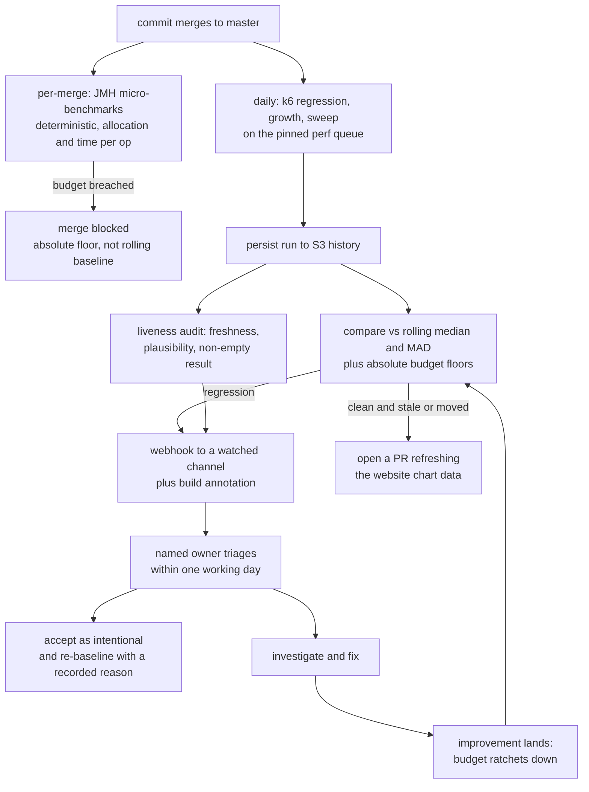

# Performance Programme

**Status:** deferred plan. Per `AGENTS.md`, landing this work includes **deleting this file** in
the same change. It is written to be consumed and removed, not kept.

Distilled from a 2026-09-16 read-only audit of every performance harness in the repo, against
`master` at `b98d18f0c`. Nothing was measured during that audit — it read the harnesses, the
pipeline, the stored results and the published figures, and established what each one can and
cannot detect.

## Bottom line

We measure **response latency on the local-match hot path, at a fixed low rate, on a pinned
six-core server, daily.** That signal is real and well engineered. Almost nothing else is
measured continuously.

- **Proxying is effectively unmeasured.** The daily run measures a forward *action* (a matched
  expectation that forwards) at 200 rps. The actual proxy surface — CONNECT tunnelling, SOCKS4/5,
  the upstream/downstream relay, transparent proxying, binary proxying, the HTTP/2 relay — has
  never been benchmarked. `k6/forward.js`, which its own README calls "the forward-path regression
  guard", **is not run by any CI step and is not even in the lint list.**
- **The laptop / per-test-method profile has no measurement at all.** Startup was measured once, by
  hand, in July. Idle heap/CPU floor, per-instance RSS, and N-parallel-instances-on-one-host have
  never been measured.
- **Several checks that look like gates cannot fail for the reason they claim.** The only true
  pass/fail perf gate runs at 300 rps against a server measured at ~32,000 rps.
- **The customer-facing figures are a stale snapshot** (2026-06-24, pre-8.0.0) and the daily run has
  no path back to the website.
- **8.0.0's HTTP/2 multiplex change has never been re-measured**, despite its own changelog warning.

The infrastructure to fix most of this already exists and is good. This programme is mostly about
**pointing existing harnesses at unmeasured things**, **closing the loop back to the website**, and
**making the controls audibly alive** — not new infrastructure.

## The mandate this serves

From the repo owner, in their framing. Performance work must cover **six dimensions**:

1. **Scale** — how far one instance goes, and how it scales out.
2. **Request/response handling** — latency and throughput of the mocking hot path.
3. **Proxying** — MockServer is a proxy as well as a mock, and proxying has a very different cost
   profile from matching a local expectation.
4. **CPU and memory growth and efficiency** — not peak, but *growth*: does a long-running instance
   under sustained load hold steady?
5. **Startup time.**
6. **The CPU and memory *floor*** — how small can a near-idle instance be.

Across **three deployment profiles**:

- **L — laptop / per-test-method.** Many small, short-lived instances in parallel on a developer
  machine. What matters: startup time, per-instance memory and CPU floor, and how N instances on one
  host interact (port pressure, thread pools, event-loop sizing, GC).
- **C — central deployment.** One heavily loaded instance (or a cluster) serving many pipelines and
  consumers. What matters: throughput ceiling, latency tail, connection scaling, memory growth over
  days.
- **P — inside someone else's performance test.** MockServer as a dependency under sustained
  synthetic load, or driving load itself via Load Scenarios.

A future reader should judge every item below against those eighteen squares.

## What exists today, and when it was measured

All dates are when the number was **taken**, not when it was written down. Anything more than a
release old should be treated as unverified.

### Harness inventory

| Harness | Location | What it measures | Runs |
|---|---|---|---|
| `k6/regression.js` | `mockserver-performance-test/k6/` | p50/p95/p99 + error rate for `match`, `forward`, `template`, `large`, over HTTP and HTTPS+H2, at a fixed 200 rps | daily, commit-gated |
| `k6/growth.js` | same | latency slope first-window vs last-window over 6 min at 800 rps (guards issue #2329) | daily |
| `k6/sweep.js` | same | throughput-vs-latency knee ladder | daily, **ladder truncated at 16k** |
| `k6/load.js` | same | the only real pass/fail gate: p95 < 25 ms, p99 < 100 ms, errors < 1% | daily + manual, **at 300 rps** |
| `k6/forward.js` | same | forward connection-pool exhaustion at 1500 rps | **never — not run, not linted** |
| `k6/stress.js`, `k6/soak.js` | same | past-the-knee breaking point; 30-min sustained soak | **never executed; lint-only** |
| `MatchingBenchmark` (JMH) | `mockserver/mockserver-benchmark/` | matcher time/op and `gc.alloc.rate.norm` | daily |
| `CandidateIndexBenchmark` (JMH) | same | scan-vs-index scaling over expectation count | daily |
| `Http2StreamChannelBenchmark` | same | N=1/10/100 streams over one h2c connection | daily, **no threshold** |
| `InboundDecode`, `MetricsIncrement`, `OpenApiValidation`, `LocalCallbackDispatch` benchmarks | same | one-off optimisation evidence | **never run in CI** |
| `stack/inject/run-inject.sh` | `mockserver-performance-test/stack/inject/` | injection ceiling, per-core sweep, N-instance scaling, against an Envoy sink | **opt-in only** (`PERF_INJECT=true` or `[perf-inject]`) |
| `scripts/perf/bench_startup.py` and siblings | `scripts/perf/` | launch→ready across a JVM/flag/JDK/image matrix | **never in CI; hand-run** |

Naming trap for a future reader: **`ForwardPathBenchmark` does not benchmark proxying.** It measures
the *load generator's* outbound render path (`LoadScenarioOrchestrator.render`). Nothing in
`mockserver-benchmark` touches the proxy handlers.

### Dated measurements

| Measurement | Taken | Against | Where it lives |
|---|---|---|---|
| Published throughput/latency knee: p50 0.19 ms to ~32k req/s, saturation ~36k req/s on 6 pinned cores, ZGC, 8 GB heap, open-model k6 | **2026-06-24** (perf build #64) | **pre-8.0.0 snapshot** | `jekyll-www.mock-server.com/mock_server/performance.html`, data in `images/perf-charts/data/` |
| Startup: Docker image 855 ms → **566 ms** with AppCDS; fat jar 919 → 804 ms; first request 230 ms → 5–11 ms with `startupWarmup`; JDK 25 Leyden `-aot` ~580 ms. arm64 Mac, median of 5 cold launches | **2026-07-02** | **7.3.1-SNAPSHOT** | `docs/code/startup-performance.md` |
| Load-injection ceiling / per-core / scaling figures | opt-in runs, most recent CI reference is build #71 | snapshot | `jekyll-www.mock-server.com/mock_server/load_injection_performance.html` |
| Daily regression latencies | continuously, most recent daily run | current snapshot | S3 `s3://mockserver-ci-perf-results/runs/master/` only |

**Every published figure was measured with `MOCKSERVER_LOG_LEVEL=ERROR`**, set by
`perf-test-load.sh` and `perf-test-run.sh`. The shipped default is `INFO`
(`ConfigurationProperties.java`, `DEFAULT_LOG_LEVEL`). The site's own tuning guidance says the
INFO-level per-matcher diagnostic is "the single largest matching-path allocation" when many
expectations are registered. So the headline numbers are **not default-configuration numbers**, and
the page does not say so.

### Coverage map

Profiles as defined above. "Never" means no harness anywhere has ever produced the number.

| Dimension | Profile | Measured today | Cadence | Threshold |
|---|---|---|---|---|
| Scale | L | nothing | — | — |
| Scale | C | knee ladder to 16k rps only (CI default `K6_SWEEP_RATES=500…16000`); the published 36k knee came from a manual longer-ladder run | daily, never reaches saturation | **none** — `perf-test-compare.sh` deliberately does not read `.sweep` |
| Scale | C | connection-count ceiling, keep-alive pool limits, max concurrent connections | — | **never** |
| Scale | C | H/2 streams per connection, N=1/10/100 | daily | **none by design** |
| Scale | P | injection ceiling, rps-per-core (C=1,2,4,8), aggregate scaling N=1→6 | opt-in | none |
| Scale | all | rps-per-core for the **serving** path | — | **never** (the per-core curve that exists is the injector's) |
| Req/response | L | nothing | — | — |
| Req/response | C | p50/p95/p99 per behaviour × {http, https_h2} at 200 rps | daily | median+MAD, 10% floor — **the one good continuous signal** |
| Req/response | C | p95 < 25 ms, p99 < 100 ms at 300 rps | daily | **real gate, ~100x headroom, on the Spot `default` queue** |
| Req/response | C | matcher time/op and bytes/op | daily | median+MAD, 5% floor — **the strongest absolute backstop** |
| Req/response | C | decode alloc, metrics contention, OpenAPI validation cache, callback dispatch hop | **never in CI** | — |
| Req/response | P | stress past the knee; sustained soak | **never executed** | — |
| **Proxying** | all | forward **action** latency at 200 rps | daily | median+MAD |
| **Proxying** | C | forward pool exhaustion at 1500 rps (`forward.js`) | **never run, never linted** | thresholds never execute |
| **Proxying** | all | CONNECT, SOCKS4/5, relay, transparent, binary, H/2 relay, upstream-proxy chaining, MITM TLS cost | — | **never, ever** |
| CPU growth | L | idle CPU floor | — | **never** |
| CPU growth | C | `docker stats` CPU start/end/peak/ratio over a 6-min growth run | daily | ratio vs median+MAD, absolute floor 1.30 |
| CPU growth | P | injector CPU% at ceiling, `rps_per_core` | opt-in | none |
| Memory growth | L | per-instance RSS, idle heap floor, `-Xmx512m` viability | — | **never** — the site's 512 MB sidecar recipe is prose only |
| Memory growth | C | heap used start/end/peak/ratio, GC seconds delta, thread peak over 6 min | daily | ratio vs median+MAD, floor 1.30 |
| Memory growth | C | ring-buffer bound (`maxLogEntries`, deque eviction, byte bound) | every build, **unit level** | **asserted, never demonstrated in a live process under load** |
| Memory growth | C | steady state over hours | — | **never** |
| Memory growth | C | **per-connection memory after the #2669 multiplex migration** | — | **never** |
| Startup | L | launch→ready matrix, first-request warmup | **once, 2026-07-02, by hand** | none |
| Startup | L | AppCDS archive actually mapped at runtime | image build checks the file **exists**; entrypoint uses `-Xshare:auto` | **cannot fail** — an unusable archive logs a warning and starts normally |
| Floor | L | minimum viable heap; thread counts at idle (`nioEventLoopThreadCount` default **5**, fixed; `actionHandlerThreadCount` = `max(5, cores)`) | — | **designed and documented, never measured** |
| Floor | L | N parallel instances: port pressure, aggregate threads, aggregate RSS, GC interference | — | **never** |

## Trustworthiness: which numbers would catch a regression tomorrow

Apply real scepticism here. Several checks run, exit zero, and prove nothing.

| Check | Would a regression be caught? |
|---|---|
| `regression.js` latency percentiles | **Yes, probably.** Median + MAD over a 10-run window with a 10% floor is sound. But it is notify-only, and the notification path is broken (below). |
| `regression.js` `throughput_rps` | **No.** `handleSummary` computes `count / durationSec` where `count` comes from a `constant-arrival-rate` executor pinned at 200 rps. The value is ~200 by construction. The `dir:"down"`, `min_pct:0.10` rule can only fire below 180 rps. It looks like throughput-regression detection and is not. |
| `MatchingBenchmark` | **Yes, now.** JMH is low-noise and `gc.alloc.rate.norm` is a true absolute backstop. It was **silently dead from 2026-09-12 to 2026-09-16** (a reactor/pom drift stopped the benchmark deps resolving); the only signal was a red square nobody watched. `b98d18f0c` fixed the build and added a failure annotation. |
| `load.js` gate | **Barely.** 300 rps against a ~32,000 rps server; a p95 gate of 25 ms against a measured p50 of 0.19 ms. A 50x throughput regression passes. It also runs on `queue: default` — Spot, mixed instance types — not the pinned `perf` queue, so its noise floor is worse than its sensitivity. |
| `sweep.js` knee | **No.** The CI ladder tops out at 16k where the server is comfortable (published data: 16,000 offered → 16,000.1 achieved, p50 0.159 ms). Saturation is never approached, and there is no baseline comparison. |
| `sweep.js` — was the **client** the bottleneck? | **Unknown and unasserted.** `perf-test-run.sh` samples `docker stats` on the **server only**, and only during the growth phase. There is no k6-container CPU sample, no VU-starvation check, no connection-reuse assertion at the top of the ladder. The published "~36,000 req/s on six cores" is therefore not proven to be MockServer's ceiling rather than a six-core k6's. The `inject` harness applies exactly this discipline (Envoy headroom, `reqs_per_connection >= REUSE_MIN`, `throttled ~ 0`, points excluded when the assertion fails) — the serving sweep does not. |
| `growth.js` heap ratio | **Weakly.** It is `last instantaneous jvm_memory_used_bytes / first instantaneous`, sampled every 5 s — a point on the GC saw-tooth, not the live set (`JvmMetricsCollector` exposes no post-GC live-set metric). The container is started with **no `--memory`**, so on a 32 GB `c5.4xlarge` the 75% `MaxRAMPercentage` yields a ~24 GB heap in which GC barely cycles. Six minutes is not a soak. It would catch an issue-#2329-class cliff; it would not catch 100 bytes leaked per request. |
| `growth.js` latency slope | **Yes for its stated purpose.** It is validated against #2329, and at 800 rps for 6 min it fills the 100k ring roughly 2.9 times over. |
| Ring-buffer bound | The bound is enforced in unit tests. It has **never been demonstrated in a running process under sustained load**, which is the claim the docs actually make. |
| `Http2StreamChannelBenchmark` | **No — by explicit design.** Recorded to S3, no threshold, because run-to-run variance on real agents is unknown. That is an honest call, but it leaves the #2669 warning unverified. |
| Published website figures | **No.** `perf-test-compare.sh` writes to S3 and stops. Nothing regenerates `jekyll-www.mock-server.com/images/perf-charts/data/*.json`. |
| Published *methodology* claims | The page states soak and stress are part of how MockServer is tested. **Neither has ever been executed by CI.** That is a customer-facing claim the pipeline does not support. |
| Startup figures | **No.** No CI step runs `scripts/perf/`. `-Xshare:auto` means a broken AppCDS archive is a warning, not a failure. The measured 34% Docker startup win could evaporate silently. |

Two things a future reader must carry forward, because nothing else in the repo says them:

1. **The published figures are a customer-facing claim taken on 2026-06-24 against a pre-8.0.0
   codebase, and the daily run has no path back to the site.** The page will keep drifting. What
   keeps it honest is a closed loop — see "Keeping published figures fresh" below.
2. **8.0.0's HTTP/2 multiplex change (issue #2669) ships with an explicit changelog warning** that
   users driving very large numbers of concurrent streams over a single connection "may notice
   different memory and throughput characteristics, since each stream now has its own lightweight
   channel". **Nothing has been re-measured since.** That is the single most concrete reason to
   re-baseline, and it lands squarely on the central-deployment profile.

## The measurement programme

Ordered by value divided by cost. Each item states dimension, profile, what to measure, how, the
threshold shape, where it runs, and rough cost. Items 1–6 are cheap and high value; 7–10 are
moderate; 11–13 are research-shaped and should be scheduled deliberately, not squeezed in.

### Tier 1 — cheap, high value

**1. Make the daily result reach a human.** *All dimensions, all profiles.*
`perf-test-compare.sh` annotates the build and then calls an optional `PERF_NOTIFY_WEBHOOK` that
**is configured nowhere in the repo or in Terraform**. A detected regression today notifies no one.
Configure it (Secrets Manager, same pattern as the existing agent secrets in
`terraform/buildkite-agents/build-secrets.tf`) so the annotation also posts to a channel a named
person watches. Until this exists, every item below is optional reading. Daily. **Hours.**

**2. Extend the CI sweep past the knee, and prove the client is not the bottleneck.**
*Scale + request handling, central.*
Raise `K6_SWEEP_RATES` in `perf-test-run.sh` to the published ladder (`…16000,32000,48000,64000`).
Per rung, additionally record a `docker stats` sample of the **k6** container and the
`dropped_iterations` count. Derive `saturation_rps` = the highest rung where
`achieved >= 0.95 x offered`. Import the `inject` harness's rule: a rung where the client is above
~85% of its CPU pin, or dropped iterations are non-zero, is **flagged and excluded** rather than
reported. Then add `saturation_rps` to the `metrics` list in `perf-test-compare.sh` with
`dir:"down"`, `min_pct: 0.15`. Adds roughly four minutes to a 45-minute step. Daily.
**1–2 days. The single highest-value change** — it converts the headline customer-facing number from
unverified prose into a tracked metric.

**3. Wire up `forward.js`, or delete it.** *Proxying, central and perf-test.*
It is the repo's only written proxy guard and it has never executed. Add it to the inspect list in
`perf-test-lint.sh` (it is simply missing from the loop today) and add a step to `perf-test-run.sh`
that runs it against the dedicated upstream container that step already starts. Its existing
`http_req_failed` threshold is a genuinely discriminating gate — the README documents how to
demonstrate it failing, by flipping `forwardConnectionPoolEnabled=false` and watching ephemeral-port
exhaustion trip the error rate. Daily. **Hours. We currently ship a guard that guards nothing.**

**4. Gate AppCDS being *used*, not merely present.** *Startup, laptop.*
Add a `container_integration_tests/` case (same shape as `docker_compose_jvm_options`) that runs the
image with `-Xlog:cds` — or an `-Xshare:on` probe invocation — and asserts the shared archive maps.
This is a **boolean**, not a wall-clock measurement, so it **cannot be flaky**. Merge gate on the
container-tests pipeline. **Hours. Protects the measured 34% startup win from silent loss.**

**5. Fix or remove `throughput_rps`.** *Request handling, central.*
Either drop it from the compared metrics — it is structurally unfalsifiable — or replace it with the
`saturation_rps` from item 2. Leaving a permanently-green metric in the annotation table trains
people to trust the table. **Hours.**

**6. Measure growth against a realistic heap, and against the live set.** *Memory growth, central.*
Start the SUT in `perf-test-run.sh` with an explicit `--memory=2g` (matching the documented
central-deployment guidance) so GC actually cycles. Change the heap metric from instantaneous
end-over-start to the **minimum `jvm_memory_used_bytes` over the last 60 s divided by the minimum
over the first 60 s** — the saw-tooth floor approximates the live set with no new metric, no forced
GC, and far less noise than a point sample. Keep the absolute floor at 1.30. Daily.
**1 day. Turns a near-meaningless number into a real leak detector.**

### Tier 2 — moderate cost, closes named mandate gaps

**7. Laptop profile: a startup and footprint check.** *Startup, CPU floor, memory floor; laptop.*
A step on the pinned `perf` queue — never Spot, because this is wall-clock.
- **Measure:** `docker run` to first successful `/mockserver/status`, reported as **median and p90 of
  9 cold launches**; plus RSS and thread count of a fully idle instance 30 s after ready, at
  `--memory=256m`, `512m` and `1g`.
- **How:** promote `scripts/perf/bench_startup.py` into a CI step — it already does exactly this and
  already emits a median/min/max table plus a per-run CSV.
- **Anti-flake:** compare median-of-9 against the same rolling median+MAD machinery, on the fixed-type
  on-demand box; discard the first launch explicitly (cold page cache — the harness README already
  advises this); never gate on a single launch.
- **Threshold:** notify-only for the first 10 runs to establish MAD, then `dir:"up"`,
  `min_pct: 0.25`.
- Daily. **2–3 days, mostly plumbing.**

**8. Proxy-path benchmarks.** *Proxying, all three profiles.* The largest genuinely uncovered area
the mandate names.
- **8a (k6, cheap).** A `proxy.js` scenario driving MockServer **in proxy mode** rather than as a
  mock: absolute-URI HTTP forwarding, and a `CONNECT` tunnel carrying HTTPS, both to the dedicated
  upstream container the daily run already starts. Reuse the `regression.js` shape — constant
  arrival rate, `op:` tags, `handleSummary` writing the same JSON contract — so
  `perf-test-compare.sh` picks the new behaviours up with **zero** compare-script changes. Threshold:
  median+MAD, like every other behaviour. Daily. **~2 days.**
- **8b (SOCKS).** k6 supports an HTTP proxy but not SOCKS, so this needs either a small driver or a
  SOCKS-aware sidecar. If that proves awkward, downgrade to a JMH benchmark of the SOCKS handshake
  handlers rather than skipping the dimension. **~3 days.**
- **8c (relay, JMH).** A benchmark over the upstream/downstream relay handlers measuring bytes per
  second and allocation per relayed KB. The relay's cost profile is byte-copy dominated and
  completely unlike matching, so the matcher backstop says nothing about it. Daily, with the same
  absolute `alloc_bytes_per_op` backstop as `MatchingBenchmark`. **~4 days.**

**9. Turn on the soak — weekly, not daily.** *Memory growth, CPU growth; central.*
`soak.js` already exists with p99-drift and error-rate thresholds. Add a **weekly**
`buildkite_pipeline_schedule` alongside `perf_regression_daily` in
`terraform/buildkite-pipelines/pipelines.tf`, running it on the `perf` queue for 2–4 hours with a
bounded `--memory`, sampling the same CSV the growth phase uses. Metrics: live-set floor slope (item
6's method) over the full run, and GC seconds per million requests. Notify-only initially; promote to
a floor once eight weeks of variance are known. **1–2 days to wire; the run costs CI money, hence
weekly.**

**10. Re-measure the #2669 HTTP/2 multiplex cost, with a per-connection memory axis.**
*Memory efficiency and scale; central.*
`Http2StreamChannelBenchmark` already sweeps N=1/10/100 streams over **one** connection. Add a
**connections** axis (N connections x M streams) and record heap delta per established connection —
precisely what the 8.0.0 changelog warned changed. Keep it notify-only until variance is known; that
judgement in the existing script is correct and should not be overridden on a hunch. Daily (the step
already runs). **2–3 days.**

### Tier 3 — research-shaped, schedule deliberately

**11. N parallel instances on one host.** *All six dimensions; laptop.* **Expensive: 1–2 weeks.**
The real question behind "per test method on a user's laptop across lots of parallel tests". Launch
N in {1, 4, 8, 16, 32} instances on one box, each with a small `--memory`, and measure aggregate RSS,
aggregate thread count, ephemeral-port consumption, per-instance startup degradation, and
per-instance p95 under light load. Note the thread-count arithmetic before starting:
`nioEventLoopThreadCount` is a **fixed 5**, not CPU-derived, while `actionHandlerThreadCount` is
`max(5, availableProcessors)` — so each instance sizes its action pool off the *whole machine*, and
total threads grow faster than linearly in a container-per-test world. Reuse the `stack/inject`
compose-profile pattern (`--profile n1/n2/n4/n6`), which already solves multi-instance orchestration
and per-instance Prometheus attribution by `run_id`. Opt-in deep run, like `PERF_INJECT`. Likely
output: a published sizing table, and a recommendation to make those defaults container-aware.

**12. rps-per-core curve for the *serving* path.** *Scale, CPU efficiency; central.* **~1 week.**
The `percore` phase in `run-inject.sh` measures the **injector's** rps-per-core. Mirror it for
serving: pin the SUT to C in {1, 2, 4, 8, 16} cores, run the extended sweep ladder at each C, record
`saturation_rps` and `rps_per_core`. The Envoy-headroom and reuse-assertion discipline transfers
directly. Occasional deep run (~60 min), published as a sizing curve. Opt-in, not daily.

**13. Connection-scaling ceiling.** *Scale; central.* **Research; unscheduled.**
Maximum concurrent established connections before latency degrades, separately for HTTP/1.1
keep-alive, HTTP/2 and TLS (TLS session state is the interesting axis). Needs a client that can hold
tens of thousands of idle connections, which k6 is not well suited to — likely a small purpose-built
driver. Schedule only after items 1–10 have landed.

## Keeping the goals true as other work lands

This half determines whether the half above still means anything in six months. It is actionable
independently of the measurement build-out.

The control loop we are aiming for:

### Budgets and thresholds

The repo's established preference is **never-regress on both small and large cases, with thresholds
derived empirically rather than picked.** Apply that here.

**How a budget is set.** Never by choosing a round number. For each metric: run the check on the
pinned `perf` queue until there are at least 10 clean runs (the existing `PERF_MIN_BASELINE=5`
"warming up" mechanism already does this — raise it to 10 for new metrics), take the median and the
MAD, and set the initial budget at `median x (1 + k)` where `k` is the larger of the observed
3-sigma spread and a floor of 10%. Record the measured spread in the metric's definition so a future
reader can tell a tight budget from a slack one.

**Proposed budgets**, with the dimension and profile each serves. All are **absolute floors layered
on top of the existing rolling median+MAD comparison** — the rolling test catches sudden change, the
absolute floor catches slow erosion that the rolling median would normalise away.

| Budget | Dimension / profile | Initial basis |
|---|---|---|
| `match` p95 and p99 at fixed rate, HTTP and H2 | req/response, C | derived from 10 clean runs; already compared, needs an absolute floor added |
| `saturation_rps` | scale, C | from item 2; floor at 85% of the established median |
| matcher `time_per_op` and `alloc_bytes_per_op`, small n **and** large n | req/response, C and L | JMH; **both ends** — small-n must show no regression, large-n must stay flat. `CandidateIndexBenchmark` already sweeps 1/2/5 and 100/1000/5000 for exactly this reason |
| proxy p95 for forward, CONNECT | **proxying**, all | from item 8; derived after 10 runs |
| relay `alloc_bytes_per_relayed_KB` | proxying, C and P | JMH, deterministic, tight floor viable |
| live-set growth ratio over a bounded-heap soak | memory growth, C | from items 6 and 9; healthy is ~1.0, floor at 1.15 once variance is known |
| idle RSS and thread count at `--memory=256m` | **floor**, L | from item 7; absolute bytes, low variance |
| container `docker run` to ready, median of 9 | startup, L | from item 7; floor at +25% |
| heap delta per established H/2 connection | memory efficiency, C | from item 10; no basis yet — measure first |

**How a budget tightens.** This is the part that is usually missed, and a budget that only ever
loosens is not a control. Add a **ratchet** to `perf-test-compare.sh`: whenever a metric's rolling
median improves by more than its MAD and holds for **three consecutive successful runs**, the
absolute floor is recomputed from the new median and the change is recorded in the run JSON as a
`budget_tightened` event, surfaced in the annotation. Improvements are then locked in automatically,
and giving one back later trips the floor. Loosening, by contrast, is **never automatic** — it
requires the explicit re-baseline path below.

### Feedback latency: what should block a merge

**Daily is not soon enough for everything.** A regression found the next morning must be bisected
against every commit that merged since — on a busy day that is a dozen or more — which is precisely
how performance work gets abandoned. But the daily wall-clock run cannot move to per-merge: the
`perf` queue is deliberately `max_size = 1` and scales to zero, so making it a PR gate would
serialise every merge behind a 45-minute run on a box that must first boot.

The split follows noise, not importance:

- **Per-merge, blocking — JMH micro-benchmarks only.** They are deterministic, fork-isolated, and
  measure allocation and time per operation rather than wall-clock under contention. Run a **reduced
  fast profile** of `MatchingBenchmark` and `CandidateIndexBenchmark` (fewer forks and iterations,
  the small-n and large-n ends only) against **absolute budget floors**, never against a rolling
  baseline — a rolling baseline needs history a PR branch does not have. Target under five minutes.
  This is the only thing that should **block a merge**, and it is justified because a matcher
  allocation regression is both the most likely regression class (it has happened: issue #2329) and
  the cheapest to detect deterministically.
- **Per-merge, non-blocking, cheap booleans.** The AppCDS-mapped assertion (item 4). It is a boolean,
  so it can safely be blocking too — prefer blocking.
- **Daily, notify-only — everything wall-clock.** The k6 regression, growth, sweep and proxy runs on
  the pinned box. Notify-only is the right call for these and should stay that way.
- **Release gate — freshness, not measurement.** The `release-preflight` pipeline should refuse to
  proceed if the last successful perf run is older than the release candidate's HEAD, or flagged an
  unacknowledged regression. This costs one API query and is where "we shipped a 2x slowdown"
  actually gets caught. **This is the highest-value gate in the whole programme after item 1.**

**Justification for not blocking on load tests:** a wall-clock gate on shared CI that fires falsely
even a few percent of the time gets marked flaky, then `soft_fail`, then deleted. This repo has
already abandoned a parallelism change over exactly that dynamic. A non-blocking daily check that
someone actually reads is worth more than a blocking gate everyone routes around.

### The notification actually reaching a human

Today: `perf-test-compare.sh` posts a Buildkite annotation and calls `PERF_NOTIFY_WEBHOOK` if set.
**It is set nowhere** — not in the pipeline YAML, not in the Terraform, not in Secrets Manager. So a
detected regression produces a warning annotation on a build in a notify-only pipeline that nobody
opens, and nothing else.

Required:

1. Configure `PERF_NOTIFY_WEBHOOK` to a channel with a **named owner**, provisioned the same way as
   the other build secrets.
2. Make the absence of the webhook **loud**: if `PERF_NOTIFY_WEBHOOK` is unset, the compare step
   should emit a **warning annotation saying the notification path is not configured**, rather than
   silently skipping the `curl`. An unconfigured control should announce itself.
3. Define the expectation explicitly in the annotation body: a flagged regression is triaged within
   one working day, and the outcome is either a fix or a recorded re-baseline. Not "someone will look
   eventually".

### Keeping the system itself alive

Call this out as its own risk, because the repo already has three examples of controls that decayed
silently: the JMH backstop was **dark for four days** and nobody noticed; the notify webhook has
**never** been configured; and a CI cache in this repo reported success while storing nothing. A
performance programme is a set of controls, and controls decay quietly. Green is not the same as
alive.

Design rule: **the thing that breaks should make noise, not go quiet.** Concretely:

- **Freshness assertion.** Add a step to the daily pipeline that reads the S3 history and **fails
  loudly** if there is no successful measurement run within N days (start at 3, allowing for
  commit-gated skips). This catches the "dispatch silently stopped happening" class, which the guard
  script's own skip path makes easy to miss.
- **Plausibility assertion, not exit code.** Every producing step must assert its output is a
  **plausible non-empty result**, not merely that the process exited zero. `perf-test-run.sh` already
  warns when the resource sample log is empty — promote that to a failure. Add the same for: zero
  behaviours in the regression JSON, a sweep with fewer rungs than the ladder asked for, a JMH result
  with fewer rows than parameter combinations, a growth run whose probe windows recorded no requests.
  `Http2StreamChannelBenchmark` already does this well — it self-validates and exits non-zero on an
  integrity breach, deliberately distinguishing "bad measurement" from "slower". Copy that pattern
  everywhere.
- **Failure annotations on every producing step.** `perf-test-microbench.sh` gained one in
  `b98d18f0c` precisely because its silent death was invisible. Every perf step should annotate its
  own failure rather than relying on the downstream compare step, which only runs if the upstream
  steps passed.
- **A quarterly controls audit.** One scheduled run that asserts, for each control: it executed
  within its cadence, it produced a non-empty plausible result, its threshold is non-vacuous (see the
  `throughput_rps` trap above — a metric pinned by the test's own design), and its notification path
  is configured. Output a single annotation listing every control and its liveness state. This is the
  check that would have caught all three historical failures.

### Re-baselining and drift

The S3 history at `s3://mockserver-ci-perf-results/runs/<branch>/` is the baseline. It legitimately
moves for three reasons: a deliberate trade-off (we accepted slower X for correctness Y), an
environment change (JDK bump, Netty bump, new agent instance type), or new hardware.

- **Intentional moves must be recorded, not absorbed.** Add a `baseline_note` field to the run JSON,
  populated from a build env var or a `[perf-rebaseline: reason]` marker in the commit message. A run
  that moves a metric past its budget **with** a note annotates as an accepted move; **without** one
  it annotates as a regression. That is the difference between an intentional trade-off and a
  rubber-stamp.
- **Who approves.** The named owner from the notification path. The approval artifact is the recorded
  reason, which lives in the run history and is therefore auditable months later — which is exactly
  what today's figures lack.
- **Environment changes invalidate history.** The run JSON already records `agent.instance_type`,
  `server_cpus`, `k6_cpus` and `mockserver_image`. Make the compare step **refuse to compare across a
  changed `instance_type`** and instead start a fresh baseline window with a loud annotation.
  Comparing a `c5.4xlarge` median against numbers from a different instance family is worse than
  having no baseline.
- **Budget floors survive re-baselining by default.** Rolling medians move; absolute floors do not,
  unless the ratchet tightens them or a recorded re-baseline loosens them.

### Keeping published figures fresh

Today `perf-test-compare.sh` writes to S3 and stops. Nothing regenerates
`jekyll-www.mock-server.com/images/perf-charts/data/*.json` or the PNGs. The page therefore carries a
2026-06-24, pre-8.0.0 snapshot and will keep drifting.

Proposal: add a final **notify-only, non-gating** step to the daily run that, on `master` only and
only when the run passed its own plausibility assertions, regenerates the chart data and images via
the existing `jekyll-www.mock-server.com/images/perf-charts/render_perf_charts.py`, and **opens a PR
rather than committing directly**. A human should look at a 20% swing before it ships to customers.

Trigger the PR only when the stored figure is **more than 30 days old, or has moved by more than
10%** — otherwise it opens a PR every day and gets ignored. The effect is that a stale page becomes
an **open PR** rather than invisible rot.

What should be **published and kept current**:

- The throughput/latency knee curve, with `saturation_rps` and the **client-headroom evidence**
  alongside it.
- Per-behaviour p50/p95/p99 for match, forward, template, large, over HTTP and HTTP/2.
- Matcher scaling, scan versus index — already good.
- **New:** proxy-path latency (forward, CONNECT tunnel); startup medians per artifact (Docker, fat
  jar, `-aot`); and a laptop sizing table (heap floor, idle RSS, threads, safe parallel instances per
  GB).
- Every figure must carry **version, date, core count, heap, GC and log level**. The last is
  non-negotiable: today's figures are `logLevel=ERROR` while the default is `INFO`, and the page does
  not say so.

What should be **gated internally and never published**: the JMH absolute backstops, the growth
live-set slope, the forward-pool error-rate guard, the AppCDS-mapped boolean, the startup
median-of-9. These are regression detectors, tuned for sensitivity rather than defensibility.

Also fix the methodology claim: the page states soak and stress are part of how MockServer is
tested. Either land item 9 (which makes it true) or amend the page. Do not leave it as is.

### Handling noise without disabling the control

For each recurring check, how it stays trustworthy:

| Check | Noise strategy |
|---|---|
| JMH micro-benchmarks (per-merge, blocking) | Deterministic by construction: fork-isolated, allocation and time per op, no network. Absolute floors, no rolling baseline needed. **Safe to block.** |
| AppCDS mapped (per-merge) | A boolean. Cannot be flaky. **Safe to block.** |
| Release freshness gate | An API query. Cannot be flaky. **Safe to block.** |
| k6 regression latencies (daily) | Pinned on-demand `c5.4xlarge`, `max_size = 1`, core-pinned server/upstream/k6 on disjoint cpusets, 30 s warmup window excluded from measurement, robust median+MAD over 10 runs. **Notify-only.** |
| Sweep `saturation_rps` (daily) | Client-headroom and dropped-iteration assertions exclude invalid rungs rather than reporting them; 15% floor. **Notify-only.** |
| Growth live-set slope (daily) | Saw-tooth **minimum** over a 60 s window, not a point sample; bounded heap so GC actually cycles. **Notify-only.** |
| Startup median (daily) | Median and p90 of 9 launches, first discarded, on the pinned box, 25% floor, 10 warm-up runs before the threshold activates. **Notify-only.** Wall-clock is inherently the worst case here — if it proves flaky in practice, demote it to informational and rely on the AppCDS boolean instead, rather than loosening it until it means nothing. |
| Soak (weekly) | Long window averages out short-term noise; informational until eight weeks of variance exist. **Notify-only.** |
| Inject / per-core / connection-scaling | Opt-in deep runs. **Informational by design**, never gating. |

The governing principle: **a flaky gate gets ignored, then softened, then removed — which is worse
than not having it.** Where wall-clock noise cannot be controlled, accept the check as informational
rather than pretending it is a gate.

### Continuous improvement, not just defence

The mandate says "constantly improve", so opportunities must surface, not only regressions.

- **Quarterly deep review, one day.** Run the opt-in deep harnesses that are not part of any regular
  cadence — `inject` ceiling and per-core, the serving rps-per-core curve (item 12) once it exists,
  and a profiling pass under sustained load (async-profiler or JFR on the pinned box) producing CPU
  and allocation flame graphs. Ask one question: *where does the time and the garbage actually go
  now?* The existing one-off benchmarks in `mockserver-benchmark` (`InboundDecodeBenchmark`,
  `MetricsIncrementBenchmark`, `OpenApiValidationBenchmark`) all exist because someone previously
  asked that question and found something. That is the cadence to institutionalise.
- **Track allocation per request as a first-class trend**, not just per-operation in JMH. Add
  `gc.alloc.rate` from the daily growth phase to the stored run so allocation-per-request has a
  visible multi-month trend line. Allocation growth precedes latency growth, so it is the earlier
  warning.
- **Every accepted trade-off gets a recorded reason** (the `baseline_note` above). Over a year that
  history is the answer to "why is this slower than it was?", which is otherwise unanswerable.
- **Revisit this programme's own budgets annually**, at the same time as the deep review, and
  re-derive any budget whose underlying environment has changed.

## Open questions and risks

1. **Is the published 36k req/s knee MockServer's ceiling or k6's?** Unresolved until item 2 lands.
   The measurement was taken with k6 on six pinned cores driving a server on six pinned cores, with
   no client-side CPU sample. Treat the published saturation figure as **unverified** until proven.
2. **Startup wall-clock on CI may simply be too noisy to gate**, even median-of-9 on a dedicated box.
   Flagged, not resolved. Mitigation if it proves flaky: keep the AppCDS boolean (deterministic) as
   the real control and demote the timing to informational.
3. **`Http2StreamChannelBenchmark` has no threshold because its variance is unknown.** That was the
   right call when written. Item 10 should collect variance first and only then propose a threshold.
   Do not guess one.
4. **The `load.js` gate runs on the Spot `default` queue.** Moving it to `perf` would make it less
   noisy but would contend with the daily run on a `max_size = 1` queue. Either fix its sensitivity
   (raise the rate materially) and keep it where it is, or retire it in favour of the sweep-derived
   `saturation_rps`. Retiring it is probably correct — it currently occupies the slot of "the perf
   gate" without doing the job.
5. **Measuring at `logLevel=ERROR` versus the `INFO` default.** Changing the CI runs to `INFO` would
   make the numbers representative but would break comparability with the entire stored baseline.
   Recommendation: keep `ERROR` for the tracked baseline, **add** an `INFO` rung to the sweep for the
   published figure, and label both. Unresolved until someone decides.
6. **How much CI spend is acceptable.** The weekly soak and the opt-in deep runs cost real money on
   an on-demand `c5.4xlarge`. Nobody has set a budget. Ask before scheduling item 9.
7. **No owner is currently named** for the notification channel proposed in item 1. Without one, the
   whole control loop terminates in an empty room.

## What belongs as lasting documentation

Most of this file is scaffolding and should disappear with it. Three parts are durable reference and
should be **moved into permanent docs as the work lands**, not deleted with this plan:

- **A corrected account of what each harness actually measures** — in particular that
  `ForwardPathBenchmark` measures the load generator's outbound render path and not proxying, and
  that `forward.js` and the soak/stress scripts are (or were) unwired. Destination:
  `mockserver-performance-test/README.md` and `mockserver-performance-test/k6/README.md`, whose
  current text describes intended rather than actual wiring.
- **The measurement-honesty rules** — client headroom, connection reuse, throttle assertions,
  exclude-rather-than-report, plausibility over exit code. These are already written down well for
  the injection harness in `mockserver-performance-test/stack/inject/README.md`; they should be
  generalised into a short "how we measure" section covering the serving harnesses too.
- **The budgets, their derivation, and the ratchet rule** — once set, these are the standing contract
  and must outlive this plan. Destination: a new `docs/code/performance-budgets.md`, cross-linked
  from `docs/code/memory-management.md` and `docs/code/startup-performance.md`.

Everything else here — the gap analysis, the tier list, the costs — is consumed by doing the work.

## Related documents

- `docs/code/startup-performance.md` — startup anatomy and the 2026-07-02 variant matrix.
- `docs/code/memory-management.md` — ring-buffer sizing and the heap-derived defaults.
- `mockserver-performance-test/k6/README.md` — the k6 harness contract and environment variables.
- `mockserver-performance-test/stack/inject/README.md` — the load-injection harness and the
  measurement-honesty discipline this plan proposes generalising.
- `jekyll-www.mock-server.com/mock_server/performance.html` — the customer-facing figures.
- `changelog.md`, 8.0.0 "Changed" section — the HTTP/2 multiplex warning (issue #2669).
