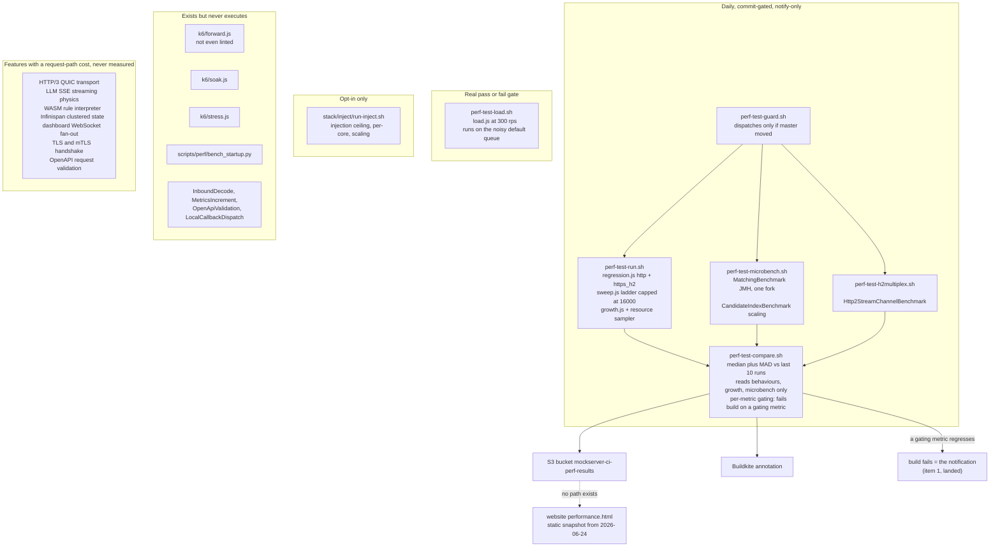
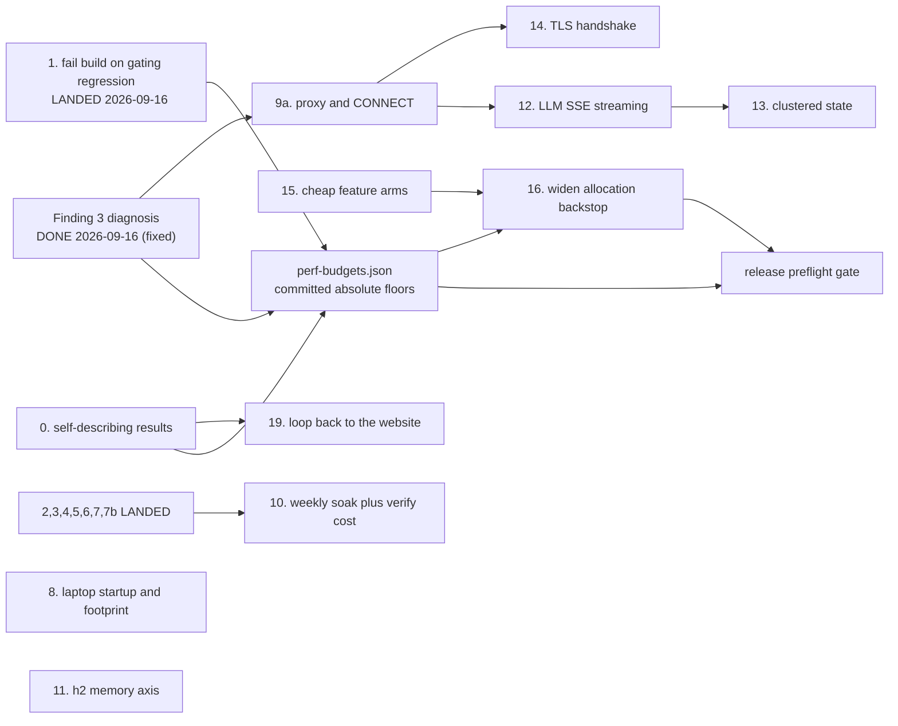

# Performance Programme

**Status: every acceptance row executed EXCEPT item 10's.** Items 0-8, 7b, 11, 13, 15a-d and
both halves of 16 are proven; 9a and 14 are recorded as REFUTED on measurement; 12 is delivered
and its calibration residual is now **closed** by a CI bisect (build 322). **Item 10 is the one
row with no evidence** — its harness and weekly schedule are wired, and build **#324** on
2026-09-19 is the first soak ever executed. It ran the full 2 h and **failed**, but on a bug in
the harness rather than in the server: the soak's own `create` arm evicts the expectation its
`match` arm depends on. So item 10 still has no baseline, and needs re-running once the harness
fix lands. Item **18** also ran for the first time on CI (build #325) and is valid, but its curve
is flat at 4,000 rps for every core count because the rung that decides the ceiling is
client-limited — the measurement is of the load generator, not the server. Both are written up
under "What remains". Items 17, 18 and 19 have no acceptance row at all and are further along than a reader
would guess; see "What remains".

Originally written 2026-09-16 against `master`
at `b98d18f0c`. **Revised 2026-09-16 against `master` at `a984a8c3a`** after a second
read-only audit that checked the first audit's load-bearing claims against the code and
against the repo's own stored results. Two of those claims were wrong; see
[Corrections to the first audit](#corrections-to-the-first-audit).

**This paragraph used to say "Tier 1 items 2-7 are being implemented now ... everything else
is unstarted."** That was true on 2026-09-16 and is long obsolete; it is replaced rather than
kept, because a stale progress note next to a current status header is worse than none — a
reader cannot tell which one to believe. The current position is the status header above and
the ["What remains"](#what-remains) table at the end; those two are the only places in this
document that claim progress, and they are kept in agreement.

Per repo convention, the change that finishes this work **deletes this file in the same
commit** — it is written to be consumed and removed, not to persist. The parts that deserve
to outlive it are named in [What survives this plan](#what-survives-this-plan) at the end;
move those before deleting.

## Bottom line

MockServer's performance harness is better than its reputation, narrower than its claims,
and **less trustworthy than the first audit concluded**. It measures one dimension in one
deployment profile continuously — response latency on the local-match hot path, on a
six-core pinned central server. Almost everything else is either measured once and
published, or never measured at all. The one signal the first audit called good had a
four-orders-of-magnitude internal contradiction in the repo's own published data; that has
now been **diagnosed and fixed** — it was a client-side rig artefact (see Finding 3).

Five things a reader needs before anything else:

1. **The daily latency signal was measuring the rig, not the server — now fixed
   (2026-09-16).** The committed `perf-result.json` recorded, from a single run, a sweep p95
   of **0.279 ms at 16,000 req/s** and a regression-scenario p95 of **1,014 ms at 200 req/s**;
   both could not describe the same server. Finding 3 shows the regression tail was a
   client-side VU-allocation connection storm and fixes `regression.js` (stagger + a fixed
   equal VU pool + warm-every-path + a settle exclusion), verified to still catch a real
   slowdown. See
   [Finding 3](#finding-3-the-daily-latency-percentiles-and-the-sweep-disagree-by-four-orders-of-magnitude).
2. **Proxying is effectively unmeasured**, despite being half of what MockServer is. The
   daily run measures a forward *action* at 200 req/s. `HttpConnectHandler`, the SOCKS
   handlers, the relay handlers, transparent proxying, binary proxying and the HTTP/2
   relay have never been benchmarked at any rate by any harness.
3. **The laptop / per-test-method profile has no measurement at all** — and the profile's
   dominant code path is not the one the proposed startup measurement covers. Users run
   MockServer **in-JVM** via `MockServerExtension` and `ClientAndServer.startClientAndServer`,
   not via `docker run`.
4. **Several checks that look like gates cannot fail for the reason they claim.** The one
   real pass/fail load gate runs at 300 req/s against a server measured at ~32,000 req/s,
   on the Spot `default` queue.
5. **The run metadata cannot support the provenance the programme depends on.** The
   published run records `"instance_type": ""`, and the result schema has no field for heap,
   GC, JVM options or log level. Several proposed mechanisms — the hardware-invalidation
   rule, the ratchet, the website provenance line — cannot be built until that is fixed.

The infrastructure needed to fix most of this already exists and is well built. This
programme is mostly about **pointing existing harnesses at unmeasured things**, **making the
existing measurements say what they are**, and **closing the loop back to the website** —
not new infrastructure.

## The mandate this serves

From the repo owner, verbatim:

> For the work on performance I want to ensure we're considering: scale; performance of
> request/response handling **and proxying**; CPU and memory growth and efficiency; and
> start up time; as well as how small the CPU and memory can be for low volume scenarios.
> I want MockServer to behave well when run **per test method on a user's laptop across
> lots of parallel tests**, as well as behave well when run as part of a **heavily loaded
> central deployment used by many pipelines or consumers**, and when run as part of a
> **performance test**.
>
> The plan should include consideration of how we can **maintain the goals, re-assess, and
> constantly improve** in the face of other changes flowing into the project.
>
> I want to make sure any performance improvements are **fully tested to confirm they work
> correctly**.

That is **six dimensions** across **three deployment profiles**, plus a correctness
obligation that has its own section
([Proving a performance change is still correct](#proving-a-performance-change-is-still-correct)).

| | Dimension |
|---|---|
| D1 | Scale — throughput ceiling, connection ceiling, how capacity grows with cores and instances |
| D2 | Request/response handling — latency and cost of matching and responding |
| D3 | **Proxying** — forwarding, CONNECT tunnelling, SOCKS, relaying. A different cost profile from matching a local expectation |
| D4 | CPU and memory **growth** over time and **efficiency** under load |
| D5 | Startup time |
| D6 | The CPU and memory **floor** — how small MockServer can be for low-volume use |

| | Profile |
|---|---|
| **L** | Per test method on a laptop, many instances in parallel. Short-lived, near-idle, dozens at once |
| **C** | Heavily loaded central deployment serving many pipelines and consumers. Long-lived, saturated |
| **P** | Inside someone else's performance test — either serving load, or generating it via Load Scenarios |

**On the scope of "request/response handling".** The first audit read D2 narrowly, as the
local-match hot path, and explicitly deferred HTTP/3, LLM mocking, async messaging, WASM
rules and the dashboard. That was defensible as a first cut and is **no longer defensible as
a final one**. The owner asked for MockServer to behave well in a heavily loaded central
deployment; a central deployment is precisely where a customer streams SSE from a mocked
LLM, where the dashboard is left open on someone's second monitor, where state is clustered
across instances, and where a hundred pipelines each hold a TLS connection. Those are
request/response handling. See [Feature surfaces the first audit
excluded](#feature-surfaces-the-first-audit-excluded), which adds five of them to the
programme and names the five it deliberately leaves out.

## How to read the numbers in this document

**Every figure below is dated and version-stamped.** That is deliberate: the whole failure
mode this programme addresses is figures going stale silently. If you are reading this
months later, treat any undated number as untrustworthy and any dated number as history,
not as current state. Re-measure before you rely on it.

Analysis date: **2026-09-16**, `master` at `a984a8c3a`. Where a claim below could not be
verified by reading code or stored results, it is marked **unverified** rather than dropped,
because an unverified claim someone can go and check is more useful than a silent gap.

## Corrections to the first audit

The first audit was written from a read-only pass over harnesses, scripts, stored results
and the website. It measured nothing, so its claims about what a harness *does* were
inferences. This revision re-checked the load-bearing ones.

**Verified correct, no change:**

| Claim | How verified |
|---|---|
| The CI sweep ladder stops at 16,000 | `perf-test-run.sh:162` sets `K6_SWEEP_RATES` default `500,1000,2000,4000,8000,16000` |
| `forward.js` is in no step and no lint list | `perf-test-lint.sh` inspects `smoke, load, stress, soak, regression, growth, sweep`. No pipeline step references `forward.js` |
| `-Xshare:auto` means a broken archive degrades silently | `docker/Dockerfile:164` and `docker/local/Dockerfile:102` pass `-XX:SharedArchiveFile` with no `-Xshare:on`. The Dockerfile comment at line 161 *states this outcome explicitly* — the repo already knows, and ships it anyway. The build check is `ls -l /mockserver.jsa` (line 120). **Now also measured — see Finding 4** |
| `nioEventLoopThreadCount` is a fixed 5; `actionHandlerThreadCount` is `max(5, availableProcessors)` | `ConfigurationProperties.java:2223-2237`. Note `availableProcessors()` **is** cgroup-aware on modern JVMs, so the "sizes off the whole machine" gloss is right for a bare JVM and wrong for a CPU-limited container. The laptop profile is the bare-JVM case, so the concern stands where it matters |
| Published figures were taken at `logLevel=ERROR` while the shipped default is `INFO` | `perf-test-run.sh:85` and `perf-test-load.sh:32` set `MOCKSERVER_LOG_LEVEL=ERROR`; `ConfigurationProperties.java:52` `DEFAULT_LOG_LEVEL = "INFO"`. The run **also** sets `MOCKSERVER_DISABLE_SYSTEM_OUT=true`, a second non-default the first audit missed |
| `PERF_NOTIFY_WEBHOOK` is a silent no-op (at audit time) | `perf-test-compare.sh` guarded the `curl` on `[ -n "${PERF_NOTIFY_WEBHOOK:-}" ]` with no else branch. Not set in any terraform file. **Since removed by item 1** — the webhook is gone; a gating regression now fails the build instead |
| The compare step never reads `.sweep` or `.h2_multiplex` | Confirmed in the `metrics` jq: it reads `.behaviours`, `.growth`, `.microbench` only |
| A new behaviour key is picked up by compare with zero script changes | Confirmed: `metrics` does `(.behaviours // {}) \| to_entries[]`. Item 9a's design is sound |
| The `perf` queue is a single on-demand `c5.4xlarge`, max 1, scale to zero | `terraform/buildkite-agents/variables.tf:79-94` |

**Wrong, and the correction matters:**

1. **`throughput_rps` is not arithmetically pinned.** The first audit said the value is
   "~200 by construction" and the metric "structurally cannot fail". The arithmetic is as
   described — `count / durationSec` from a `constant-arrival-rate` executor — but `count`
   is *completed* requests, and k6 drops iterations when its VU pool cannot keep up. The
   repo's own published run records `throughput_rps` of **191.8, 183.8, 191.8, 191.3,
   186.1, 177.7, 185.9, 185.3** across the eight behaviours. `forward_https_h2` at 177.7 is
   **below** the 180 that a 10-percent `dir:"down"` rule would trip against a nominal 200.
   So the metric moves, has moved, and is already losing 4 to 11 percent of offered load at
   200 req/s.

   The correct diagnosis is worse than the original one, not better: `throughput_rps` is an
   **unlabelled dropped-iteration counter** presented as a throughput measurement. It cannot
   distinguish "the server got slower" from "k6 ran out of VUs", and the run records
   `dropped_iterations` nowhere. **This changed item 5**: the answer was not to delete the
   metric, it was to record what it is actually detecting — done in `19686f9f1`, and the
   shortfall it was detecting is now **explained and fixed** (Finding 3, 2026-09-16): the same
   tied-up VU pool that produced the latency tail. After the harness fix the light-path
   `delivery_ratio` reads ~1.00 with zero `dropped_iterations`.

2. **`regression.js` is now a trustworthy continuous signal (fixed 2026-09-16).** In the
   published run its p95/p99 were between 1,012 ms and 2,154 ms at 200 req/s per behaviour —
   a client-side rig artefact, now diagnosed and fixed (light-path p99 collapses from
   ~1,900-3,000 ms to single-digit/low-double-digit ms, drops to zero). See
   [Finding 3](#finding-3-the-daily-latency-percentiles-and-the-sweep-disagree-by-four-orders-of-magnitude).
   The JMH `alloc_bytes_per_op` backstop remains the strongest *absolute* signal; the k6
   latency percentiles are now sound as a *relative* change detector.

3. **The acceptance table now carries a REFUTED premise (item 9a), on measurement.** The
   9a control "disable forward pooling; the CONNECT behaviour moves" describes something that
   cannot happen: the CONNECT tunnel is architecturally unreachable from the forward pool
   (`RelayConnectHandler` connects a fresh per-tunnel `Bootstrap`, never `NettyHttpClient`/the
   pool), so `forwardConnectionPoolEnabled` moves only the absolute-URI arm (measured 1→150
   connections), not CONNECT (~30 vs ~49, unmoved). The pooling lever is still guarded — by
   item 3 on the absolute-URI path (gating `forward.error_rate` 0.997, exit 99) — 9a simply
   named the wrong arm. Recorded so nobody re-attempts it; full evidence in the 9a row below.

**Could not verify:**

- **That the published run used ZGC with an 8 GB heap.** The result schema records
  `agent.instance_type`, `agent.queue`, the cpusets and the image. It does **not** record
  heap, GC, `JAVA_TOOL_OPTIONS`, `PERF_SERVER_JAVA_OPTS` or log level. The claim may be true
  from build logs; it is not recoverable from the artefact. That gap is itself a finding —
  it is [item 0](#0-make-a-result-self-describing-before-anything-compares-them).
- ~~**What causes the 1-second regression p95.**~~ **Settled (2026-09-16):** a client-side
  VU-allocation connection storm — see Finding 3 for the diagnosis, fix and evidence.
- **Whether `alloc_bytes_per_op` really is agent-independent.** Still open, still one cheap
  experiment.

### What actually runs pre-merge

The first audit asserted merge-blocking for a check without checking where its step is wired.
That produced a recommendation that reads as a PR gate and is not one. The topology, verified
2026-09-16, so nobody has to infer it again:

- **Exactly one pipeline has `trigger = "code"`**: the orchestrator, `.buildkite/pipeline.yml`.
  Every other entry in `terraform/buildkite-pipelines/pipelines.tf` is `trigger = "none"`, and
  the `provider_settings` block derives `build_branches`, `build_pull_requests` and
  `publish_commit_status` from that flag — so no other pipeline builds a PR directly or
  reports a commit status of its own.
- The orchestrator's `generate-pipeline.sh` dispatches sub-pipelines by changed path, passing
  the **PR branch**, and `trigger-pipeline.sh` polls each triggered build to completion — so a
  sub-pipeline failure **does** fail the PR.

| Where a step lives | Runs pre-merge? | Blocks the PR? | Covers which changes |
|---|---|---|---|
| `pipeline-java.yml`, **no `if:`** | Yes | Yes | Path-filtered: `mockserver/`, `mockserver-ui/`, `test-fixtures/` |
| `pipeline-java.yml`, `if: build.branch == 'master'` | No | Blocks the **master build** post-merge | **Source-agnostic** — every master build |
| `pipeline-container-tests.yml` | Yes | Yes, via the orchestrator | Path-filtered: `container_integration_tests/`, `docker/` |
| `pipeline-perf-test.yml` | No | No — not a PR gate; schedule/UI triggered. Its own build fails on a *gating* regression (item 1), but that is the daily build, not the PR | Commit-guarded daily |

Two consequences the rest of this document depends on:

1. **"Merge-blocking" is a property of wiring, not of a check.** Any gating claim in this plan
   must name the pipeline file, the step label and the branch condition. That is now an
   acceptance criterion.
2. **Pre-merge does not imply broader.** Every pre-merge path in this repo is path-filtered by
   the orchestrator; the master-gated steps are the only source-agnostic ones. See the gating
   rule in [Feedback latency](#feedback-latency-what-should-block-a-merge).

## The model: what the measurement system is today

A regression on a **gating** metric now fails the build (the solid `redbuild` edge —
item 1), and that red build is the notification. A regression on a notify-only metric still
reaches only the annotation, as does every measured number that reaches S3 and stops (the
remaining dotted edge). The `never` box is the part the first audit left out.

## Coverage map

Status vocabulary: **continuous** = runs on a schedule and is compared; **once** = measured
by hand at a point in time and never since; **dark** = the code exists but nothing runs it;
**none** = never measured.

| Dim | Profile | Status | What exists | Cadence | Threshold |
|---|---|---|---|---|---|
| D1 Scale | L | none | — | — | — |
| D1 | C | continuous | Knee ladder. **Extended to 64,000 in `19686f9f1`** — it previously stopped at 16,000, below saturation, so the ceiling could not move the number | daily | `peak_achieved_rps`, `dir:"down"`, validity-gated |
| D1 | C | once | Published knee: p50 0.19 ms at 32,000 offered / 31,751 achieved; peak achieved 36,324 at 48,000 offered, where p50 had already risen to 23.1 ms. **2026-06-24, build #64, commit `15f4dcf50`, pre-8.0.0, instance type not recorded** | one-off | — |
| D1 | C | none | Connection-count ceiling; keep-alive pool limits; max concurrent connections | — | — |
| D1 | C | continuous | HTTP/2 streams per connection, N = 1, 10, 100 over one h2c connection | daily | **none by design** — variance unknown; a threshold would be guessing |
| D1 | P | opt-in | Injection ceiling, per-core sweep, aggregate scaling N = 1 to 6 | opt-in | none |
| D1 | all | none | req/s **per core for the serving path** — the per-core curve that exists measures the *injector* | — | — |
| D2 Req/resp | L | none | — | — | — |
| D2 | C | continuous, **sound (Finding 3 fixed 2026-09-16)** | p50/p95/p99 per behaviour over HTTP and HTTPS+H2 at 200 rps | daily | median + MAD, 10% floor. The old ~1 s p95 was a client rig artefact, now fixed (stagger + equal VU pool + warm-every-path + settle exclusion); attach the budget notify-only for 10 runs first per open question 9 |
| D2 | C | continuous | p95 < 25 ms, p99 < 100 ms at **300 rps** against a server measured near 32,000 | daily | real gate, ~100x headroom, on the Spot `default` queue |
| D2 | C | continuous | Matcher time/op and `gc.alloc.rate.norm`, **one JMH fork** | daily | median + MAD, 5% floor — the strongest absolute backstop |
| D2 | C | dark | Inbound decode allocation; metrics contention; OpenAPI validation cache; callback dispatch hop | never run | — |
| D2 | C | none | **Template engine cost by engine** — the `template` op exercises Velocity only | — | — |
| D2 | C | none | **TLS and mTLS handshake cost** — connections are reused per VU, so handshake is amortised out of every number | — | — |
| D2 | C | **continuous** | **ByteBuf leak detection at `paranoid`, gated at `verify`** — landed `a1158a104`. Found a production leak on its first run | every `mockserver-netty` build | **fails the module**; `-Dmockserver.failOnNettyLeak=false` downgrades |
| D2 | P | dark | Stress past the knee; sustained soak | **lint-only — nothing runs them** | — |
| **D3 Proxy** | all | continuous (partial) | Forward **action** latency at 200 rps | daily | median + MAD |
| **D3** | C | **continuous** | Forward connection-pool exhaustion at 1,500 rps. **Wired in `19686f9f1`** — it had never executed and was not even linted | daily | `forward_guard.error_rate`; infra failure now announces itself |
| **D3** | all | **none** | CONNECT tunnel; SOCKS4/5; transparent proxy; binary proxying; HTTP/2 relay; upstream-proxy chaining; proxy MITM TLS | — | — |
| D4 CPU | L | none | Idle-instance CPU floor | — | — |
| D4 | C | continuous | CPU start/end/peak/ratio over a 6-minute growth run | daily | ratio vs median + MAD, floor 1.30 |
| D4 Memory | L | none | Per-instance RSS; idle heap floor; whether the documented `-Xmx512m` sidecar recipe works | — | the 512 MB recipe is **prose only, never measured** |
| D4 | C | continuous | **Live-set floor ratio AND absolute `live_set_bytes`**, SUT bounded to 2g so GC cycles. Landed `19686f9f1` | daily | ratio floor 1.30; absolute budgeted |
| D4 | C | unit-only | Ring-buffer bound | every build | **asserted in unit tests; never demonstrated in a live process under load** |
| D4 | C | none | Long-running steady state over hours | — | — |
| D4 | C | **none** | **Per-connection memory after the 8.0.0 HTTP/2 multiplex change** | — | see Finding 2 |
| D4 | C | **none** | **Event-log verification query cost at high log occupancy** — the central-deployment pattern, unmeasured at any occupancy | — | — |
| D5 Startup | L | **once** | Docker 855 ms to **566 ms** with AppCDS; fat jar 919 to 804 ms; first-request warmup 230 ms to 5-11 ms; `-aot` about 580 ms. **2026-07-02, 7.3.1-SNAPSHOT, arm64 Mac, median of 5** | **by hand, once** | — |
| D5 | L | **none** | **In-JVM start via `ClientAndServer.startClientAndServer`** — what `MockServerExtension` actually does, and what a laptop user pays per test class | — | — |
| D5 | L | **continuous** | Whether the AppCDS archive actually maps. Landed `bb3c41246`. **Silent degradation confirmed by experiment 2026-09-16** — corrupted archive, container healthy, `bad magic number` and nothing else | every master build, post-merge | **boolean, blocking** — not a PR gate, deliberately |
| D5 | C | **none** | Startup with a large `initializationJsonPath` — a central deployment boots from one | — | — |
| D6 Floor | L | none | Minimum viable heap; idle thread count. `nioEventLoopThreadCount` is a **fixed 5**; `actionHandlerThreadCount` is `max(5, cores)` | — | **designed and documented, never measured** |
| D6 | L | none | N parallel instances: port pressure, aggregate threads, aggregate RSS, GC interference | — | — |
| D6 | L | **none** | **Dev mode.** `mockserver.devMode` exists specifically for this profile and nobody knows what it saves | — | — |
| **NEW D2, D4** | C, P | **none** | **LLM / SSE streaming.** Per-token delays are scheduled onto a `max(5, cores)` pool; under saturation scheduler-thread starvation delays per-token emission (fidelity drift) and the `writeAndFlush` each task hands off loads the shared event loops a concurrent `match` uses (see item 12 — the original `CallerRunsPolicy`-on-the-event-loop claim was measured wrong) | — | — |
| **NEW D1, D2** | C | **none** | **HTTP/3 / QUIC** — a full second transport with different physics | — | — |
| **NEW D1, D2, D4** | C | **none** | **Clustered state** (`StateBackend`, Infinispan) — the feature built for the exact profile the owner named | — | — |
| **NEW D2** | C | **none** | **WASM rule bodies** — a per-request interpreter on the matching path when used | — | — |
| **NEW D2, D4** | C | **none** | **Dashboard WebSocket fan-out** while serving traffic | — | — |

## Trustworthiness: which numbers would catch a regression tomorrow

Three grades: **measured continuously** (runs and is compared), **measured once and
published** (a historical fact, not a current one), and **asserted in prose**. Then the
sharper question: *could this check pass while the thing it measures had regressed?*

| Check | Would a regression be caught? |
|---|---|
| `regression.js` latency percentiles | **Now trustworthy (Finding 3 fixed 2026-09-16).** Median + MAD over 10 runs with a 10% floor is a sound *method*; the published p95 of 1,014 ms was a client-side VU-allocation connection storm, not the server. Fixed (stagger + equal `preAllocatedVUs==maxVUs` + warm-every-path + settle exclusion), and verified to still move with a real +25 ms server delay so the exclusion does not hide regressions. Safe to budget — notify-only for 10 runs first (open question 9) |
| `regression.js` `throughput_rps` | **It fired for the wrong reason — now understood.** A dropped-iteration counter in disguise: it fell when k6's VU pool was tied up, conflating server slowdown with client starvation. Published values 177.7 to 191.8 against a nominal 200. Labelled with `offered_rps` and a delivery ratio (`19686f9f1`); the shortfall it detected is the **same** tied-up pool as the latency tail, now fixed (Finding 3) — post-fix light-path `delivery_ratio` reads ~1.00. Keep it un-budgeted (it is a client-health gate, not a server throughput measure — use the sweep for peak throughput) |
| `MatchingBenchmark` | **Yes for allocation, weakly for time.** `gc.alloc.rate.norm` is a real absolute backstop. `time_per_op` runs `-f 1` — a **single JMH fork** — so inter-fork JIT variance is never sampled and the measured dispersion understates the real one. It was also **silently dark 2026-09-12 to 2026-09-16** |
| `load.js` CI gate | **Barely.** 300 rps against a server measured near 32,000; a p95 gate of 25 ms against a sweep p50 of 0.19 ms. A 50x throughput regression passes. It runs on the Spot `default` queue, so its noise floor is worse than its sensitivity |
| `sweep.js` knee | **Now yes, previously no.** The ladder reached only 16,000 where the server is comfortable. Extended to 64,000 with `peak_achieved_rps` budgeted (`19686f9f1`) |
| `sweep.js` — was the **client** the bottleneck? | **Now asserted, previously unknown.** k6's own CPU and dropped iterations are captured per rung and a compromised rung is excluded and named. Before this, the published "~36,000 req/s on six cores" was not proven to be MockServer's ceiling rather than a six-core k6's |
| `growth.js` heap | **Now yes, previously weakly.** Was last-instantaneous over first-instantaneous — a point on the GC saw-tooth — with the SUT unbounded on a 32 GB box where GC barely cycled. Now the live-set floor plus a budgeted absolute, bounded to 2g (`19686f9f1`) |
| Ring-buffer bound | The **bound** is enforced in unit tests. Its behaviour **under sustained load in a live process** is asserted in prose, never demonstrated |
| ByteBuf leaks | **Yes, newly.** Paranoid detection gated at `verify` (`a1158a104`). Configured nowhere before, so Netty ran at ~1% sampling and gated nothing |
| `Http2StreamChannelBenchmark` | **No, by explicit and correct design** — recorded, no threshold, because run-to-run variance is unknown |
| Run provenance | **Insufficient to compare runs at all.** Every stored run carries `"instance_type": ""` — `curl -s` exits zero on an empty body so the fallback never fired. Fixed in `19686f9f1`; the rest of the `config` block is item 0. No heap, GC, JVM-options or log-level field exists |
| Published website figures | **No.** `perf-test-compare.sh` writes to S3 and stops. Nothing regenerates the committed chart data |
| Published *methodology* claims | The page states soak and stress are part of how MockServer is tested. **Neither has ever been executed by CI** |
| Startup figures | **No.** No CI step runs `scripts/perf/` |

### Finding 1: the published figures are a stale customer-facing claim

`performance.html` asserts that a single six-core instance holds sub-millisecond median
latency to 32,000 req/s and saturates near 36,000. The backing data records
`timestamp_utc: 2026-06-24T23:12:13Z`, `build_number: 64`, `commit: 15f4dcf50`,
`agent.instance_type: ""` — **the hardware is not recorded** — and predates 8.0.0.

Three caveats the page does not state:

- The run is believed to have used **ZGC with an 8 GB heap**, not the default configuration.
  **Unverified** — the schema has no field for it, so the claim cannot be checked from the
  artefact. That is item 0.
- Every CI perf run sets `MOCKSERVER_LOG_LEVEL=ERROR` **and** `MOCKSERVER_DISABLE_SYSTEM_OUT=true`.
  The shipped default log level is `INFO`, and the site's own tuning guidance says INFO-level
  per-matcher diagnostics are "the single largest matching-path allocation". The headline
  figures are **not default-configuration figures**, and the page does not say so.
- **Never publish a throughput ceiling without the latency measured at it.** The headline
  "saturates near 36,000" is the peak *achieved* rung — and the curve turns over above it:

  | Offered | Achieved | p50 | p95 |
  |---:|---:|---:|---:|
  | 16,000 | 16,000.1 | 0.159 ms | 0.279 ms |
  | 32,000 | 31,751.2 | 0.194 ms | 4.14 ms |
  | 48,000 | **36,323.8** | **23.119 ms** | **125.136 ms** |
  | 64,000 | 30,870.7 | 97.355 ms | 170.664 ms |
  | 80,000 | 33,040.9 | 112.646 ms | 181.170 ms |

  At the published peak, p50 has risen 119x and p95 30x against the rung below, and 64,000
  offered returns **less** than 48,000 did. 36,324 req/s is the top of an overload curve on
  the way down, not a healthy operating ceiling. A reader sizing a deployment from it will
  provision for 36,000 and get 23 ms medians. Publish `healthy_ceiling_rps` — highest rung
  where achieved is within 5% of offered **and** latency stays within a stated multiple of
  the flat part, which on this data is **32,000 at p50 0.194 ms** — with `peak_achieved_rps`
  beside it, explicitly labelled as degraded.

### Finding 2: the 8.0.0 HTTP/2 multiplex change is unverified

The 8.0.0 changelog records, about issue #2669:

> Users driving very large numbers of concurrent streams over a single connection may notice
> different memory and throughput characteristics, since each stream now has its own
> lightweight channel.

An explicit, self-declared change to per-connection memory and throughput, in the area that
matters most to the central-deployment profile. **Nothing has been re-measured since.** The
benchmark added alongside it sweeps streams-per-connection but has no memory axis and no
threshold, and the published figures predate the change entirely. This is the single most
concrete reason to re-baseline.

### Finding 3: the daily latency percentiles and the sweep disagree by four orders of magnitude

> **RESOLVED — 2026-09-16.** The `regression.js` tail was a **client-side rig
> artefact**, not server latency, and the harness has been fixed so the measured
> percentiles describe the server.
>
> **Mechanism.** The four `constant-arrival-rate` scenarios all started
> simultaneously at `startTime: 30s` with a mid-run allocation ramp
> (`preAllocatedVUs: 20` → `maxVUs: 200`). When the warmup-to-measured
> discontinuity made the first cohort run long, all four scenarios allocated VUs
> at once; **each new VU opens a fresh connection**, and the connection storm on
> the six-core SUT slowed requests further, piling up more iterations and
> allocating still more VUs — a feedback loop that overshot then settled,
> producing a multi-second p95/p99 while p50 stayed sub-ms and `error_rate` stayed
> 0. The 4-11% `throughput_rps`/`delivery_ratio` shortfall was the **same** tied-up
> VU pool, not a second problem. A secondary bug compounded it: the warmup
> scenario touched `/simple`, `/template` and `/forward` but **never `/large`**, so
> the heaviest path (4 KB JSON `ONLY_MATCHING_FIELDS` match) was JIT-cold at
> measurement start.
>
> **Fix** (`mockserver-performance-test/k6/regression.js` + `lib/config.js` +
> `lib/expectations.js`), four coordinated levers, none discarding steady-state
> data:
> 1. **Stagger** the four scenario starts (`K6_REG_STAGGER`, default 5 s) so their
>    allocation/connection transients do not superimpose.
> 2. **Equalise** `preAllocatedVUs == maxVUs` (default 50) so the executor can
>    **never** allocate mid-run — the ramp *was* the storm. Reproduction showed the
>    tail *grows* with pool size (200 was catastrophic; a large pool is a bigger
>    connection storm), so the fix is a modest **equal** pool, not a large one —
>    the opposite of the first guess, because a fast isolated CI core tolerates a
>    big pool that a contended core does not.
> 3. **Warm every path**, including the previously-omitted `/large`.
> 4. **Exclude a settle window** (`K6_REG_SETTLE`, default 10 s) from the measured
>    percentiles — load still runs during it (the transient is traversed, not
>    skipped); only the known start artefact is dropped. The excluded count is
>    reported per behaviour as `settle_excluded`, and `dropped_iterations` still
>    counts the whole scenario, so the exclusion is auditable and cannot silently
>    hide client starvation.
>
> **Evidence** (local, SUT pinned to 6 cores, upstream 1, k6 6; 200 rps/behaviour;
> `match` behaviour, the cleanest signal):
>
> | | HTTP p50/p95/p99 (ms) | drops | delivery | H2 p50/p95/p99 (ms) | drops | delivery |
> |---|---|---:|---:|---|---:|---:|
> | before (master) | 0.15 / 2.5 / **1922** | 426 | 0.956 | 0.25 / 6.6 / **3048** | 690 | 0.937 |
> | after (fixed) | 0.16 / 1.4 / **4.5** | **0** | **1.00** | 0.23 / 2.5 / **10.0** | **0** | **1.01** |
>
> **The fix does not hide a real slowdown.** With a genuine +25 ms server delay
> injected on the match response (`K6_REG_MATCH_DELAY_MS=25`, a self-test knob),
> the measured `match` percentiles moved to **25.4 / 28.4 / 34.0 ms** (HTTP) and
> **25.4 / 28.0 / 32.8 ms** (H2) — the delay shows up in full, so the settle
> exclusion was not tuned until nothing is measured.
>
> **What remains unproven.** Local heavy-path magnitudes (`template`, `large`, and
> under load `forward`) still show run-to-run drops and sub-second tails on this
> contended laptop — macOS does not isolate the pinned cpusets, the 1-core upstream
> competes, and a 60 s window makes the transient a larger fraction than CI's 2 m.
> The diagnosing agent predicted this ("local slow cohort 1-5%, absolute magnitudes
> differ"; CI's slow cohort exceeds 5% so the artefact lands on p95 there, on p99
> locally). The mechanism and the light-path clean-up are decisive; the heavy-path
> clean-up should be confirmed on the isolated CI box on the first run.

The original diagnosis, kept as the record of what was learned:

From **one artefact**, build #64:

| Source, same run | Offered | p50 | p95 | p99 |
|---|---:|---:|---:|---:|
| `sweep` rung | 16,000 rps | 0.159 ms | 0.279 ms | 0.501 ms |
| `growth` probe | 20 rps | — | 0.204 ms | — |
| `behaviours.match_http` | 200 rps | 0.475 ms | **1,014.2 ms** | **1,240.0 ms** |
| `behaviours.forward_https_h2` | 200 rps | 1.297 ms | **1,487.6 ms** | **2,154.1 ms** |

A server serving 16,000 req/s at p95 0.279 ms cannot also serve 200 req/s at p95 1,014 ms.
Every behaviour shows it, on both transports, with `error_rate: 0`. Medians are fine; only
the tail is pathological. The same run's `throughput_rps` is 4-11% short of the offered 200,
consistent with a VU pool tied up.

Candidates, unverified, in rough order of prior probability: k6 VU starvation at scenario
start (all four scenarios use `preAllocatedVUs: 20`, `maxVUs: 200`, and start simultaneously
at `startTime: 30s`; a ~1 s mode is suspiciously close to a one-second scheduling quantum);
contention between the four scenarios plus warmup inside one k6 process on six cores; a real
server-side tail visible only at low concurrency; or a percentile-computation artefact.

**What this blocked (now unblocked).** Three things rested on `regression.js` being sound: its
p95/p99 are the proposed D2 budget metrics, item 9a proposes cloning its scenario shape for
proxying, and the first audit called it the one good continuous signal. The tail *was* a rig
artefact — so with the fix above, the harness now measures the server, and those three no
longer inherit a rig artefact. The diagnostic that settled it was exactly the one predicted:
the tail moved with `K6_REG_PRE_VUS` (and *grew* with the pool), and a uniform +25 ms server
delay showed up in full — starvation/contention, not a server tail, on the light paths.

### Finding 4: the AppCDS degradation is measured, not inferred

On **2026-09-16**, with a deliberately corrupted `/mockserver.jsa` bind-mounted over the real
one, the container **served `/mockserver/status` 200 while logging only `bad magic number`**.
The 34% startup win is given back silently. Item 4 now detects this on every master build.
This moved from an inference about flag semantics to an experiment, and it is the pattern
worth copying: the plan's other flag-derived claims deserve the same treatment.

## The programme

Ordered by value divided by cost. Items marked **[landed]** are on `master`; the commit is
named so a reader can see what was actually done versus what was planned.

### Tier 0 — must precede or accompany everything else

#### 0. Make a result self-describing before anything compares them

*Serves: all. Cost: half a day. **Blocks items 2, 7, 11, 19 and the whole Sustaining section.***

The comparison machinery, the ratchet, the hardware-invalidation rule and the website
provenance line all assume a run records what it was. It does not.

- **The `instance_type` bug is fixed** (`19686f9f1`): `curl -s` exits zero on an empty body,
  so the `||` fallback never fired and `""` was written into permanent history for months.
  A field that exists, is populated, and is wrong survives review in a way an absent field
  does not.
- **Add a `config` block** (`schema_version: 2`): MockServer version and image digest, log
  level, `DISABLE_SYSTEM_OUT`, the **resolved** heap and GC, JVM options, JDK build, k6 image
  digest, cpusets, and the k6 container's CPU allocation. Resolve from the **running JVM**
  where possible rather than echoing the environment variables meant to set it — record what
  the run was, not what someone intended. Mark declared-versus-observed values distinctly.
- **Fail the step when a value cannot be recorded**, rather than writing a placeholder.
- **Do not silently compare across the boundary.** Annotate when a baseline window contains
  runs without a `config` block. Do not backfill history.

**Done when:** a run's JSON carries a populated `config` block and a non-empty
`instance_type`; the annotation names the version and log level; and a deliberately
unobtainable value makes the step fail rather than write an empty string.

#### 1. Make a detected regression fail the build — **LANDED**

*Serves: all. Cost: hours.*

**Decision (owner):** do **not** add a notification channel, a webhook, or a named owner
to read it. A failing pipeline is itself the notification, and the owner checks the pipeline
regularly. That reasoning is sound — but its premise was **false**, which is why this item
existed. `perf-test-compare.sh` annotated a detected regression as a *warning*, printed
"_Notify-only: this does not fail the build_", and `exit 0`d — so a 20% throughput
regression produced a **green** build. The pipeline only went red for *harness* failures.
Checking the pipeline therefore caught harness breakage and missed the thing the check
exists to detect. (The old `PERF_NOTIFY_WEBHOOK` was an *optional* hook configured nowhere —
not in `terraform/buildkite-agents/`, not in `terraform/buildkite-pipelines/`, nowhere — so
it notified nobody either. It has been removed: a configured-nowhere hook that looks like a
notification path is what made this confusing.)

**What landed:** the compare step now **exits non-zero when a *gating* metric regresses**,
which makes "the pipeline fails and that is my notification" actually true, and removes the
need for a webhook, a channel, or an owner reading it.

- **Per-metric gating, not a global flip.** Each metric in the compare `metrics()` jq carries
  an explicit `gating: true|false`. A flagged **gating** metric fails the build (non-zero
  exit); a flagged **notify-only** metric is reported *exactly as loudly* in the annotation
  but does not change the exit code. The annotation's Gate + Status columns distinguish the
  two at a glance (`:red_circle: REGRESSION (fails build)` vs `:warning: flagged
  (informational)`).
- **Only metrics with a derived, trustworthy budget gate today:** the JMH micro-benchmark
  metrics (`*.time_per_op`, `*.alloc_bytes_per_op`) and `forward.error_rate` (a discriminating
  pass/fail guard, not a tuned threshold). **Everything else starts notify-only** — every k6 latency
  percentile (only just fixed in `4ce6ae27b`, so zero clean runs of history), every growth
  ratio, `peak_achieved_rps`, and `live_set_bytes`. Gating those now would fire on noise, and
  a gate that cries wolf gets switched off — the failure mode this whole document warns
  about.
- **`time_per_op` is the weaker of the two JMH signals, and gates anyway — deliberately.**
  `alloc_bytes_per_op` counts allocations, so it is genuinely noise-free. `time_per_op` is
  wall-clock and the micro-benchmark runs `-f 1`, so inter-fork JIT variance is never sampled
  and the observed dispersion is understated (item 15c raises the fork count). The gate is
  self-calibrating rather than a fixed budget — a rolling `median + 3 x 1.4826 x MAD` with a
  5% floor over the last >= 5 runs — so it adapts to real cross-run spread rather than
  enforcing a number picked in advance. The residual risk is sparse history: the backstop was
  dark 2026-09-12 to 2026-09-16, so with only a few points the MAD degenerates toward zero and
  the 5% floor binds against single-fork timing noise. That is the most plausible false red
  here. It is bounded: this is the daily build, not a PR or release gate, and reversing it is
  a one-line `gating: false` flip. Re-assess once 15c has landed and ten clean runs exist.
- **Promotion path (explicit).** A notify-only metric becomes gating once it has **≥ 10 clean
  runs of history** and a budget **derived from that history** (per the acceptance criteria
  and open question 9). Flip its `gating` flag to `true` in the same change that records the
  derived budget. **Who decides:** the repo owner, from the stored S3 history.
- **Fail-closed paths unchanged.** The invalid-run refusal, the missing-artifact path, the
  warming-up (< `MIN_BASELINE`) path, and the `forward_guard` infra-error notice all still
  `exit 0` exactly as before — the non-zero exit is reserved for a flagged gating metric.
- **No `soft_fail` on the compare step**, so the non-zero exit actually reddens the build
  (`perf-test-guard.sh`).

**Done when:** DONE. Proven against local fixtures for all four cases (no regression → exit
0; a notify-only metric flagged → exit 0 with the informational annotation; a gating metric
flagged → non-zero; both together → non-zero, distinguished in the table), plus the
invalid-run and warming-up paths still exiting 0.

### Tier 1 — cheap, high value

#### 2. Extend the sweep past the knee, and prove the client was not the bottleneck — **[landed `19686f9f1`]**

The ladder now reaches 64,000. Per rung, k6's own CPU and `dropped_iterations` are captured,
and a rung where the client was pinned or starved is **excluded and named** rather than
reported. The budgeted metric is **`peak_achieved_rps`**, not `saturation_rps`.

**Two corrections made during implementation, worth preserving:**

- `saturation_rps` as originally specified is **ladder-quantised** — on the published data its
  only neighbours are 16,000 and 32,000. A metric whose smallest possible move is a factor of
  two cannot carry a 15% floor. `peak_achieved_rps` is continuous and moves with the ceiling.
- `perf-test-compare.sh` applied `$m.floor` **only in the `dir:"up"` branch**, so a
  `dir:"down"` floor was **silently ignored**. Fixed symmetrically, with the up branch left
  byte-identical. Without this the item would have shipped a threshold that could not fire —
  the exact defect the programme exists to remove, built into the programme.

Validity-exclusion is bidirectional: if the k6 container degrades, top rungs are excluded,
`peak_achieved_rps` falls, and a **client** problem reports as a **server** regression. The
annotation names which rungs were excluded and why, so an operator can tell them apart.

#### 3. Wire up `forward.js` — **[landed `19686f9f1`]**

The repo's only written proxy guard had **never executed** and was not in the lint list. Now
both. Its failure modes are distinguished: an unreachable upstream announces that the guard
did not run, rather than passing unnoticed because its metric row is absent — a guard that
has never run quietly not running again is the failure this closes.

#### 4. Gate AppCDS being *used*, not merely present — **[landed `bb3c41246`]**

*Where: the master-gated container-integration suite. **Post-merge-on-master blocking** — a considered decision, not an accepted limitation.*

Silent degradation confirmed by experiment (Finding 4). The check forces `-Xshare:on` via
`JAVA_TOOL_OPTIONS` over the real entrypoint so an unusable archive aborts JVM init, and
additionally asserts the `-Xlog:cds` line naming `/mockserver.jsa` — because dropping the
`SharedArchiveFile` flag still boots cleanly on the base archive, so readiness alone would
not catch it. Both halves are load-bearing.

**Implementation trap:** a naive `docker run --entrypoint java ... -version` probe
**false-fails on a healthy archive** — it maps the archive then rejects it with a CDS *shared
class paths mismatch*, because the probe lacks the classpath the archive was trained with.
Reuse the real entrypoint; override only the share mode.

**On placement — the counter-argument, because the next reader's instinct will be to move it
earlier.** The pre-merge `container-tests` pipeline is path-filtered on
`container_integration_tests/**` and `docker/**`; the master-gated suite is
**source-agnostic** and runs on every master build. The archive can stop mapping from
origins those paths do not cover — a JDK base-image digest bump, a jlink module-set change,
a core change that shifts the training run's class set. Moving it earlier buys **earlier
detection of a narrower set of causes** and loses the likeliest ones. Tenanting the
pre-merge slot also means re-importing the `docker/Dockerfile` build, which drags in the
AppCDS training stage (it boots a server and polls up to 240 x 0.5 s) — precisely the
heavyweight tenant that was pulled from that slot for turning it red.

#### 5. Say what `throughput_rps` actually measures — **[landed `19686f9f1`]**

The original specification said this metric was arithmetically unfalsifiable and should be
deleted. **That was wrong on both counts.** The published run records 177.7 to 191.8 against
a nominal 200, and one value already sits below its own trip line. It is a **dropped-iteration
counter in disguise**, conflating server slowdown with client starvation. It is now kept and
labelled — `offered_rps`, `dropped_iterations` and a delivery ratio in the annotation — and
deliberately **un-budgeted** until the 4-11% shortfall is explained. That investigation is
the same one as Finding 3.

#### 6. Measure growth against a realistic heap and against the live set — **[landed `19686f9f1`]**

The SUT ran unbounded on a 32 GB box, so `MaxRAMPercentage=75` gave roughly a 24 GB heap in
which GC barely cycled and a slow leak was invisible. Now bounded to 2g, with the heap metric
changed from a point on the GC saw-tooth to the **live-set floor** — and a **budgeted
absolute** alongside the ratio, because a ratio has a gameable denominator: a leak that
plateaus at the ring cap gives a ratio near 1.0 while the live set is permanently doubled.

#### 7. Add validity blocks to every measurement — **[landed `19686f9f1`]**

Every result carries a `validity` block and compare **refuses to baseline** a run whose block
is absent or false — absent is treated as invalid rather than defaulting to valid, and the
refusal happens before the S3 persist.

**The rule that makes this worth anything:** no assertion enters the validity block until it
has been **observed to evaluate false at least once**, with the provocation recorded as a
comment beside it. An assertion that has never been false is an assumption wearing a check's
clothing. Five checks, each carrying its provocation.

One of those checks was itself a false green on first draft: `resource_samples_present` keyed
on **row count**, so a growth phase where `docker stats` worked but the metrics endpoint was
unreachable produced CPU-only rows, collapsed the heap floor to 0, and would have baselined
`live_set_bytes = 0` — which, as a `dir:"up"` metric, never exceeds its threshold. It would
have silently dragged the rolling median down for every future run. Now gated on
`HEAP_MIN_LAST > 0`.

#### 7b. Netty ByteBuf leak detection — **[landed `a1158a104`]**

*Serves: D2, D4 / all profiles. Not in the original plan; added because the correctness section demanded it and no mechanism existed.*

Leak detection was configured **nowhere** in the tree, so Netty ran at its default ~1%
sampling and gated nothing. Now `paranoid`, with a gate failing `mockserver-netty` at
`verify`.

**The obvious implementation does not work.** A JUnit `RunListener` that throws on leak
detected four leaks, threw 88 times, and **surefire still reported SUCCESS** — it catches
listener exceptions and downgrades them to warnings. The gate is therefore a file that
outlives the fork, checked by Maven. Anyone tempted to simplify it back to a listener will
reintroduce a gate that does not gate.

It found a **real production bug on its first run**: `ProxyAuthenticationValidator` allocated
two unreleased buffers per proxy-authenticated request. Unpooled heap, so GC reclaimed them
rather than exhausting an arena — which is why nothing noticed. Eight further sites were test
hygiene. `PortUnificationHandler` was deliberately left alone: `ReplayingDecoder` owns the
message and `SniHandler` releases its cumulation on close, which a real socket always does
and an `EmbeddedChannel` never did. Changing production to satisfy a harness would have been
the wrong repair.

Cost: about **10%** on the unit phase — cheap enough to leave on every run rather than
relegating to a nightly.

### Tier 2 — moderate cost, closes named mandate gaps

#### 8. Laptop profile: startup and footprint

*Serves: D5, D6 / profile L. Cost: 3-4 days. Where: daily, pinned `perf` queue.*

- **8a.** `docker run` to first successful `/mockserver/status`, as the **median of 9
  measured launches after discarding one warm-up launch** — ten total. Plus RSS and thread
  count of a fully idle instance 30 s after ready, at `--memory=256m`, `512m` and `1g`. The
  512 MB figure directly tests the recipe the website recommends on no evidence.
- **8b. The in-JVM path — the number the mandate actually asks for.** `MockServerExtension`
  calls `ClientAndServer.startClientAndServer(ports)`; there is no container. A user running
  500 test classes pays the in-JVM start cost 500 times and the `docker run` cost zero times.
  `bench_startup.py` has no variant for it. This is also the cheapest of the three to measure.
- **8c. Startup with a large expectation file** — `initializationJsonPath` at 0, 1,000 and
  10,000 expectations. Serves profile C as well as L.
- **8d. Compressed image size as a deterministic counter.** A median-of-9 with a pre-pulled
  image cannot see image growth, which is the laptop user's real first-run pain. Free, exact,
  gateable on any queue.

**Anti-flake:** pinned on-demand box only, never Spot; discard the first launch (cold page
cache); compare through the existing median + MAD machinery; never gate on a single launch.
Notify-only for 10 runs to establish the MAD, then `dir:"up"` with a 25% floor. Note a 25%
floor on a 566 ms baseline is a 141 ms dead band — wide enough to hide most real regressions
while catching a total AppCDS loss, so it is a backstop, not the signal.

#### 9. Proxy-path benchmarks — **the largest genuinely uncovered area the mandate names**

*Serves: D3 / all profiles. Cost: 9a about 2 days; 9b and 9c about a week.*

- **9a (k6, do first):** a `proxy.js` scenario driving MockServer **in proxy mode** rather
  than as a mock — absolute-URI forwarding, and a `CONNECT` tunnel carrying HTTPS, both to
  the upstream container the run already starts. Reuse `regression.js`'s shape so compare
  picks the behaviours up with **zero** script changes (verified: the `metrics` jq iterates
  `.behaviours | to_entries[]`).
  **Clone the FIXED `regression.js` shape (post-2026-09-16), never the pre-fix shape from an
  older commit.** Finding 3 is resolved, so 9a is unblocked — but the thing that made cloning
  dangerous (the 1-second tail) lived *in the scenario shape*: simultaneous `startTime`, a
  `preAllocatedVUs`→`maxVUs` ramp, and no settle window. The current shape fixes that (staggered
  starts, `preAllocatedVUs == maxVUs`, warm-every-path, a `K6_REG_SETTLE` exclusion, and the
  `settle_excluded`/`delivery_ratio` guards). Carry **all** of those into `proxy.js`; do not
  copy the four-orders-of-magnitude bug back in by starting from a pre-fix revision.
  **Shipped 2026-09-17:** `mockserver-performance-test/k6/proxy.js` (mode `forward`)
  cloning the fixed shape; `forward_absolute_proxy` / `forward_connect_proxy` land in
  `.behaviours` (covered by the existing `behaviours.*` budgets, resetting the k6 arm
  set once, as intended). `setup()` fails loud if the CONNECT tunnel carried no TLS
  handshake at all (it measures the proxy CONNECT path; MockServer may itself
  terminate the tunnel TLS with a generated cert). 9b (SOCKS5) and 9c (JMH relay) remain.
- **9b:** a SOCKS5 rung. k6 supports an HTTP proxy but not SOCKS, so this needs a small
  driver or a SOCKS-aware sidecar; if awkward, downgrade to a JMH benchmark of the handshake
  handlers rather than skipping the dimension.
- **9c (JMH):** a relay benchmark measuring bytes/s and allocation per relayed KB. The relay
  is byte-copy dominated and nothing like matching, so the matcher backstop says nothing
  about it.

**Naming trap:** `ForwardPathBenchmark` does **not** benchmark proxying — it measures the
*load generator's* outbound render path. Do not assume proxying is covered because that file
exists.

#### 10. Turn on the soak — weekly, not daily

*Serves: D4 / profile C. Cost: 1-2 days to wire.*

`soak.js` exists with p99-drift and error-rate thresholds and has never run. Add a weekly
schedule on the `perf` queue at 2 hours with a bounded `--memory`.

- **Schedule it out of the daily's slot.** The queue is `max_size = 1`; a 2-hour soak
  starting at 04:00 UTC blocks that day's regression run entirely.
- **10b — event-log verification cost as the log fills.** Issue `verify` and
  `retrieveRecordedRequests` at a low fixed rate throughout and record latency against log
  occupancy. This is the central-deployment pattern — pipelines assert — and a query against
  a full 100k ring is where an O(n) regression bites hardest. One extra scenario inside a run
  that is already happening.
- Notify-only until about 8 weekly runs of variance exist. That is **two months** to a usable
  budget; plan for it.
- This is what finally **demonstrates** the ring-buffer bound under load rather than
  asserting it.

#### 11. Re-measure the 8.0.0 multiplex cost, with a memory axis

*Serves: D1, D4 / profile C. Cost: 2-3 days.*

Add a **connections** axis (N connections x M streams) to the existing streams-per-connection
sweep and record heap delta per established connection — precisely what the changelog warned
had changed. Keep it notify-only until variance is known.

**Done when** a `bytes_per_connection` figure exists for 1x1, 10x10 and 100x10, dated, and is
compared against a **pre-8.0.0 build** once. The comparison is the entire point; a new number
with nothing to compare it to does not answer the changelog's warning.

**Shipped 2026-09-17:** `org.mockserver.benchmark.Http2ConnectionMemoryBenchmark` (+ `run-h2-connection-memory.sh`)
adds the connections axis (N connections x M in-flight streams; shapes 1x1/10x10/100x10) and records
`bytes_per_connection` as (loaded heap - baseline heap) / N with the event log CLEARED before each sample so
the delta is connection + stream child-channel state, not logged bodies. Four self-test gates fail loudly
(exit 2) rather than publish a number over nothing: distinct-connection count, `C*S` streams established
(impossible on fewer than `ceil(C*S/100)` connections given `MAX_CONCURRENT_STREAMS=100` — an independent
proof the axis is real), event-log-empty-at-sample, and a plausible-magnitude floor/ceiling. The step
`perf-test-h2multiplex.sh` runs it alongside the throughput sweep and merges both into `perf-h2-multiplex.json`,
which `perf-test-compare.sh` persists into the S3 run history (a dated trend). The
`h2_connection_memory.*.bytes_per_connection` budget key is committed NOTIFY-ONLY and DORMANT (the daily
compare's metrics jq does not yet read `.h2_connection_memory`, so it cannot perturb the fail-closed
missing-budget rule; wiring it is a one-line clause in that k6/compare-owned script). **The pre-8.0.0
comparison (the whole point) was run once** via `run-h2-connection-memory-compare.sh` (same external client,
diff server-container RSS): pre-multiplex 7.6.0 vs first-multiplex 8.0.0, `-m 512m`, 3 repeats, median.
At the 100x10 shape (the only one RSS resolves with low spread, ~4-6%): **271,581 -> 338,690 bytes/connection,
+24.7%** (~+67 KB/connection, roughly the cost of the 10 concurrent stream child-channels the multiplex
design adds). 1x1 (below RSS 0.1 MiB granularity) and 10x10 (spreads overlap) show no resolvable difference.
The changelog's warning is thus CONFIRMED and quantified: per-connection memory rose modestly (~25% at
100x10), not the ~2.7x a naive un-warmed measurement first suggested (fixed by warming the h2 path before the
idle baseline so first-traffic JVM warm-up is not mis-charged to the connections). The trustworthy quantity is
the cross-version DELTA (identical client + identical warm-up on both images cancel everything else); the
absolute `bytes_per_connection` is a marginal cost beyond a ~100-stream-warm process (the warm-up pre-grows
the Netty pooled arena) and, in-process, whole-JVM heap — both are order-of-magnitude/trend signals, not pure
per-connection costs. The in-process harness also warms the h2 path before the first shape's baseline (the
same correction), which removed a ~108 KB one-time upward bias from the 1x1 figure; its residual spread is
GC-read granularity at single-connection scale, so the low-noise 100x10 (spread ~1%) is the figure to trust.

#### 12. LLM and SSE streaming under concurrency — **new**

*Serves: D2, D4, D1 / profiles C, P. Cost: 3-4 days.*

**Why this is in scope rather than a future feature.** Per-token delays are scheduled onto a
pool sized `actionHandlerThreadCount()` (default `max(5, cores)`) — verified:
`Scheduler.java:82-86` builds `new ScheduledThreadPoolExecutor(actionHandlerThreadCount(), …,
CallerRunsPolicy)`, and `HttpSseResponseActionHandler.java:135,167-168` schedules each event's
delay there, chained per stream (the next event is scheduled only from the current write's
success listener). At the default 50 tokens/second every concurrent stream generates 50
scheduled tasks per second; 100 streams is 5,000 tasks/second onto that pool.

**Mechanism corrected (2026-09-17, from measurement — the original claim below was wrong).**
The original text said saturation makes `CallerRunsPolicy` run the task on the calling event
loop. It does **not**: a `ScheduledThreadPoolExecutor`'s `DelayedWorkQueue` is **unbounded**, so
its rejection handler (`CallerRunsPolicy`) fires only at executor **shutdown**, never from load —
a `CallerRunsPolicy` counter reads ~0 under load, and MockServer exposes none anyway (so metric
#3 below is recorded as a documented absence, not fabricated). The real degradation, both
observed on a constrained SUT (1 CPU / 2 scheduler threads): (1) **scheduler-thread starvation** —
when the small pool cannot service the due `writeEvent` tasks on time, per-token emission runs
LATE, so inter-token timing drifts (the p99 error went 5 ms → 57 ms, max → 103 ms while the
median stayed on time — a fat TAIL, so it must be reported as a distribution, never a mean); and
(2) **shared event-loop write pressure** — each `writeEvent`'s `ctx.writeAndFlush` enqueues onto a
Netty event loop, so heavy streaming loads the very loops a concurrent `match` uses (its p95 went
1.5 ms → 40.7 ms, a 27× within-run A/B ratio, under sustained load at saturation). So streaming
**does** degrade the hot path — via event-loop write pressure, not via `CallerRunsPolicy`.

Streaming is also the one feature whose **correctness claim is a latency claim**: the
implementation promises cumulative timing accuracy by carrying sub-millisecond remainders
forward. True for one stream in a unit test, untested for a thousand. A timing-fidelity
feature with no timing measurement is exactly the shape this programme exists to find.

Measure: **inter-token delay error** (the distribution of actual minus requested — a fidelity
metric, not a throughput one), heap per open stream, the p95 of a concurrent plain `match`
request while streams run (the within-run A/B showing whether streaming steals the hot path),
and — where MockServer instruments them — scheduler-saturation counters. A deterministic
`CallerRunsPolicy` counter was the original intent, but per the correction above it cannot move
under load; the meaningful deterministic saturation signal would be a **scheduler queue-depth**
or **task-lag** gauge (neither exists today). **Shipped 2026-09-17:** `streaming.js` sustains the
concurrency and drives the match A/B against a dedicated constrained SUT; a single-threaded SSE
reader (`k6/tools/sse-fidelity-reader.py`) times inter-token gaps idle (client-jitter floor /
positive control) then under load; `perf-test-run.sh` samples heap-per-open-stream. All
`streaming.*` budgets are notify-only.

#### 13. Clustered state under load — **new**

*Serves: D1, D2, D4 / profile C. Cost: about a week.*

The `StateBackend` SPI and the Infinispan backend are built for exactly the deployment the
owner named, and move expectation reads and event-log writes onto a network. No number exists
for what that costs.

Run `regression.js` unchanged against the in-memory backend and a two-node cluster **in the
same run**; the in-memory arm is the control and the metric is the **ratio**. That is the
within-run A/B pattern `CandidateIndexBenchmark` already establishes as the repo's gold
standard, and it cancels almost all environmental noise. Reuse the clustered-libs jars the
container-tests pipeline already builds rather than inventing a second build.

#### 14. TLS and mTLS handshake cost — **new**

*Serves: D2, D4 / profiles C, L. Cost: 1-2 days, sharing item 9a's run.*

The https_h2 run reuses connections per VU, so handshake cost is amortised to near zero and
appears in no measured number. A central deployment pays a handshake per short-lived CI
consumer; the laptop profile pays one per test class. Measure handshakes/second, CPU and
allocation per handshake, across TLS 1.3 server-only and mTLS, plus an arm with the native
provider absent — the Dockerfile carries a documented fallback that nothing exercises under
load.

**Shipped 2026-09-17, sharing item 9a's run:** `proxy.js` mode `handshake` drives the three
arms (`tls13` / `mtls` / `jdk`) with `noConnectionReuse` (a fresh handshake per iteration —
proven against a reuse control that collapses handshake time to 0). The native-absent arm
forces Netty's JDK provider via `-Dio.netty.handler.ssl.noOpenSsl=true` (verified to flip
`SslContext.defaultServerProvider()` from `OPENSSL` to `JDK`). `perf-test-run.sh` emits
`.tls_handshake` per arm — `handshakes_per_s`, `handshake_p50/p95_ms`, `cpu_ms_per_handshake`
(docker-stats CPU integrated) and `alloc_kb_per_handshake` — the last enabled by a new
`jvm_memory_allocated_bytes` JVM metric (a monotonic thread-allocation counter; the figure is
its delta ÷ the `requests_received_count` delta on that arm's SUT). All `tls_handshake.*`
budgets are notify-only.

#### 15. Cheap feature arms on measurements that already run — **near-free**

*Cost: 1-2 days for all four.*

- **15a.** `template` exercises **Velocity only**. Add Mustache and JavaScript ops — three
  lines of expectation seeding, and compare picks them up with no script change. The
  JavaScript engine carries a warm-up cost nobody has quantified.
- **15b.** Promote the four dark JMH benchmarks to the daily microbench step. They are
  written, unrun, and bit-rotting toward the same silent death `MatchingBenchmark` had. The
  OpenAPI one already has cached-versus-per-request arms — a within-run A/B, ready to go.
  **This also fixes the biggest weakness of the allocation backstop** (item 16).
- **15c.** Raise the JMH fork count to 2 for `time_per_op`. `-f 1` never samples inter-fork
  JIT variance, so the measured MAD understates the real dispersion and any derived budget is
  tighter than the data supports. **Land this before deriving any timing budget.**
- **15d.** A body-size axis on `large`: 4 KB, 1 MB, 10 MB, plus one file-backed body.

#### 16. Widen the allocation backstop, and wire it where it runs pre-merge

*Cost: folded into 15b plus half a day.*

Running `alloc_bytes_per_op` per merge is the right instinct — it is the one signal cheap and
deterministic enough to attribute to a single commit. Two things must be true first, and
neither is today.

**Its coverage does not support the claim.** `MatchingBenchmark` measures **matching only**.
It does not touch Netty decode, response serialisation, the event-log write, or the response
writer. An allocation regression that moves bytes *out of* the matcher and *into* decode
shows up as an **improvement**. A gate satisfiable by moving cost somewhere it cannot see is
a false green by construction. Promote the decode benchmark and add a response-write one, and
give the metric an **absolute committed budget**, not a rolling median — a rolling median over
per-merge history absorbs exactly the slow drift the gate exists to catch.

**"Per merge" is a property of wiring, not of the check — and "blocks" needs qualifying
for this project.** The gate is the step labelled `:scales: per-merge allocation gate
(item 16)` in `.buildkite/pipeline-java.yml`, with **no `if:` branch condition**, placed
before the `wait` preceding the master-gated block. That unconditional wiring is correct and
worth keeping: it runs on **both** PR builds and the master build. But this project commits
directly to `master` for its own work (PRs are for dependabot and community contributions),
so "blocks" is only literally true for the **PR-shaped** minority:

- **On a PR build** (dependabot, community) the gate runs pre-merge and genuinely **blocks
  the PR** — the regression is stopped before it reaches `master`.
- **On a direct-to-`master` commit — this project's normal path — the commit has already
  landed**, so the gate cannot block it. It is a **post-merge detector** that reds the
  **master build** after the fact, exactly as it did on build 2262 (see the item 16 negative
  control). An allocation regression *can* reach `master` this way; the gate then reports it,
  it does not prevent it.

Keep the step unconditional. Do not put it in the container-integration suite and do not add
a branch condition "for safety" — either choice silently converts it into a master-only
(post-merge, source-agnostic) gate that never runs on a PR at all, and nobody is told. Note
the java pipeline is itself orchestrator-path-filtered, so a JDK or base-image change that
moves allocation reaches it only via the daily run.

### Tier 3 — research-shaped, schedule deliberately

#### 17. N parallel instances on one host — **research, 1-2 weeks**

The real question behind "per test method on a laptop across lots of parallel tests". Launch
N in {1, 4, 8, 16, 32} and measure aggregate RSS, thread count, ephemeral-port consumption,
per-instance startup degradation, and per-instance p95 under light load.

**Run it two ways, because the profile has two shapes.** N containers: `availableProcessors()`
is cgroup-aware, so each sizes its pool off its own limit. N **in-JVM** instances in one test
JVM — the `MockServerExtension` case users actually hit — has no cgroup, so every instance
sizes off the whole machine. On a 10-core laptop, 32 instances is 32 x (5 event-loop + 10
action-handler) = **480 threads in one JVM** before any callback pool.

**Also measure the store-sizing order dependence.** `maxLogEntries` and `maxExpectations`
derive from free heap *at the moment of the call*, so in one JVM the first instance sizes off
a mostly-empty heap and the thirtieth off a full one — identical instances get different
capacities depending on test order. A plausible source of "flaky only on CI" reports, never
looked at. **And measure `devMode`** as the control arm: it exists for this profile and
nobody knows what it saves. If it saves a lot, the JUnit integrations should probably default
to it — a shippable outcome rather than a table.

**Measured 2026-09-17 (14-core laptop, `-Xmx2g`, 8.0.1-SNAPSHOT jar in-JVM /
`mockserver/mockserver:7.6.0` containers). Harnesses: `scripts/perf/InJvmParallelBench.java`
(in-JVM shape) and `scripts/perf/parallel_instances.py` (container shape).** Both shapes ran the
full {1,4,8,16,32}; 32 fit comfortably. Findings, several correcting the plan's own arithmetic:

- **The "480 threads" figure is a warm-pool ceiling, not the steady state — measured 222 live at
  N=32 in one JVM (6.7/instance, ~7× fewer).** Thread pools start LAZILY. The action-handler pool
  (`Scheduler`, a `ScheduledThreadPoolExecutor(actionHandlerThreadCount())`) starts **zero** core
  threads until a delayed/callback response schedules a task — verified by a positive control: 0
  scheduler threads under plain load, exactly **14** (`max(5, 14 cores)`) after 60 concurrent
  *delayed* responses. Netty's boss/worker `NioEventLoop` threads also start per registration, so
  the worker group shows ~2 alive of its 5 sized. Per-instance sized ceiling on this host is
  5 boss + 5 worker + 14 scheduler = 24 (the plan's 15 omits the boss group and assumes 10 cores);
  live under light load is ~5 server threads/instance. So the 480 ceiling is reachable only when
  every instance concurrently runs delayed/callback responses — not on a typical mock-only suite.

- **Store-sizing is worse and different from the hypothesis: the capacity is FROZEN at first read
  for the whole JVM, not recomputed per instance.** `readPropertyHierarchically`
  (`ConfigurationProperties.java:6531-6543`) caches the computed default string on first read and
  returns it forever. So all 32 instances get an *identical* `maxLogEntries`/`maxExpectations` —
  but that shared value is a lottery set by how full the heap was when the FIRST store was
  constructed. Proven with the harness's `--preconsumeHeapMb` flag (which holds heap before the
  first store read): the frozen `maxLogEntries` fell as pre-consumed heap rose — e.g. 100000 (0 MB)
  → 45957 (300 MB) at `-Xmx1g`, and down to ~8045 under a tighter `-Xmx512m` + pre-consumption — a
  multi-fold swing purely from heap-at-first-read, while a *later* 300 MB allocation did NOT change
  it (the freeze). The committed harness's per-instance `maxLogPre`/`maxLogPost` prove the freeze
  (constant across instances); `--preconsumeHeapMb` reproduces the swing across separate runs. That
  is the real "flaky only on CI" mechanism — a suite whose first MockServer start happens after a
  heavy fixture silently gets a tiny store for *every* instance, so log/expectation eviction (and
  "absence cannot be proven" verify failures) appears only on that machine/order.

- **`devMode` saves ~2 MB heap per instance and, more importantly, kills the freeze lottery.**
  In-JVM heap-used at N=32: 117 MB (default) → 52 MB (`devMode`), a 56% reduction scaling linearly
  at ~2 MB/instance; threads and startup are unchanged (it only fixes store sizes to 1000/1000).
  The decisive benefit is determinism: `devMode` sizes stores at a fixed 1000/1000 with no heap
  derivation, so it removes the order-dependent freeze entirely. **Two recommendations follow, both
  separate product units with their own review (not implemented here — this unit is measurement):**
  1. **Default the JUnit integrations (`MockServerExtension` / `MockServerRule`) to `devMode`** — to
     make test-store capacity deterministic (killing the flakiness above), with a secondary
     ~2 MB/instance saving. But "a suite that needs more can opt out" is **not sufficient on its
     own**, because exceeding the cap fails *silently*: the ring overwrites and a later verify
     quietly fails with no error. So a default change **must** be paired with a store-construction
     log line stating the effective `maxLogEntries`/`maxExpectations` and that `devMode` set them,
     so a suite that outgrows 1000 finds out from a log, not from a flaky verify.
  2. **The cleaner underlying fix is to stop caching *derived* defaults.** `devMode` only *masks*
     the freeze; the actual defect is that `readPropertyHierarchically` caches heap-based computed
     defaults as though they were resolved configuration. Caching only *explicitly-set* values
     (env var, properties file, system property) and never derived defaults would fix the freeze
     for ordinary users who never touch `devMode`.

  **Status of both recommendations, re-audited against the code on 2026-09-19** (this note is
  here because the recommendations above read as open work and are not):
  - Recommendation 1 is **built and deliberately off** (`ada0619c2`). Its stated precondition —
    the store-construction log line — was implemented with it, so the only thing left is the
    one-line switch, which is a shipped-default decision rather than a task. See the
    ["JUnit `devMode` default"](#what-remains) row.
  - Recommendation 2 is **DONE** (`e2e69a0ae`), by a different and better route than proposed
    here. The shared reader was not changed; the affected getters were moved off it, resolving an
    explicit override via `explicitIntegerProperty` (which never injects nor caches a default) and
    recomputing the derived default on every read. Changing `readPropertyHierarchically` itself is
    NOT owed: the only genuinely derived default still on that path is
    `actionHandlerThreadCount()`'s `max(5, availableProcessors())`, which cannot produce the order-dependent lottery this
    recommendation was written about: that lottery needed a default varying with `devMode()`, and this one
    does not. (The JDK documents `availableProcessors()` as a value that "may change during a particular invocation of the virtual machine", so "stable" is loose wording in general — but it is read once at startup under container support on the JDKs MockServer ships against, and it is a thread-pool floor rather than a store capacity, so a change would not be silent the way an evicted `verify` is.)

- **The two shapes differ mostly in baseline replication, not per-instance pool sizing.**
  Containers: `availableProcessors()` IS cgroup-aware — verified `--cpuset-cpus=0,1` makes the JVM
  report 2 processors (vs 14 unpinned), so each container caps `actionHandlerThreadCount` at
  `max(5,2)=5` off its own limit. But because that pool is lazy, the practical cost difference is
  the JVM **baseline**: each container is a full JVM (**process RSS** ~175 MiB, ~14 threads,
  ~520 ms cold start, all flat regardless of N — cgroup-isolated), so N containers cost N
  baselines while the in-JVM shape shares one. **Container aggregate RSS therefore grows ~N× faster
  than the in-JVM footprint** — 2806 MiB (N=16) and 5330 MiB (N=32) of process RSS, versus the
  in-JVM shape's single shared baseline. A clean side-by-side *multiplier* is deliberately NOT
  claimed: the trustworthy in-JVM memory figure is **heap-used** (52→117 MB across N, monotonic),
  which is not the same quantity as container process RSS (that includes metaspace, code cache,
  thread stacks and Netty direct buffers); and the in-JVM **process-RSS** samples from `ps` are a
  post-`System.gc()` point read that came back non-monotonic (460 MiB at N=16, 394 MiB at N=32),
  so they are not trustworthy enough to anchor a ratio. Thread counts ARE like-for-like: 448
  (container, N=32) vs 222 (in-JVM) — ~2×, again the replicated per-JVM baseline.

- **Ephemeral ports and per-instance startup are non-issues at these N.** In-JVM held TCP sockets
  scaled linearly to 176 at N=32 (~5.5/instance) — no exhaustion risk. Per-instance startup did
  not degrade with N (both shapes: cold first launch ~520-630 ms dominated by one-time class
  loading, warm launches ~7-15 ms flat through N=32). Per-instance light-load p95 is reported as a
  distribution: in-JVM per-instance p95 rose from ~1 ms (N=1) to a median 2.6 ms / max 3.3 ms at
  N=32, with a fat tail (p99 max 23.5 ms) — reported per-instance, never as a mean.

These are laptop-profile research numbers, not daily-gated metrics; the harnesses write their own
`--out` JSON and do **not** emit into the daily perf result. To wire a `.laptop` parallel block
into `perf-test-compare.sh` later, the existing `laptop.*` leaves `ready_ms` / `cold_ready_ms` /
`rss_mb` / `threads` cover the reused metrics, but new **notify-only** wildcard budgets would be
needed first (compare is fail-closed on unbudgeted metrics): `laptop.*.heap_used_mb`,
`laptop.*.threads_per_instance`, `laptop.*.total_threads`, `laptop.*.tcp_sockets`,
`laptop.*.load_p95_median_ms`, `laptop.*.load_p99_max_ms`, `laptop.*.agg_rss_mb`,
`laptop.*.rss_mb_per_container`, `laptop.*.threads_per_container` (all `dir:"up"`, `gating:false`).

#### 18. req/s per core for the serving path — **research, about a week**

Pin the SUT to C in {1, 2, 4, 8, 16} cores and run the ladder at each, recording
`peak_achieved_rps`, `healthy_ceiling_rps` and `rps_per_core`. **Prerequisite easy to miss:**
at C = 16 the SUT wants more cores than the client has. On a 16 vCPU box you cannot pin 16 to
the server and still have a k6. Either the top rung moves to a second box or the curve stops
at C = 8 and says so.

**Shipped 2026-09-17.** `.buildkite/scripts/steps/lib/perf-percore.sh` pins ONE SUT to C cores
in {1, 2, 4, 8, 16} with `--cpuset-cpus` (item 17's lever — the JVM's `availableProcessors()`
follows it, sizing `actionHandlerThreadCount()` and its derived pools) and drives the `sweep.js`
ladder against it from a k6 on DISJOINT cores. Per C it records `peak_achieved_rps` (max achieved
over CLIENT-SOUND rungs — client CPU headroom + low error; dropped iterations *with* client
headroom are the server-saturation signal, `server_saturated`, NOT a client limit), the reused
Finding-1 `healthy_ceiling_rps` (each C's sweep is fed to `lib/perf-website-figures.jq` and its
headline read back — not a third copy of the rule), and `rps_per_core = healthy_ceiling_rps / C`.
Behind `PERF_SERVING_PERCORE` (opt-in; it spins a fresh pinned SUT per core-count, so it is
scheduled deliberately, not added to every daily run). Emits `.serving_percore` into `result.json`
+ a `serving-percore.json` artifact; `perf-test-compare.sh` reads `serving_percore.*` NON-GATING on
the FULL baseline, with a `serving_percore_attempted` presence gate (attempted-but-empty → RED).

**Pinning is PROVEN per C** (a one-shot probe container on the SAME image + cpuset prints
`availableProcessors()`; a C whose probe != C fails loud), warm-up is a separate un-measured drive
(the first-rung-vs-second p50 check flags residual warm-up bias rather than averaging it in),
per-rung spread is p50/p95/p99 with MIN_TAIL_SAMPLES suppression, event-log residence
(`maxLogEntries / achieved_rps`) is computed PER RUNG (it lengthens as rps falls), and readiness is
`PUT /mockserver/status`.

**C = 16 stops the curve, and the artifact says so** — on the 14-core measurement laptop it needs
16 SUT + client + reserve cores; it is recorded in `.serving_percore.skipped[]` with a reason,
`max_cores_measured`/`curve_complete_to_16` make the limit explicit, and compare surfaces
"curve stops at C=8" in the annotation body. **But the more important limit is MEASURED, not
skipped, and attributed with SUT-side CPU data rather than asserted:** the harness samples BOTH the
k6 client and the SUT container CPU each rung. On a single Docker-Desktop-for-Mac box the peak
throughput is flat at ~14.4k rps regardless of SUT cores (peak 14.7k C=1, 14.4k C=2, 14.5k C=4,
14.4k C=8), and the SUT-CPU series shows WHY: at C = 1 the SUT saturates its core (peak-rung SUT
CPU 101 % of its 100 % pin → `peak_limited_by: server`), but as cores grow the SUT tops out at a
FALLING fraction of its pin — 60 % (C=2), 45 % (C=4), just **20 % at C=8** — i.e. the 8-core server
sits ~80 % idle while throughput does not rise (`peak_limited_by: load_path_or_virtualization`).
So the server demonstrably has spare CPU it cannot use. That rules out MockServer being **CPU**-bound
at C >= 2, and strongly indicates the binding constraint is the containerised load path (k6 + the VM's
virtualised network). Be precise about what is and is not established: a server-internal NON-CPU
bottleneck — event-log disruptor backpressure, lock or stage serialisation, a GC-stall pattern — would
also present as low SUT CPU with flat throughput, and the CPU series cannot exclude it. The C = 1
datum weakens that alternative considerably (a server-internal serialisation cap would show below
100 % CPU even at C = 1, and it sits at 101 %), but does not eliminate it. The distinction matters
because the remedy differs: a load-path cap goes away on a bigger box, a serialisation cap follows
you there. Only **C = 1 is a clean server-side figure** here (1 core ≈ 8k healthy / 14.7k peak of
trivial `GET /simple`); C >= 2 is limited by something outside MockServer's CPU, and the re-run on a
real box — which records `peak_limited_by` per C — is what will say which. The clean per-core serving curve therefore needs a DEDICATED load
generator on a separate host (native-Linux, >= 16 cores) — the plan's "second box" fallback, needed
from C = 2 upward on this box, not only at C = 16. The harness is correct and re-runnable there
unchanged (env-overridable ladder/cores), and it now records `sut_cpu_frac_of_pin`, `sut_cpu_peak_pct`
and `peak_limited_by` per C so the next run on a real box states which side bound each rung. What
stopped short is the measurement box, not the method.

#### 19. Close the loop from S3 back to the website

*Cost: 2-3 days. Where: tail of the daily run, non-gating.*

Regenerate the chart data and **open a pull request** — deliberately not a direct commit,
because the figures are a customer-facing claim and a human should look at a 20% swing before
it ships. Trigger only when the committed figure is more than 30 days old **or** has moved
more than 10%, so it does not open a PR every day. A stale page then becomes an open PR
rather than invisible rot. Requires item 0 for the provenance line. Finding 3 is now resolved
(2026-09-16), so per-behaviour percentiles are publishable — but publish figures from the
**fixed** `regression.js` only, never the pre-fix rig-artefact numbers. **Publish
`healthy_ceiling_rps` with its latency, not `peak_achieved_rps` alone** — see Finding 1.

#### 20. HTTP/3 and QUIC — **research**

- **20a (do this):** a JMH benchmark of the HTTP/3 request bridge, compared **in the same
  run** against the HTTP/2 equivalent. In-process, deterministic, no driver needed, and it
  answers "is the QUIC path allocating an order of magnitude more per request" — the question
  a central deployment needs answered.
- **20b (defer):** an end-to-end HTTP/3 throughput ladder. There is no HTTP/3 client in k6, so
  this needs a purpose-built driver — most of the cost and most of the risk. Only worth it
  once 20a shows something, or a user reports a problem.

#### 21. Connection-scaling ceiling — **research, lowest priority**

Maximum concurrent established connections before latency degrades, separately for HTTP/1.1
keep-alive, HTTP/2 and TLS (session state is the interesting axis). k6 is not suited to
holding tens of thousands of idle connections; likely a purpose-built driver. Schedule after
everything above.

## Proving a performance change is still correct

**A performance PR whose only evidence is a faster number must not merge.** The benchmark is
the *motivation* for a change, never the verification of it.

This is the more dangerous half of the programme, and the reason is structural: an
optimisation is a behaviour change that **arrives with a success signal already attached**. A
feature change lands with no green light and attracts scrutiny until it earns one. An
optimisation lands with a chart showing it worked, and attention stops there.

The repo has already paid for this at scale. `Http2FlowControlBodies` records it in its own
javadoc: **four HTTP/2 defects — #2641, #2667, #2669, #2683 — all shipped while every HTTP/2
test was green**, for one structural reason. Every test used a body smaller than the
65,535-byte flow-control window, including one named
`shouldForwardHttp2RequestWithLargeBodyViaConnectProxy` at 50,000 bytes. The failure mode was
a silent hang, not a wrong answer.

### The evidence standard

Three things must hold. The second is the one that gets skipped.

**1. The full integration suite passes — not the unit suite.** `mvn test` **excludes**
integration tests here: surefire carries `<exclude>**/*IntegrationTest.java</exclude>`
(`mockserver/pom.xml:1622`) and failsafe picks them up separately (`:1654`). For
`mockserver-netty` that is roughly **1,219 tests under `test` against 2,275 under `verify`**
(2026-09-16). A perf change verified with `mvn test` has skipped nearly half the tests and
essentially all of the ones that drive a real socket. **"Tests pass" is not a claim; "`mvn
verify` passes on `mockserver-netty`" is.**

**2. A differential check: identical inputs produce identical outputs through the old and new
path.** Not "the tests still pass" — "the output is the same". Compare byte-for-byte: response
bytes, header order, status, trailers, observable frame boundaries, the serialised event-log
entry. This is the only evidence that catches drift nobody anticipated. Where a true A/B is
impractical, pin a golden corpus before the change and diff after.

**3. The correctness test is shown capable of catching the break.** Invert the repo's
standing discipline: the fix *is* the optimisation, so **deliberately introduce the hazard**
— skip an invalidation, drop a `release()`, reuse a buffer without clearing, remove the type
guard — and confirm something goes red.

### Hazard classes

Each has occurred in this repo.

| # | Hazard | Why it evades a benchmark | Required evidence |
|---|---|---|---|
| 1 | **Reuse and pooling** | Cross-request contamination needs concurrency; throughput is indifferent to *whose* bytes came back. **A security failure, not only a correctness one** | Concurrency test with **distinguishable per-request payloads** asserting zero cross-talk, at real concurrency |
| 2 | **Caching** | A cache is fastest and most wrong when it never invalidates. Hit-path tests get faster; staleness is invisible | The **invalidation path** tested — mutate the underlying thing, assert the cached view updates. A cache tested only for hits is a bug with a benchmark attached |
| 3 | **Reference counting** | A leak shows as growth over hours; a double-release as corruption under load | The suite run with leak detection at `paranoid` — **now wired and gated** (`a1158a104`), which found a shipped bug on its first run |
| 4 | **Laziness and init order** | A cold start is single-threaded; the race needs concurrent first use. The **dynamic CA race** presented as a ~10% launcher flake and was a *shipped TLS race* | **Concurrent** first-use, repeated. Treat an intermittent failure introduced by a lazy-init change as a shipped race until proven otherwise |
| 5 | **Concurrency and pool changes** | A deadlock under recursion is invisible to a load generator that never recurses | The **deadlock argument stated in the PR**, plus a test under contention. `localCallbackExecutor` is deliberately unbounded because a bounded pool self-deadlocks on a blocking loopback callback — the javadoc is all that stands between the next optimiser and that bug |
| 6 | **Topology changes** | Handlers attached to the wrong thing still forward traffic; throughput is unaffected | Assertions on the **type**, and both parent and child cases. The #2669 lesson: guard on `Http2StreamChannel` **type**, not `parent() != null` — on an HTTP/1.1 socket `parent()` is the server *listening* socket, so such a guard **shuts the whole server down on the first concurrent stream**. It looks right and benchmarks clean on one connection |

A seventh, live in this document: **init-order changes alter heap-derived capacities.**
`maxLogEntries` and `maxExpectations` derive from free heap at call time, so an optimisation
that moves *when* initialisation happens changes store sizes without touching store code.
Assert the derived capacities, not just behaviour that happens to fit inside them.

### The benchmark-shaped correctness loss

An optimisation can be **correct on the benchmark's inputs and wrong on real ones**, because
benchmark fixtures are chosen for convenience and stability — the two properties that make
them unrepresentative:

- **Sub-window bodies hid the flush family** for four releases.
- **All-ASCII fixtures hid a double-encoding defect.**
- **A 7-byte payload left frame-length bytes zero**, indistinguishable from default init.
- **2026-09-16, in this very programme:** a new assertion pinning the proxy-auth encoder
  against its predecessor **passed against a deliberately wrong encoder**, because the ASCII
  test credential's base64 contained no `+` or `/` — the only two characters where the
  standard and URL-safe alphabets differ. The fixture could not distinguish the two encoders
  it existed to distinguish. Only the degrade test found it.

So the corpus must be **adversarial in exactly the dimensions the change touches**. Buffering
or flushing: cross buffer and flow-control boundaries (`Http2FlowControlBodies.Size.OVER_WINDOW`
exists for this and fails the build if shrunk to the window). Encoding: non-ASCII, and the
characters where alphabets differ. Framing: empty, one-byte, boundary-minus-one, boundary,
boundary-plus-one, maximal. And **the error paths** — an optimisation that skips work on
success frequently skips cleanup on failure.

State in the PR which dimensions the change touches and which corpus arms cover them. If the
answer is "the existing fixtures", that is the answer that produced four shipped HTTP/2
defects.

### Where this plugs into the gate chain

| Evidence | Where | Why there |
|---|---|---|
| `mvn verify` on affected modules | **Per merge, blocks the PR** | The baseline, and the only thing that makes "tests pass" mean anything |
| Leak detection at `paranoid` | **Per merge**, gated at `verify` on `mockserver-netty` | Deterministic; a leak found a week later is a bisect across a week |
| Allocation-per-op budget | **Per merge** (item 16), unconditional step | Cheap, deterministic, attributes to one commit |
| **Differential corpus** | **Required in the landing PR as evidence**, not per-merge CI | Too slow for every merge, and meaningful only against the specific old path being replaced — which exists only in that PR |
| **Negative control** | **Required in the landing PR** | Nobody can automate "prove this test can fail"; it is a one-time act per change, and it is the act that converts a test into evidence |
| Adversarial corpus arms | **Required in the landing PR** | Which dimensions matter depends on what the change touches; no CI step can infer that |
| Deadlock argument (class 5) | **Required in the PR description** | An argument, not a test. Writing it down stops the next person undoing it |
| Hazard-class identification; type assertions; invalidation paths | **Review checklist** | Judgement, not automation. Cheap to ask, expensive to omit |
| Does the win survive contact | **Daily perf run**, after merge | The *last* step, not the first |

**Two rules, stated so they are not re-argued:**

1. **A performance PR states its hazard classes.** If the author cannot name which of the six
   the change belongs to, it has not been understood well enough to merge. Belonging to none
   is legitimate and common — say so, and that is the end of it.
2. **The benchmark result belongs in the PR body under a heading saying it is motivation, not
   verification.** The failure this prevents is not that people lie about testing; it is that
   a green chart *feels* like completion.

## Feature surfaces the first audit excluded

The first audit deferred HTTP/3, LLM mocking, async messaging, WASM rules and the dashboard
as "out of the mandate's framing". That was not defensible — the framing is a *deployment
profile*, not a feature list, and all five run inside the profile it names. But measuring all
of them is not defensible either; this programme already has more wall-clock measurements
queued than one serialised box can carry.

**Added**, with rationale above: LLM/SSE streaming (item 12), clustered state (13), TLS
handshake (14), four near-free feature arms (15), and HTTP/3 scoped down to an in-process
benchmark (20a).

**Deliberately excluded, with reasons**, so nobody re-litigates:

- **AsyncAPI broker mocking.** The transport is a broker the user supplies, so end-to-end cost
  is dominated by the broker client and is not attributable to MockServer. No existing harness
  shape to reuse. **Revisit when a user reports a problem**, or when a broker-independent
  in-process benchmark becomes cheap.
- **WASM rule bodies** as a *continuous* measurement — included in the **quarterly deep
  review** as a JMH benchmark only. A WASM body is opt-in per expectation and on no default
  path, so a regression there cannot affect a user who is not using it.
- **OpenTelemetry export** as a separate item — folded into a **once-per-release
  optional-feature ledger** (on versus off, same run, same load). Off by default, so it cannot
  regress the default path.
- **Dashboard WebSocket fan-out** as standalone — folded into item 12's within-run A/B:
  measure serving p95 with 0, 1 and 10 connected dashboards during a run already happening.
  The classic "the observability tool destroys the thing it observes" risk deserves one
  number, not a harness.
- **Expectation persistence as an ongoing write cost.** Its startup half is covered by 8c,
  which is where the user-visible cost is.
- **gRPC streaming.** It shares the HTTP/2 stream machinery item 11 already measures, so item
  11 is the cheaper first look. Add a gRPC arm only if item 11 finds something.

## Sequencing

### The first fortnight

1. **Item 0** — the `config` block. Half a day. Everything that compares, ratchets or
   publishes depends on it.
2. ~~**Item 1** — the webhook.~~ **DONE (2026-09-16).** No webhook: the decision was that a
   failing pipeline is the notification. The compare step now fails the build on a *gating*
   metric (JMH alloc/time, `forward.error_rate`); everything else stays notify-only until it
   earns a budget. It was the only item that made any other item matter — a green build on a
   real regression — and it now holds.
3. ~~**Finding 3 diagnosis.**~~ **DONE (2026-09-16).** Diagnosed as a client-side
   VU-allocation connection storm and fixed in `regression.js` (stagger + equal VU pool +
   warm-every-path + settle exclusion), verified to still catch a real slowdown. This
   unblocks the D2 latency budgets, item 5's resolution and item 9a's design.
4. **Item 15c** — JMH fork count. One line, and it changes the dispersion every future timing
   budget is derived from, so it must land before any budget is derived.

### The first quarter

- **Weeks 3-4:** `perf-budgets.json` extracted, existing floors migrated unchanged, the file's
  last-changed commit named in the annotation. Items 15a, 15b, 15d. The baseline-freshness
  assertion in `pipeline-infra.yml`.
- **Weeks 5-7:** item 8. Item 9a with item 14 sharing its containers and run. Item 16 once 15b
  has landed.
- **Weeks 8-10:** item 10 scheduled out of the daily's slot. Item 11. Start the eight-week soak
  window — it will not produce a budget inside the quarter, and that is fine as long as the
  clock starts.
- **Weeks 11-13:** item 12. Item 19 once item 0 has enough history for a meaningful provenance
  line. The release-preflight gate — highest leverage in the programme, needing only the budget
  file and one S3 query.
- **Deferred past the quarter:** 13, 17, 18, 20, 21.

**First budget attachable:** `peak_achieved_rps`, about three weeks after landing (10 daily
runs). **Last:** item 10's soak metrics, about ten weeks after landing. Nothing here produces
a tight control loop inside a month, and a plan implying otherwise is lying about the
statistics.

## Cost

**Every figure is an estimate from reading configuration, not a measurement** — which makes
step zero of this section "measure how long the current daily chain actually occupies the
box", because nobody has.

The `perf` queue is one on-demand `c5.4xlarge`, `min_size = 0`, `max_size = 1`. List price is
about **USD 0.68/hour**; confirm before quoting. Storage and boot add perhaps 20%.

| Workload | Box-min each | Per month | Box-hours | USD |
|---|---:|---:|---:|---:|
| Today's daily chain — **unmeasured, estimated** | ~60 | 30 | 30 | ~20 |
| Item 2, extended sweep with 30 s steps above 16k | +4 | 30 | 2 | ~1.4 |
| Item 3, `forward.js` | +3 | 30 | 1.5 | ~1.0 |
| Item 6, bounded heap | +0 | 30 | 0 | 0 |
| Item 8, startup matrix | +18 | 30 | 9 | ~6.1 |
| Items 9a + 14 sharing one run | +8 | 30 | 4 | ~2.7 |
| Item 11, connections x streams | +8 | 30 | 4 | ~2.7 |
| Item 12, streaming | +10 | 30 | 5 | ~3.4 |
| Item 15, all four arms | +5 | 30 | 2.5 | ~1.7 |
| Item 10, 2-hour weekly soak | +120 | 4 | 8 | ~5.4 |
| Items 17, 18 research, occasional | +90 | 1 | 1.5 | ~1.0 |
| **Total** | | | **~68** | **~USD 45** |

Per-merge JMH runs on the `default` Spot queue and is dominated by the Maven build, not the
benchmark — **under USD 2/month**.

**The conclusion changes the ordering, and not as the open question assumed:**

- **Money is not the constraint.** The whole programme lands around USD 45-60/month on a box
  costing USD 20 today. Do not sequence this around dollars.
- **Serialisation is the constraint.** `max_size = 1`. At ~68 box-hours the box is busy about
  9% of the time — comfortable until a 2-hour soak occupies a contiguous block and any daily
  run behind it waits. **Item 10 must be scheduled into a slot the daily does not use**, and
  that should be stated in terraform next to the schedule so the next person does not undo it.
- **Share runs rather than adding steps.** 9a and 14 use the same containers. 12 and the
  dashboard A/B share a run. 15's arms attach to runs that already happen. Item 8 is the only
  genuinely additive step, because launching a container ten times is inherently serial.

## Cadence: is daily right at all?

Daily was inherited, not chosen. It deserves an argument, because the box serialises and
"daily" is a strange unit for a project whose merges arrive in bursts.

**Against daily.** A daily run bundles every merge in a 24-hour window, so a flagged
regression starts as a bisect across everything that landed — precisely how performance work
gets abandoned. On a quiet week it measures the same commit repeatedly. The commit guard
already recognises this: it dispatches only if master moved, so "daily" is really "at most
once per day, if something changed".

**For daily, which wins.** The repo chose **median plus MAD over the last ten runs**. That
method needs run density. At a per-release cadence — perhaps monthly — ten runs is most of a
year, and a budget derived from a window that wide is derived from a different codebase and
probably different hardware. **The statistical method the repo already committed to requires
a cadence faster than the release cadence.** A second reason: a daily wall-clock run is the
only way to learn the *noise* of a new measurement, and every item here runs notify-only for
ten runs before getting a budget. Ten days is tolerable; ten releases is not.

**So: keep daily, but stop pretending one cadence fits everything.**

| Trigger | What runs | Why |
|---|---|---|
| **Per merge to master** | Allocation per op, deterministic counters — thread count, class-load count, image size | Cheap, hardware-independent, collapses the bisect surface to one commit. **This is where attribution is solved, not by changing the wall-clock cadence** |
| **Daily, commit-gated** | Everything wall-clock | The median-plus-MAD method needs the density; the commit guard already suppresses no-op days |
| **Weekly** | Soak | Too long to serialise daily; its metric is a slope needing hours |
| **Per release, and per significant change** | The deep research set, the optional-feature ledger, the quarterly profile diff — **plus the release-preflight gate**, where teeth belong | These answer sizing questions, not regression questions. A sizing curve goes stale when the architecture changes, and a release is a good proxy |

**"Significant change" concretely**, so it is not a judgement call every time: a JDK or Netty
bump, a change under `mockserver-netty/.../netty/` or `mockserver-core/.../mock/` exceeding
some size, a change to any default in `ConfigurationProperties`, or a changelog entry
mentioning memory or throughput — the 8.0.0 multiplex entry being the worked example of one
that should have triggered a deep run and did not.

**Honest summary: daily is right for the trend line and wrong for attribution, and the fix for
attribution is per-merge deterministic counters, not a different clock.**

## Acceptance criteria

Every item's definition of done has the same three parts, and the third is the one that is
usually skipped.

1. **The measurement exists** — a named field in a named artefact, with a stated unit and
   method.
2. **It has history** — at least 10 runs for daily measurements, 8 for weekly, before any
   budget is attached. Notify-only until then, no exceptions. **This is exactly the line item
   1 enforces mechanically:** a metric carries `gating: false` in the compare `metrics()` jq
   until it has that history and a budget derived from it, at which point the owner flips it to
   `gating: true`. Only the JMH allocation/time metrics and `forward.error_rate` gate today;
   everything else is notify-only awaiting its ten runs.
3. **It has been demonstrated capable of failing** — a specific, recorded negative control.
   Not "the step exists and is green", but "on this date, with this deliberate change, this
   check went red, and here is the evidence."

A fourth, added after the pipeline-gating error: **a gating claim names the pipeline file, the
step label and the branch condition.** "Merge-blocking" asserted without those three is an
inference, and this programme has been burned by exactly that inference once.

| Item | Negative control that must be executed and recorded |
|---|---|
| 0. self-describing results | **Done** — control found the check FALSE-GREEN, then found the defect was LIVE, then fixed both. (a) The verbatim resolution snippet was driven with a fake `curl`: unreachable IMDS stored `instance_type="unknown"` at exit 0; a mangled 200 (`<html>…502 Proxy Error…</html>`) was stored verbatim at exit 0. Added shape validation + fail-closed. (b) Turning the reviewer's IMDSv2 concern into a measurement found the real finding: the perf ASG launch template `lt-01f1ac1070d561f50` sets `HttpTokens=required` (IMDSv2 mandatory), so the unauthenticated GET always 401'd and **every stored baseline point carries `instance_type:''`** (confirmed on `runs/master/2026-09-10T04-15-15Z__42193bc4f6.json`) — the `instance_type:""` worked example, live since inception, invisible because it wrote a falsy value at exit 0. Fix: IMDSv2 two-step (`PUT /latest/api/token` → metadata GET with `X-aws-ec2-metadata-token`), reviewer's tightened regex `^[a-z][a-z0-9-]*\.(nano\|micro\|small\|medium\|large\|metal\|[0-9]+xlarge)$`, fail-closed with distinct token-PUT-failure vs metadata-garbage diagnoses, `PERF_INSTANCE_TYPE` override, `instance_type_source` recorded. Proven by execution against a dispatching curl stub: token-PUT-fails→`exit 1` ("token PUT returned nothing / not on EC2"); token-OK+metadata-mangled→`exit 1` ("token acquired but metadata GET returned '<html>…'"); token-OK+non-2xx→`exit 1`; override→`m5.large` `declared` exit 0 in both failing cases; happy path (token→`c5.4xlarge` `observed` exit 0) is **stubbed, not observed** — the next real perf run confirms the live handshake. History-comparability judgement (hardware was constant `c5.4xlarge`, on-demand, min=max=1): the series stays comparable, field populated from here on, no re-baseline — see note below the table |
| 1. fail-on-regression | **Done** — a flagged gating metric exits non-zero (red build); a flagged notify-only metric exits 0 with the informational annotation; the invalid-run and warming-up paths still exit 0. All four cases proven against fixtures |
| 2. sweep | **Done** — a synthetic degraded value flags; 36,324 reported where saturation would report 16,000 |
| 3. `forward.js` | **Done** — pooling disabled gave error rate 0.997, k6 exit 99 |
| 4. AppCDS | **Done** — zero-byte and garbage archives both fail, through different JVM code paths; `-Xshare:auto` serves 200 with the same garbage |
| 5. `throughput_rps` | **Done** — live `dropped_iterations` 3-10 and delivery ratios 0.9985-0.999 recorded |
| 6. live set | **Done** — flags at 950 MB against a ~705 MB baseline |
| 7. validity | **Done** — `valid:false` and an absent block both refuse; zero-heap now refused rather than baselined |
| 7b. leak detection | **Done** — 50 deliberately leaked buffers fail the build; the same leak is invisible on unmodified master |
| 8. startup | **Done** (2026-09-18, arm64 laptop) — an AppCDS-disabled image (baked `/mockserver.jsa` overwritten with 4 KB of garbage; runtime `-Xlog:cds` confirms `bad magic number` → `Unable to use shared archive`, and `-Xshare:auto` still serves 200) raised the `laptop.docker_ready.ready_ms` median-of-9 (1 warm-up discarded, `bench_laptop.py ready`, readiness = `PUT /mockserver/status` 200) from **394.9 ms** AppCDS-on (min 380/max 404, tight) to **680–726 ms** AppCDS-off (+64–83%; every off launch ≥ 641 ms exceeded every on launch ≤ 433 ms). Feeding perf-test-compare.sh's verbatim compare jq the 9 real on-launches as baseline (median 395 → notify-only threshold **493.75 ms** = median×1.25, since `laptop.*.ready_ms` is floor:null / min_pct:0.25) flags the 680 and 726 ms off heads `regression:true` and the 394.9 ms on control `regression:false`; a synthetic 707/708 ms boundary confirms the threshold governs exactly. NOTIFY-ONLY: it flags loudly (`nongating_count` 1) but does NOT fail the build until the metric earns ≥10 runs of history and a MAD floor — so "red" here is the flagged-regression annotation, not a non-zero exit. What is proven is ENVIRONMENT-INDEPENDENT — the check logic firing when a >25% relative degrade crosses a floor:null threshold that rides only the relative move, not any box-calibrated absolute; NOT proven from here is that the perf box's own numbers cross (its threshold is likewise relative, so the ~34% distroless-JDK25 loss the startup doc records also clears the 25% band). Local absolutes (395/680 ms) differ from the shipped image's ~566/855 ms because these are full `eclipse-temurin:21-jdk` images built from the `8.0.1-SNAPSHOT` fat jar, not the jlink-trimmed distroless JDK25 artifact. One OFF median of 1705 ms during a load-6.1 spike was discarded as noise; clean passes ran at load ~4.2–5.0 |
| 9a. proxy | **REFUTED — the control text describes something that cannot happen** (2026-09-18, x86_64 laptop, pre-built `8.0.1-SNAPSHOT` fat jar; two local MockServer JVMs — SUT forward proxy :1080, upstream :1090 — driven by curl; Docker up but not needed). Disabling forward pooling does **not** move the CONNECT behaviour, because the CONNECT tunnel is **architecturally unreachable from the forward pool**: `RelayConnectHandler.channelRead0` builds its own `new Bootstrap().connect(remoteSocket)` per tunnel and never touches `NettyHttpClient`/`HttpForwardConnectionPool`; `mockserver.forwardConnectionPoolEnabled` governs only the absolute-URI/HTTP-forward path. Measured (distinct SUT→upstream TCP connections — a **pool-reuse count**, load-independent per this plan's own anti-flake note; timing deliberately NOT quoted, the box was under a concurrent Maven `verify`): absolute-URI arm N=150 → pool ON **1** connection (TIME_WAIT-exact), pool OFF **150**; CONNECT arm same continuous both-column sampler → pool ON **~30** vs pool OFF **~49** (both sampler lower bounds, same order — **unmoved**), while under that SAME pool-ON run the absolute-URI arm was **1–2**. A future reader must NOT re-attempt this control and conclude the proxy is broken on seeing the same non-movement. **(2) The pooling lever IS guarded — just on the other arm.** The "disable forward pooling" degrade is covered by **item 3** (`forward.js`, absolute-URI path) with a genuinely **gating** metric: `forward.error_rate` **0.997**, k6 **exit 99**, at 1500 rps. So the lever is not unguarded; 9a was pointing at the wrong arm. My 1→150 connection count reproduces item 3's mechanism load-independently. **(3) The proxy.js arms ARE capable of failing (criterion 3), recorded load-independent:** with the upstream killed, BOTH arms' `error_rate` → **1.000** (0/20 got 200) — the check catches a genuine broken-proxy fault. These arms land in `.behaviours` (`forward_absolute_proxy` / `forward_connect_proxy`) under the **notify-only** `behaviours.*` budgets (`error_rate` floor 0.005, `p95_ms`/`p99_ms` floor null, all `gating:false`), so that red is a compare `regression:true` **annotation at exit 0, NOT a build failure**, and is **NOT** the gating `forward.error_rate` (that is item 3's key, not a `.behaviours` key). At proxy.js's own 200 rps the gateable signal does not even move: a pool-OFF CONNECT burst of 3000 at conc 120 (~97 rps) gave `error_rate` **0.0000** (3000/3000 → 200) — only item 3's port-exhaustion regime reddens `error_rate`. **Uncovered residual:** the CONNECT-tunnel forward path has no forward-pool coupling and only notify-only observability; a CONNECT-specific gating guard (relay/upstream-connect failure) remains unbuilt — 9b/9c are the follow-ups |
| 10. soak | Reduce `maxLogEntries` so the ring never fills; the verification-query metric flattens, proving it is sensitive to occupancy |
| 11. h2 memory | **Done** (2026-09-18, arm64 laptop, load avg ~12–34 during the run). This is a **memory** control — per-connection **retained heap** — not a timing one, so a saturated box does not corrupt it (the property the timing controls lacked); relied on explicitly. Independent of the shipped **RSS** comparison and by a **different metric (on-heap, not RSS)**: last **pre-multiplex 7.6.0** vs **first-multiplex 8.0.0** standalone `mockserver-netty` fat jars from Maven Central, run as servers under the **same** JDK (Zulu 21.0.3), **same** `-Xmx512m -Xms512m`, driven by the **same** external h2c client (`Http2ConnectionMemoryBenchmark hold` mode — version-portable raw control-plane HTTP + raw Netty multiplex client, so an identical client hits both versions), log **cleared before each sample** so the delta is connection/channel state not logged bodies, metric = `jmap -histo:live` **Total** (a full-GC on-heap live-set total), `per_conn = (H1_loaded − H0_idle-warm) / C`, **fresh server JVM per rep, 5 reps/shape**. **The per-connection figure DIFFERS — decisively and outside noise.** At the low-noise **100×10** shape (1000 in-flight streams over 100 distinct connections, per-side spread **0.1%**, the 5-rep ranges **disjoint**): **7.6.0 = 179,537 → 8.0.0 = 196,932 bytes/conn, = +17,395 (+9.7%)**. Corroborating shapes: **10×10** 195,705 → 212,376 (**+8.5%**, disjoint); **100×1** (1 stream/conn) 133,638 → 135,316 (**+1.3%**, disjoint but small); **1×1** 280,104 → 273,688 (**−2.3%**, ranges **overlap** → no resolvable difference — expected at C=1, where fixed per-connection-independent cost is charged to one connection, matching the plan's own 1×1 caveat). **Attribution (why this is the multiplex change, not just a two-version diff):** the excess **scales with concurrent streams per connection** — the connection-fixed cost (100×1) barely moves (+1.3%) while the 10-stream cost (100×10) rises +9.7%; decomposed, **~+1,746 bytes per extra concurrent stream** on 8.0.0 vs 7.6.0 (×10 ≈ 17,463 ≈ the observed +17,395/conn), i.e. the cost tracks the **child-channel-per-stream** structure the 8.0.0 migration introduced. **Honest limits:** on-heap **only** — this is why these figures (~135–197 KB/conn) are **lower** than the shipped **RSS** figures (271k → 339k, +24.7% at 100×10), which also count off-heap Netty direct buffers; the two **corroborate direction, not magnitude**. Two versions differ in more than the codec, so "8.0.0 retains ~17 KB/conn more **on-heap** at 100×10" is directly supportable; the per-stream scaling makes the multiplex attribution **strong but not exclusive** (another per-stream 8.0.0 change could contribute). Raw data `.tmp/item11/results.tsv` (40 rows), harness `.tmp/item11/measure.sh`, analysis `.tmp/item11/analyse.py` |
| 12. streaming | **Control was calibrated against a slower server; recalibrated, CI confirmation owed** (2026-09-18). Build 290 read a match-A/B p95 ratio of **1.056** at the committed concurrency 300 — no movement, proving nothing — where the step's own comment recorded 8.0× and 3.9× at that exact setting. Both were true: `3d7a2f9c8` (stop keeping a parsed copy of every logged JSON body) cut retained heap per entry ~7× (429 MB → 61 MB over 20,000 entries; 1,840,013 Jackson nodes → 0), so far less GC competes with the two action-handler threads on one CPU and the knee moved well past 300. **The control was not broken — the product got faster.** Recalibrated by measurement, not guess: on a post-fix image against the same constrained SUT the ratio climbs monotonically (~2.0 at 300, ~2.6 at 600, ~4.5 at 900, **min 6.08** across repeats at 1200) with zero stream errors, zero match errors and full delivery throughout. Default raised 300 → **1200** (`4fbce6d5b`). **The knee is box-dependent** and the figure is deliberately margin-carrying, not exact: the same concurrency 300 read ~2.0 on a laptop against CI's 1.056 on identical code, because a 1-CPU quota buys more real throughput on a dedicated CI core than a contended laptop vCPU — so CI needs MORE concurrency than a laptop for the same ratio, and laptop figures are a lower bound. 1200 survives the worst observed box sensitivity (~3× on CI); 900 would not. **DELIVERED (build 306, 2026-09-19) — and it refutes the extrapolation that set the number.** At concurrency 1200 CI read `match_p95_ratio` **93.8** (match p95 25.514 ms against an idle baseline of ~0.27 ms, matching build 290's 0.263 ms), with inter-token error p99 39.0 ms. The control therefore FIRES decisively and the owed evidence exists. But the prediction was ~3×, derived from the laptop reading ~2.0 where CI read 1.056 at concurrency 300 — i.e. CI was assumed to need MORE concurrency for the same ratio, making laptop figures a lower bound. Wrong: CI has a far **sharper** knee than the laptop, whose own contention flattened its curve, so the same step from 300 → 1200 that moved a laptop 2.0 → 6.08 moved CI 1.056 → 93.8. **Residual CLOSED by bisect (build 322, 2026-09-19).** A third point settles the curve on CI: **300 -> 1.056** (below the knee), **600 -> 2.536** (just past it), **1200 -> 93.8** (deep in collapse, ~40x past). The design wants "reliably past the knee" and above the ~1.6 near-knee variance band — 600 meets that, 1200 overshoots it by a factor of forty, and a saturated server leaves little headroom for a future regression to register in. Default corrected 1200 -> **600**, and the comment now records the CI curve rather than the laptop one, because the laptop-to-CI extrapolation was wrong in SHAPE, not just in magnitude: CI has a far sharper knee, where the laptop's own contention had flattened its curve |
| 13. clustered state | **Done** (2026-09-18, arm64 laptop, in-JVM two-node JGroups REPL_SYNC cluster — no Docker). **The check** is the module's in-JVM cluster suite in `mockserver-state-infinispan`, which the java pipeline runs under `clean install`, so a failed assertion is a **red build (surefire exit 1, not retried)** — a real gate, NOT the notify-only k6 clustered A/B in `perf-test-run.sh` (that arm captures `member_count` BEFORE the run, never re-checks mid-run, needs the clustered Docker image, and is notify-only; it is untouched here). New `ClusteredMemberDeathTest` seeds an expectation, a scenario state, a CRUD entity and a bounded-`Times` counter (the `9642abe8e` dedicated replicated cache, consumed once to N-1=4) on node A, confirms REPL_SYNC put a copy on node B, then **stops node A mid-run** (`nodeA.close()`). Recorded on survivor B (verbatim passing asserts, exit 0): JGroups view drops **2→1** (`getMembers().size()==1` — the death is observed); B still serves the expectation, the scenario state, the CRUD entity, and the counter **at 4, NOT resurrected to 5**; a never-seeded id stays absent (anti-vacuity); B still accepts a fresh write/CAS after the peer died. Survival is **ownership-independent by construction** — every cache is REPL_SYNC so each node holds a full replica, the opposite of node-local `evict()` (the `9642abe8e` coin-flip trap); the counter surviving at 4 is the direct proof. NEGATIVE CONTROL (degrade-and-confirm-red): `-Dmemberdeath.degrade=evict-survivor` evicts the survivor's replicas just before the kill so the fleet holds the value nowhere → `survivor must still serve the expectation seeded on the dead peer` fails `expected: <true> but was: <false>`, **surefire exit 1**; without the flag **exit 0**. Full module **118→119** green (`./mvnw -o verify -pl mockserver-state-infinispan`, BUILD SUCCESS). CAVEAT recorded, not a defect: a CRUD namespace cache the survivor never materialised while a source was live comes up EMPTY after the peer dies (REPL_SYNC state transfer needs a live member); the realistic central-deployment model is that both nodes already serve the namespace, so the test materialises it on B pre-kill, matching `ClusteredTwoNodeTest`'s CRUD-visibility test. NOT covered: the perf harness's per-request ratio under member death, and multi-node (>2) or unclean-crash (kill -9 / partition) failure modes — this is a clean-leave, two-node, state-layer control |
| 14. TLS | **Control REFUTED as worded, and replaced** (2026-09-18, build 290). The rate did not move: `handshakes_per_s` read 51.40 (tls13), 51.42 (mtls), 51.40 (jdk/native-absent). It **cannot** move — `proxy.js` drives the handshake arms from a constant-arrival-rate executor at a fixed offered rate (`K6_HS_RATE`, default 50/s), so the column reports what k6 OFFERED, not server capacity, and falls only if the server drops below a modest fixed load. The budget entry behind it (a 25% `dir:down` band) was a gate on a quantity with nothing to say — the same shape as 9a. **What is provider-sensitive is per-handshake COST**: `handshake_p50_ms` 3.992 → 6.02 (**+51%**) and `cpu_ms_per_handshake` 7.133 → 8.951 (**+25%**), both budgeted `dir:up`/0.25 and both shown to flag against a native baseline in a replayed `perf-test-compare.sh`. The +25% CPU move only just clears its band, so 0.25 is the **loosest defensible** figure there until ≥10 runs allow a MAD-derived bound. **Keep-up** moved to the scale-free `delivery_ratio` (throughput ÷ offered, `dir:down`, floor 0.90), which `proxy.js` already computed and compare never extracted: proven at a *different* offered rate (200/s) to flag a 20%-short server the old absolute floor of 45 passed blind. `handshakes_per_s` is demoted to a liveness floor of 1. Landed `6fbd2eb7e` | **Confirmed on a second, clean-tier run (build 306, 2026-09-19):** tls13 p50 **4.234 ms** vs jdk **6.516 ms** (+54%) and cpu_ms_per_handshake 5.396 → 8.333 (+54%), while `handshakes_per_s` read 52.12 vs 52.14 — identical to two decimal places, exactly as the refutation predicts. Two independent runs now agree that the rate column cannot move and the cost columns do |
| 16. allocation gate (master path) | **Done** — executed by accident on 2026-09-17, not staged, which makes it a stronger control than a rehearsed one. Build **2262** of `mockserver-java` (branch `master`, `pull_request: None`, commit `0d1d4f4db`): the `:scales: per-merge allocation gate (item 16)` job **failed exit 1** with `ERROR: allocation gate measured 4 benchmark row(s), expected 3`. Real cause, not contrived: `0d1d4f4db` added a `declareBodyCharset` `@Param` to `ResponseWriteBenchmark` **without pinning it in the gate's `-p` list**, so JMH expanded the axis and the class emitted **2 rows instead of 1** (`declareBodyCharset=false` → 36409 B/op, `=true` → 20121 B/op), giving 4 rows against the pinned expectation of 3. Build **2263** (repair, commit `4cab2a47d`) shows the same job passing **exit 0**. What it demonstrates: the **exact-row-count** assertion fired on a **real surface change, on master** — and **both** offending rows were individually *within* their floor (36409 and 20121 both < `floor=46000`, logged `:white_check_mark:`), so a gate checking only "is each row within its floor" would have passed **green while measuring a different workload than its floor describes**. It also demonstrates the master-path framing above: the gate reddened the master build **after** the offending commit had already merged — a post-merge detector, not a blocker, on the direct-to-main path |
| 16. allocation gate (PR path) | **Done** (2026-09-19, PR #2715, java build 2310). A throwaway branch added ~16 KB/op to the decode path (`new byte[16384]` escaping into a static sink so the JIT cannot scalar-replace it away — a dead local would have made the gate see nothing and *look* like a passing control). The gate failed on the **PR** build, pre-merge: `InboundDecodeBenchmark alloc=53968 B/op floor=47000`, with the other three benchmarks green (`MatchingBenchmark` 1,498,011/1,850,000; `MatchingBenchmark_detailed` 2,096,357/2,650,000; `ResponseWriteBenchmark` 36,537/46,000) — so the probe hit only the path it targeted. **The load-bearing detail is what PASSED:** `:maven: build` and the dashboard gate were both green, making the allocation gate the SOLE blocker. A first attempt was discarded because checkstyle also failed (the probe field was `static` but not `final`, so SCREAMING_SNAKE violated the static-variable rule), which would have left the claim ambiguous — "the PR was blocked" is not "the gate blocked it". PR closed and branch deleted; it was never merged |
| Baseline freshness | **Done** — control found the content check MISSING, then added it. First established by execution that the dedicated watchdog (`perf-baseline-freshness.sh`) keys off producer LIVENESS only and cannot read the object (no perf-bucket S3 on the trigger queue): fed a live+passed producer via fake `aws`/`curl`, it exits 0 regardless of what the producer wrote. Then ran the real `perf-test-compare.sh` against a structurally-valid-but-empty head (`validity.valid:true`, `behaviours:{}`, `peak_achieved_rps:null`) over a 6-run baseline: it exited **0 GREEN** ("No performance regressions", empty table) and would have persisted the empty object — the false green. Fix adds a content-plausibility gate in compare (the reader that HAS the object), independent of `validity.valid`: ≥1 behaviour arm with `0 < p95_ms < 600000`, plus range sanity on `peak_achieved_rps` (`0 < rps ≤ 1e8`) and `forward_guard.error_rate` (`[0,1]`) when present. After: empty head→`exit 1` IMPLAUSIBLE; `peak=-5`→`exit 1`; `forward.error_rate=1.7`→`exit 1`; normal head→`exit 0` GREEN; legitimately-partial (`forward_guard.status:infra_error`, error_rate null)→`exit 0` GREEN (no false red) |

That last row is the one to read twice. A freshness assertion that checks an object's
timestamp passes forever against a producer writing valid empty JSON every day. **It must
assert the newest object contains the expected keys with non-null values in plausible
ranges** — the same plausibility rule demanded of producers, applied to the watchdog itself.

### Note (2026-09-18) — what the first profiled run found, and the three fixes it produced

The diagnostics built for this programme paid for themselves the first time they ran on a
healthy sweep. Build 290 carried tier-2 instrumentation (`PERF_JVM_DIAGNOSTICS=deep`) and its
JFR repository chunks survived the container teardown — the `dumponexit` recording did not,
because the SUT is removed with `docker rm -f` and SIGKILL runs no exit hook, which is why the
repository lives on the mounted volume. The same teardown is why `PrintNMTStatistics`, which
prints at exit, produced nothing: **NMT is unavailable for exactly the death we most want it
for.** Worth fixing separately.

**The load-bearing question was answered.** At the collapse rungs every `jdk.ExecutionSample`
is `STATE_RUNNABLE`, the host sampler shows 5.5–5.8 of 6 cores busy, the worker event loops
record **zero** parks, and socket samples are negligible. So the server is **CPU-saturated, not
blocked and not parked** — which eliminates "add threads" and "find the lock" as directions and
points entirely at cost per request. Note the sampling trap this had to be checked against:
JFR's execution sampler only samples runnable threads, so a parked server looks *idle* rather
than slow, and a hot-methods list alone cannot tell the two apart.

**What got more expensive at the knee was the logging path, not request serving.** Three fixes
followed, each with the profile share it targeted:

| Finding | Evidence | Fix |
|---|---|---|
| Match-failure diffs formatted for **every** field comparison, read or not | `StringFormatter` #1 and #2 allocation sites, ~28–33% of all sampled allocation | `a8898b263` — lazy, snapshotting args to strings at comparison time so a later mutation cannot be reported; 3,486 → 86 B/op on the recording path |
| Event-log consumer re-resolving `logLevelOverrides` per entry | that single thread **2.1% → 22.6%** of runnable samples, peak → collapse | `65392d6d3` — generation-gated memo, invalidated by a token bumped last in `setProperty`/`clearProperty` so it cannot freeze the way `readPropertyHierarchically` once did |
| Every `LogEntry` minting a **cryptographically secure** UUID | ~5% of samples, and the run's **only** material lock contention — 261 contended enters on the `SecureRandom` monitor, concentrated in the collapse minute | `0b9cc71a7` — opt-in non-secure path at the call site; 26 uniqueness-only sites switched, 17 security-sensitive ones (session ids, client ids, keystore names) deliberately left secure |

The GC storm in that window (~290 pauses, ~5.4s stop-the-world, ~9% of wall) is a
**consequence** of the allocation rate, not an independent problem — it nearly stops when load
drops, and the allocation type mix does not change between peak and collapse. So no GC tuning
was done, and none should be until the allocation fixes have been re-measured.

**Two gate gaps surfaced while fixing the above, and they matter more than the fixes.**

1. **The allocation gate never measured the largest allocation source.** `MatchingBenchmark`
   pinned `detailedMatchFailures=false`, the flag gating that path, so neither it nor
   `premerge_alloc.MatchingBenchmark.*` ever executed it. Fixed in `048cff77c`: both arms are
   measured with the param pinned to both values (deterministic, `EXPECTED_ROWS` 3 → 4) and the
   detailed arm carries its own floor — necessarily its own, because the healthy detailed value
   (2,096,344 B/op) sits *above* the base 1,850,000 floor and a shared floor would have failed
   every healthy build.
2. **`ConfigurationCallSiteGuardTest`'s coverage was set by Maven reactor order — FIXED (`44322eaf6`).**
   It scans compiled class output, and `mockserver-junit-rule` depends on `mockserver-netty`, so
   it builds afterwards: on a clean CI build the junit modules have no classes when the guard
   runs and are silently not scanned. A real violation (`applyDevModeDefault` reading
   `devMode`/`maxLogEntries`/`maxExpectations` static-only) has sat on master since
   `ada0619c2` through many green builds, invisible. Its own sanity assertions
   (`moduleClassRoots > 1`, core and netty scanned) all pass while that is true. **Nine modules
   downstream of netty were outside its reach.** The guard now runs as a standalone execution
   after `clean install` has populated every module, and asserts the set it ACTUALLY scanned
   against the set derived from the **reactor pom** — a module declaring main sources with no
   compiled output is a named, loud failure, and an unparseable pom fails closed. Deriving the
   expected set from the reactor rather than a committed list matters: a list is how the blind
   spot returns the first time somebody adds a module and forgets. Proven by execution in three
   states — passes on a built tree, fails naming `mockserver-junit-rule` when its classes are
   hidden, fails naming an injected violation. The two `applyDevModeDefault` sites are
   allowlisted with the reason stated (they run in JUnit bootstrap before any `Configuration`
   instance exists, so static-only is correct there).

   A footnote worth keeping, because it cost a red master: the guard's shipped invocation
   initially omitted `jacoco:prepare-agent`, so surefire's late-evaluated `@{argLine}` reached
   the JVM literally and the fork died with `could not open '{argLine}'` before a single test
   ran — a build failure wearing the costume of a guard verdict. Every local proof had used the
   documented `jacoco:prepare-agent` prefix, so the guard's BEHAVIOUR was verified three ways
   while the command that actually ships was never run once.

That second one is the programme's own pattern turned on its own instrumentation: not a check
that cannot fail, but a check whose **scope** silently excludes what it claims to cover. The
generalisable rule it earns: *a scanning guard must assert what it actually scanned against
what it was supposed to scan, and fail loudly on a gap.* Coverage is a load-bearing property,
and an unasserted one is an assumption.

**The fixes are validated on real hardware, and the collapse is gone (build 306, 2026-09-19).**
The first perf run of the programme to complete every phase, on the **default 2 GiB** SUT that the two
preceding runs died on. The sweep, against the same ladder:

| offered | build 302 (before the fixes) | build 306 (after) |
|---|---|---|
| 16,000 | 15,475 | 15,480 |
| 32,000 | 26,020 | **26,937** |
| 48,000 | 23,463 ↓ | **28,533 ↑** |
| 64,000 | 19,517 ↓↓ | **25,488** |

Before, throughput FELL past the knee — the congestion-collapse signature. After, it keeps climbing to
28,533 and holds 25,488 at 64,000 instead of collapsing. Same hardware, same ladder, same 1,230 MiB heap.
This also retires the rig-sizing question the heap-cap change raised: no container-memory override is
needed, and the 60% cap is validated in the configuration users actually run.

Read `peak_achieved_rps` with care all the same: it still reports **2,000**, because it admits only rungs
with ZERO dropped iterations. It has not moved and must not be read as "no improvement" — it measures a
different property from the 26,937 knee, which is precisely the ambiguity item 19 must not publish past.

### Note (2026-09-19) — a production leak, and three tiers of the same contention

**A real memory leak, found because the heap cap made it visible sooner (`d6316f7a4`).**
With the corrected 60% cap the SUT died of a JVM `OutOfMemoryError` rather than a kernel kill,
and the tier-1 histogram named **1,562,741 live `InFlightRequest` instances**. The load
generator reported **1,562,739 completed iterations** in that run. Off by two — the pair still
in flight when the dump was taken. **Not one completed token had ever been freed.**

`channelRead0` runs per request and registered a listener on the CHANNEL's `closeFuture`,
which completes only when the connection closes; `grep removeListener` over the whole netty
module returned nothing. An idempotent token does not free a retained listener. The token now
removes its own listener when it wins its CAS, so on the normal response path nothing outlives
the request, while a request that never responds still has the listener armed to decrement the
drain counter exactly once.

Only **HTTP/1.1 leaked**: there the handler sits on the connection channel. Under HTTP/2 the
same handler sits on a per-stream child channel whose `closeFuture` fires per request, so it
was already being freed — the inverse of this repo's usual multiplex trap, where
connection-level machinery no-ops on child channels. Pre-existing since `3511ea92e`
(2026-06-17), not a regression from the multiplex work. Proven by making it fail first: with the
removal gated off, the retention test fails on exactly the leak assertion while the three
counter tests stay green, isolating the fault to the listener rather than the drain.

**Three tiers of shared-RNG contention, and why the third was needed.** The JFR profile found
`UUIDService.getUUID` at ~5% of samples and the source of the run's ONLY material lock
contention — 261 contended enters on the process-wide `SecureRandom` monitor, concentrated in
the collapse minute, serialising all six worker event loops at peak rate.

| tier | route | what it missed |
|---|---|---|
| `0b9cc71a7` | `UUIDService.getUUID()` — 26 sites | anything not going through `UUIDService` |
| `721b90f36` | `java.util.UUID.randomUUID()` — 13 files | the JDK's own shared static `SecureRandom`, reached by a different route |
| `133f6cab0` | `Math.random()`, unseeded `new Random()` | per-document scoring, per-call vector generation |

Measured at 32 threads: **3.613 → 411.056 ops/us (~114x)**, allocation 176 → 80 B/op.
**Each sweep found exactly what it searched for.** The enumeration method was the defect all
three times, not the judgement — which is why the durable output is a fail-closed guard
(`check-shared-rng-hotpath.sh`, always-on, outside the path filters) over `Math.random(`,
unseeded `new Random()`, `UUID.randomUUID(` and `new SecureRandom(`, with a reasoned allowlist
and a rot-check for stale entries. It earned itself immediately: switching one site left a
stale entry and the rot-check failed the build until the entry went too.

A security audit governed what did NOT move. Callback and breakpoint correlation ids are bearer
capabilities — present one on a websocket and its payload becomes the response to someone
else's in-flight request; client registration ids are routing keys, so guessing one permits
squatting or impersonation; the certificate serial needs 64 bits because the CA/Browser Forum
requires it against chosen-prefix collisions. **None of those had a performance case anyway** —
they are once-per-JVM or fire only for opted-in features. The useful finding was that *no site
was both a theoretical concern and a meaningful speedup*.

One methodological failure is recorded because it repeated the thing it was fixing: the brief
for the third tier listed `AsyncApiMockOrchestrator` as "leave alone — once per run". It is
invoked inside the per-message publish loop. That is the same assumed-frequency error that had
mislabelled the SAML and OIDC sites as low-frequency, made while correcting it. **Establish
call frequency by reading the call site, never by assertion — including mine.**

**Instrumentation that was answering about the wrong thing.** Three fixes, each closing a route
by which a measurement looked fine and meant something else:
`4d31febb7` added `retained_entries`/`retained_bytes`, because the sampler had gauges for the
disruptor ring only and none for the deque — so "the event log is empty" was read off an
instrument structurally incapable of seeing the site that held the heap. It repaid itself the
same day, settling the 930 MB question in one read.
`5740ff989` files a result under the commit of the binary it MEASURED rather than the checkout
that ran the harness, recording the harness commit separately — and adds a staleness check,
because the previous alarm fired on every run (the mutable tag always lags) and a permanently-on
alarm carries no information about any particular run.
`ac4fe8970` made heap dumps readable off the container: the JVM writes them as a non-root user,
`$DIAG_DIR` being 0777 governs the directory and not the files, so every host-side read failed
and a 2.02 GiB dump was announced as "0 MiB" and never uploaded. Unreadable and zero-byte must
never look alike in a log — the first is a defect in the instrument, the second a fact about
the run.

**The ~930 MB Jackson mass was CHURN, not a leak — settled by experiment (2026-09-19).**
Build 302's OOM dump ranked ~930 MB of `ObjectNode`/`LinkedHashMap`/`TextNode` as the dominant
retainer, and a shallow histogram cannot tell retention from uncollected garbage. Rather than
infer it, the question was settled the way the investigation said it had to be: comparing
`jmap -histo` against `jmap -histo:live` (which forces a GC, so only reachable objects count)
across ~1.07M JSON-body match requests on a deliberately small 512 MB heap.

| sample | live ObjectNode | live TextNode | full instances |
|---|---|---|---|
| baseline (idle) | 1,345 | 1,453 | 382,199 |
| under load (3 samples, ~67 s apart) | 18,437 → 18,436 → 18,430 | ~36,780 | 2.47M → 3.81M |
| after load stops + forced GC | **1,480** | **1,718** | 1.18M |
| after a further 200k matching requests | **1,485** | **1,733** | 2.10M |

Three facts decide it. The live count does **not** track request volume — it is flat across
three samples spanning hundreds of thousands of requests, where a leak would climb. It
**collapses back to baseline** the instant load stops. And the residual above baseline is
*identical* at 20k and 854k requests, i.e. bounded by thread count rather than requests. Up to
68% of instances in the full histogram were already dead at sampling, mirroring build 302's dump
being 2.02 GiB on disk against a 1,230 MiB max heap.

What IS retained is architecturally bounded and small: `JsonStringMatcher`'s `matcherJsonNode`
(one expected tree per expectation, in both the Jackson 2 and Jackson 3 namespaces) and
`BODY_PARSE_CACHE`, a `ThreadLocal` holding only the last parsed body per worker thread. Neither
scales with traffic. Everything else — the `Diff`/`ComparisonMatrix` state json-unit allocates per
`matches()` call — is discarded on return.

So the OOM was **allocation rate outrunning the collector on a saturated heap**, not retention.
There is no reference to break and no leak fix to make; the levers are GC headroom and allocation
rate. Two operational notes fall out: at `INFO` a non-matching request emits one
`EXPECTATION_NOT_MATCHED` entry *per evaluated expectation*, so the CI SUT's 15 expectations
multiplied both allocation and event-log pressure on exactly the worst-case path; and if this path
ever needs higher rps the lever is a structural short-circuit before invoking `Diff`, not a leak
hunt.

**Caveat, and the one thing that would fully close it:** this was a local jar run (JDK 21, G1,
512 MB, `hey` client), not the CI SUT, so absolute numbers do not transfer — the qualitative
answer does, because the retained set is bounded by expectation and thread count by construction.
A single `jmap -histo:live` on a CI agent a few seconds *after* load stops would confirm it on the
real SUT: it should show ObjectNode back near the expectation-count baseline, not millions.

**A memory bound that did not bound.** Separately, `estimatedHeapSize()` — the weigher behind
`maxEventLogSizeInBytes` — counted raw body bytes and essentially nothing else. Measured by
degrading a test until it went red: ten retained entries with 10,000-byte bodies weighed
*exactly* 100,000. Live heap dumps at two body sizes then separated fixed from proportional
cost (2,054 B overhead at 1 KB, 2,037 B at 8 KB — flat, so ~2 KB of structural graph per entry
counted as zero; byte arrays scaled 1:1, confirming no hidden second body copy). Corrected in
`f3ade3b73`. **The multiples first recorded here — ~1.0x at WARN and ~1.6-2.2x at INFO — were
superseded on 2026-09-19** by a re-measurement against the honest weigher: the real figures are
**2.0x at WARN and 3.0x at INFO**, because a decoded text body is retained twice (the decoded
`String` and the raw `byte[]`) and counted once. ~1.0x is the ratio for a body retained ONCE,
which is what a binary body does. The formatted message is deliberately still not counted — it is
materialised after the weight is memoised and only at rendering levels, and the level-aware budget
divisor already compensates for it, so counting it too would compensate twice. The divisors are
now `heap/12` at INFO against `heap/8` at WARN — a 1.5x asymmetry matching the measured 3.0/2.0,
not the 2x the original `heap/8`-against-`heap/4` pairing assumed. **Decision taken (2026-09-19):** the divisor was tuned against the under-counting weigher and has now been re-derived from live-heap measurement — see the "Byte-budget divisor" row in [What remains](#what-remains).

**Note (item 0) — is the pre-fix baseline history still comparable, given every stored
point has `instance_type:''`?** Yes: no re-baseline is needed, only the field populated from
here on. The empty field records nothing, but the hardware was in fact *constant* — the perf
queue is pinned to a single instance type (`perf_instance_types = "c5.4xlarge"`,
`terraform/buildkite-agents/variables.tf`, no `terraform.tfvars` override), on-demand (not a
Spot type-list, so no reclamation-driven type substitution), with `min = max = 1` (at most one
concurrent run). So the rolling median+MAD series was always same-on-same hardware; the missing
attribution was a *recording* gap, not a *comparability* gap. Two caveats that do not change the
conclusion: (1) the guarantee holds only while that terraform variable is unchanged — once
`instance_type_source:"observed"` values start landing, a future silent hardware change becomes
*visible* rather than assumed, which is the point of the fix; (2) points predating
`schema_version 2` are already flagged by compare's `PRE_CONFIG_COUNT` config-boundary warning
for the separate reason that they carry no `config` block (JDK/GC/heap/log-level), so they are
weighed with that caveat regardless of the instance-type field.

## Gaps found by a 2026-09-19 sweep for what this plan does NOT cover

The plan's items were chosen in 2026-09-16 from a read of the harness and the hot path. This
section is the result of deliberately asking the opposite question — **what is absent?** — across
CPU, memory and scalability, with each finding required to cite code and to name the measurement
that would confirm it. Findings are recorded here rather than promoted to numbered items because
none has been measured yet; the measurement is the work.

### G1. The candidate index is silently given back under expectation churn — the largest gap

`CircularPriorityQueue.toSortedList()` caches a sorted snapshot and nulls it on every structural
mutation (`CircularPriorityQueue.java:243` rebuild; nulled at `:103,:140,:145,:159,:185,:197`).
In parallel `matchersModificationCount` bumps on every mutation (`RequestMatchers.java:639`) and
the `CandidateIndex` rebuilds whenever its generation differs (`:732-739`). So **one mutation
forces the next request to rebuild both the full sorted list and the index.**

The critical part: **churn is produced by the serving path itself, not only the control plane.**
`firstMatchingExpectation` schedules lazy removal of inactive matchers *during its own scan*
(`RequestMatchers.java:867`), and the clustered Times-exhaustion path schedules removal (`:803`).
So any workload using `once()` or limited-`Times` expectations — overwhelmingly common in tests
and stateful scenarios — mutates the store continuously. At 15,000 expectations that is an O(n)
rebuild per request on the request thread, and because the cache is a benign race, several
concurrent threads can each rebuild the 15k list at once, so it **worsens with more cores.**

This directly contradicts the documented scaling story: the index is described and benchmarked as
a large speedup at scale (`RequestMatchers.java:168-180`), and that is true only for a *static*
store. `CandidateIndexBenchmark` uses a `@Setup(Level.Trial)` fixed set, no `@Threads`, and no
mutation — so it measures warm single-threaded matching over an unchanging store, and the churn
case is **entirely unmeasured**. A user hits this with no signal at all.

**MEASURED 2026-09-19 — confirmed, and larger than this finding assumed.** `CandidateIndexChurnBenchmark`
(JMH, `-f 1 -wi 3 -i 5 -prof gc`, thread counts 1/4/8, contended laptop so read the ratios).

Held static, the index does exactly what it was built for: `firstMatchingExpectation` is flat at
**~0.27 us/op and 248 B/op regardless of store size**. Under continuous churn that collapses.

| n | threads | INDEX static | INDEX churn | **ratio** |
|---:|---:|---:|---:|---:|
| 100 | 1 | 0.277 us | 13.0 us | **47x** |
| 1,000 | 1 | 0.268 us | 132 us | **493x** |
| 15,000 | 1 | 0.281 us | 2,295 us | **8,168x** |
| 15,000 | 8 | 1.14 us | 19,019 us | **16,742x** |

Allocation tells the same story and is the steadier signal: 248 B/op static against **4 MB/op**
churned at n=15,000 — a ~13,000x ratio, and essentially thread-count-invariant, which is itself
the tell that the extra *time* at higher thread counts is contention rather than extra work.

**The sharpest result: under churn the index is WORSE than the linear scan it replaces.** At
n=15,000 single-threaded, index-churn (2,295 us) is **1.9x slower** than scan-churn (1,183 us) and
allocates **8x more** (4 MB against 498 KB), because it rebuilds the sorted list *and* a
15,000-bucket map. At 8 threads the allocation gap is 16x. The index engages at
`DEFAULT_CANDIDATE_INDEX_THRESHOLD = 64` (`RequestMatchers.java:180`), so **any store past 64
expectations is on this path by default** — it is not a corner case.

**The "worsens with cores" claim holds** for the index path: per-op time rises 8-11x from 1 to 8
threads while allocation/op stays flat. Two mechanisms, same disease: `CandidateIndex.rebuild()`
is `synchronized` (`CandidateIndex.java:173`), so concurrent readers serialise behind an O(n)
rebuild each doing the full work in turn; and `toSortedList()` is an unsynchronised benign race,
so every thread allocates its own complete list even though only one wins the index lock.

**How the churn arm was proved to actually rebuild** — the thing I asked for before trusting any
number. Three independent ways: `toSortedList()` returns the *same instance* across calls with no
mutation and a *different* instance after one clear+add (observed by identity, not assumed); the
writer-mutation counter reads 0 for every static arm and 406K-25M for churn arms; and the
allocation gap is orders of magnitude, which only a full-store rebuild explains.

*Caveats, stated because they bound the claim:* absolute microseconds are soft on a contended
laptop (some wide JMH error bars). The scan-only path's concurrency behaviour could **not** be
cleanly isolated — its churn time stayed flat across threads and its allocation *fell* with more
threads, a writer-starvation artefact — so "worsens with cores" is confirmed for the
index-engaged path that matters at scale, not for the bare `toSortedList` race. The arm measures
HIT only and worst-case continuous churn; a rate-limited writer interpolates between static and
this. It drives mutation through `clear`+`add` rather than literal lazy-removal-during-scan
(which depletes the store and cannot reach steady state under JMH), after verifying the
invalidation it produces is identical to the serving path's.

*Not wired to any gate* — this is research, and the multi-thread numbers are laptop-noisy. If it
ever becomes gated, gate the static-vs-churn **allocation** ratio at n=15,000, t1: the most
stable and least machine-sensitive signal.

*The fix this points at:* make the sorted-list and index rebuilds incremental, or maintain the
index per-mutation, rather than full-rebuild-on-read; and deduplicate `toSortedList`'s rebuild
across concurrent readers.

### G2. One event-log thread serializes every verify/retrieve/clear WITH log ingestion

The disruptor has a single handler (`MockServerEventLog.java:475`) that both appends entries and
runs every query, because `retrieveLogEntries`/`verify`/`clear` are dispatched as `RUNNABLE`
events onto that same thread (`:1027,:1055,:1081,:749`). A query is an O(n) scan over up to
`maxLogEntries` entries, each running a full cloned request-match (`:1044`).

Good news first, and it is a real non-result worth recording: **a verify does NOT block the
serving path.** Matching never reads the event log, and serving-path log writes are non-blocking
(`tryPublishEvent`, `:269`). What a long query *does* block is every other query — so retrieval
throughput does not scale with cores at all — and ring drainage.

That second consequence is the dangerous one. While a scan runs, incoming log writes back up, and
once the 16,384-slot ring fills they are **dropped with only a WARN-once** (`:277-278`). So a
burst of retrievals against a large log can silently discard the `RECEIVED_REQUEST` entries that
a later `verify` needs to prove a request happened. **A user can lose verification evidence with
no error.** This is adjacent to the plan's existing "verification query cost at high occupancy"
row, but that row frames it as single-query cost; the serialization-with-ingestion and the
drop-under-verify consequence are not in the plan.

**MEASURED 2026-09-19 — CONFIRMED with a counterfactual, and honestly bounded.**

**The correctness risk is real.** An identical paced writer dropped **0** entries with no query
running and **183,617** with one real scan running concurrently — same writer, same rate, same
occupancy, the query the only difference. A second deterministic control isolates the drop path
itself: an identical flood of 3x the ring gives 32,769 drops against a *held* consumer and 0
against a free one. So the degrade-to-red exists in both directions.

**But the trigger is bounded, and this is the part that keeps it in proportion.** Scan latency is
linear in occupancy, and the ring is 16,384 slots:

| occupancy | scan latency | write rate needed to overflow the ring during ONE scan |
|---:|---:|---:|
| 10,000 | 1.3 ms | ~13.0M entries/s |
| 50,000 | 6.7 ms | ~2.45M entries/s |
| **100,000 (default ceiling)** | **12.7 ms** | **~1.29M entries/s** |
| 250,000 | 32.6 ms | ~0.50M entries/s |
| 500,000 | 63.4 ms | ~0.26M entries/s |

(Arithmetic checked independently: 16,384 / 0.0127 s = 1.29M/s.) At the default `maxLogEntries`
of 100,000 that is roughly **430-650k req/s to a single node** — above realistic single-node
throughput. So on default settings this is not reachable; it becomes practical with a raised log
limit, expensive matchers (a regex or JSON-schema filter makes every entry-match dearer than the
empty-matcher clone measured here, lengthening the scan), or **stacked queries**.

**Stacking is the mechanism that makes it reachable, and it follows from the second result:**
14 concurrent queries take **14.0x** a single scan on 14 cores. Retrieval does not scale with
cores *at all* — every query serialises on the one consumer. So dashboard polling or several
concurrent verifies do not overlap; they queue head-to-tail and the consumer stays frozen for
their **cumulative** duration. The single-query threshold above is therefore the optimistic case.

**The non-result is verified, not assumed.** A long query does NOT block the serving path. Max
single-write latency during a scan was **14.6 us**, against 78.6 us idle — a dropped write
actually returns *faster*. Writes are non-blocking (`tryPublishEvent`): they are dropped, never
stalled. And matching never reads the event log, so the serving path is decoupled by
construction.

*Not measured:* end-to-end req/s to drop on a live Netty server under k6 (the log component was
measured directly; the write-rate column is the bridge to a load figure, not a load figure);
expensive-matcher scans; and `verify` specifically, which calls `drainDisruptor()` first and so
adds a second consumer round-trip — `retrieveRequests` was measured as the cleaner O(n) scan.

*Not a gate.* The trigger depends on load, config and query frequency together, so any
wall-clock or drop-count threshold would be machine-tuned and flaky. The value is the
architectural signal, which wants a fix rather than a gate: **run queries off the append path**
(snapshot or copy-on-read, or a separate reader) so a scan cannot starve ingestion. The existing
WARN-once and `mock_server_dropped_log_events` counter only *report* the loss.

*The proof is deliberately not promoted to a committed core test*, for the same reason as G4's:
its PASS asserts the **current buggy behaviour** (drops happen), so committing it would lock in
the bug. The right committed test arrives *with* a fix and asserts the invariant "a query causes
no drops" — which fails today, and whose degrade is already built: it is exactly the control arm.
Note the held-consumer half of the mechanism is already pinned by the committed
`MockServerEventLogDroppedEventsTest`; what is new here is that a **real query scan** is what
holds the consumer.

### G3. Clustering puts a grid CAS on the matching thread per limited-Times match

Inside `firstMatchingExpectation`, a clustered limited-`Times` match calls
`consumeTimesViaBackendCas` synchronously (`RequestMatchers.java:796-797`), and a scenario
transition calls `scenarioManager.matchesAndTransition(...)` (`:845`) — both on the request
thread. Unlimited-Times and no-scenario requests take a node-local fast path (`:810-818`). So
under clustering, any bounded-`Times` or scenario expectation turns each match into a network
round-trip on the serving path, making latency a function of grid RTT rather than local matching.
The plan lists clustered state generically; this specific hot-path placement is not named.

**MEASURED 2026-09-19 — CONFIRMED and large, and it surfaced a correctness finding that matters
more than the latency.**

**The latency.** A bounded-`Times` match pays a synchronous distributed CAS on the request
thread: **p50 175.8 us against 1.0 us** for the node-local fast path — a **169x** blow-up on the
matching step, the instant a second node exists.

| topology | p50 | vs 1-node |
|---|---:|---:|
| 1 node (no peer) | 9.5 us | 1.00x |
| 2 nodes | 132.7 us | **13.9x** |
| 3 nodes | 134.8 us | 14.1x |

It is a **step function on "clustered with peers"**, not linear in node count: the jump is
entirely 1->2 (no-network to one RTT), and 2->3 is flat because REPL_SYNC broadcasts and waits on
the slowest ack in parallel. Note even the single-node CAS (~10 us) is ~10x the pure in-memory
match — the Infinispan `cache.replace` machinery costs before any network. And 176 us is a
**floor**: loopback RTT is ~120 us, where a real LAN is hundreds of microseconds to milliseconds.

**The correctness finding, which is the more surprising half.** Under same-key contention (8
threads, 2 nodes, `Times.exactly(50_000_000)` — a budget nowhere near exhausted) the CAS
**refused 33.5% of matches**: 2,127 served, 1,073 dropped, at **7.43 CAS attempts per served
match**. The bounded `MAX_CAS_RETRIES` (10) loop falls through to "not served" when a request
loses the optimistic-version race more than ten times. So a `Times.exactly(N)` far from N can
refuse to serve **purely from contention**.

This contradicts an assumption written as fact in the code. The javadoc above
`isClusteredLimitedTimes` states that "limited-Times expectations are low-count and **contention
is rare**, so the common case is a single CAS write". Measured, the common case under concurrent
load on one expectation is 7.43 writes. The fail-closed direction is the right choice — better to
under-serve than over-serve a bounded `Times` — but the frequency was assumed, not measured.

**The mechanism was proved before any ratio was trusted**, with a counting backend wrapping the
SPI: the control arm (unlimited `Times`) recorded **0** shared-times CAS operations and 0 counter
reads, the treatment arm recorded **exactly N** — one replicated write per match — and *both*
arms recorded 0 expectation-store operations, confirming the CAS is the only backend I/O on the
serving path. Two arms taking the same route would have shown identical counts. The test asserts
mechanism **counts**, never latency magnitudes, so it is robust on a contended machine.

**There is already an escape hatch**, which bounds how much this matters:
`clusterSharedTimesEnabled(false)` (or `-Dmockserver.clusterSharedTimesEnabled=false`) restores
the node-local fast path with no backend round-trip, at the cost of approximate per-node `Times`.

*Topology:* in-JVM JGroups `SHARED_LOOPBACK` REPL_SYNC at 1, 2 and 3 members — the same fixture
`ClusteredTwoNodeTest` uses. Docker was available but a multi-container cluster adds no fidelity
over loopback for measuring a request-thread CAS and is far flakier. *Not measured:* real
inter-host RTT.

*Originally not committed* — and for a different reason than the G2/G4 proofs. Those asserted
current BUGGY behaviour and would have locked bugs in. This one asserted **correct** current
behaviour, so committing it would have locked nothing in; it was a pure suite-weight call on an
~11 s clustered research test with no regression-protection role, the exactly-N correctness being
already covered by the committed G10 tests.

**That call is reversed as of 2026-09-20, because the fix gave it a role it did not have.** With
the backoff landed, nothing else in the suite fails if someone deletes it — the file's other
assertions are all mechanism counts (CAS >= served, a read per attempt, contention actually
occurring), every one of which stays green with the backoff removed. It now carries a single
deliberate magnitude assertion, `dropRate < 0.10`, which is degrade-proven in both directions:
green at 0.1% with the fix, red at 34.8% with it reverted. The threshold sits ~5x above the
observed post-fix noise (0.1-2.1% across runs) and ~3x below the defect, so it can neither flake
on a loaded machine nor miss a removal. *Still not a latency gate:* it asserts no magnitude about
time, deliberately — only that contention may not refuse matches the budget allows.

#### Status (2026-09-20) — fixed, and the fix costs fewer round-trips than the bug

The correctness half is addressed. The CAS retry loop had **no backoff at all**: every loser
re-read and re-CASed at essentially the same instant, so at most one thread made progress per
generation and the rest each burned a full replicated round-trip. That is what turned contention
into refusals.

Both retry loops (the dedicated-counter path and the legacy on-entry path) now park for a bounded
randomised interval between attempts — exponential with full jitter, base 150us, capped at 1ms —
and `MAX_CAS_RETRIES` rises 10 -> 20, which only helps *because* backoff makes the extra attempts
productive rather than merely re-colliding.

Measured on this machine, same harness, before and after:

| | before (retries=10, no backoff) | after (retries=20, jittered backoff) |
|---|---:|---:|
| served | 2173 | 3183 |
| dropped despite a non-exhausted budget | 1027 | 17 |
| drop rate | **32.1%** | **0.5%** |
| CAS attempts per served match | 7.28 | 3.74 |

The before-figure independently reproduces the 33.5% previously recorded here, so the defect is
real and repeatable rather than an artefact of one run. **The after-figure is noisy** — a second
run of the restored build measured 2.1% / 2.42 — so the honest claim is an order-of-magnitude
reduction, not a specific number.

The counter-intuitive part is that the fix is **cheaper**, not a latency-for-correctness trade:
attempts per served match roughly halve. Avoiding a collision saves an entire ~176us replicated
write, which costs far more than the park that prevented it.

Fail-closed is unchanged — true exhaustion still refuses, and nothing can over-serve a bounded
`Times`. The worst case is now bounded at 20 replicated writes plus at most 19 parks, about 17ms,
reached only if every attempt loses and every jittered draw lands at its maximum.

*Two things were removed from the in-flight change before it went anywhere near a commit:* three
`public static` diagnostic counters and a `static` block installing a JVM **shutdown hook** that
wrote a scratch file into the temp directory — debugging instrumentation that had also been wired
into the proof test, so deleting it broke the test's compile and proved it was load-bearing only
for the experiment. And the constants had been retuned without their descriptions following: four
javadoc sites plus two rows of `docs/code/clustered-state.md` still described a 25us base and a
500us cap that the code no longer used. Both were found by sweeping the *identifiers*
(`MAX_CAS_RETRIES`, `CAS_BACKOFF_*`) rather than the old values.

### G4. `Expectation` holds a per-instance `ThreadLocal` that is set and never removed

`Expectation.java:109` declares `private final ThreadLocal<Integer> lastRotationSnapshot` as an
**instance field**, `set()` on every match from `recordMatch` (`:1444-1450`) on the long-lived
request and action-handler threads, and **never `remove()`d** — only get and set exist anywhere.

This is the same shape as the connection-listener leak fixed earlier in this programme — a
per-request write into a longer-lived scope — but on the `ThreadLocalMap` of pooled server
threads rather than a channel future. While an expectation is live the cost is bounded. **Under
expectation churn nothing bounds it promptly:** each cleared `Expectation`'s `ThreadLocal`
becomes a stale weak key, and the value slot is reclaimed only by an incremental expunge on a
later set/get on that thread. The `Entry[]` never shrinks. Retained bytes are small; the real
cost is map bloat and linear-probe CPU **on the hot matching path**.

It is driven by control-plane churn, not request data, so it is a slow-leak and efficiency
concern rather than a denial-of-service vector. **This plan examines no `ThreadLocal` retention
on server threads at all.**

**MEASURED 2026-09-19 — largely REFUTED, and downgraded to tidiness.** A deterministic
weak-reference reproducer against the real `Expectation` settles it:

- **It is not a retention leak.** The `ThreadLocalMap` key is a `WeakReference`, so an
  instance-field `ThreadLocal` does **not** pin its owner — the cleared `Expectation` is collected
  normally. The finding above implied otherwise; that part is wrong.
- What lingers is only the stale entry's **value slot**, a boxed `Integer` usually inside the
  `-128..127` cache, reachable through the live pooled thread's map until its next map operation.
- **And the hot path is its own cleaner.** `recordMatch` calls `lastRotationSnapshot.set(...)` on
  **every** match (`Expectation.java:1447,1449` — both branches), and a `set` performs
  `ThreadLocalMap`'s incremental expunge. So the very traffic that creates stale slots reclaims
  them. Demonstrated: after unrelated `ThreadLocal` churn on the same live thread, the leaked
  value is reclaimed.

The reproducer was degrade-tested and is genuinely mechanism-sensitive: two methods assert
**opposite** outcomes of the identical probe, differing only by whether `remove()` ran, and both
pass — so the leaky-case assertion would fail against a fixed implementation.

*The test was deliberately NOT committed*, and the reasoning is worth keeping: it encodes the
current leaky behaviour as an invariant, so it would become a **fix-blocker** the day someone adds
the one-line `remove()`. Guarding a negligible, self-healing cost with a GC-and-reflection test is
poor value, and a test that must be fought to fix the thing it describes is worse than no test.

*Disposition:* close G4 as a low-priority tidiness item. If ever actioned, the cleaner fix is to
stop using a `ThreadLocal` for the rotation snapshot at all — thread the snapshot through the
`selectFromResponses` call path — rather than adding a `remove()`.

### G5. The daily perf run is skipped by any master commit that lands while it queues

Found 2026-09-19 by asking why `mockserver-infra`'s "assert perf baseline is fresh" step reds
**every** master build. It is not a flake and it is not caused by any code change — it fails on
docs-only commits too. It is correct, and it is reporting a real outage.

The chain:

1. `terraform/buildkite-pipelines/pipelines.tf:283` sets `skip_intermediate_builds = true` with
   **no branch filter**, for every pipeline via a shared `for_each`.
2. The daily perf build is created at 04:00 and then **queues** — the perf queue is
   scale-to-zero with `max_size=1`, so it waits for an agent to boot, and longer still if any
   other perf build is running.
3. Any push to master during that wait creates a newer build, and the queued daily is skipped.
4. `perf-baseline-freshness.sh` then reports the last completed **scheduled** run as `skipped`,
   not passed, and fails — which is exactly what it exists to do.

**Proven by controlled test, 2026-09-19, not merely inferred.** On the throwaway `mockserver-infra`
branch, build **#1937** was created and left queued; build **#1938** was then created on the same
branch seconds later. #1937 flipped to `skipped` **immediately and never started**. That is the
mechanism reproduced on demand, independent of the perf pipeline.

Note what the controlled test does and does not show. It used API-source builds on a feature
branch; the daily is a schedule-source build on master. Both of those are covered by real
observations rather than by assumption: **#312 was schedule-source, on master, and was skipped**,
and the empty filter means the setting applies to every branch. The `!master` filter two lines
above in the Terraform protects only *running* master builds from cancellation — it does not
protect *queued* ones from being skipped.

The supporting correlation between the gap to the next build and the daily's fate:

| daily | created | next build | outcome |
|---|---|---|---|
| #272 | 2026-09-18 04:00 | +5,437 s (~90 min) | **ran** (then failed on its own merits — the SUT crash) |
| #312 | 2026-09-19 04:00 | **+272 s (~4.5 min)** | **skipped before it started** |

**The rationale for leaving the filter off is recorded in the Terraform, and it is sound for
every pipeline except this one.** The comment at `pipelines.tf:278-280` says skipping "still
applies to queued (not-yet-started) builds on all branches — those report as `skipped`
(neutral), not red, so they are left unfiltered." That reasoning treats a build as a *commit
validation*, where skipping an obsolete one is free because a newer commit supersedes it. **For
a scheduled perf run the build IS the measurement**, and nothing supersedes it — a skipped daily
means no measurement happened that day. The setting was chosen against the wrong model of what
the build is for.

This is a third, independent cause of item 19 never firing: even with the notify-only gating bug
fixed and the Maven ordering already fixed, **the daily cannot persist a baseline on any day
master is busy** — and master is busy most days. It also explains why only two scheduled builds
appear in the last hundred: the rest were skipped or crowded out.

*Fix (needs approval — Terraform/infra):* give `skip_intermediate_builds` a
`!master` branch filter mirroring the `cancel_intermediate_builds_branch_filter` two lines
above, or scope the exemption to the perf pipeline alone. Prefer the narrower change: the
existing behaviour is deliberate and correct for the commit-validation pipelines that share the
`for_each`.

*Verification after the change:* a daily that starts despite a master push landing during its
queue wait, and `perf-baseline-freshness.sh` going green on the next master build.

### G6. Every non-literal matcher parks a Netty event-loop thread on a shared pool

Found 2026-09-19. The highest-value CPU gap left, and the one most likely to be invisible to
every instrument currently pointed at matching.

`MatchingTimeoutExecutor.callWithTimeout` submits the real match to a **single JVM-wide**
`ThreadPoolExecutor` and then blocks the calling thread on `future.get(timeoutMillis, ...)`
(`MatchingTimeoutExecutor.java:137`). The calling thread is a **Netty event-loop thread**:
`HttpRequestHandler` is added to the pipeline with no `EventExecutorGroup`
(`PortUnificationHandler.java:519`), so `channelRead0` and the matching it drives run on the
loop. `nioEventLoopThreadCount` is a fixed 5, so parking one stalls every connection
multiplexed on it — not just the request being matched.

Verified rather than assumed:

| claim | evidence |
|---|---|
| The caller blocks | `future.get(timeoutMillis, TimeUnit.MILLISECONDS)` at `:137` |
| It is on by default | `regexMatchingTimeoutMillis()` returns a **5000L** default (`ConfigurationProperties.java:3846`) |
| The handler is on the event loop | added via `addLastIfNotPresent(pipeline, new HttpRequestHandler(...))`, no executor group (`PortUnificationHandler.java:519`) |
| The pool is shared and global | `static final ExecutorService EXECUTOR`, `SynchronousQueue`, `MAX_POOL_SIZE = max(64, cores*16)` (`:59-70`) |
| It is measured single-threaded only | `MatchingBenchmark` is `@Fork(1)` with **no `@Threads`** |

The affected matchers are not a corner: regex (path, method, header, query, string body), XPath
(`XPathEvaluator.java:87`), GraphQL `operationName` (`GraphQLMatcher.java:164`), JSON-RPC
`method` (`JsonRpcMatcher.java:133`), and the LLM conversation matcher.

**The existing literal short-circuit does not help here.** It skips only *pure-ASCII-literal*
matcher values, so a genuine regex — the entire reason a user writes one — always takes the
pool. And for a benign pattern completing in microseconds, the 5-second budget is never
realised: all that is paid is the hand-off. That is a `FutureTask` allocation, a
`SynchronousQueue` hand-off, a park/unpark across two threads, and a CAS on a shared
`AtomicLong` whose javadoc says it is "exposed for tests" — contending on the production hot
path for test observability.

**Why no current instrument can see it.** `MatchingBenchmark` already drives this path and is
gated daily for time and allocation per op — but single-threaded. Contention on a shared pool
and blocking of a 5-thread event loop are *concurrency* phenomena; a single-threaded benchmark
is structurally incapable of showing either. This is the programme's recurring shape again: an
instrument that runs, passes honestly, and is about the wrong subject — here the wrong
*dimension* rather than the wrong quantity.

**MEASURED 2026-09-19 — CONFIRMED, and it is a performance problem rather than a code smell.**
`MatchingTimeoutHandoffBenchmark` (JMH, `-f 1 -wi 5 -i 5 -prof gc`, 14-core laptop):

| threads | pool (us/op) | inline (us/op) | **ratio** |
|---:|---:|---:|---:|
| 1 | 6.124 | 0.044 | **~139x** |
| 4 | 18.677 | 0.045 | **~415x** |
| 8 | 51.577 | 0.120 | ~430x (noisy) |

The regex evaluation itself is the 0.044 us inline figure. **Everything above it is hand-off
tax** — about 6 us to wrap 44 ns of work — plus a fixed **+104 B/op** for the task wrapper and
`FutureTask`, independent of thread count. Pool-path time scales 3.0x then 8.4x with thread count
while the inline path stays flat: the contention-plus-blocking signature the finding predicted.

**The arms were proved to take different paths** before any ratio was believed, using the
executor's own submitted-task counter: `timeout=5000` gives a submission delta of **1**,
`timeout=0` gives **0**. So `regexMatchingTimeoutMillis=0` genuinely means inline — the `<= 0`
disable branch, verified in code and at runtime, not an assumed sentinel. Per-trial teardown
confirmed it every run: pool trials 1.6-2.1M submissions, inline trials 0.

**The saturation comment is now quantified rather than asserted.** The pool caps at exactly
**224 = cores x 16**, and the `AbortPolicy` inline fallback IS reachable above it (288 submitters
-> 224 accepted, 64 inline). With a fixed 5 event loops feeding it, production cannot drive more
than ~5 concurrent matches in, so "effectively unreachable under realistic concurrency" holds
empirically — but it would stop holding for any future caller that escapes the 5-loop
bottleneck, virtual threads being the obvious one.

*Caveats:* the `-t 8` figure carries +/-42 us, over 80% of its mean — directional only. The
trustworthy results are the single-thread ~6 us overhead (+/-1) and the ratios. This measures the
hand-off primitive in isolation, not end-to-end throughput, and `-t 8` drives more concurrent
pool pressure than a 5-loop server ever would — but each of those 5 loops still pays the ~6 us
tax per non-literal match, which is the production-relevant number.

*Not wired to a gate:* research, laptop-noisy at thread counts above 1, and there is no active
change to guard against regressing.

*One assumption in the code worth testing at the same time:* the saturation fallback runs the
match inline with a WARN, and its comment calls that path "effectively unreachable under
realistic concurrency given the generous cap". `MAX_POOL_SIZE` is `max(64, cores*16)`, so on a
16-core box that is 256 threads against 5 event loops — probably true, but it is an assumption
written as a fact, and the same benchmark can check it.

**Three smaller findings from the same sweep**, recorded without ceremony because each is real
but narrower: `MediaType.parse` re-parses and re-allocates the same `Content-Type` per request
with no cache (`MediaType.java:85-133`, called from `BodyDecoderEncoder.java:68,105`); the full
request body is eagerly decoded to a `String` even when no matcher reads it
(`BodyDecoderEncoder.java:106-124` — though it is retained for the event-log entry anyway, and
`InboundDecodeBenchmark` already targets it but has never been run in CI); and XPath re-parses
the XML DOM per candidate expectation **outside** the timeout wrapper, on the event-loop thread
(`XPathEvaluator.java:81`), so that cost scales with body size x candidate count.

*Confirmed non-gap from this sweep:* **regex `Pattern` compilation is cached**, not per-request
— lazily compiled into volatile fields and reused (`NottableString.java:34-35,261-289`).

#### Status (2026-09-20) — the mitigation was built, and its first three defects were all the same defect

The fix for G6 is `RegexComplexityClassifier`: a static analysis that proves a user-supplied regex
cannot backtrack super-linearly, letting it run inline on the event-loop thread and skip the pool
hand-off entirely. Not yet committed.

**The analysis was sound in shape and wrong in its alphabet three separate ways**, each one
turning the mitigation into the vulnerability it was built to prevent. The classifier proves
safety by extracting each quantified atom's character set and showing adjacent quantifiers are
disjoint, so *any under-approximation of an alphabet makes an unsafe pattern look safe* — and a
false "safe" means unbounded backtracking inline on a Netty event loop with **no timeout at all**,
which is strictly worse than the pool hand-off it replaces. The regexes arrive in expectation JSON
over the control plane, so they are attacker-supplied.

| defect | pattern | pre-fix | post-fix |
|---|---|---|---|
| single-char escapes modelled as the following letter (`\t` as `'t'`, not TAB) | `\t+<TAB>+$` and the LF/CR/FF/BEL/ESC equivalents | `safe` | `unsafe` |
| nested `[` terminated the class scan at the inner `]`, returning an end offset mid-class | `[a[b]c]+X+$` | `safe` | `unsafe` |
| an escaped low range endpoint was modelled as its two ends alone | `[\t-z]+X+$` | `safe` | `unsafe` |

Measured runtime of `\t+<TAB>+$`, confirming these are genuinely quadratic rather than
theoretically so: N=2000 → 4 ms, 5000 → 24 ms, 10000 → 99 ms, 20000 → 397 ms.

Every row above was proved by compiling the pre-fix and post-fix classifier side by side and
diffing the verdicts, not by reading the code. All three now route through one
`decodeSingleCharEscape` helper that **fails closed**: an escape it cannot decode returns "not
analysable" and the pattern keeps the pool, so the next missed escape costs the optimisation
rather than the event loop.

**Two lessons worth carrying, both about the instrument rather than the code.**

The empirical backstop test could not have caught any of this, for two compounding reasons. It
iterated a *hand-curated* list of patterns someone had already decided were safe — so it could
only ever re-confirm existing beliefs — and it stressed them with a *fixed* input alphabet of
`'a'` and digits, so even had the tab pattern been listed, the input would never have exercised
it. It is now driven by an **unlabelled** corpus that the classifier itself sorts, with the
adversarial input derived from each pattern's own alphabet, plus an assertion that it actually
timed something (a loop whose body never runs also passes). Degrading the fix turns it red, and
it caught the tab defect without being told that pattern was dangerous — which is the property
the old test lacked.

The second: an adversarial review found the escape defect and reported it as one finding. Sweeping
the *class* of defect rather than fixing the reported line found two more in the same file, one of
them in the sibling scanner (`scanCharClass`) that the review had not looked at. A review's finding
list is a sample, not the set.

### G7. Trigger-queue capacity is oversubscribed by design under a commit burst

Found 2026-09-19 while item 18's re-run (build #347) sat `scheduled` for **58 minutes**. The
perf queue was not the problem — the perf guard step runs on the **`trigger`** queue, and all
**16 of 16** trigger agents were busy, with none idle for the whole period.

**The mechanism.** Each master commit creates one `mockserver` dispatcher build.
`generate-pipeline.sh:58-70` emits one step per affected child pipeline, each running
`trigger-pipeline.sh` on `queue: trigger` with `timeout_in_minutes: 120`. That script **blocks**
— a `while [ "$ELAPSED" -lt "$MAX_WAIT" ]; do sleep ...` poll loop
(`trigger-pipeline.sh:153-154`) — so **a trigger step holds its agent for the entire duration of
the child build it is waiting on.** Observed holds at the time: 87, 61, 41, 40, 12, 9, 7 and 3
minutes.

So demand is `concurrent dispatcher builds x affected child pipelines`. There are 19 child
pipelines and six dispatcher builds were running concurrently (#7243-#7249), against a hard cap
of **16 agents** (4 instances x 4). That is up to ~100 blocking waits competing for 16 slots —
roughly 6x oversubscribed. The cap is fine at a normal commit cadence and cannot absorb a burst,
which is what this session's ~15 master commits produced.

**This is not a perf-programme bug, but it gates the perf programme** — though not by the
mechanism this section originally claimed. **Corrected 2026-09-20.** It is NOT that perf dispatch
traverses the queue. The daily regression run is a Buildkite schedule attached **directly** to
`mockserver-performance-test` and never touches the dispatcher at all; a commit touching
`mockserver-performance-test/` does dispatch it (`generate-pipeline.sh:117`), but that is not the
binding path either. The actual coupling is that the perf pipeline's **own** commit-guard/dispatch
step declares `queue: "trigger"` (`pipeline-perf-test.yml:46`), so **every perf build contends for
those same 16 hard-capped agents however it was started** — scheduled, dispatched or API-triggered.
That is what left item 18's re-run `scheduled` for 58 minutes, and it blocks item 10's remaining
arms the same way.

**It also changes the risk assessment of the G5 fix, and that is the part worth acting on.** The
review of the `skip_intermediate_builds_branch_filter` change concluded the blast radius was safe
because "on autoscaling queues this drains in parallel — a bounded cost increase". That reasoning
considered the `default` queue (max 10, autoscaling) and `perf` (max 1). **It did not consider
the `trigger` queue, which is hard-capped and is the binding constraint here.** The G5 fix keeps
master builds alive that would previously have been skipped while queued — and each surviving
dispatcher build spawns up to 19 more blocking trigger steps. Applied uniformly, it would make
this saturation materially worse under exactly the commit bursts that cause it.

**Recommendation: narrow the G5 fix to the perf pipeline alone** — the scoping the review
considered and rejected for want of this evidence. The daily perf run still gets its protection;
the other 19 pipelines keep skipping queued master builds, which is what currently relieves
trigger-queue pressure during a burst.

**Options, re-assessed 2026-09-20 against the repo's own history — and two of the three
"obvious" ones have already been tried and reverted.** This is why the blocking script exists; it
is the survivor of that loop, not an oversight:

- **Native Buildkite `trigger` steps** (which occupy no agent) were adopted and reverted **twice**
  — `23c51bab8` replaced them with the API script because bot-authored PRs have no Buildkite
  permissions, so an author-inherited trigger step **fails silently**; `c6653fe2a` tried again and
  `553784bf3` reverted again for the same reason. `docs/infrastructure/ci-cd.md` states it
  outright. Dependabot still authors in-repo PR branches, so the reason is **not stale** — but it
  is specific to PR builds and does not apply to master commits.
- **Fire-and-forget async** was tried (`eaee7774f`) to fix this exact agent starvation and reverted
  (`16928ddcd`) because the parent then "always passed regardless of child build outcome" — it
  defeats the gate entirely.

That leaves a **conditional hybrid** as the only option that solves the master-burst case without
reintroducing a known defect: emit native `trigger` steps when `BUILDKITE_PULL_REQUEST` is false
and keep the script for PRs, a change confined to `generate-pipeline.sh`. It needs no Terraform
apply, leaves `min_size` at 0, and takes master dispatch demand from ~100 concurrent agent-holds
to zero. **Two Buildkite semantics must be proven on a throwaway build first**, because neither is
verifiable from the repo and one of them is load-bearing: how a `skip_intermediate_builds`-
superseded child is reported (it must map to neutral/pass, matching `trigger-pipeline.sh:207-215`,
or rebased builds go falsely red), and whether `timeout_in_minutes` bounds an `async: false` wait.

A risk-free fallback that needs no semantics check: add `concurrency: 1` +
`concurrency_group: "trigger/<slug>"` to the emitted steps, capping holds at ~19 (one per child
pipeline) rather than ~100. It bounds the burst instead of eliminating it, and layers under the
hybrid.

**Empirical status (2026-09-20), partial.** One of the three premises is now VERIFIED and the two
load-bearing ones are NOT. On throwaway pipelines, a native trigger step records `type=trigger`
with **no agent assigned** — so the central claim, that native triggers consume no agent, holds
and the fix would genuinely take master dispatch from ~100 concurrent holds to zero. The two
Buildkite semantics remain **inconclusive**: both scratch runs failed with `triggered_build: null`,
i.e. the trigger never created a child, so neither the superseded-child mapping nor the timeout
question was exercised at all. That failure looks like scratch misconfiguration rather than a real
semantic — the two scratch child pipelines were created with different default branches (`main`
and `master`) — but it was not diagnosed, so nothing should be concluded from it in either
direction. **Do not adopt the hybrid until the superseded-child mapping is actually observed**: if
a skipped child reports as failed rather than neutral, every rebase turns master falsely red,
which is worse than the saturation being fixed. Four `zz-scratch-trigger-semantics-*` pipelines
were deleted once the re-run completed.

**Resolved empirically 2026-09-20 — one gate cleared, one failed, and the failure reshapes the
fix.** The earlier `triggered_build: null` was scratch misconfiguration, but not the suspected
default-branch mismatch: the scratch child routed to a non-existent queue, and in a clustered
Buildkite org that makes **build creation itself** fail with `422 Queue ... does not exist`. Once
the child used a real queue, native triggers created children normally.

- **Q1 (superseded child) — SAFE, directly observed.** A child skipped by
  `skip_intermediate_builds` reports on the parent's native trigger step as `skipped` with
  `soft_failed = false`, NOT as `failed`. A rapid rebase or push therefore cannot turn master
  falsely red, which was the dangerous outcome. This was the load-bearing gate and it clears.
- **Q2 (bounded wait) — FAILED, and worse than "unbounded".** `timeout_in_minutes` is not merely
  ignored on a `trigger` step, it is **rejected at config validation** (`422 ... is not a valid
  property on the 'trigger' step`). The emitted steps currently carry `timeout_in_minutes: 120`,
  so copying them verbatim onto native trigger steps would **fail the pipeline upload outright**.
  The same is true of the `retry: { automatic: { exit_status: -1, limit: 2 } }` block they also
  carry. Both must be dropped, not translated.

Two further observations from the same run: a genuinely failed child **does** fail the parent under
`async: false`, and cancelling a parent cancels its child.

**What the two rejections actually cost is asymmetric.** Dropping `retry` is harmless and arguably
correct — that block exists to survive **Spot reclamation of the agent running the script**, and a
native trigger step has no agent to reclaim, so the hazard it guards against disappears with it.
Dropping `timeout_in_minutes` is a real change to the failure contract: nothing on the parent side
bounds the wait for a stuck child.

**That risk is smaller than it first appears, and it is enumerable rather than a judgement call.**
Child pipelines almost all bound their own steps, so a stuck child is normally cut short by its own
timeouts and the parent's wait is transitively bounded. The exceptions are a short list of steps
carrying no `timeout_in_minutes` of their own — in `pipeline-java.yml` (21 timeouts across ~22
steps), `pipeline-maven-plugin.yml` (3/5), `pipeline-python.yml` (6/7), `pipeline-ruby.yml` (5/6)
and `pipeline-ui.yml` (11/12). **Closing those gaps is a cheap prerequisite that makes the hybrid
safe**, and is good hygiene regardless of whether the hybrid is ever adopted.

**Prerequisite DONE 2026-09-20** (user approved the close-gaps-then-hybrid path). The gap was
smaller than the file-level counts implied: only **six** agent-run steps across the whole
`.buildkite/` tree carried no bound of their own — one `docker pull` in `pipeline-java.yml`, a
`docker pull` plus a `junit-annotate` in `pipeline-maven-plugin.yml`, and a `junit-annotate` in
each of `pipeline-python.yml`, `pipeline-ruby.yml` and `pipeline-ui.yml`. The rest of the apparent
shortfall was `wait`/`block`/`group` entries, which take no timeout. All six now carry
`timeout_in_minutes: 10`, every changed file still parses under a real YAML parser, and a re-scan
finds no untimed agent-run step **in the pipeline YAML files**.

**That is NOT full transitive bounding, and the first draft of this note overstated it.** Review
found two agent-run stretches the scan could not see: the Terraform-defined bootstrap step every
child pipeline runs (`buildkite-agent pipeline upload`, `pipelines.tf`) carries no timeout, and the
agent's checkout/bootstrap phase is not a step and cannot carry one. There is also no agent-level
`command_timeout` default. So a child wedged in either leaves the parent waiting indefinitely,
where the command path capped it at two hours. Accepted rather than fixed, because a native trigger
step holds no agent: the wait is a visible zombie build, not the queue saturation this change
exists to remove. The per-step convention is now enforced by
`check-pipeline-step-timeouts.sh` rather than left as a comment asking people to keep it.

Raising `trigger_max_size` remains available and is genuinely cheap in dollars (the queue runs
`t3.small`/`t3.micro`), but it needs a `terraform apply` the user must run, and it treats the
symptom — the agents still block on `sleep`+`curl`.

### Confirmed non-gaps — checked and found already sound

Recorded because a verified non-gap is worth as much as a finding, and stops the next sweep
re-treading them:

- **No lock caps the matching scan.** The read path is deliberately unsynchronised
  (`RequestMatchers.java:283-286`); the `synchronized` blocks guard only short control-plane
  structure mutations and never span a backend call. Throughput is not lock-capped — the real
  cost is G1's rebuild.
- **Pooled Netty allocators are configured** on every server and client path (`MockServer.java:182,261`,
  `NettyHttpClient.java:314,497`).
- **The listener-leak sibling hunt came up clean.** The two remaining per-request
  `closeFuture().addListener(...)` registrations both sit on per-stream channels that complete
  per request (`GrpcStreamResponseActionHandler.java:99`, `Http3GrpcResponseWriter.java:134`).
- **Request-derived caches are all bounded** — LRU or capped: the structured-output validator
  cache (256), recovery attempts, schema/OpenAPI/matcher caches (250 with TTL).
- **OpenAPI expectations do not each retain a parsed spec** — the spec is expanded once and the
  parsed document is not held per matcher.
- **Forward connection pooling is on by default** and its saturation case is already a CI signal.

## What remains

Everything in the acceptance table is executed. What is outstanding is either research-sized,
needs a resource, or is a decision rather than a task.

| | Owed | True state |
|---|---|---|
| **10. soak** | Its occupancy control: reduce `maxLogEntries` so the ring never fills, and show the verification-query metric flattens | **BASELINE ESTABLISHED (build #340, 2026-09-19) — and the harness fix is vindicated.** The second soak ever run, on `cdac3b0bb` with the fixed harness. The self-inflicted failure is gone: **match error rate 54.17% -> 0**, and **drift 3.809 -> 1.0632**. That drift collapse is the headline — the apparent degradation-over-time in build #324 was an artefact of the harness evicting its own match seed and pinning the expectation store at 15,000, not real. p50 is **0.148 ms** and the tail does not move across two hours. Retention fell with it: heap end 902 MB -> **362 MB**, live-set floor 484 MB -> **282 MB**. **Item 10b now has its numbers**: verify p50 **98.2 ms** (drift 0.9665), retrieve p50 **271.8 ms** (drift 1.0485), both carrying the new early/late sub-percentiles, and `samples.csv` uploaded — build #324 lost it by exiting 99 before the upload path. **The run still fails its gate, but not for the stated reason.** The annotation says "data-plane p99 drift or error-rate gate tripped"; p99 was 96.051 ms against a 100 ms threshold and **passed**. What crossed is **p95: 62.644 ms against 25 ms**. `LIMITS` is a shared block documented as "standard thresholds shared by the load/stress/soak scenarios", so 25 ms was never calibrated for a 2 h soak against a full event log — a threshold inherited from a different subject. **Owed to close the item:** the reduced-`maxLogEntries` arm. Expect verify/retrieve well below 98/272 ms; at the default the log fills early and stays pinned at the cap, so there is no occupancy gradient for the metric to track, which is why both drifts are flat here. Also owed: correct the soak annotation to name the threshold that actually crossed |
| **17. N instances** | Not the measurement — that is done | **Research DONE (2026-09-17, local).** Results are recorded in item 17's own body: 222 live threads at N=32 (not the 480 previously assumed), store-sizing capacity frozen at first read JVM-wide via `readPropertyHierarchically` and reproduced with `--preconsumeHeapMb`, `devMode` saving ~2 MB/instance and removing the freeze lottery, ports and startup non-issues. Harnesses (`scripts/perf/InJvmParallelBench.java`, `parallel_instances.py`) are deliberately unwired — this is a laptop profile. **Outstanding: only (a).** Re-audited against the code 2026-09-19; the two "product follow-ups" this row used to list were both stale. (a) The optional notify-only `.laptop` parallel block for `perf-test-compare.sh`, whose wildcard budgets are already enumerated below — still owed. (b) *Stop caching derived defaults* is **DONE**, by a better mechanism than this plan proposed (`e2e69a0ae`): rather than change the shared reader, the affected getters were moved OFF it. `maxLogEntries()` and `maxExpectations()` now resolve an explicit override through `explicitIntegerProperty` and otherwise recompute the derived default on every read via `devModeDefaultOrHeapBased`; `maxEventLogSizeInBytes()` does the same through the analogous Long variant `explicitMaxEventLogSizeInBytes()` -> `explicitProperty`, against a default derived from the **log level** rather than from `devMode`. What the three share is the property that matters: none of them injects or caches a default. The freeze is pinned by a live sequential test (`ConfigurationTest.shouldApplyDevModeDefaultToMaxLogEntriesAndMaxExpectationsEvenAfterHeapBasedDefaultWasRead`), which reads at the heap-based default FIRST — the read that used to freeze it — before enabling dev mode. `readPropertyHierarchically` itself still caches injected defaults, and that is deliberate: the only genuinely derived default left on that path is `actionHandlerThreadCount()`'s `max(5, availableProcessors())`. That cannot produce the order-dependent lottery this row is about, because the lottery needed a default that varied with `devMode()` and this one does not. (The JDK documents `availableProcessors()` as a value that "may change during a particular invocation of the virtual machine", so "stable" is loose wording in general — but it is read once at startup under container support on the JDKs MockServer ships against, and it is a thread-pool floor rather than a store capacity, so a change would not be silent the way an evicted `verify` is.) Recorded here as a known-benign residual so it is not rediscovered as "the bug". (c) *Default the JUnit rule/extension to `devMode`* is **not a task but a decision**, and has been moved to its own row below |
| **18. req/s per core** | A trustworthy curve | **RAN ON CI (build #325, 2026-09-19) — valid run, and the curve is still not measured.** The flag was set at last and the run passed every validity check on the 16 vCPU native Linux box the local attempt lacked. The result: the healthy ceiling is **exactly 4,000 rps at 1, 2, 4 and 8 cores**. That flatness is the *rig*, not the server — see [Why the per-core curve is still flat](#why-the-per-core-curve-is-still-flat). C=16 is correctly recorded infeasible (16 SUT cores + >=2 disjoint client cores + 1 reserved does not fit a 16-core host), so `curve_complete_to_16` stays false. **Owed: a ladder and a load generator that can resolve the knee** — not another run of the same shape. **Re-run attempted 2026-09-19 as build #347 and it measured nothing — root-caused 2026-09-20.** The ladder died at bash PARSE time before a single core-count ran: `7ee0470b8` (the VU/stall diagnostics this very row asked for) added comment prose containing `k6's` and `pool's` INSIDE the single-quoted `jq` program at `lib/perf-percore.sh:490,492`. `#` does not start a comment inside a single-quoted string but `'` closes it, so bash re-tokenised the remainder as shell and choked on `$sweep[0].vus_diagnostics`. The two apostrophes BALANCE, which is why `bash -n` passed it — the same defect class, and the same file, as the earlier shipped syntax error. Ancestry settles it: `7ee0470b8` (bug) IS an ancestor of `abdc5a020` (what #347 ran); `a4303f5ee` (the reword plus the `shellcheck -S error` guard that catches what `bash -n` cannot) is NOT. **#347 ran one commit too early; master is already fixed.** Action is a re-run at or after `a4303f5ee`, not a code change. Two things worth keeping from it: the compare gate fired correctly (`serving_percore_attempted: true` with an empty block = RED) and stopped exactly the silent green it was built for, though its annotation's candidate-cause list omitted the actual one, a parse-time crash of the producer; and `serving_percore_attempted` is set unconditionally at `perf-test-run.sh:2259` BEFORE the producer is invoked, so it records intent to launch, not work performed. *Advisory, not done:* the jq program is embedded as a single-quoted string full of prose, so any future apostrophe re-breaks it — loading it from a `.jq` file with `-f` (as `perf-website-figures.jq` already does) would make the class structurally impossible. **Re-run as build #358 on `a4303f5ee` (2026-09-20) and THE LADDER FINALLY EMITTED** — the root cause was exactly the one commit of ancestry. Four core-counts measured (1c/2c/4c/8c); C=16 correctly recorded infeasible, so `curve_complete_to_16` stays false. Per-core `healthy_ceiling_rps` 4000 / 8000 / 4000 / 4000, `rps_per_core` 4000 / 4000 / 1000 / 500, `healthy_ceiling_p50_ms` 0.219 / 0.126 / 0.151 / 0.157, `peak_achieved_rps` 7463 / 13849 / 13933 / 13818. **What this does NOT establish, and the row's original debt therefore stands:** `healthy_ceiling_rps` is quantised to the ladder's own rungs (4000, 8000, ...), which is why it reads non-monotonically across 1->2->4->8 — that is rung spacing, not a server curve; and `peak_achieved_rps`, where the apparent 2c->4c flattening at ~13.9k lives, is the metric this plan already establishes measures the CLIENT (see the section of that name). So item 18 now has a working instrument and still lacks a ladder that can resolve the knee — the owed work is unchanged, but it is no longer blocked on a producer that cannot run. *Build #358's overall state is FAILED for an unrelated reason:* `MultiplePortMockingIntegrationTest` hit `Runtime Exception while binding MockServer to port 44569` in the h2-multiplex step (1 error across 2208 tests) — the known find-then-bind port race, and #358 ran a commit predating the G1/G6 work, so neither is implicated |
| **19. S3 -> website** | **CLOSED 2026-09-19** | **Closed by the second half of its own acceptance wording — "a PR, *or a reasoned decision not to open one*".** Every stage of the logic is proven: build **#325** read the newest self-describing S3 object, judged the candidate (`healthy_ceiling_rps=16000`, `peak_achieved_rps=28377.4`, 18 arms), fired its movement trigger, regenerated the chart data, branched and committed 3 files / 2,235 insertions — then died at `git push` on `could not read Username`. The reason is structural, not a missing config: the perf stack's IAM role grants only S3 on `mockserver-ci-perf-results`; the GitHub token is named solely by `read_release_secrets`, attached to the release stack. **The obvious fix was rejected on privilege grounds** — that token can push any branch and cut GitHub Releases, and the perf queue builds master and runs k6 on a public-IP box, so a poisoned dependency would inherit both, for a cosmetic docs refresh. The step now emits the refresh as a `git format-patch --binary` artifact plus the regenerated files, and annotates with what moved and the exact apply-then-PR commands. A human was always required in the loop anyway — the step's own text says "A human must reconcile the hand-authored numbers this refresh does NOT touch". `format-patch` over `git diff` is not a style choice: a plain diff emits `Binary files ... differ` for the chart PNGs, which `git am` rejects; the binary round-trip was proven to reproduce an identical SHA. The refuse path (build #290) is untouched and still fails closed. If auto-PR is ever wanted, the fallback is a fine-grained token scoped to this repo with `Contents`+`Pull requests` write only — **never** the release token |
| **12 calibration** | Bisect the CI streaming knee between 300 and 1200 | **CLOSED (2026-09-19, `72bc3dafd`).** Build **#322** ran the ladder and the knee is far sharper on CI than the laptop curve predicted. **Provenance, because this matters and a reader would otherwise be misled: build 322's overall state is FAILED and its run is flagged `validity.valid=false`.** That flag is not about this measurement. Of the six validity checks exactly one failed — `sweep_client_had_headroom` — and its own detail scopes itself: *"every sweep rung was excluded (client CPU-pinned / VU-starved / erroring) ... no server **throughput** figure is trustworthy"*. It fired because the bisect deliberately ran a **short 3-rung ladder** (2,000 / 16,000 / 32,000 offered), none of whose rungs survived the headroom filter, so `peak_achieved_rps` was recorded as 0. **Mechanism corrected 2026-09-19:** this row first said those rungs sat "at or above the k6 client's own capability". Client CPU was never the constraint — build 325 measured it at 13.6% utilisation on the equivalent rung. The real binding constraint is that `sweep.js` never received this plan's own Finding-3 fix and still ramps `preAllocatedVUs` 200 -> `maxVUs` 4,000 mid-run; see [Why the per-core curve is still flat](#why-the-per-core-curve-is-still-flat). **Corrected again, same day:** I then said the VU ramp was the cause. It is not — that rung needed under one VU from a pool of 200, so no ramp was possible. The exact chain is: the 2,000 rung dropped 133 iterations (~0.4%), `rig_valid` requires `dropped_iterations <= 0` with no tolerance, so every rung was rig-invalid, `peak_achieved_rps` became `max over []` = 0, and the check keys off `peak > 0`. See [`peak_achieved_rps` measures the client, not the server](#peak_achieved_rps-measures-the-client-not-the-server). The streaming arm is a different scenario and its own check **passed** (`streaming_metrics_present`, ratio 2.5357), with the direct client-starvation signals all clean: `stream_dropped_iterations: 0`, `stream_error_rate: 0`, `match_under_stream_error_rate: 0`, 13,200 streams completed, and delivery ratios **above** 1.0 on both arms (1.0606 under stream, 1.1386 baseline) — a starved client under-delivers, it does not over-deliver. The harness behaved correctly throughout: it refused to baseline a run it could not fully vouch for (`valid=false` -> not persisted) and failed the build loudly rather than showing a green square. The numbers below come from the passing `perf regression — run + sample` job (exit 0), not from the failed compare step. Three CI data points: concurrency **300 -> 1.056x**, **600 -> 2.536x**, **1200 -> 93.8x**. The knee therefore sits between 300 and 600, and 1200 was an order of magnitude past it — a control that fires so hard it proves nothing about the margin. Item 12 now runs at **600**, where the control fires by 2.5x with headroom either side. This also corrects an extrapolation error of mine: I predicted ~3x at 1200 from the laptop curve, whose own contention had flattened it |
| **JUnit `devMode` default** | **DONE 2026-09-19 (`c4252ea97`)** | The machinery is **built, wired and deliberately off** (`ada0619c2`), behind one line — `ENABLE_DEV_MODE_BY_DEFAULT = false` in both `MockServerExtension:31` and `MockServerRule:33` — and the discoverability precondition this plan set for flipping it is already met: a store-construction log line fires on every start, warning that a `verify` past the cap is being silently evicted. Flipping buys the recorded **117 MB -> 52 MB at N=32** (~2 MB/instance, 56%) and removes the freeze lottery by making capacity deterministic. It costs correctness-in-silence: stores fix at 1000/1000, and a suite logging more than 1000 entries gets a `verify` that quietly stops matching. **The user approved the flip on 2026-09-19 knowing that trade-off.** Scope of the change: flip the constant in both modules; update `MockServerExtensionDevModeDefaultTest` and `MockServerRuleDevModeDefaultTest`, which were written to pin opt-in; decide whether Spring test support (which has no devMode hook at all) gets one for consistency; and update the consumer docs, since this changes behaviour for every JUnit-integration suite in the wild. **This is a user-visible default change and needs a changelog entry** |
| **Byte-budget divisor** | **DONE 2026-09-19 (`e03e48833`)** — measured, not guessed | The divisor was tuned against the OLD under-counting weigher (which counted body bytes only), so an honest weigher means the default config retains **less real heap than before** — the bound did not change, the accounting did, and the effective capacity fell with it. Restoring prior capacity is a sizing choice about shipped defaults, which is why it waited on the user; **approved 2026-09-19**. Done-when: the new divisor is derived from a MEASURED ratio between weighed and actual retained bytes (the honest weigher makes that measurable for the first time), not guessed; the default retains approximately what it did before the weigher was corrected, or the change in capacity is stated deliberately; and the figure is justified at both log levels, since retention per entry differs sharply between them. **User-visible default change -> changelog entry** |
| **JSON diff cost** | **CLOSED** — shipped and measured | **Landed 2026-09-19 (`79d91c09e`), and now measured on the shipped code rather than on a prototype.** The JFR profile put `Diff.compareObjectNodes` / `ComparisonMatrix.isSimilar` at 67% of samples during JSON matching. Parsing is NOT the bottleneck — the mapper is shared and the parsed body is cached per thread. The shipped filter is a pure-negative `canMatch(...)` in `JsonStringMatcher`, gated on `useJacksonNodes && !detailedMatchFailures()` so it never changes what a user is told about a failure. **The prototype's -99.9% headline is real but is a WARN-level number; at the shipped default of INFO the win is -37.9%.** Full measured table and what it revises in [What the JSON pre-filter actually buys](#what-the-json-pre-filter-actually-buys) below |

### `peak_achieved_rps` measures the client, not the server

Found 2026-09-19 while reconciling build 325. Its `perf-result.json` reports a top-level
`peak_achieved_rps` of **2,000.1** while the same artifact's own sweep block shows the server
achieving **28,377.4** with zero errors. Build 306 reports the identical 2,000.1 despite a
different run. Two runs producing the same "peak achieved rps" while the server's real peak
differed (28,532 vs 28,377) is the tell: the field is a property of the rig, not the server.

**It is computed correctly under its own definition.** `derive_saturation` in
`perf-test-run.sh` takes the max achieved over **rig-valid** rungs only, where rig-valid means
the k6 client had CPU headroom, returned low errors, and — the binding clause —
`dropped_iterations <= 0`, zero tolerance. On this rig k6 starts dropping at the 4,000 rung,
so the highest rig-valid rung is 2,000 in both runs and the field reads its arrival rate.

**What is wrong is the claim the code makes about it.** The comment above that jq states the
metric is *"CONTINUOUS (it moves proportionally with the real ceiling, e.g. 36,324 achieved at
48,000 offered)"*. The data falsifies it: in build 325 the server did achieve 28,377.4 at
48,000 offered, and the field still read 2,000.1. It cannot move with the server ceiling,
because the rig-validity filter structurally caps it at whatever rung the client stops being
clean — and on this rig that is far below the server. A documented rationale contradicted by
the shipped behaviour is worse than an undocumented one, because it tells the next reader not
to check.

**Two different quantities share the name.** `derive_saturation` yields the rig-valid peak
(2,000.1); `lib/perf-website-figures.jq` independently recomputes max achieved over ALL rungs
(28,377.4) and that is the number published to the website. Same name, different subject,
different consumer.

**Consumers, and whether each gets what it needs:**

| consumer | uses it as | gating | verdict |
|---|---|---|---|
| `sweep_client_had_headroom` (`peak > 0`) | "at least one rig-valid rung exists" | **yes** | Sound for its purpose — but it conflates a validity signal with a throughput number |
| compare plausibility check (`0 < peak <= 1e8`) | range check | reds compare | Fine |
| budgeted metric (`perf-budgets.json`) | "continuous server-throughput floor" | **no** (`gating:false`) | Wrong subject; trends a rig-bound number as server throughput. Harmless only because it cannot fail a build |
| website headline | recomputes its own | publish only | Does not read the field |

**Build 322's whole-run invalidation, precisely.** Its truncated ladder ran 2,000 / 16,000 /
32,000. The 2,000 rung dropped **133 iterations** — about 0.4% — and `dropped_iterations <= 0`
is absolute, so that rung was rig-invalid too. With no rig-valid rung anywhere,
`max over []` gave 0, `sweep_client_had_headroom` went false, and compare failed the build. A
0.4% blip at the lowest rung invalidated the entire run.

**It corroborates the `sweep.js` finding from the other direction.** The harness labels its own
exclusions *"k6 dropped N iterations (client VU-starved)"* at the 4,000, 8,000 and 16,000
rungs, while k6 CPU sits far below its ceiling. The harness already knows the client is
VU-starved rather than CPU-starved; nothing downstream acts on that distinction.

**What to do, scoped to what is proven:** rename the top-level field to say it is rig-bound
(`rig_valid_peak_achieved_rps`) and delete the false continuity claim; key
`sweep_client_had_headroom` off a count of rig-valid rungs rather than off a throughput value;
give the two same-named quantities distinct names; and reconsider the absolute zero-drop
threshold, since a fractional tolerance would still catch a genuinely starved rig without
letting 0.4% void a run. Fixing the `sweep.js` VU ramp removes most of the drops at source.

### Why the per-core curve is still flat

Build 325 is a valid run that answers the wrong question, and it reproduces the local
result for a reason the plan had mis-attributed. The local run was explained away as a
Docker-Desktop-for-Mac client cap. CI is native Linux with 16 vCPU and shows the same
flatness, so that explanation was wrong — or at least incomplete.

The ceiling rule is "highest rung where achieved >= 0.95 x offered, zero errors, p50 within
3x the flat region". The ladder is 250 / 500 / 1,000 / 2,000 / 4,000 / 8,000 / 16,000 /
32,000. At 4,000 the server delivers ~0.98 of offered and passes. At 8,000 it delivers:

| SUT cores | achieved at 8,000 offered | ratio | k6 CPU | dropped iterations |
|---:|---:|---:|---:|---:|
| 1 | 7,475.6 | 0.9345 | 190.5% | 6,294 |
| 2 | 7,485.8 | 0.9357 | 197.5% | 6,172 |
| 4 | 7,527.6 | 0.9410 | 193.8% | 5,670 |
| 8 | 7,539.3 | 0.9424 | 146.2% | 5,530 |

Every one falls just under 0.95, so 8,000 is disqualified at every core count and the ceiling
pins to 4,000 everywhere. The curve is flat **by construction**.

**And the shortfall is client-side.** Those are `dropped_iterations` — k6 constant-arrival-rate
iterations that never started because no VU was free. The server did not fail to answer; the
client failed to ask. So the 0.95 delivery-ratio criterion, at the rung that decides the
ceiling, is measuring **the load generator's ability to offer, not the server's ability to
serve** — the exact error recorded as instance 1 of this programme's recurring failure
(`handshakes_per_s` reporting k6's offered rate as capacity).

The giveaway is in the numbers themselves: **8x the cores buys 0.85% more throughput** at that
rung. No real server scales that way. A quantity that ignores an 8x change in the resource it
is supposed to be a function of is not measuring that resource.

**`client_limited_at_ceiling: false` is true and useless.** It reports on the 4,000 rung — the
one called the ceiling, where k6 sat at 73-99% — not on the 8,000 rung that *disqualified* the
step up. The load-bearing question is not "was the client limited where we stopped?" but "was
the client limited at the rung that made us stop?". The flag answers the first.

**There is real scaling in the data, just not where the rule looks.** At 16,000 offered the
achieved rate goes 3,120 (1 core) -> 9,170 (2) -> 9,003 (4) -> 9,767 (8). One core to two
nearly triples it, then it flattens — which hints the server ceiling is somewhere near
9-10k rps and that two cores already reach it. But those rungs are excluded for latency
(p95 ~1,000 ms), so nothing downstream sees them.

**ANSWERED 2026-09-19 by build #347, the instrumented run — and it corrects me again.**

The diagnostics settle it, and the answer is that **both** of my earlier explanations were
partly right and both were stated too absolutely.

| offered | drops | vus_avg | **vus_max** | stalls | stall_time_buckets |
|---:|---:|---:|---:|---:|---|
| 500 | 0 | 1.2 | 34 | 30 | [30, 0, 0, 0, 0, 0] |
| 2,000 | 0 | 2.8 | 128 | 291 | [190, 34, 32, 35, 0, 0] |
| **4,000** | **149** | **4.6** | **216** | 469 | **[0, 253, 0, 0, 216, 0]** |
| 8,000 | 2,198 | 5.3 | 301 | 2,005 | [217, 411, 262, 277, 325, 513] |
| 32,000 | 153,428 | 460.4 | 1,283 | 203,051 | [8776, 21779, 30938, 46375, 45789, 49394] |

**At the 4,000 rung — the one where I argued a pool shortage was "arithmetically impossible" —
average concurrency is 4.6 VUs but the PEAK is 216, which exceeds the 200-VU pool.** Little's
law was right about the average and I wrongly treated the average as the whole story. A pool
shortage is not impossible there; it is impossible *in steady state* and entirely possible in a
transient.

**The transient is a stall, and the two coincide exactly.** `stall_concurrency_max` equals
`vus_active_max` at that rung (216 = 216): the concurrency spike happens *at* the stalls, not
independently of them. And `stall_time_buckets` is `[0, 253, 0, 0, 216, 0]` — two sharp bursts
in six windows, not a spread. That is the clustered signature the instrumentation was built to
discriminate, and it is clustered at every low rung (500: all 30 in the first window; 2,000:
front-loaded).

So the mechanism is: **a transient stall blocks VUs, iterations pile up behind it, concurrency
spikes past the pool, and the executor drops the overflow.** `vus_pool_grew` is **true** —
global max 4,683 against a 1,800 baseline — so the ramp does fire, but it is *driven by the
stall*, not by steady demand. My "the VU ramp is the cause" claim had the right mechanism and
the wrong trigger; my "unexplained" correction was right to retract the trigger and wrong to
call the mechanism impossible.

The high rungs are a different regime and read as such: from 32,000 upward the stalls spread
across all six windows and `vus_avg` is 460-727, which is genuine saturation rather than a
transient.

**What this licenses:** equalising `preAllocatedVUs` and `maxVUs` per Finding 3 is now justified
by evidence rather than by invariant alone — a fixed pool cannot ramp, so the storm cannot
compound. But it will NOT eliminate the drops: a fixed pool still overflows on a transient spike,
and k6 counts that as a dropped iteration. Sizing the pool for the *peak* rather than the
average is the change that matters, and the peaks are now measured.

*Still owed:* the per-core ladder itself produced nothing on this run —
`serving_percore_attempted: true` with an empty `serving_percore: {}`. The diagnostics above are
from the main sweep, which is the same `sweep.js` the ladder drives, so the mechanism finding
holds; but item 18's actual curve still needs a run where the ladder emits.

**The cause is not client CPU.** My first write-up of this said the fix was "more k6 cores, a
second generator host". That was wrong, and the run's own numbers refute it: at the 8,000 rung
k6 used **190.5% of a 1,400% pin — 13.6% utilisation, 86% idle**. The client had CPU to spare at
every rung.

**Second correction, to my own first correction.** Having ruled out CPU I then asserted that
`sweep.js` violating Finding 3 was *the* cause of the drops. That is right for the rung that
sets the per-core ceiling and wrong as a general claim, and the difference matters. Little's law
against the measured latency gives the VU demand per rung:

| ladder | rung | VUs needed at p95 | pool (preallocated) | drops | ramp possible? |
|---|---:|---:|---:|---:|---|
| per-core, C=1 | 4,000 | 16.0 | 200 | 902 | **no** |
| per-core, C=1 | **8,000** | **425.5** | 200 | 6,294 | **yes** |
| main sweep | 4,000 | 1.2 | 200 | 138 | **no** |
| main sweep | 16,000 | 58.2 | 200 | 8,502 | **no** |
| main sweep | 32,000 | 1,007.9 | 200 | 70,462 | **yes** |

So at the 8,000 rung that disqualifies the per-core step up, demand (425) does exceed the pool
(200) and the Finding-3 ramp can fire — that part of the diagnosis stands. But drops begin much
earlier, at rungs needing **one or two VUs out of two hundred**, where a pool shortage is
arithmetically impossible. Those early drops are **unexplained**; the plausible candidate is a
transient stall (the same rungs show p999 of 66-90 ms against a 0.18 ms p50) blocking VUs while
the arrival rate keeps producing iterations, but I have not established that and it should not
be written down as though I had.

What it did not have is a fixed VU pool. Finding 3 established the invariant
`preAllocatedVUs == maxVUs`, and config.js states the mechanism in its own words: mid-run
allocation is a feedback loop where "a cold/contended request piles up iterations, k6 ramps
preAllocatedVUs -> maxVUs, EACH new VU opens a fresh connection, the connection storm slows the
core-limited server further, which piles up more iterations — a ~1 s (to multi-second) tail that
MORE VUs only worsen."

That fix was applied to `regression.js` (50 == 50) and to `clustered_crossing.js` (which
annotates the invariant by name at line 112). **It was never applied to `sweep.js`**, which
still runs `preAllocatedVUs: 200, maxVUs: 4000` — a 20x ramp — at `lib/config.js:300-301`.

The build-325 ladder shows the described loop precisely, with CPU idle throughout:

| offered | p95 | dropped iterations | k6 CPU (of 1,400% pin) |
|---:|---:|---:|---:|
| 4,000 | 0.3 ms | 1,023 | 5.2% |
| 8,000 | 53.2 ms | 6,294 | 13.6% |
| 16,000 | 4,816.7 ms | 151,751 | 13.9% |

A 176x p95 explosion between two rungs while the load generator sits 86% idle is a connection
storm, not saturation.

**This reaches further than item 18.** `sweep.js` also produces `peak_achieved_rps` and feeds
`sweep_client_had_headroom` — the validity check that failed build 322. But note the same
correction applies there: build 322's 2,000 rung needed well under one VU and still dropped 133
iterations, so **the ramp cannot be what voided that run either**. What voided it is the
zero-tolerance `dropped_iterations <= 0` rule turning a 0.4% blip into a whole-run
invalidation — see
[`peak_achieved_rps` measures the client, not the server](#peak_achieved_rps-measures-the-client-not-the-server).
The published knee figures derive from this sweep and deserve re-examination regardless, because
the sweep's own drop behaviour is not yet understood at the rungs that matter.

**What would actually resolve it,** in order, and note the first step is now a measurement
rather than a fix:

1. **Find out what drops an iteration when 199 of 200 VUs are idle.** Until that is known, any
   pool change is a guess. k6 emits `vus` and `vus_max` time series; capturing them per rung
   would settle in one run whether the pool ever grows, and when the drops occur within a step.
2. **Equalise `K6_SWEEP_PRE_VUS` and `K6_SWEEP_MAX_VUS`** per Finding 3, sized by Little's law
   for the target rung. This is justified on invariant grounds regardless of (1) — `sweep.js` is
   the only one of the three arrival-rate scripts that does not carry the invariant.
3. **Add finer ladder rungs between 4,000 and 16,000** — the current octave steps jump straight
   past the knee, which is why the per-core ceiling can only ever report 4,000 or 8,000.

Re-running the present shape on a bigger box will reproduce 4,000 again.

### What the first soak actually measured

Build 324 failed loudly, which is the right outcome, but not for the reason the numbers
suggest. The 54.2% is `http_req_failed{op:match}` — responses outside 200-399 — and across
1.44 M requests there were **zero** transport errors and zero interrupted iterations. The SUT
stayed up, took 2,317,706 requests and ended with 46 threads. So those are HTTP statuses, and
the server was answering.

The mechanism, confirmed against the code:

1. The `match` arm depends on a seeded `/simple` expectation with `times: {unlimited: true}`.
2. The `create` arm PUTs a **new** `/simple` expectation at 10/s with `times:
   {remainingTimes: 5}` and **no id**, so each one is a distinct live entry — ~72,000 over 2 h.
3. Matching runs priority-desc then `created`-asc, so the older seed **shadows** every one of
   them. They are never matched, never consumed, and just accumulate.
4. `maxExpectations` is capped at 15,000 and the soak step passes no override. Eviction is
   **oldest-first by insertion**. At 10/s the store hits the cap at ~1,500 s — and the very
   next creates evict the four seeds, including the `/simple` the match arm needs.
5. From then on `/simple` falls through to `remainingTimes: 5` entries consumed at 200/s but
   replenished at 50/s, so most requests find no live matcher and MockServer correctly
   returns 404.

The arithmetic reconciles: ~0% errors for the first ~25 min, ~75% for the remaining ~87 min,
averaging 0.54 over 1,440,001 samples — against the reported 0.54168. It also explains WHICH
thresholds tripped: `checks` and `http_req_failed{op:match}` fell over, while
`http_req_failed{op:create}` did not — the control plane kept returning 201 throughout. A
server that was actually failing would not be so selective.

The p99 drift has the same root: once the seed is gone the expectation list is pinned at
15,000 and every unmatched `/simple` scans all of it. That is expectation-store scan cost, not
the event-log occupancy item 10 exists to measure. Note the early window (120-420 s) already
showed p99 102 ms against a 0.346 ms median, *before* any eviction — unexplained, plausibly GC
or lock contention, and not attributable from this log.

**One honest gap:** the 404 status is *inferred*. `handleSummary` replaces k6's default
summary, so no status histogram or per-time failure series was emitted. The attribution rests
on the code path, the absence of any transport error, and the timing arithmetic — strong, but
not a printed 404 count.

**Why this is worth recording rather than just fixing.** Every presence assertion the soak
makes passed: match/verify/retrieve all had samples, received exceeded its floor. The run was
green on "did it measure?" while the match arm was three-quarters 404. That is this
programme's signature failure — an instrument that runs, reports honestly, and is about the
wrong subject — this time inside the soak harness itself.

**What the fix is.** Give the `create` arm a stable `id` (an in-place replace still churns the
event log, which is its actual purpose) and/or a distinct path such as `/churn` so it can
never shadow or evict the match seed. Raising `maxExpectations` is NOT the fix — it only
delays the same eviction. Both soak arms must carry the fix before the `maxLogEntries`
comparison means anything, and `maxExpectations` must be held identical across arms so a
smaller heap chosen to shrink the ring does not silently move the expectation cap too.

**Also owed, so the re-run can answer the question:** emit early/late sub-percentiles for
verify and retrieve (they exist only as 2 h aggregates — `verify` p50 151.5 ms, `retrieve` p50
425.3 ms, both zero errors), and upload `samples.csv` on every outcome rather than only on the
`fail_soak` path. Without a trajectory there is no way to see occupancy-sensitivity, which is
the entire point of the control. `dropped_log_events: 0` says the ingestion ring never
overflowed; it says nothing about whether verify latency tracks occupancy. Heap ran 27 MB ->
902 MB with a 484 MB live-set floor under a ~1.5 GB ceiling, no OOM, stable threads — no sign
of a leak, but with no trajectory a plateau is not demonstrated either.

### What the JSON pre-filter actually buys

Measured 2026-09-19 on the shipped code (`MatchingBenchmark`, `-f 1 -wi 3 -i 5 -prof gc`,
contended laptop — read the ratios, not the absolute magnitudes). The A/B is a
measurement-only system property gating the short-circuit, so the only difference between
arms is whether `canMatch` may fire. `gc.alloc.rate.norm`, filter OFF -> ON:

| log level | arm | OFF (B/op) | ON (B/op) | change |
|---|---|---:|---:|---:|
| INFO (**shipped default**) | `JSON_DEEP_REJECT` | 5,602,962 | 3,481,014 | **-37.9%** |
| INFO | `JSON_DEEP_DEFER` | 5,088,546 | 5,104,706 | +0.3% |
| INFO | `JSON_BODY` | 4,093,328 | 2,915,196 | -28.8% |
| WARN | `JSON_DEEP_REJECT` | 2,065,860 | 4,064 | **-99.80% (508x)** |
| WARN | `JSON_DEEP_DEFER` | 1,697,859 | 1,733,059 | +2.1% |
| WARN | `JSON_BODY` | 617,497 | 4,816 | -99.22% (128x) |

Three things this says that the prototype figures did not.

1. **The -99.9% headline is real, but it is a WARN-level number.** At the shipped default of
   INFO the win is -37.9%, because INFO-level matching allocates for logging whether or not
   the diff runs, so the filter can only remove the diff's share. Quoting -99.9% without the
   log level overstates what a default deployment gets by more than an order of magnitude.
2. **The cost when it cannot fire is small but not free** — +0.3% at INFO and +2.1% at WARN,
   against a claimed +0.1%.
3. **`JSON_BODY` is not the neutral control it was assumed to be.** Flat JSON improves too
   (-28.8% at INFO, -99.2% at WARN), so the filter reaches further than the deep-array arms
   alone suggested. That is a bonus, not a defect — but it means `JSON_BODY` cannot be cited
   as an unaffected baseline.

The `JSON_DEEP_DEFER` arm is what makes the table trustworthy: it is the case where the
filter provably cannot short-circuit, and its near-zero movement is the evidence that the
toggle isolates the filter and nothing else. Two earlier attempts at this measurement were
discarded — the first compared against a parent commit where these benchmark arms did not
yet exist (so its "before" was some other parameter combination, and it concluded the filter
was broken), and the second reported the REJECT saving as "61%" by inverting the ratio. The
numbers above are recomputed from the raw JMH output.

### Why item 19 never reached the baseline

Diagnosed 2026-09-19 against the pipeline and the last three weeks of daily builds. The
short version: item 19 is not blocked by a measurement being judged invalid. It is blocked by
the step that would do the judging never executing.

1. **A notify-only step gates the gating step.** `run + sample`, `microbench` and
   `HTTP/2 multiplex` run in parallel followed by a plain `- wait: ~`, and a plain wait fails
   closed on ANY prior failure. Two of those steps declare themselves NOTIFY-ONLY in their own
   comments — or rather ONE of them does. The HTTP/2 step says so literally: *"NOTIFY-ONLY,
   no threshold (recorded only)"*. `microbench` carried no such annotation at all, yet its red
   blocked the wait exactly the same way — which is the sharper version of the point: the
   blocking behaviour never depended on how a step described itself.
   So a notify-only failure skips persist. **Build 306 is both the proof and the cost**:
   `run + sample` passed, `microbench` passed, `HTTP/2 multiplex` failed, and a fully valid
   `schema_version: 3` result — `validity.valid: true`, no failed checks, `peak_achieved_rps`
   2000.1 — was discarded. The run this plan elsewhere celebrates as the validating one never
   reached the baseline.
2. **A Maven build-ordering bug in the microbench step — HISTORICAL, already fixed.**
   `mockserver-benchmark` was built without `mockserver-netty:<version>-SNAPSHOT` installed
   first, so resolution failed identically every run: 4 of the 6 daily failures (builds 208,
   209, 211, 224). Fixed by `b98d18f0c8` on 2026-09-16 at 06:56, which changed both
   container invocations to `-pl mockserver-netty -am install`. The daily schedule is
   `0 4 * * *` — 04:00 UTC, confirmed from the Buildkite cronline and from every build's
   `created_at` — so all four failing dailies ran hours before the fix landed. Build 272 (2026-09-18) is the proof it worked: its
   microbench step **passed**. Recorded here only so the four historical failures are
   explained — there is nothing left to fix. This correction exists because the first pass at
   this diagnosis listed it as a live remediation without checking whether it had already been
   done; the investigating agent explained four real past failures and its "fix this" was read
   as present tense.
3. **One SUT crash, on build 272 only.** The MockServer container exits `ExitCode 3` (not
   OOM) during k6 `setup()` expectation seeding. This is the one live measurement defect
   besides (1). On that build `run + sample` failed while microbench and HTTP/2 both passed,
   so the compare skip was *correct*: the measurement genuinely failed. A
   `perf-jvm-diagnostics.tgz` post-mortem was uploaded and is where to continue.
4. **Build 232 was something else entirely — and was the harness behaving correctly.** It did
   not crash. `run + sample` aborted on its own provenance self-check: *"run configuration is
   not fully recordable — refusing to emit a result that misrepresents what it measured:
   image digest not resolvable via `docker inspect`"*. That is the attribution discipline
   working as designed, declining to emit a result it could not key to a binary. It appears in
   build 232 and nowhere else among the five later runs checked (272, 290, 306, 322, 324),
   which is a small sample spanning a few days — enough to say no recurrence has been
   observed, not enough to call it impossible. A digest that resolves on every other run
   points at something transient around image creation rather than a standing
   misconfiguration, but that mechanism is inferred, not established. An earlier draft of this section folded 232 and 272
   together as "a recurring SUT crash". They are different classes, and only one is a bug.

Note what this says about the *belief* rather than the bug. `sweep_client_had_headroom` — the
check this plan had pointed at — appears in **zero** dailies, and for a sharper reason than
"it passed": every daily whose `run + sample` succeeded emitted `schema_version: 1`, which
carries no `validity` structure at all, so the check was never *evaluated* on a scheduled run
rather than evaluated and passed. It fired only in the targeted bisect 322, whose short ladder
explains it. The plan had generalised one targeted run's flag
into a chronic daily condition, which is the same error as reading a number without asking what
it is *of*. So the live list is short: defect (1), which has a fix drafted and pending approval, and
defect (3), which needs the 272 post-mortem read. (2) is already fixed; (4) is the harness
doing its job once. A single baseline-eligible `[perf-run]`
that reaches compare would also unblock item 19 without either fix.

**A correction worth recording, because it is this programme's own failure mode.** An earlier
version of this section listed 17, 18 and 19 as "not started" research with day estimates
attached. All three were substantially built; item 17's measured results were sitting in its own
section of this very document. That text was written from the plan's prose rather than from the
code and the stored build output — the same stale-fact defect the programme keeps finding in its
instruments, committed in the document that catalogues it. **A plan asserting the state of work
must be checked against build evidence, not against its own earlier paragraphs.**

Two open questions from the original list also remain genuinely open: whether the published
36,000 req/s knee is real (build 306 gives a clean-tier shape but the figure is still
unconfirmed), and whether the documented `-Xmx512m` sidecar configuration survives load — the
general form of that one was answered by the heap-cap work, the specific claim was not.

## Who does what

There is deliberately **no notification channel** (item 1): a regression on a gating metric
fails the build, and a red pipeline the owner already checks is the signal — no room to
terminate in, and no channel to leave unread. What still needs an owner is **judgement**:
which flagged metric is fixed, bisected or accepted, and when a notify-only metric has earned
promotion to gating. A rota is the wrong prescription for that on a small project: a rota
with one person fails the first time that person is on holiday, and one with three is a
fiction.

**What this needs is one named role and three mechanisms that do not need a human watching.**

- **Perf owner — one named person, named in `perf-budgets.json`.** Owns the budget file,
  reviews every ratchet PR and budget change, and decides whether a flagged metric is fixed,
  bisected or recorded as accepted — and **which notify-only metrics have earned promotion to
  gating** (≥ 10 clean runs plus a history-derived budget; see item 1). The signal reaches
  them as a red build, not a message to read. **Not a rota**, because rotating destroys the
  only thing that makes it work: continuity of judgement about what the numbers normally look
  like. A few minutes most days; an hour when something moves.
- **Per-measurement owner, recorded beside each budget.** Whoever landed a measurement owns
  its noise. If it flaps, the owner either fixes it or **demotes it to informational — a
  legitimate, recorded outcome, not a failure**. This is what stops the known pattern of a
  flaky gate being ignored, then deleted.
- **Mechanism 1: the release-preflight gate needs no human.** The most important
  organisational point here. If the owner is away three weeks, notifications pile up unread —
  and the release still cannot ship with a stale baseline or an unaccepted flagged
  regression, because the gate reads the budget file and S3 and fails on its own. **Design the
  loop so neglect is caught at the release boundary rather than assumed not to happen.**
- **Mechanism 2: the freshness assertion lives in a different pipeline.** A watchdog inside
  the system it watches dies with it. `pipeline-infra.yml`, not the perf pipeline.
- **Mechanism 3: the annual break-a-producer drill.** Same calendar slot as the quarterly
  review, so it is not a separate thing to remember.

**What deliberately has no owner:** the research items. They are scheduled work, not standing
duties, and pretending otherwise creates a backlog that guilts people rather than a queue
that gets picked from.

## Sustaining the goals

### Budgets that ratchet

The repo's preference is **never-regress on both small and large cases, with thresholds
derived empirically rather than picked.**

**Where budgets live.** Today all absolute floors are hardcoded inside
`perf-test-compare.sh`'s jq. Move them to a committed, reviewed `perf-budgets.json`:

- A **committed** budget cannot be quietly loosened — loosening is a reviewed diff with a
  required justification.
- The **rolling median + MAD** then does only what it is good at: absorbing noise. It can no
  longer normalise a slow real regression away over ten runs, because the committed floor does
  not move unless someone changes it.
- The annotation names the budget file's last-changed commit, so a silent loosening is visible
  in the output, not just in git history.

**How a budget is set.** Never picked. Run notify-only for at least 10 successful runs, take
the median and MAD, set the budget at `median + 3 * 1.4826 * MAD`, floored at a minimum
sensible percentage so a freakishly quiet window does not produce an impossibly tight budget.
Record the window — **including the `instance_type` and `config` of every run in it**, which
item 0 makes possible and which is currently impossible.

**How a budget tightens — the ratchet.** A budget that only ever loosens is not a control.

- **What fires:** after each successful daily run, if the head value has beaten the budget by
  more than 20% for **5 consecutive runs**, the compare step opens a PR tightening it.
- **When:** daily, at most one ratchet PR per metric per fortnight.
- **Guard against ratcheting on a rig improvement.** Only ratchet when `instance_type` and the
  `config` block are **identical across all five runs**. Otherwise a faster k6 image or a new
  agent generation permanently tightens a budget the server never earned, and every subsequent
  hardware change reads as a regression.
- **Who sees it:** the perf owner. Merging accepts the improvement as the new normal;
  declining with a reason is also legitimate.
- **Automated as a proposal, manual as a decision.** Never auto-merge a budget change in
  either direction.

**Small and large arms both.** `CandidateIndexBenchmark` sweeps n in {1, 2, 5} *and*
{100, 1000, 5000} precisely so a large-case optimisation cannot regress the small case
unnoticed. Every new budget should have both arms where the dimension admits one.

### Feedback latency: what should block a merge

The discriminator is **determinism, not importance**.

| Signal | Noise | Cadence |
|---|---|---|
| `gc.alloc.rate.norm` | **Essentially deterministic** — an allocation count, hardware-independent | **Per merge to master**, *once item 16 widens its coverage* |
| JMH `time_per_op` | low but hardware-sensitive; **understated today at `-f 1`** | Daily, pinned queue, two forks |
| Deterministic counters — threads, class-loads, connections, image size | none to low | Per merge, cheap |
| AppCDS mapped (boolean) | none | **Blocks the master build immediately post-merge** — a considered placement, not a limitation |
| ByteBuf leaks (boolean) | none | **Per merge**, gated at `verify` |
| k6 latency percentiles, knee | wall-clock | Daily, pinned queue, validity-gated |
| SSE inter-token delay error | wall-clock but *distributional*, so more robust than a single percentile | Daily |
| Soak slope, verification cost | long wall-clock | Weekly |
| Per-core, N-instance, connection ceiling, HTTP/3 end-to-end | very high | Occasional deep run |

**Recommendation — deliberately narrow:**

- **Nothing wall-clock blocks a pull request.** The queue is max-one-instance and
  scale-to-zero; a PR gate would serialise every merge behind a 45-minute run, and a
  wall-clock PR gate on shared agents is how a flaky gate gets born, ignored, then deleted.
- **Three things block, at different points, and the differences are deliberate.** The
  **leak gate** and **`mvn verify`** block the PR. The **AppCDS boolean** blocks the master
  build immediately post-merge. The **allocation budget** can block a PR as an unconditional
  step in `pipeline-java.yml` — but note that pipeline is itself orchestrator-path-filtered,
  so a JDK or base-image change reaches it only via the daily run. **Neither gate replaces the
  daily run**, which is the only always-runs backstop either has — and the daily run now has
  teeth of its own: a regression on a *gating* metric fails it (item 1), so a slowdown that
  reaches only the daily is no longer a green build.
- **The release gate is where teeth belong.** Fail preflight when the newest successful perf
  run is older than the release candidate's merge base, when any budget is in an unaccepted
  flagged state, or when the newest run's `validity` is false. One S3 query and one JSON read,
  and it is where "we shipped a 2x slowdown" actually gets caught.

**Standing rule: earlier is not automatically better.** A pre-merge gate that is path-filtered
may cover **fewer causes** than a post-merge gate that always runs:

- For a **defect gate** — catching a mistake in the change under review — earlier wins, because
  the cause is by definition inside the changed paths.
- For a **decay detector** — catching something that stops working for reasons unrelated to any
  one change — **always-runs usually beats runs-earlier**, because the causes are exactly the
  ones path filters miss.

The AppCDS check is a decay detector. So is baseline freshness. So is most of this programme.
**Anywhere this plan recommends moving a check earlier, it must say which causes that move
stops covering** — and if the answer is "the likely ones", do not move it.

### Keeping the system itself alive

**Its own risk, not a footnote.** The evidence that controls decay silently here is direct:

- The JMH backstop produced **no signal from 2026-09-12 to 2026-09-16** and nobody noticed;
  the only symptom was a red square on a notify-only build.
- `PERF_NOTIFY_WEBHOOK` was referenced by the compare step and **configured nowhere**, so the
  notification path never fired. *(Historical: still a valid illustration of the decay mode —
  a hook that looks like a notification path but is wired to nothing — but no longer a live
  gap. Item 1 removed the webhook and replaced it with a build that fails on a gating
  regression, so the notification is now the red pipeline itself, which cannot be
  "configured nowhere".)*
- A CI cache reported success while storing nothing (`1490c5ad4`).
- `agent.instance_type` has been the empty string in every stored run because `curl -s` exits
  zero on an empty body — a field that exists, is populated, and is **silently wrong**, for
  months.
- The pre-merge container slot is empty because `docker-build-verify.sh` was **un-wired after
  it turned the pipeline red and blocked PRs** — a control removed rather than repaired, and
  the reason item 4 has no cheap pre-merge home.

The general failure mode: **a control that stops working goes quiet rather than loud.** Green
is not the same as measuring. **And a populated field is not the same as a correct one** —
that is the `instance_type` lesson, and why every plausibility assertion must check *values*,
not presence.

1. **Baseline freshness assertion, owned by a different pipeline.** Fails if the newest object
   is older than 7 days **or if its expected keys are absent, null, or implausible**. Age alone
   is gameable by a producer writing valid empty JSON. On the `trigger` queue, in
   `pipeline-infra.yml` — **a check that lives inside the system it monitors dies with it.**
2. **Plausibility assertions, not exit codes.** Every producing step asserts a *plausible
   non-empty result*: keys present, non-null, within sane absolute ranges; `instance_type`
   matching a known pattern; sample log non-empty. Promote the existing empty-sample-log
   warning to a hard failure.
3. **Validate the measurement before trusting it.** Generalise the inject harness's discipline
   to every harness. **A number that has not been validated is not evidence — and an assertion
   that has never been false is not a validation.**
4. **Every step annotates its own failure.** The compare step owns the annotation and runs
   only *after* the `wait`, so a dead producer silently produces nothing.
   `perf-test-microbench.sh` gained a trap for this reason; copy it to the others.

**Acceptance test for this whole section: deliberately break one producer and confirm the
system says so within 24 hours.** Once when the programme lands, once a year after. If the
answer is "nothing happened", the controls are theatre.

### Re-baselining and drift

- **The rolling median handles noise only.** A 10-run window absorbs a 3%-per-run drift
  invisibly. That is why absolute budgets live in the committed file.
- **An intentional move is a reviewed commit** — date, metric, old and new values, cause, who
  approved. No other mechanism may change a budget.
- **Hardware changes invalidate history, loudly.** Make compare **refuse to compare** across a
  differing `instance_type` and annotate "baseline invalidated — re-derive". **This cannot be
  implemented before item 0**, because every stored run currently has `""` and a rule
  comparing empty strings compares everything to everything.
- **Configuration changes invalidate history too.** Extend the rule to the `config` block. The
  2026-06-24 figures are the worked example: `logLevel=ERROR`, `DISABLE_SYSTEM_OUT=true`,
  possibly ZGC on an 8 GB heap, and nothing recorded it.
- **Accepted regressions are recorded, not forgotten.** A flagged regression that is neither
  fixed nor recorded stays flagged, and the release gate keeps failing until somebody decides.
  **The only way to silence a regression is to write down why.**

### Handling noise without disabling the control

1. **Wall-clock runs only on the pinned `perf` queue.** Never Spot, never the mixed-instance
   `default` queue. *(`perf-test-load.sh` currently violates this.)*
2. **Never gate on a single sample.** Median of at least 5 for load-shaped, 9 for startup.
   Report dispersion so a widening spread is itself visible. **If the MAD exceeds 15% of the
   median, the measurement is informational, not gating** — stated in the annotation so the
   decision is made by data rather than by whoever is annoyed that day.
3. **Prefer within-run comparison.** `CandidateIndexBenchmark` comparing arms in the same JVM
   on the same run is the gold standard; items 13, 14, 15b and the dashboard A/B are shaped
   this way deliberately.
4. **Prefer deterministic counters over wall-clock** wherever the question can be reframed.
   These can gate on noisy hardware; wall-clock cannot.
5. **Prefer a distribution over a single percentile** where the question is fidelity rather
   than speed — item 12's delay-error distribution has a known correct value (zero) rather
   than a baseline.
6. **Anything that cannot meet 1-5 is informational, labelled, never gating.**
7. **Validity gating beats threshold loosening.** When a measurement is noisy because the rig
   was compromised, exclude the point. **Do not widen the threshold until noise fits inside
   it — that is how a gate becomes unable to fail.**

### Continuous improvement, not only defence

- **Quarterly deep review.** A JFR or async-profiler wall-clock **and** allocation profile of
  the measured behaviours plus at least one proxy and one streaming path, diffed against the
  previous quarter. Output the top ten allocation sites and CPU frames to a dated page so the
  trend is visible. Also run it **before every major release**.
- **Run the remaining dark benchmarks there** — the WASM interpreter, the optional-feature
  ledger — the ones that do not justify daily cost but should not bit-rot.
- **The ratchet is itself an improvement mechanism.** Every tightening PR is a recorded win;
  reviewing that history answers "did we actually get faster this quarter" with evidence.
- **Re-read the coverage map when a major feature lands and at each major release.** The first
  audit deferred five feature surfaces to "the first annual re-read"; three months later two
  were in Tier 2. **Tie the re-read to the release, not the calendar.**

## Open questions and risks

**Why no baseline has been written since 2026-09-11 — two sequential causes, not one (established
2026-09-18 from the Buildkite API).** It is tempting to attribute the whole gap to the SUT dying under
load, and that is wrong for most of it:

- **2026-09-12 to 2026-09-16** — the `run + sample` load step PASSED every time (builds 208, 209, 211,
  224, all exit 0). What failed was the **micro-benchmark** step, on dependency resolution:
  `Could not find artifact org.mock-server:mockserver-netty:jar:8.0.1-SNAPSHOT`. The benchmark module
  sits outside the Maven reactor, so its in-reactor dependencies must be installed via a named module
  plus `-am`. Fixed by `b98d18f0c` (2026-09-16), and because no full chain ran between that commit and
  2026-09-18, the fix went unexercised for two days. It passes on all five runs of 2026-09-18.
- **2026-09-18 onward** — the micro-benchmark passes and the **load step** fails instead, the SUT dying
  of JVM heap exhaustion at ~37k iterations. This is a NEW failure, not a continuation: the MB-scale
  body arms that trigger it landed the same day (`764731d10`). Root-caused to parsed JSON bodies
  retained on every log entry and invisible to the byte budget, fixed in `3d7a2f9c8`, and awaiting a
  run to confirm.

The lesson worth keeping: a pipeline that has been red for a week is not necessarily red for one
reason, and the duration signature said so before the logs did — the 2026-09-12 failures ran ~31
minutes, the 2026-09-18 ones ~69-110, against ~44 for a healthy chain. Three different shapes, and
only the middle one was the same bug.

1. ~~**Why is `regression.js`'s p95 a thousand times the sweep's, in the same run?**~~
   **ANSWERED and FIXED (2026-09-16).** A client-side VU-allocation connection storm: four
   `constant-arrival-rate` scenarios starting simultaneously with a `preAllocatedVUs`→`maxVUs`
   ramp, each new VU opening a connection, on a core-limited SUT — a feedback loop that
   overshoots then settles. Fixed with staggered starts, an equal (fixed) VU pool, warming
   every path (the `/large` path had been left cold), and a settle-window exclusion; verified
   to still move with a real +25 ms server delay. See Finding 3. This unblocked every D2
   latency budget and item 9a's design.
2. **Is the published 36,000 req/s knee real, or is it k6's ceiling?** The client is pinned to
   six cores — the same count as the server. Item 2 now asserts client headroom; until a run
   with it lands, treat the published figure as unverified.
   **PARTIAL (2026-09-18, build 290) — a third possibility was ruled out, and a shape recorded.**
   The first sweep to survive its own top rungs gives: 15,475 achieved at 16,000 offered,
   **26,020 at 32,000**, then 23,463 at 48,000 and 19,517 at 64,000 — error rate 0 at every
   rung, the losses all `dropped_iterations`. So the curve has a genuine knee around 32,000
   offered and **collapses beyond it**, which is a server-side congestion signature, not a
   client ceiling. It does **not** settle the 36,000 claim: build 290 was a deep-tier run
   (JFR + NMT instrumentation depresses throughput by design, which is why it sets
   `baseline_eligible:false`), so 26,020 is a **floor**, not a refutation. A clean-tier run on
   an image carrying the corrected heap cap is what closes this.
   Worth separating from the headline: the same sweep reports `peak_achieved_rps` of **2,000**,
   because that metric counts only rungs with ZERO dropped iterations. The published 36,000 and
   that 2,000 measure very different things, and item 19 must not put them on the same page
   without saying so.
3. **What did the 8.0.0 multiplex change cost per connection? ANSWERED (2026-09-18) — item 11's
   negative control was executed.** Pre-multiplex **7.6.0** vs first-multiplex **8.0.0** (Maven
   Central fat jars, same JDK/heap, same external h2c client, on-heap retained heap via
   `jmap -histo:live`, 5 reps/shape): 8.0.0 retains **+17,395 bytes/conn (+9.7%)** more at the
   low-noise **100×10** shape (5-rep ranges disjoint, 0.1% spread), and the excess **scales with
   concurrent streams per connection** (100×1 only +1.3%), consistent with the child-channel-per-
   stream design the migration named. Corroborates the shipped RSS comparison's **direction**
   (+24.7% RSS at 100×10; RSS is larger because it also counts off-heap direct buffers). **No
   longer an open risk** — the per-connection cost is modest and quantified. See item 11's
   acceptance-criteria row for method, honest limits, and raw data.
4. **Does the documented `-Xmx512m` sidecar configuration actually work under load?** Never
   tested. If it does not, the website recommends a configuration that OOMs.
   **The general form of this question is now ANSWERED, and the answer was no (2026-09-18).**
   The shipped images capped the heap at `MaxRAMPercentage=75.0`, which implicitly assumes the
   whole process fits in heap ÷ 0.75. Measured under sustained load with the heap pinned to what
   a 2 GiB container yields: peak RSS **2,271 MiB** against a **1,536 MiB** heap and **133 MiB**
   of metaspace + code cache — so **~735 MiB** of non-heap and native, dominated by Netty's
   pooled direct buffers, which scale with concurrency and body size and not with heap at all.
   That is a ratio of **1.48×**, against the 1.33× the 75% cap assumed: in a 2 GiB container the
   JVM wanted 2,271 MiB and had 2,048, a 223 MiB shortfall. Builds 284 and 294 were both
   OOM-killed by the kernel (`OOMKilled:true`, exit 137) mid-sweep, exactly as that arithmetic
   predicts. Default lowered to **60.0** across every image that runs `Main`, with the guard that
   enforces it updated in the same change (`ec2373d86`) — which also surfaced that
   `docker/aot/Dockerfile` had never been in that guard's coverage at all.
   The specific `-Xmx512m` sidecar claim still needs its own run, but note the sizing rule now
   published: the overhead is **additive and load-driven**, not a fixed multiple, so it gets
   proportionally worse as the container shrinks — a 512 MiB container is the size most likely
   to be killed, not the safest.
5. **`logLevel=INFO` (shipped default) or `ERROR` (what CI uses)?** Measuring the default makes
   the numbers representative but breaks comparability with the entire stored baseline.
   Recommendation: keep `ERROR` for the tracked baseline, **add** an `INFO` rung for the
   published figure, label both. Decide before item 19 refreshes the site.
   **DECIDED + measurement capability landed (2026-09-18).** The tracked, gated baseline stays
   `ERROR` and is unchanged. `perf-test-run.sh` now adds a second SUT at the shipped-default
   `INFO` level and re-measures ONLY the two published families — the knee curve (`sweep.js`)
   and per-behaviour percentiles (`regression.js` http+https) — emitting them under a DISTINCT
   result key (`.info_log_level_arm.*`, self-describing via `.config.log_level`), never under
   `.behaviours` / `.sweep` / `peak_achieved_rps`, so an `INFO` number can never be confused
   with or diffed against the `ERROR` series. Non-gating and excluded from `validity` (open
   question 9); `PERF_INFO_ARM=false` disables it; estimated ~10 min added wall-clock (open
   question 6 — verify against a real run). `perf-budgets.json` carries staged, notify-only
   `provisional` `info_*` budgets. **Still pending:** `perf-test-compare.sh` does not yet
   surface these keys and item 19 does not yet publish the `INFO` figure — sequence that after
   a run emits both series (a number is not published until it is measured).
6. ~~**Cost is not the constraint; the serialised box is.** One estimate unverified: nobody has
   measured how long the daily chain occupies it.~~ **MEASURED (2026-09-18): ~44 minutes.** From the
   Buildkite API, the last seven chains that ran to completion — builds 197, 198, 199, 200, 201, 204,
   205, 206, 207, spanning 2026-09-01 to 2026-09-11 — took 44.0, 44.3, 44.3, 44.0, 44.3, 44.2, 44.2,
   43.3 and 44.3 minutes. A spread of one minute across nine runs, so the figure is stable enough to
   plan against. A guard-skipped build (the per-commit case, where the run does not dispatch) costs
   ~0.5 min and two jobs, which is what most builds on the pipeline are. The cost table can now be
   read against a measured occupancy rather than an estimate.
7. **Is `alloc_bytes_per_op` really agent-independent?** One cheap experiment: same commit,
   five runs on each queue. Item 16 depends on the answer.
8. **Are the heap-derived store defaults order-dependent in a shared JVM?** Item 17 answers it.
   If true, it is both a performance finding and a flakiness finding.
9. **Flakiness risk remains real.** Items 8, 9, 10, 12, 13, 14, 17 and 18 are all wall-clock.
   **Land each notify-only first, observe 10 runs, and only then attach a budget.** Never ship
   a new wall-clock gate with a threshold on day one.
10. **The programme is larger than one person can land in a quarter.** Stated plainly rather
    than hidden in the ordering. The first fortnight and quarter are scoped to be achievable;
    Tier 3 explicitly is not.

## What to publish versus what to gate internally

**Published and kept current**, each figure carrying **version, date, core count, heap, GC and
log level** — none of which the schema records today:

- The knee curve, with **`healthy_ceiling_rps` as the headline** and `peak_achieved_rps` beside
  it labelled as degraded, with the latency measured at each. Never a ceiling without its
  latency.
- Per-behaviour percentiles — **now publishable (Finding 3 resolved 2026-09-16).** The tail
  everyone could not explain is explained and fixed; publish only figures from the **fixed**
  `regression.js`, and never again publish only the flattering half of an artefact — the
  `settle_excluded` / `delivery_ratio` fields make the whole run legible.
- Matcher scaling, scan versus index — already good.
- **New:** proxy-path latency; startup medians per artifact including in-JVM, and compressed
  image size; a laptop sizing table; TLS and mTLS handshake rates; and SSE streaming fidelity
  at concurrency, which is a differentiating claim nobody else publishes.

**Correct two published claims while you are there.** The page lists **soak** and **stress**
as part of how MockServer is tested; neither has ever executed. And it implies the figures are
default-configuration figures; they are not.

**Gated internally, never published:** the JMH absolute backstops, the growth and soak
live-set slope and absolute, the event-log verification cost, the forward-pool guard, the
AppCDS boolean, the leak gate, the streaming match-A/B ratio, the startup median-of-9, and
the baseline freshness assertion. These are regression detectors tuned for sensitivity rather
than defensibility; publishing them invites arguments about numbers that exist only to move.

## What survives this plan

This file is deleted by the change that completes the work. Four pieces deserve to persist;
move them before deleting.

1. **A corrected account of what each harness measures, and which ones run.** *Destination: a
   new `docs/code/performance-measurement.md`.* Must state plainly: which k6 scripts CI
   executes and which it only lints; that `ForwardPathBenchmark` measures the load generator's
   render path and **not** proxying; which JMH benchmarks run daily and which are dark; that
   the inject harness answers "how much load can MockServer generate", not "how fast does it
   serve"; and that `throughput_rps` is a delivery ratio against a fixed offered rate, not a
   throughput ceiling.
2. **The dating and provenance rule.** *Destination: `docs/code/startup-performance.md`*, which
   already half-states it. Every performance figure carries its date, version, hardware and
   configuration, or it is not a figure. **Add the corollary this audit learned the hard way:
   a populated field is not a correct one.**
3. **The corrections to the harness READMEs.** The k6 README described `forward.js` as a
   regression guard in the present tense while it never ran. Item 3 fixed the code; the README
   must not keep claiming guards the pipeline does not execute.
4. **The hazard-class table and the evidence standard** from
   [Proving a performance change is still correct](#proving-a-performance-change-is-still-correct).
   *Destination: alongside (1), or its own `docs/code/optimisation-safety.md` cross-linked from
   `docs/code/netty-pipeline.md`*, whose HTTP/2 testing convention is the worked example the
   whole section generalises.

Everything else here — the programme, the sequencing, the budgets — is scaffolding for the
work and goes when the work is done.
