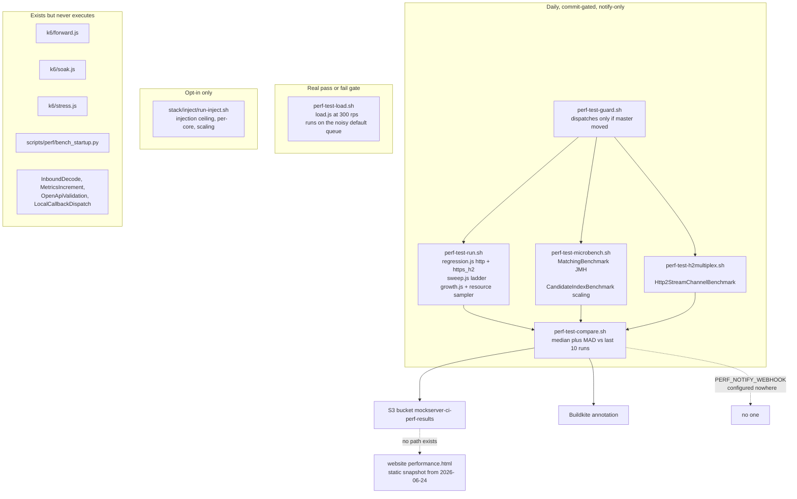

# Performance Programme

**Status: deferred plan.** Written 2026-09-16 against `master` at `b98d18f0c`. Nobody is
working on this. Per repo convention, the change that finishes this work **deletes this
file in the same commit** — it is written to be consumed and removed, not to persist. The
parts that deserve to outlive it are named in [What survives this
plan](#what-survives-this-plan) at the end; move those before deleting.

## Bottom line

MockServer's performance harness is better than its reputation and narrower than its
claims. It measures **one dimension well — response latency on the local-match hot path —
in one deployment profile**, a six-core pinned central server, and it measures that
continuously and honestly. Almost everything else is either measured once and published,
or never measured at all.

Three things a reader needs before anything else:

1. **Proxying is effectively unmeasured**, despite being half of what MockServer is. The
   daily run measures a forward *action* at 200 req/s. `HttpConnectHandler`, the SOCKS
   handlers, the relay handlers, transparent proxying, binary proxying and the HTTP/2
   relay have never been benchmarked at any rate by any harness.
2. **The laptop / per-test-method profile has no measurement at all** — no startup check in
   CI, no idle memory floor, no parallel-instance behaviour.
3. **Several checks that look like gates cannot fail for the reason they claim.** The one
   real pass/fail load gate runs at 300 req/s against a server measured at ~32,000 req/s.

The infrastructure needed to fix most of this already exists and is well built. This
programme is mostly about **pointing existing harnesses at unmeasured things** and
**closing the loop back to the website**, not new infrastructure.

## The mandate this serves

From the repo owner, verbatim:

> For the work on performance I want to ensure we're considering: scale; performance of
> request/response handling **and proxying**; CPU and memory growth and efficiency; and
> start up time; as well as how small the CPU and memory can be for low volume scenarios.
> I want MockServer to behave well when run **per test method on a user's laptop across
> lots of parallel tests**, as well as behave well when run as part of a **heavily loaded
> central deployment used by many pipelines or consumers**, and when run as part of a
> **performance test**.
>
> The plan should include consideration of how we can **maintain the goals, re-assess, and
> constantly improve** in the face of other changes flowing into the project.

That is **six dimensions** across **three deployment profiles**:

| | Dimension |
|---|---|
| D1 | Scale — throughput ceiling, connection ceiling, how capacity grows with cores and instances |
| D2 | Request/response handling — latency and cost of matching and responding |
| D3 | **Proxying** — forwarding, CONNECT tunnelling, SOCKS, relaying. A different cost profile from matching a local expectation |
| D4 | CPU and memory **growth** over time and **efficiency** under load |
| D5 | Startup time |
| D6 | The CPU and memory **floor** — how small MockServer can be for low-volume use |

| | Profile |
|---|---|
| **L** | Per test method on a laptop, many instances in parallel. Short-lived, near-idle, dozens at once |
| **C** | Heavily loaded central deployment serving many pipelines and consumers. Long-lived, saturated |
| **P** | Inside someone else's performance test — either serving load, or generating it via Load Scenarios |

## How to read the numbers in this document

**Every figure below is dated and version-stamped.** That is deliberate: the whole failure
mode this programme addresses is figures going stale silently. If you are reading this
months later, treat any undated number as untrustworthy and any dated number as history,
not as current state. Re-measure before you rely on it.

Analysis date: **2026-09-16**, `master` at `b98d18f0c`.

## The model: what the measurement system is today

The two dotted edges are the point of the diagram. A detected regression today reaches a
build annotation and stops. Measured numbers reach S3 and stop.

## Coverage map

Status vocabulary: **continuous** = runs on a schedule and is compared; **once** = measured
by hand at a point in time and never since; **dark** = the code exists but nothing runs it;
**none** = never measured.

| Dim | Profile | Status | What exists | Harness | Cadence | Threshold |
|---|---|---|---|---|---|---|
| D1 Scale | L | none | — | — | — | — |
| D1 | C | continuous but truncated | Knee curve, ladder capped at 16,000 rps in CI (`K6_SWEEP_RATES` default in `perf-test-run.sh` is `500,1000,2000,4000,8000,16000`) — below saturation, so the ceiling cannot move the number | `k6/sweep.js` | daily | **none** — `perf-test-compare.sh` deliberately does not read `.sweep` |
| D1 | C | once | Published knee: p50 0.19 ms to ~32,000 rps, saturation ~36,000 rps on 6 pinned cores. **Measured 2026-06-24, perf build #64, commit `15f4dcf50`, pre-8.0.0** | manual `sweep.js` run with a longer ladder | one-off | — |
| D1 | C | none | Connection-count ceiling; max concurrent connections; keep-alive pool limits | — | — | — |
| D1 | C | continuous | HTTP/2 streams per connection, N = 1, 10, 100 over one h2c connection | `Http2StreamChannelBenchmark` | daily | **none by design** — the script states variance on real agents is unknown so a threshold would be guessing. Correct judgement; do not override it blindly |
| D1 | P | opt-in | Injection ceiling, per-core sweep C = 1,2,4,8, aggregate scaling N = 1 to 6 | `stack/inject/run-inject.sh` with an Envoy sink | opt-in (`PERF_INJECT=true` or `[perf-inject]`) | none — recorded |
| D1 | all | none | req/s **per core for the serving path**. The per-core curve that exists measures the *injector*, not the server | — | — | — |
| D2 Req/resp | L | none | — | — | — | — |
| D2 | C | continuous | p50/p95/p99 and error rate for `match`, `forward`, `template`, `large` over HTTP and HTTPS+H2 at a fixed 200 rps | `k6/regression.js` | daily | median + MAD over last 10 runs, 10 percent floor. **This is the one genuinely good continuous signal** |
| D2 | C | continuous | p95 < 25 ms, p99 < 100 ms, errors < 1 percent at **300 rps** | `k6/load.js` via `perf-test-load.sh` | daily and manual | real gate, but see trustworthiness — roughly 100x headroom, and on the Spot `default` queue |
| D2 | C | continuous | Matcher time/op and `gc.alloc.rate.norm` bytes/op, 100 expectations, matcher types EXACT/REGEX/JSON_BODY, `logLevel=INFO` | `MatchingBenchmark` (JMH) | daily | median + MAD, 5 percent floor. **The strongest absolute backstop in the repo** |
| D2 | C | continuous | Matcher scan versus candidate-index scaling over n | `CandidateIndexBenchmark` via `run-scaling.sh` | daily | none — recorded |
| D2 | C | dark | Inbound decode allocation; metrics counter contention; OpenAPI validation cache; local-callback dispatch hop | four JMH benchmarks in `mockserver-benchmark` | never run | — |
| D2 | P | dark | Stress past the knee; sustained soak | `k6/stress.js`, `k6/soak.js` | **lint-only — `k6 inspect` parses them, nothing ever runs them** | — |
| **D3 Proxy** | all | continuous (partial) | Forward **action** latency at 200 rps to a dedicated upstream container | `k6/regression.js` op `forward` | daily | median + MAD |
| **D3** | C | **dark** | Forward connection-pool exhaustion guard at 1,500 rps — the documented guard for `mockserver.forwardConnectionPoolEnabled` | `k6/forward.js` | **never run, and not even in `perf-test-lint.sh`'s inspect list** | its thresholds never execute |
| **D3** | all | **none** | CONNECT tunnel; SOCKS4/5; transparent proxy; binary proxying; HTTP/2 relay; upstream-proxy chaining; proxy MITM TLS cost | — | — | — |
| D4 CPU | L | none | Idle-instance CPU floor | — | — | — |
| D4 | C | continuous | CPU percent start/end/peak/ratio from `docker stats` every 5 s during a 6-minute growth run | sampler in `perf-test-run.sh` | daily | ratio versus median + MAD, absolute floor 1.30 |
| D4 | P | opt-in | Injector CPU percent at ceiling; `rps_per_core` | inject harness | opt-in | none |
| D4 Memory | L | none | Per-instance RSS; idle heap floor; whether the documented `-Xmx512m` sidecar recipe actually works | — | — | the 512 MB recipe on the website is **prose only, never measured** |
| D4 | C | continuous (weak) | Heap used start/end/peak/ratio, GC seconds delta, peak thread count over 6 minutes at 800 rps | sampler plus `growth.js` | daily | heap ratio versus median + MAD, floor 1.30 |
| D4 | C | unit-only | Ring-buffer bound: `maxLogEntries`, `CircularConcurrentLinkedDeque` eviction, byte bound | JUnit (`MockServerEventLogEvictionTest`, `CircularConcurrentLinkedDequeTest`, `HeapAvailableSizingTest`) | every build | **the bound is enforced in unit tests; it has never been demonstrated in a live process under sustained load**, which is the claim the docs make |
| D4 | C | none | Long-running steady state over hours | `soak.js` exists, never runs | — | — |
| D4 | C | **none** | **Per-connection memory after the 8.0.0 HTTP/2 multiplex change** | — | — | see [the 8.0.0 warning](#finding-2-the-800-http2-multiplex-change-is-unverified) |
| D5 Startup | L | **once** | `docker run` to ready 855 ms then **566 ms** with AppCDS; fat jar 919 to 804 ms; first-request warmup 230 ms to 5–11 ms; JDK 25 Leyden `-aot` about 580 ms. **Measured 2026-07-02 on 7.3.1-SNAPSHOT, arm64 Mac, median of 5 cold launches** | `scripts/perf/bench_startup.py`, `gap_probe.py`, `warmup_probe.py` | **by hand, once. No CI step invokes these** | — |
| D5 | L | ineffective | Whether the AppCDS archive is actually mapped at runtime | `docker/Dockerfile` does `ls -l /mockserver.jsa` — existence only — and the entrypoint uses `-Xshare:auto` | image build | **cannot fail.** An unusable archive logs a warning and starts normally, silently giving back the measured 34 percent win |
| D5 | C, P | none | Startup under a cold registry or in a cluster | — | — | — |
| D6 Floor | L | none | Minimum viable heap; idle thread count. Note `nioEventLoopThreadCount` defaults to a **fixed 5** and `actionHandlerThreadCount` to `max(5, availableProcessors)` — designed and documented, never measured | — | — | — |
| D6 | L | none | N parallel instances on one host: port pressure, aggregate threads, aggregate RSS, GC interference | — | — | — |

## Trustworthiness of what exists

Distinguish three grades: **measured continuously** (runs and is compared), **measured once
and published** (a historical fact, not a current one), and **asserted in prose** (a claim
with no measurement behind it). Then ask the sharper question: *could this check pass while
the thing it measures had regressed?*

| Check | Last taken | Version | Would a regression be caught tomorrow? |
|---|---|---|---|
| `regression.js` latency percentiles | continuous (daily) | snapshot | **Yes, probably.** Median + MAD over 10 runs with a 10 percent floor is sound. Caveat: notify-only, and the notification path is broken (see below) |
| `regression.js` `throughput_rps` | continuous | snapshot | **No — structurally cannot fail.** `handleSummary` computes `count / durationSec` where `count` comes from a `constant-arrival-rate` executor pinned at 200 rps. The value is ~200 by construction; the `dir:"down"`, 10 percent rule can only fire below 180 rps. It looks like throughput-regression detection and is not |
| `MatchingBenchmark` micro-benchmark | continuous — **but silently dark 2026-09-12 to 2026-09-16** | snapshot | **Yes, now.** JMH is low-noise and `gc.alloc.rate.norm` is a real absolute backstop. Before `b98d18f0c` the only signal that it had stopped producing numbers was a red square nobody watched |
| `load.js` CI gate | continuous | snapshot | **Barely.** 300 rps against a server measured at ~32,000 rps; a p95 gate of 25 ms against a measured p50 of 0.19 ms. A 50x throughput regression passes. It also runs on `queue: default` (Spot, mixed instance types) rather than the pinned `perf` queue, so its noise floor is worse than its sensitivity |
| `sweep.js` knee curve | continuous, **truncated** | snapshot | **No.** The CI ladder stops at 16,000 rps where the server is comfortable — the 2026-06-24 data shows 16,000 offered giving 16,000.1 achieved at p50 0.159 ms. Saturation is never approached, and there is no baseline comparison at all |
| `sweep.js` — was the client the bottleneck? | — | — | **Unknown and unasserted.** `perf-test-run.sh` samples `docker stats` on the **server** only, and only during the growth phase. No k6-container CPU sample, no VU-starvation check from `dropped_iterations`, no connection-reuse assertion at the top of the ladder. **The published "about 36,000 req/s on six cores" is therefore not proven to be MockServer's ceiling rather than a six-core k6's.** The inject harness applies exactly this discipline — Envoy headroom, `reqs_per_connection >= REUSE_MIN`, `throttled ~ 0`. The serving sweep does not |
| `growth.js` heap ratio | continuous | snapshot | **Weakly.** It is last instantaneous `jvm_memory_used_bytes` divided by first instantaneous, sampled every 5 s — a point on the GC saw-tooth, not the live set (`JvmMetricsCollector` exposes no post-GC live-set metric). The container starts with **no `--memory`**, so on the 32 GB `c5.4xlarge` `MaxRAMPercentage=75` yields roughly a 24 GB heap where GC barely cycles. Six minutes is not a soak. It would catch an issue-#2329-class cliff; it would not catch a 100-bytes-per-request leak |
| `growth.js` latency slope | continuous | snapshot | **Yes for its stated purpose.** It is validated against issue #2329, and 800 rps for 6 minutes overfills the 100k ring roughly 2.9 times |
| Ring-buffer bound | every build, unit level | HEAD | The **bound** is enforced. Its behaviour **under sustained load in a live process** is asserted in prose, never demonstrated |
| `Http2StreamChannelBenchmark` | continuous | snapshot | **No, by explicit and correct design** — recorded to S3, no threshold |
| Inject ceiling / per-core / scaling | opt-in | snapshot | Not a regression signal; a research instrument. Its self-validation discipline is the best in the repo and should be generalised |
| Published website figures | **2026-06-24, build #64** | **pre-8.0.0** | **No.** See finding 1 |
| Published *methodology* claims | — | — | `performance.html` tells readers that **soak** and **stress** are part of how MockServer is tested. Neither script has ever been executed by CI. That is a customer-facing claim the pipeline does not support |
| Startup figures | **2026-07-02, once, by hand** | **7.3.1-SNAPSHOT** | **No.** No CI step runs `scripts/perf/`, and `-Xshare:auto` makes a broken AppCDS archive a warning rather than a failure |

### Finding 1: the published figures are a stale customer-facing claim

`jekyll-www.mock-server.com/mock_server/performance.html` asserts, in prose and in a
results table and in its FAQ schema, that a single six-core instance holds sub-millisecond
median latency to 32,000 req/s and saturates near 36,000 req/s.

Those numbers come from `jekyll-www.mock-server.com/images/perf-charts/data/perf-result.json`,
whose own metadata records:

- `timestamp_utc: 2026-06-24T23:12:13Z`
- `build_number: 64`
- `commit: 15f4dcf509101bf3dd4440357db52c7902d88f34`
- **pre-8.0.0** — before the HTTP/2 multiplex migration

Two further caveats the page does not state:

- The run used **ZGC with an 8 GB heap**, which is not the default configuration.
- Every CI perf run, including the one that produced these figures, sets
  `MOCKSERVER_LOG_LEVEL=ERROR`. **The shipped default is `INFO`**
  (`ConfigurationProperties.java:52`, `DEFAULT_LOG_LEVEL = "INFO"`). The site's own tuning
  guidance says INFO-level per-matcher diagnostics are "the single largest matching-path
  allocation" when many expectations are registered. So the headline figures are not
  default-configuration figures, and the page does not say so. The page's phrase "full
  request logging enabled (the default)" is defensible about *request recording* into the
  event log, which is on — but it reads as though log level is default, and it is not.

**Nothing refreshes the page.** `perf-test-compare.sh` persists each run to
`s3://mockserver-ci-perf-results/runs/<branch>/...` and stops. There is no code path
anywhere that regenerates the committed chart data or the site tables. The page will keep
drifting for as long as nobody notices. What would keep it honest is in
[item 14](#14-close-the-loop-from-s3-back-to-the-website).

### Finding 2: the 8.0.0 HTTP/2 multiplex change is unverified

`changelog.md` for 8.0.0 records, about issue #2669:

> Users driving very large numbers of concurrent streams over a single connection may notice
> different memory and throughput characteristics, since each stream now has its own
> lightweight channel.

That is an explicit, self-declared change to per-connection memory and throughput, in the
exact area that matters most to the **central deployment profile** — many consumers, many
concurrent streams, long-lived connections. **Nothing has been re-measured since.** The
`Http2StreamChannelBenchmark` added alongside it sweeps streams-per-connection but has no
memory axis and no threshold, and the published figures predate the change entirely.

This is the single most concrete reason to re-baseline before anything else.

## The programme

Ordered by value divided by cost. Each item is independently actionable.

### Tier 1 — cheap, high value, days not weeks

#### 1. Make the daily result reach a human

*Serves: all dimensions, all profiles. Cost: hours. Where: daily pipeline.*

`perf-test-compare.sh` annotates the build and then calls an **optional
`PERF_NOTIFY_WEBHOOK` that is configured nowhere** — not in
`terraform/buildkite-agents/`, not in `terraform/buildkite-pipelines/`, nowhere. A detected
regression today notifies nobody.

- Provision the webhook URL through the existing AWS Secrets Manager pattern used for the
  Buildkite API tokens (`terraform/buildkite-agents/build-secrets.tf`) and expose it to the
  `perf` queue.
- Make its absence **loud**: when `PERF_NOTIFY_WEBHOOK` is unset and a regression is
  detected, the annotation must say so explicitly — "this regression notified nobody" —
  rather than silently skipping the `curl`.
- **Signal lands:** a maintainer channel. **Who acts:** the maintainer on rota reads it the
  same day and either bisects, or files a follow-up, or records it as accepted in the
  budgets file (see Sustaining the goals).

Until this exists, every other item is optional reading.

#### 2. Extend the CI sweep past the knee, and prove the client is not the bottleneck

*Serves: D1, D2 / profile C. Cost: 1–2 days. Where: daily pipeline. **Highest value single change.***

- Raise `K6_SWEEP_RATES` in `perf-test-run.sh` to the published ladder
  (`...16000,32000,48000,64000`) so saturation is actually reached. Adds roughly 4 minutes
  to a 45-minute step.
- Per rung, additionally record: `docker stats` CPU for the **k6** container, and k6's
  `dropped_iterations`.
- Adopt the inject harness's rule: a rung where the client is above about 85 percent of its
  pin, or `dropped_iterations` is non-zero, is **flagged and excluded** from the derived
  ceiling rather than reported. A ceiling is only a ceiling if the client had headroom.
- Derive `saturation_rps` = highest rung where `achieved >= 0.95 * offered` **and** the
  validity checks pass. Add it to `perf-test-compare.sh`'s `metrics` function with
  `dir:"down"` and a 15 percent floor.

This converts the headline customer-facing number from unverified prose into a tracked
metric.

#### 3. Wire up `forward.js`, or delete it

*Serves: D3 / profiles C, P. Cost: hours.*

`k6/forward.js` is documented in `mockserver-performance-test/k6/README.md` as the
regression guard for `mockserver.forwardConnectionPoolEnabled`, complete with instructions
for demonstrating it failing. It has **never executed**, and it is **missing from
`perf-test-lint.sh`'s inspect list** (which covers `smoke, load, stress, soak, regression,
growth, sweep` — not `forward`). We ship a guard that guards nothing.

- Add `k6/forward.js` to the lint list — a one-word fix.
- Add a step to `perf-test-run.sh` running it against the dedicated upstream container that
  is already started for `regression.js`.
- Its existing `http_req_failed` threshold is a genuinely discriminating gate: with pooling
  off, the host exhausts ephemeral ports and the error rate spikes.

#### 4. Gate AppCDS being *used*, not merely present

*Serves: D5 / profile L. Cost: hours. Where: container-tests pipeline, merge-blocking.*

The image entrypoint uses `-XX:SharedArchiveFile=/mockserver.jsa` with the JVM default
`-Xshare:auto`, so a missing, corrupt, bind-mounted-away or arch-mismatched archive logs a
warning and starts normally — silently giving back the measured 34 percent startup win. The
build only checks the file exists (`ls -l /mockserver.jsa`).

- Add a container test following the `container_integration_tests/docker_compose_jvm_options`
  pattern that runs the image with `-Xlog:cds` (or probes with `-Xshare:on`) and asserts the
  archive maps.
- This is a **boolean**, not a wall-clock measurement, so it cannot be flaky. It can and
  should block a merge.

#### 5. Fix or remove `throughput_rps`

*Serves: D2 / profile C. Cost: hours.*

It is arithmetically unfalsifiable (see trustworthiness table). Either drop it from the
compared metrics or replace it with `saturation_rps` from item 2. A permanently-green row in
the annotation table trains readers to trust the table.

#### 6. Measure growth against a realistic heap, and measure the live set

*Serves: D4 / profile C. Cost: 1 day.*

- Start the SUT in `perf-test-run.sh` with an explicit `--memory=2g`, matching the
  documented central-deployment guidance, so GC actually cycles and the live set is
  observable. Today it runs unbounded on a 32 GB box.
- Change the heap metric from instantaneous end-over-start to **the minimum
  `jvm_memory_used_bytes` over the last 60 s divided by the minimum over the first 60 s**.
  The saw-tooth floor approximates the live set with no new metric, no forced GC, and far
  less noise than a point sample.
- Keep the 1.30 absolute floor.

#### 7. Add validity blocks to every measurement

*Serves: all. Cost: 1–2 days.*

Generalise the inject harness's discipline: every result JSON gains a `validity` object
recording the assertions that were checked and whether they held (client headroom, no
dropped iterations, connections reused, no throttling, non-null metrics within plausible
absolute ranges). `perf-test-compare.sh` **refuses to baseline** a run whose `validity` block
is absent or false, and annotates that as an error rather than silently comparing garbage.

### Tier 2 — moderate cost, closes named mandate gaps

#### 8. Laptop profile: startup and footprint

*Serves: D5, D6, D4-floor / profile L. Cost: 2–3 days, mostly plumbing. Where: daily, on the pinned `perf` queue.*

- **What:** `docker run` to first successful `/mockserver/status`, reported as **median and
  p90 of 9 cold launches**; plus RSS and thread count of a fully idle instance 30 s after
  ready, at `--memory=256m`, `512m` and `1g`. The 512 MB figure directly tests the recipe
  the website currently recommends on no evidence.
- **How:** promote `scripts/perf/bench_startup.py` into a CI step — it already does exactly
  this and already emits a median/min/max table plus a per-run CSV.
- **Anti-flake:** pinned on-demand box only, never Spot. Discard the first launch (cold page
  cache), as the harness README already advises. Compare median-of-9 through the existing
  median + MAD machinery. Never gate on a single launch.
- **Threshold:** notify-only for the first 10 runs to establish the MAD, then `dir:"up"`
  with a 25 percent floor.

#### 9. Proxy-path benchmarks

*Serves: D3 / all profiles. Cost: 9a about 2 days; 9b and 9c about a week. **The largest genuinely uncovered area the owner named explicitly.***

- **9a (k6, cheap, do first):** a `proxy.js` scenario driving MockServer **in proxy mode**
  rather than as a mock — absolute-URI HTTP forwarding, and a `CONNECT` tunnel carrying
  HTTPS, both to the upstream container that already exists in the run. Reuse
  `regression.js`'s shape (constant arrival rate, `op:` tags, the same `handleSummary` JSON
  contract) so `perf-test-compare.sh` picks the behaviours up with **zero** changes to the
  compare script. Threshold: median + MAD, same as every other behaviour. Daily.
- **9b:** a SOCKS5 rung. k6 supports an HTTP proxy but not SOCKS, so this needs a small
  driver or a SOCKS-aware sidecar. If that proves awkward, downgrade to a JMH benchmark of
  `Socks5ProxyHandler` plus `SocksConnectHandler` handshake cost.
- **9c (JMH):** a relay benchmark over `UpstreamProxyRelayHandler` and
  `DownstreamProxyRelayHandler` measuring bytes/s and allocation per relayed KB — the relay
  is byte-copy dominated and nothing like matching. Daily, with the same absolute
  `alloc_bytes_per_op` backstop as `MatchingBenchmark`.

Note for whoever picks this up: **`ForwardPathBenchmark` is misleadingly named.** It
benchmarks the *load generator's* outbound render path
(`LoadScenarioOrchestrator.RunningScenario.render`), not proxying. Do not assume proxying is
covered because that file exists.

#### 10. Turn on the soak — weekly, not daily

*Serves: D4 / profile C. Cost: 1–2 days to wire; the run itself costs CI money, hence weekly.*

`k6/soak.js` already exists with p99-drift and error-rate thresholds and sensible defaults
(`K6_SOAK_RATE=200`, `K6_SOAK_DURATION=30m`). Add a second
`buildkite_pipeline_schedule` in `terraform/buildkite-pipelines/pipelines.tf` alongside
`perf_regression_daily`, running it on the `perf` queue weekly at 2–4 hours with a bounded
`--memory`, sampling the same CSV the growth phase uses.

- **Metrics:** live-set floor slope over the full run (item 6's method), and GC seconds per
  million requests.
- **Threshold:** notify-only initially; promote to an absolute floor once about 8 weeks of
  variance are known.
- This is what finally **demonstrates** the ring-buffer bound under load rather than
  asserting it.

#### 11. Re-measure the 8.0.0 HTTP/2 multiplex cost, with a memory axis

*Serves: D1, D4 / profile C. Cost: 2–3 days. Where: daily (the step already runs).*

`Http2StreamChannelBenchmark` already sweeps N = 1, 10, 100 streams over one connection. Add
a **connections** axis (N connections by M streams) and record heap delta per established
connection — precisely what the changelog warned had changed. Keep it notify-only until
variance is known; that existing judgement in the script is correct.

### Tier 3 — expensive, research-shaped. Mark clearly and schedule deliberately.

#### 12. N parallel instances on one host — **research**

*Serves: all six dimensions / profile L. Cost: 1–2 weeks. Where: occasional deep run, opt-in like `PERF_INJECT`.*

The real question behind "per test method on a user's laptop across lots of parallel tests".
Launch N in {1, 4, 8, 16, 32} instances on one box, each with a small `--memory`, and
measure aggregate RSS, aggregate thread count, ephemeral-port consumption, per-instance
startup degradation, and per-instance p95 under light load.

Two facts make this likely to find something: `nioEventLoopThreadCount` is a **fixed 5**,
not CPU-derived, and `actionHandlerThreadCount` is `max(5, availableProcessors)` — so every
instance sizes its action pool off the *whole machine*, and total threads grow linearly with
N regardless of how idle each instance is.

Reuse the `stack/inject` compose-profile pattern (`--profile n1/n2/n4/n6`), which already
solves multi-instance orchestration and per-instance attribution via the `run_id` label.
Expected output: a published sizing table, and quite possibly a recommendation to make those
defaults container-aware.

#### 13. req/s per core for the serving path — **research**

*Serves: D1, D4 / profile C. Cost: about a week plus a roughly 60-minute CI run. Opt-in, not daily.*

Mirror `run-inject.sh`'s `percore` phase for serving: pin the SUT to C in {1, 2, 4, 8, 16}
cores, run the extended ladder at each C, record `saturation_rps` and `rps_per_core`. The
Envoy-headroom and reuse-assertion discipline transfers directly. Publish as a sizing curve.

#### 14. Close the loop from S3 back to the website

*Serves: honesty of the customer-facing claim. Cost: 2–3 days. Where: tail of the daily run, non-gating.*

Add a final, notify-only, **non-gating** step that, on `master` only and only when the run's
`validity` block passed, regenerates
`jekyll-www.mock-server.com/images/perf-charts/data/*.json` and the PNGs via the existing
`render_perf_charts.py`, and **opens a pull request** — deliberately not a direct commit,
because the figures are a customer-facing claim and a human should look at a 20 percent
swing before it ships.

- **Trigger rule:** open the PR only when the committed figure is more than 30 days old
  **or** has moved by more than 10 percent, so it does not open a PR every day.
- The `lastmod` on `performance.html` then tracks reality, and a stale page becomes an open
  PR rather than invisible rot.
- The same PR must carry the **provenance line**: version, date, core count, heap, GC, and
  **log level**.

#### 15. Connection-scaling ceiling — **research, lowest priority**

*Serves: D1 / profile C.*

Maximum concurrent established connections before latency degrades, separately for HTTP/1.1
keep-alive, HTTP/2 and TLS (TLS session state is the interesting axis). k6 is not well
suited to holding tens of thousands of idle connections; this likely needs a purpose-built
driver. Schedule after items 1–14.

## Sustaining the goals

This half determines whether the other half still means anything in six months. Measurement
that is not maintained becomes measurement theatre. Every mechanism below states **what
fires, when, and who sees it.**

### Budgets that ratchet

The repo's established preference is **never-regress on both small and large cases, with
thresholds derived empirically rather than picked.** Apply it here.

**Where budgets live.** Today all absolute floors are hardcoded inside
`perf-test-compare.sh`'s jq program (`min_pct: 0.10`, `floor: 1.30`, and so on). Move them
to a committed, reviewed `perf-budgets.json` at the repo root or under
`mockserver-performance-test/`. This matters more than it looks:

- A **committed** budget file cannot be quietly loosened — loosening it is a diff in a pull
  request that a human reviews, with a required justification in the commit message.
- The **rolling S3 median + MAD** then does only what it is good at: absorbing run-to-run
  noise. It can no longer normalise a slow real regression away over ten runs, because the
  committed absolute floor does not move unless someone changes it.
- The compare annotation names the budget file's last-changed commit, so a silent loosening
  is visible in the output, not just in git history.

**How a budget is set initially.** Never picked. Run the measurement notify-only for at
least 10 successful runs (the existing `PERF_MIN_BASELINE` of 5 is the current floor; use 10
for anything new), take the median and MAD, and set the budget at
`median + 3 * 1.4826 * MAD`, floored at a minimum sensible percentage move so a
freakishly quiet window does not produce an impossibly tight budget. Record the window in
the budget file so a future reader knows what it was derived from.

**How a budget tightens — the ratchet.** A budget that only ever loosens is not a control.
When an improvement lands, the win must be locked in or it will be quietly given back.

- **What fires:** after each successful daily run, if the head value has beaten the current
  budget by more than 20 percent for **5 consecutive runs**, the compare step opens a pull
  request tightening that budget to the new `median + 3 * 1.4826 * MAD`.
- **When:** daily, but at most one ratchet PR per metric per fortnight, so it does not spam.
- **Who sees it:** the maintainer reviewing the PR. Merging it is the act of accepting the
  improvement as the new normal; declining it with a reason is also a legitimate answer
  (for instance, if the improvement is known to be workload-specific).
- Ratcheting is **automated as a proposal and manual as a decision.** Never auto-merge a
  budget change in either direction.

**Proposed budget set** — one per dimension per profile, with the metric that carries it:

| Dim | Profile | Budget metric | Initial basis |
|---|---|---|---|
| D1 | C | `saturation_rps` (item 2), validity-gated | derive from 10 runs after item 2 lands |
| D2 | C | `match_http` p95, p99; `MatchingBenchmark` `time_per_op` | already collected; migrate existing floors |
| D2 | C, all | `MatchingBenchmark` `alloc_bytes_per_op` — **the deterministic one** | already collected; tightest budget in the set |
| D3 | C | proxy `op:connect` and `op:forward` p95, p99 (item 9a) | derive after item 9a |
| D3 | C | `forward.js` error rate (item 3) | already specified in the script |
| D4 growth | C | live-set floor slope over soak (items 6, 10) | derive after 8 weekly runs |
| D4 efficiency | C | CPU percent at a fixed reference rate | already collected |
| D5 | L | `docker run` to ready, median of 9 (item 8) | derive from 10 runs |
| D6 | L | idle RSS and thread count at `--memory=512m` (item 8) | derive from 10 runs |
| D6 | L | AppCDS mapped — boolean (item 4) | no derivation needed; it is true or false |

**Small and large cases both.** Follow `CandidateIndexBenchmark`'s example, which sweeps
n in {1, 2, 5} *and* {100, 1000, 5000} precisely so a large-case optimisation cannot
regress the small case unnoticed. Every new budget should have a small-input and a
large-input arm where the dimension admits one: small and large bodies, few and many
expectations, one and many connections, one and many parallel instances.

### Feedback latency: what should block a merge

Today: **daily, notify-only, never a merge gate.** Honestly assessed, daily is too slow for
some of this and exactly right for the rest. A regression found a day later must be bisected
against everything that merged in between, and that is precisely how performance work gets
abandoned.

The discriminator is **determinism, not importance**:

| Signal | Noise | Recommended cadence |
|---|---|---|
| `gc.alloc.rate.norm` (bytes/op) from JMH | **Essentially deterministic** — an allocation count, hardware-independent, unaffected by a noisy neighbour | **Per merge to master**, on any queue, notifying immediately. This is the one signal cheap and stable enough to attribute to a single commit |
| JMH `time_per_op` | low but hardware-sensitive | Daily, pinned queue |
| Class-load count to readiness, thread count, connection count | deterministic counters | Per merge, cheap |
| AppCDS mapped (boolean) | none | **Merge-blocking** on the container-tests pipeline |
| k6 latency percentiles | wall-clock, moderate | Daily, pinned queue |
| k6 saturation / knee | wall-clock, high | Daily, pinned queue, validity-gated |
| Soak live-set slope | long wall-clock | Weekly |
| Per-core, N-instance, connection ceiling | very high | Occasional deep run |

**Recommendation on merge gating — deliberately narrow:**

- **Nothing wall-clock blocks a pull request.** The `perf` queue is max-one-instance and
  scale-to-zero by design (`terraform/buildkite-agents/variables.tf`); making it a PR gate
  would serialise every merge behind a 45-minute run, and a wall-clock PR gate on shared
  agents is how a flaky gate gets born, ignored, and then deleted.
- **Two things do block.** The AppCDS-mapped boolean (item 4), because it is deterministic
  and catches a silent 34 percent loss. And the **allocation-per-op budget**, run per merge
  to master and notifying on the commit that moved it — blocking is arguable here, but even
  as notify-only it collapses the bisect surface from a day of merges to a single commit,
  which is the real win.
- **The release gate is where teeth belong.** Extend `release-preflight-pipeline.yml` to
  fail when (a) the newest successful perf run in S3 is older than the release candidate's
  merge base, or (b) any budget is currently in a flagged-regression state that has not been
  explicitly accepted in `perf-budgets.json`. That costs one S3 query and one JSON read, and
  it is where "we shipped a 2x slowdown" actually gets caught. This is the single highest-
  leverage gate in the whole programme.

### Keeping the system itself alive

**Treat this as its own risk, not a footnote.** The evidence that controls decay silently in
this repo is direct and recent:

- The JMH backstop produced **no signal from 2026-09-12 to 2026-09-16** and nobody noticed;
  the only symptom was a red square on a notify-only build. Fixed in `b98d18f0c`, which
  added a failure annotation — the right instinct, applied to one step.
- `PERF_NOTIFY_WEBHOOK` is referenced by `perf-test-compare.sh` and **configured nowhere**,
  so the notification path has never fired.
- A CI cache in this repo reported success while storing nothing (recorded in `1490c5ad4`).

The general failure mode is that **a control that stops working goes quiet rather than
loud**. Design against it explicitly. Green is not the same as measuring.

Four mechanisms:

1. **Baseline freshness assertion, owned by a different pipeline.**
   *What fires:* a cheap daily check that queries
   `s3://mockserver-ci-perf-results/runs/master/` and fails if the newest object is older
   than 7 days. *When:* daily, on the `trigger` queue (seconds, pennies). *Where:* put it in
   **`pipeline-infra.yml`, not the perf pipeline** — a check that lives inside the system it
   monitors dies with it. *Who sees it:* the same maintainer channel as item 1.
2. **Plausibility assertions, not exit codes.** Every producing step must assert its output
   is a *plausible non-empty result*, not merely that the process exited zero: all expected
   keys present, non-null, within sane absolute ranges (p50 between 0.01 ms and 100 ms;
   achieved throughput within 50 to 200 percent of offered; `alloc_bytes_per_op` strictly
   greater than zero; sample log non-empty). `perf-test-run.sh` already warns when the
   resource sample log is empty — promote that from a warning to a hard failure, and apply
   the pattern everywhere.
3. **Validate the measurement before trusting it** (item 7). The inject harness already does
   this properly — it excludes a ceiling point that failed the connection-reuse assertion
   rather than reporting a churn-corrupted number. Generalise that to every harness:
   client headroom, no dropped iterations, connections reused, no throttling. A number that
   has not been validated is not evidence.
4. **Every step annotates its own failure.** `b98d18f0c` gave `perf-test-microbench.sh` an
   `annotate_on_failure` trap because the compare step — which owns annotations and the
   webhook — runs only *after* it, behind a `wait: ~`, so a dead producer silently produces
   nothing. Copy that trap into `perf-test-run.sh`, `perf-test-h2multiplex.sh` and
   `perf-test-inject.sh`. Anything that breaks must make noise.

A useful acceptance test for this whole section: **deliberately break one producer and
confirm the system says so within 24 hours.** Do that once when the programme lands, and
again annually. If the answer is "nothing happened", the controls are theatre.

### Re-baselining and drift

Baselines legitimately move: a deliberate trade-off, a JDK or dependency bump, new CI
hardware. The risk is that an intentional move becomes indistinguishable from a regression
somebody rubber-stamped.

- **The rolling S3 median handles noise only.** It has a 10-run window, so a slow drift of 3
  percent per run is absorbed invisibly. That is why absolute budgets must live in the
  committed `perf-budgets.json` and not in the rolling window.
- **An intentional move is a reviewed commit.** Changing a budget requires editing
  `perf-budgets.json` with a commit message stating: the date, the metric, the old and new
  values, the cause (for example "Temurin 25.0.2 bump, matcher `time_per_op` +6 percent,
  accepted"), and who approved. No other mechanism may change a budget.
- **Hardware changes invalidate history, loudly.** `perf-test-run.sh` already records
  `agent.instance_type` and the cpusets in every result. Make `perf-test-compare.sh`
  **refuse to compare** across a differing `instance_type` and annotate "baseline invalidated
  by hardware change — re-derive" rather than silently comparing incomparable runs. Changing
  `perf_instance_types` in `terraform/buildkite-agents/variables.tf` should therefore be a
  deliberate act with a known cost.
- **Accepted regressions are recorded, not forgotten.** An accepted move goes into
  `perf-budgets.json` with its reason. A flagged regression that is neither fixed nor
  recorded stays flagged, and the release-preflight gate keeps failing until somebody
  decides. That is the mechanism that stops rubber-stamping: the only way to silence a
  regression is to write down why.

### Handling noise without disabling the control

This repo has already abandoned a change over wall-clock flakiness on CI. A flaky gate gets
ignored, then removed, which is strictly worse than not having the gate. **State these as
standing rules for anything added under this programme:**

1. **Wall-clock measurements run only on the pinned `perf` queue** — single fixed instance
   type, 100 percent on-demand, max one instance, scale to zero. Never on Spot, never on the
   mixed-instance `default` queue. *(Note that `perf-test-load.sh` currently violates this —
   it runs on `queue: default`. Either move it to `perf` or accept it as informational.)*
2. **Never gate on a single sample.** Median of at least 5 for load-shaped measurements, at
   least 9 for startup. Report the dispersion alongside the median so a widening spread is
   itself visible.
3. **Prefer within-run comparison where the question allows it.** `CandidateIndexBenchmark`
   comparing SCAN and INDEX arms in the same JVM on the same run is the gold standard: it
   cancels almost all environmental noise. Any A-versus-B question should be posed this way.
4. **Prefer deterministic counters over wall-clock** wherever the question can be reframed:
   allocation bytes per op, GC count, class-load count, thread count, connection count,
   requests per connection. These can gate on noisy hardware; wall-clock cannot.
5. **Anything that cannot meet rules 1 to 4 is informational, labelled as such, and never
   gating.** `Http2StreamChannelBenchmark` already does this correctly and explicitly — copy
   its reasoning, including its written justification for *not* setting a threshold yet.
6. **Validity gating beats threshold loosening.** When a measurement is noisy because the
   rig was compromised (client saturated, iterations dropped, connections churning), exclude
   the point. Do not widen the threshold until noise fits inside it — that is how a gate
   becomes unable to fail.

### Continuous improvement, not only defence

Catching regressions keeps performance from getting worse. The owner asked for **constantly
improve**, which needs a separate mechanism that surfaces opportunities.

- **Quarterly deep review.** A JFR or async-profiler wall-clock **and** allocation profile of
  the four measured behaviours plus at least one proxy path, diffed against the previous
  quarter's profile. Output: the top ten allocation sites and top ten CPU frames, committed
  to a dated reference page so the trend is visible. *What fires:* a calendar item, not CI.
  *Who sees it:* whoever does the quarter's performance work. Also run it **before every
  major release**, which is when a re-baseline is needed anyway.
- **Run the dark benchmarks in the deep review.** `InboundDecodeBenchmark`,
  `MetricsIncrementBenchmark`, `OpenApiValidationBenchmark` and
  `LocalCallbackDispatchBenchmark` all exist and none of them ever run. They are a
  ready-made "where does the time and allocation go" ledger. Running them quarterly costs
  almost nothing and keeps them from bit-rotting into the same silent death the
  `MatchingBenchmark` had.
- **The ratchet is itself an improvement mechanism.** Every tightening PR is a recorded win.
  Reviewing the ratchet history at the quarterly review answers "did we actually get faster
  this quarter" with evidence rather than impression.
- **Re-read this coverage map annually.** New features add new hot paths — HTTP/3, LLM
  mocking, WASM rules, async messaging all exist in the tree and none is in the coverage map
  above. The map should be a living artefact (see What survives this plan), revisited when a
  major feature lands and at each major release.

## Open questions and risks

1. **Is the published 36,000 req/s knee real, or is it k6's ceiling?** Unresolved. Nothing in
   the sweep proves the client had headroom. Item 2 answers it; until then, treat the
   published saturation figure as unverified.
2. **What did 8.0.0's HTTP/2 multiplex change actually cost per connection?** Unknown, and
   self-declared as changed. Item 11 answers it. Highest-value unknown for the central
   profile.
3. **Does the documented `-Xmx512m` sidecar configuration actually work under load?** Never
   tested. Item 8 answers it. If it does not, the website is recommending a configuration
   that OOMs.
4. **Should the perf figures be measured at `logLevel=INFO` (the shipped default) or `ERROR`
   (what CI uses)?** Unresolved and consequential — the site's own guidance says the
   difference is the largest matching-path allocation. Two defensible answers: measure both
   and publish both, or measure the default and publish that. Either is better than the
   current silent mismatch. Decide before item 14 refreshes the site.
5. **Cost.** The `perf` queue is on-demand `c5.4xlarge`, max one instance, scale to zero.
   Adding a weekly multi-hour soak, a longer daily sweep and a startup matrix all consume
   that single serialised box. Estimate the monthly cost before landing items 2, 8 and 10
   together; they may need to share a run rather than each adding a step.
6. **Per-merge JMH conflicts with scale-to-zero.** Running the allocation backstop per merge
   to master means either accepting it on the `default` queue (fine for allocation counts,
   which are hardware-independent — this is the recommended answer) or contending for the
   single perf box. Confirm the allocation figures really are agent-independent before
   relying on it; that is one cheap experiment.
7. **Flakiness risk remains real.** Items 2, 8, 10, 12 and 13 are all wall-clock. The
   standing rules above are the mitigation, but the honest position is that any one of them
   could still produce an unstable signal on first contact. **Land each one notify-only
   first, observe 10 runs, and only then attach a budget.** Never ship a new wall-clock gate
   with a threshold on day one.
8. **This plan does not cover HTTP/3, LLM mocking, async messaging, WASM rules, or the
   dashboard UI.** They are out of the mandate's framing as written, but they are hot paths
   that exist. Flag at the first annual re-read.

## What to publish versus what to gate internally

**Published and kept current** on `performance.html`, each figure carrying **version, date,
core count, heap, GC and log level**:

- The throughput-latency knee curve, with `saturation_rps` and the client-headroom evidence
  alongside it.
- Per-behaviour p50/p95/p99 for match, forward, template, large, over HTTP and HTTP/2.
- Matcher scaling, scan versus index — already good, keep it.
- **New:** proxy-path latency (forward and CONNECT tunnel); startup medians per artifact
  (Docker, fat jar, `-aot`); and a laptop sizing table (heap floor, idle RSS, thread count,
  safe parallel instance count per GB).

**Correct one published claim while you are there.** The "How MockServer is performance
tested" section lists **soak** and **stress** as part of the ladder. Neither has ever
executed. Either wire them up (item 10 does soak) or remove the claim. Do not leave both.

**Gated internally, never published:** JMH absolute backstops (`time_per_op`,
`alloc_bytes_per_op`), the growth and soak live-set slope, the forward-pool error-rate
guard, the AppCDS-mapped boolean, the startup median-of-9, and the baseline freshness
assertion. These are regression detectors, tuned for sensitivity rather than defensibility,
and publishing them would invite arguments about numbers that exist only to move.

## What survives this plan

This file gets deleted by the change that completes the work. Three pieces of analysis
deserve to persist; move them before deleting, or they vanish with it.

1. **A corrected account of what each harness actually measures, and which ones run.**
   *Destination: a new `docs/code/performance-measurement.md`*, sitting alongside
   `docs/code/memory-management.md`, `docs/code/startup-performance.md` and
   `docs/code/metrics.md`. Must state plainly: which k6 scripts CI executes and which it only
   lints; that `ForwardPathBenchmark` measures the load generator's render path and **not**
   proxying; which JMH benchmarks run daily and which are dark; and that the inject harness
   answers "how much load can MockServer generate", not "how fast does it serve".
2. **The dating and provenance rule.** *Destination: `docs/code/startup-performance.md`*
   already half-states this ("absolute numbers are machine-specific; only compare runs from
   the same machine and session"). Extend it into a general rule the whole `docs/` tree
   follows: every performance figure carries its date, version, hardware and configuration,
   or it is not a figure.
3. **The corrections to the harness READMEs.** *Destinations:
   `mockserver-performance-test/README.md` and `mockserver-performance-test/k6/README.md`.*
   The k6 README currently describes `forward.js` as a regression guard in the present tense;
   it does not run and is not linted. Either fix the code (item 3) or fix the sentence — but
   the README must not keep claiming a guard the pipeline does not execute.

Everything else here — the coverage map, the programme, the budgets — is scaffolding for the
work and goes when the work is done.
