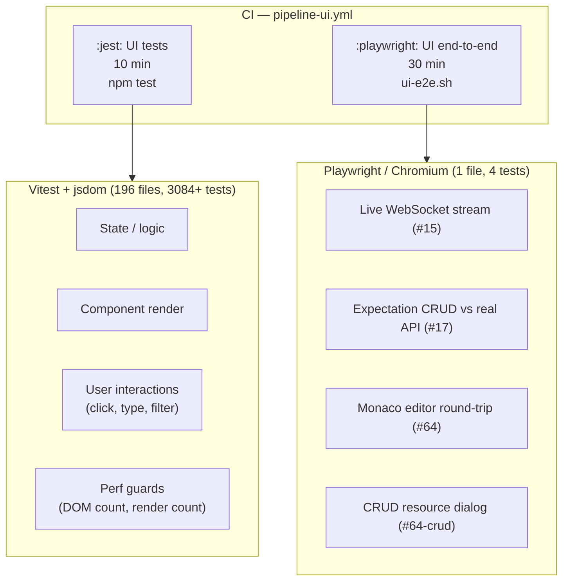
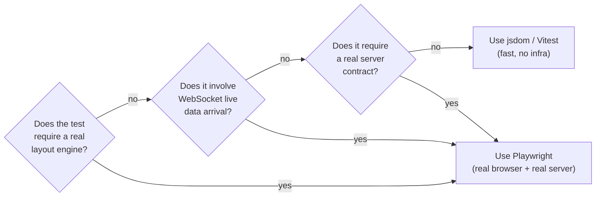

# UI Testing Strategy

## TL;DR

The motivating bug — a panel row opened by the user closing itself the moment
new data arrived — exposed a structural gap: 3,084 passing jsdom tests could
not reproduce it because jsdom has no layout engine. Scroll position, viewport
height, and virtualisation mount/unmount are all invisible there. A single
Playwright test in a real browser would have caught it immediately. This plan
adds a targeted real-browser live-update suite to the existing Playwright
harness (already wired to CI), documents the layer boundary so future
contributors know when jsdom is the wrong tool, and fixes a class of test that
asserts a true invariant at the wrong layer.

The existing jsdom suite is not rewritten. The three concrete additions are:
1. A Playwright test that asserts the opened row survives data arrival.
2. A written rule about user-visible versus implementation invariants in tests.
3. A jsdom-upgrade protocol to reduce the recurring environment fragility.

---

## Current State



The Playwright harness (`mockserver-ui/e2e/`) is already production-grade:
`playwright.config.ts` boots the real runnable JAR via `start-mockserver.mjs`,
runs headless Chromium on the served dashboard against real REST and the real
WebSocket, and is a hard CI gate (fail-closed: non-zero exit on any failure or
zero tests found).

---

## The Blind Spot — What Each Layer Cannot See

| What the test exercises | jsdom | Playwright |
|-------------------------|-------|------------|
| React state and derived values | yes | yes |
| User interactions (click, type, keyboard) | yes | yes |
| API calls and error handling | yes (mocked fetch) | yes (real server) |
| CSS-computed values, `getComputedStyle` | partial (no calc(), no CSS vars with layout) | yes |
| `scrollTop`, `scrollHeight`, `offsetHeight` | no (always 0) | yes |
| Virtualisation mount/unmount | no (viewport = 0, every row mounts) | yes |
| A row scrolled off-screen being unmounted | no | yes |
| Live WebSocket arrival triggering a side-effect | no (WebSocket is mocked) | yes |
| Monaco editor, workers, web APIs | no (mocked to textarea) | yes |
| Focus restoration after DOM removal | partial (shim required) | yes |

**The Panel.tsx bug specifically required all three of the bottom rows
simultaneously**: scroll-driven unmount, AND live-data arrival changing `count`,
AND a real viewport so virtualisation actually fires. jsdom fails all three.

### Why the passing selection test was the most dangerous failure

A test asserting "the expansion state survives a live update" passed while the
bug existed — because state genuinely was preserved. The row was unmounted by
virtualisation after the auto-scroll moved the viewport, not because state was
lost. The test asserted a true implementation invariant at the wrong layer. The
user-visible invariant ("the row I opened is still on screen and readable") is
categorically different from "the expansion state boolean remains true in the
store". This distinction is the core of what needs to change.

---

## Where to Use Each Layer



The default is jsdom. The trigger to use Playwright is any one of: real layout
(scroll, viewport, virtualisation), live-update side-effects, or real server
contracts. A test that says "run everything in Playwright" adds 20+ minutes to
CI per test file; the discipline is to reach for it only when jsdom is
structurally incapable.

---

## Rationale and Trade-offs

**Why not add a layout stub to jsdom?** The `perf-domWeight.test.tsx` suite
already stubs `offsetHeight` to 600px to exercise the virtualised code path.
That works for counting DOM elements. It does not work for the Panel.tsx bug
because the bug is an interaction between scroll position (set by the effect),
the virtualisation engine reading `scrollTop` to decide which rows are in view,
and a user whose scroll position matters. Stubbing `scrollTop` is feasible but
the resulting test is fragile (it tests the stub's behaviour, not the real
scroll/virtualisation interaction) and breaks on any refactor of
`ProgressiveList`. Playwright costs one test file and catches the real
behaviour.

**Why not a mid-tier option (Storybook, Cypress component tests)?** The
dashboard's live-update path goes through a real WebSocket from a real server.
A component harness that mounts the component in isolation would need to fake
the WebSocket — which is exactly what the existing jsdom suite already does.
The gap is the full-stack interaction, not the component in isolation. Only the
Playwright harness closes it.

**Accepted limitation of the current Playwright suite:** it runs serially
(one worker, shared server state), is slow (JAR build + browser image, 30 min
timeout), and has one retry on agent loss. This is by design — the server has
global ring buffers and the tests depend on clean state (`PUT /mockserver/reset`
in `beforeEach`). Parallelism would require per-test server isolation
(containers) which is disproportionate at the current scale.

---

## What to Add

### P0 — Live-update list-usability tests (Playwright) — **DONE, and the original
### sketch of it would not have worked**

**Status: shipped.** `mockserver-ui/e2e/scroll-anchor.pw.ts` (3 tests, harness) and
`mockserver-ui/e2e/dashboard-live-scroll.spec.ts` (1 test, real server).

This section originally sketched a single test: fire one request, expand its log
entry, fire 20 more, assert the entry is still visible and expanded. That test
would have **passed against a fix that did nothing on a real server**, and the
reasons are the useful part of this document.

**Three requirements the original sketch missed.** Any test of this bug class must
satisfy all of them, because the defect lives in their interaction:

| Requirement | Why the sketch failed it | What the real bug needed |
|---|---|---|
| **The list must be at its cap** | It grows 1 → 21 rows, so `count` changes on every push | `DashboardWebSocketHandler` caps a panel at `DEFAULT_LOG_UPDATE_ITEM_LIMIT` (100) and evicts as it prepends. Past 100 the count is **constant forever**. A fix gated on the count rising is inert exactly when traffic is live — and one shipped. Seed past the cap first |
| **The reader must be scrolled away from the top** | It expands an entry near the top | At the top, tail-following applies and anchoring does not. The reported symptom only occurs below the top, where prepends land *above* the viewport |
| **Assert the row has not MOVED, not just that it exists** | "still visible and still expanded" | A row can stay mounted while drifting down and out of view. Assert its viewport position is unchanged (±few px), and assert the click actually expanded it — otherwise the test can pass by holding a *collapsed* row still |

**A fourth, learned later:** also assert what happens on the way **back**.
Scrolling to the top must leave the reader at the top. A stale anchor dragged the
viewport to the bottom of the list, and none of the first three tests caught it
because none of them scrolled back up.

**Row identity is not row text.** The panel renders a display ordinal
(`filtered.length - i`) that changes for the *same* request whenever a newer one
arrives. Matching a row by its rendered text reports a present row as missing.
Match on the request path.

**Both layers are needed, and the harness alone is not enough.** The harness suite
is fast and can drive exact scenarios; the server-backed suite cannot disagree
with production about how the list behaves. The shipped fix was certified by a
harness test that was green, degrade-confirmed red, on the right components — and
still wrong, because the harness modelled a growing list while production's is
permanently full. **A degrade test proves the code causes the behaviour the test
measures; it says nothing about whether the test measures the situation the user
is in.** Before trusting one, state the production invariant it assumes and go
check it against the producer.

**What only a real browser can see (unchanged from the analysis above):** the
`scrollTop = 0` effect, virtualisation unmount, scroll anchoring, and the browser
reducing `scrollTop` itself as estimated row heights are replaced by measured
ones — that last one silently defeated a guard that compared scroll positions.

### P1 — Re-aim the existing jsdom auto-scroll test

**Files:** the test(s) in `mockserver-ui/src/__tests__/` that assert "expansion
state survives a live update".

Locate the test(s) that assert the expansion boolean holds after a store push.
These tests are not wrong; they prove the store does not reset state. The risk
is that they are the only coverage and give false confidence that the row stays
visible. Add a comment to each such test explicitly naming what it does NOT
cover:

```
// NOTE: this asserts state is retained in the store (correct and valuable).
// It does NOT assert the row stays visible on screen — that depends on
// virtualisation and scroll, which jsdom cannot model. The Playwright test
// in e2e/dashboard.spec.ts covers the on-screen invariant.
```

This is documentation, not code change, but it prevents the next contributor
from reading a passing test and concluding the bug class is covered.

### P2 — Layer boundary documentation in test-setup.ts

Add a comment block near the top of `mockserver-ui/src/test-setup.ts`
summarising the jsdom blind spots that are known from real bugs in this repo:

```
// jsdom DOES NOT MODEL:
//   - scroll position (scrollTop / scrollHeight / offsetHeight = 0)
//   - virtualisation mount/unmount (ProgressiveList renders all rows; see
//     perf-domWeight.test.tsx for the offsetHeight stub that enables windowing tests)
//   - live WebSocket arrival side-effects (WebSocket is globally mocked)
//   - real CSS calc() and getComputedStyle with layout (see jsdom shim below)
// For tests that require any of these, use the Playwright suite in e2e/.
```

### P3 — jsdom upgrade protocol (environment resilience)

jsdom 30.0.1 → 30.1.0 broke 109 tests (all `*Dialog.test.tsx`). The shim in
`test-setup.ts` recovers the suite, but it is fragile: it patches an internal
jsdom module path (`jsdom/lib/jsdom/living/helpers/focusing.js`) that is not a
public API and can disappear silently.

Recommended approach:

1. Pin jsdom to the exact minor version that works (currently `30.0.x`) in
   `mockserver-ui/package.json` using a pinned range, not `^`. Let Dependabot
   surface the upgrade as a PR.
2. When a jsdom minor bump PR arrives, check whether the shim is still needed:
   if the Dialog tests pass without it, remove it; if not, update the shim and
   explain the new internal path in the comment.
3. Document this in the Dependabot PR template as a known fragility point.

The nvm coupling (v22.21.1, Homebrew node v26 breaks rolldown) is a separate
issue. The `.nvmrc` should pin the exact Node version, and CI's `node:22` image
provides a stable reference. The local mismatch happens when developers use
Homebrew node; the current workaround (`unset NVM_DIR` before the build) should
be documented in `docs/code/dashboard-ui.md`.

---

## Cost and Sequencing

| Priority | Work item | Estimated effort | CI impact |
|----------|-----------|-----------------|-----------|
| P0 | Playwright live-update row-readability test | 0.5 day | +0 min (within 30 min Playwright step) |
| P1 | Comment on existing jsdom auto-scroll tests | 1 hour | none |
| P2 | Layer boundary comment in test-setup.ts | 30 min | none |
| P3 | jsdom version pin + upgrade protocol | 1 hour | none (prevents future breakage) |

P0 is the only item that directly catches the bug class. P1 and P2 are
documentation that prevents future contributors from drawing the wrong
conclusion from a passing suite. P3 reduces the environmental fragility that
causes CI breaks on routine Dependabot bumps.

P0 through P3 are independent and can land in any order. P0 is the one to do
first if time is limited.

---

## What This Plan Does Not Propose

- **Rewriting the existing 3,084 jsdom tests.** They have value. The problem is
  not that they exist but that they are the only layer.
- **Moving all interaction tests to Playwright.** That would add 20+ minutes to
  the critical path for every state/logic change. The split described above is
  defensible: jsdom for fast unit-level coverage, Playwright only for the tests
  that jsdom structurally cannot run.
- **A component harness (Storybook, Cypress CT).** Neither closes the gap that
  matters — the full-stack WebSocket → virtualisation → scroll interaction — and
  both add a third environment to maintain.
- **Eliminating the jsdom-upgrade shim.** The shim is the correct response to an
  internal jsdom change. The protocol in P3 is the improvement: ensure the shim
  is re-evaluated on each upgrade rather than silently accumulating.

---

## Appendix — Test Topology Reference

| Suite | Command | Environment | Server | Gate |
|-------|---------|-------------|--------|------|
| Unit / component (196 files) | `npm test` | jsdom (node:22 in Docker) | mocked fetch + mocked WebSocket | hard, 10 min |
| End-to-end (1 file, 4 tests today) | `npm run test:e2e` | headless Chromium (Playwright image) | real JAR on Docker network | hard, 30 min |
| Benchmarks | `npm run bench` | jsdom | mocked | not CI-gated |
| Screenshots (docs site) | `npm run screenshots` | real browser (local) | real JAR | not CI-gated |

Key files:
- `mockserver-ui/vitest.config.ts` — jsdom config, coverage thresholds, exclude pattern for `e2e/`
- `mockserver-ui/src/test-setup.ts` — jsdom patches, Monaco mock, ResizeObserver stub
- `mockserver-ui/e2e/playwright.config.ts` — Playwright config, JAR topology, CI external-server mode
- `mockserver-ui/e2e/dashboard.spec.ts` — existing real-browser tests (live WS, CRUD, Monaco, CRUD resource)
- `mockserver-ui/e2e/start-mockserver.mjs` — JAR locator / builder for local Playwright runs
- `.buildkite/scripts/steps/ui-test.sh` — CI jsdom step
- `.buildkite/scripts/steps/ui-e2e.sh` — CI Playwright step (builds JAR, boots server container, runs browser)
- `mockserver-ui/src/components/Panel.tsx` — auto-scroll effect fixed in `b00228d8d`
- `mockserver-ui/src/__tests__/perf-domWeight.test.tsx` — virtualisation DOM-count guard (includes offsetHeight stub)
